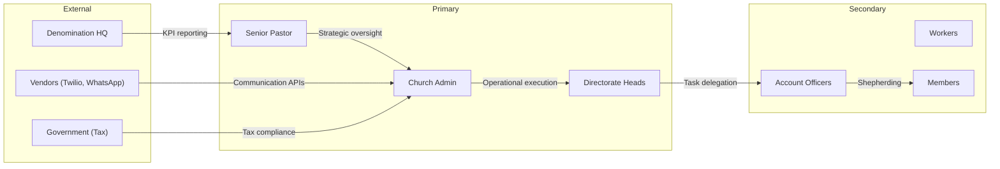
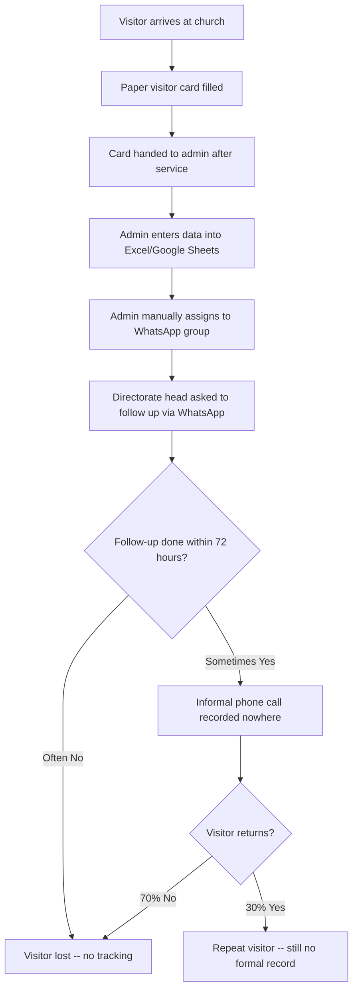
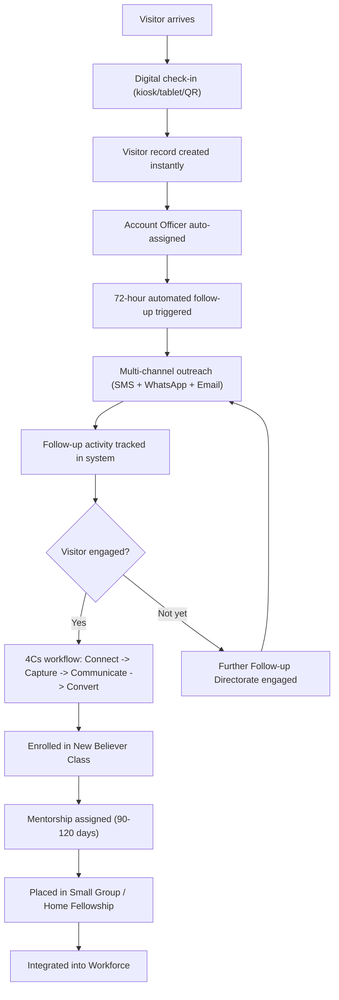
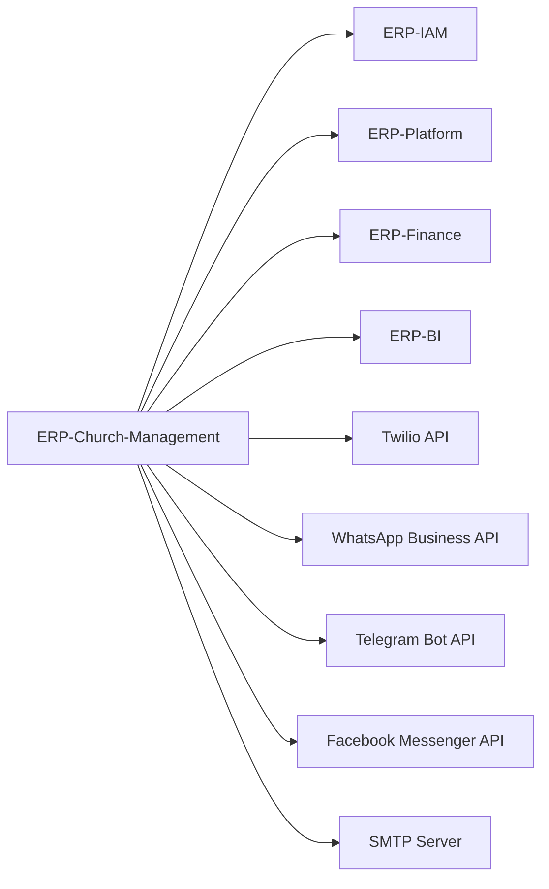

# Business Requirements Document (BRD) -- ERP-Church-Management
> Version: 1.0 | Last Updated: 2026-02-23 | Status: Draft
> Classification: Internal | Author: AIDD System

---

## 1. Business Context

### 1.1 Background

The Redeemed Christian Church of God (RCCG) Follow-up & Visitation Ministry framework mandates a structured approach to soul care that most commercial ChMS platforms cannot support. Churches using Planning Center, Tithe.ly, ChurchTrac, or Breeze must supplement with spreadsheets, WhatsApp groups, and manual processes -- creating data fragmentation, operational inefficiency, and accountability gaps.

ERP-Church-Management closes this gap by encoding the 4Cs Assimilation Workflow, 6-Directorate Follow-up Structure, and Quarterly Shepherding KPIs into a unified platform that integrates seamlessly with the broader BillyRonks ERP ecosystem.

### 1.2 Business Objectives

| # | Objective | Measure | Target |
|---|---|---|---|
| BO-1 | Increase visitor retention | Visitor-to-member conversion rate | 60% within 12 months |
| BO-2 | Achieve 72-hour follow-up compliance | 72-hour contact completion rate | 90% sustained |
| BO-3 | Digitize giving operations | Online giving adoption | 80% of regular givers |
| BO-4 | Consolidate communication | Channels managed from single platform | 7 channels |
| BO-5 | Enable data-driven pastoral care | KPI dashboards per directorate | 100% directorate coverage |
| BO-6 | Reduce administrative burden | Hours spent on manual data entry per week | 80% reduction |
| BO-7 | Scale to multi-campus | Campuses supported per deployment | Unlimited with tenant isolation |

---

## 2. Stakeholder Analysis

### 2.1 Stakeholder Requirements

| Stakeholder | Need | Priority |
|---|---|---|
| Senior Pastor | Real-time church health dashboard, growth trends | Critical |
| Church Admin | Centralized member database, automated workflows | Critical |
| Directorate Heads | Directorate-specific KPIs, team performance tracking | High |
| Account Officers | Mobile-first follow-up workspace, contact tracking | High |
| Workers | Volunteer scheduling, task assignments, attendance marking | Medium |
| Members | Self-service profile, giving history, group finder | Medium |
| Denomination HQ | Aggregated KPI reports across parishes | High |
| Tax Authority | Compliant giving statements and receipts | High |

---

## 3. Current State Assessment

### 3.1 As-Is Process Flow

### 3.2 Pain Points Quantified

| Pain Point | Quantified Impact |
|---|---|
| Paper visitor cards lost or illegible | ~15% data loss per service |
| Follow-up not completed within 72 hours | ~65% of visitors uncontacted |
| No visibility into account officer activity | 0% accountability tracking |
| Giving recorded in separate accounting system | 2-week delay for statements |
| No welfare case tracking | Cases fall through cracks |
| No discipleship pipeline visibility | NBC enrollment ad hoc |

---

## 4. To-Be Solution

### 4.1 Future State Process Flow

### 4.2 Business Process Improvements

| Process | As-Is Duration | To-Be Duration | Improvement |
|---|---|---|---|
| Visitor registration | 5-10 min (paper) | 30 sec (kiosk) | 90% faster |
| 72-hour follow-up initiation | 3-7 days (manual) | Automatic (hourly job) | 100% compliance possible |
| Account officer assignment | 1-3 days | Instant (on registration) | Same-day shepherding |
| Giving statement generation | 2 weeks | Real-time | 100% faster |
| KPI calculation | Monthly manual | Daily automated | 30x more frequent |
| Welfare case tracking | Informal/verbal | Full lifecycle tracking | 100% accountability |

---

## 5. Business Rules

### 5.1 Follow-up Rules

| Rule ID | Rule | Automation |
|---|---|---|
| BR-FU-001 | Every first-timer MUST be contacted within 72 hours | Cron job every hour checks and triggers outreach |
| BR-FU-002 | Every visitor MUST be assigned an Account Officer | Auto-assignment on visitor creation |
| BR-FU-003 | Account Officers MUST log at least 1 follow-up per assigned soul per week | KPI service calculates compliance |
| BR-FU-004 | Visitors not converted within 90 days escalate to Further Follow-up Directorate | Automated workflow transition |
| BR-FU-005 | Absentee members (3+ weeks) trigger welfare check | Absentee checker cron job |

### 5.2 Giving Rules

| Rule ID | Rule |
|---|---|
| BR-GIV-001 | All giving records require member ID and giving type classification |
| BR-GIV-002 | Tax receipts generated only for tax-deductible giving types |
| BR-GIV-003 | Pledge fulfillment tracked against campaign targets |
| BR-GIV-004 | Annual giving statements available by January 31 |

### 5.3 Discipleship Rules

| Rule ID | Rule |
|---|---|
| BR-DIS-001 | All new believers MUST be enrolled in NBC within 7 days of conversion |
| BR-DIS-002 | Mentorship pairs run 90-120 days; completion reported to KPI service |
| BR-DIS-003 | Sunday School attendance contributes to engagement score |

---

## 6. Financial Justification

### 6.1 Cost-Benefit Analysis

| Item | Annual Cost |
|---|---|
| **Current tooling** (Planning Center + Tithe.ly + Breeze + manual effort) | $8,400/year + 20 hrs/week admin time |
| **ERP-Church-Management** (included in ERP suite license) | $0 incremental (suite module) |
| **Communication APIs** (Twilio, WhatsApp Business) | $1,200/year estimated |
| **Net Savings** | **$7,200/year + 1,040 admin hours** |

### 6.2 ROI Projections

| Metric | Year 1 | Year 2 | Year 3 |
|---|---|---|---|
| Admin hours saved | 1,040 | 1,200 | 1,200 |
| Visitor retention improvement | +25% | +35% | +40% |
| Giving increase (online adoption) | +15% | +25% | +30% |
| Welfare case resolution rate | +40% | +60% | +70% |

---

## 7. Constraints

| Constraint | Description |
|---|---|
| Regulatory | GDPR/POPIA compliance for member data; tax authority compliance for giving statements |
| Technical | Must integrate with existing ERP-IAM for SSO; PostgreSQL as the mandated database |
| Operational | Initial deployment must handle Sunday peak loads (10x weekday traffic) |
| Cultural | Account Officers may resist digital tracking -- change management required |

---

## 8. Assumptions

1. Churches will have reliable internet connectivity for real-time features
2. Account Officers have smartphones capable of running the Flutter mobile app
3. Twilio and WhatsApp Business API accounts will be provisioned per church/campus
4. The RCCG Follow-up & Visitation Ministry manual serves as the authoritative process reference
5. ERP-IAM and ERP-Platform services are available for authentication and entitlement checks

---

## 9. Dependencies

---

## 10. Acceptance Criteria Summary

| # | Business Requirement | Acceptance Criterion |
|---|---|---|
| 1 | Visitor registration | Visitor created via kiosk in < 30 seconds |
| 2 | 72-hour follow-up | Automated contact triggered within 1 hour of registration |
| 3 | Account officer assignment | Officer assigned automatically on visitor creation |
| 4 | Multi-channel communication | Message delivered on at least 2 channels per contact |
| 5 | Giving recording | Tithe/offering recorded with instant receipt |
| 6 | KPI dashboard | All 7 KPIs displayed in real-time |
| 7 | Member conversion | Full data migration from visitor to member record |
| 8 | Welfare case tracking | Case lifecycle from creation to fulfillment tracked |
| 9 | Multi-campus support | Tenant isolation verified with cross-tenant query returning 0 results |
| 10 | Mobile access | All core workflows accessible on Flutter mobile app |
