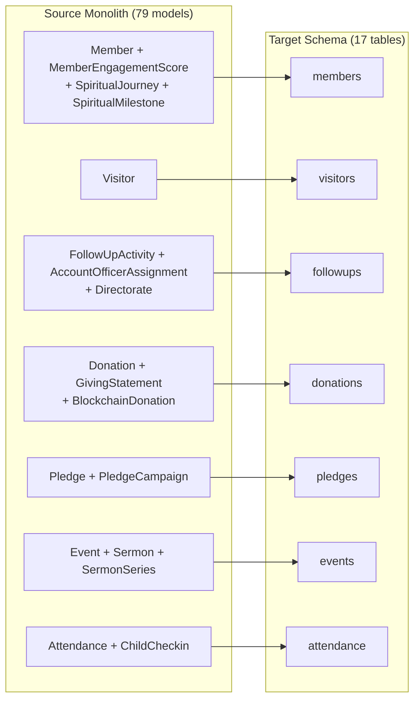

# Database Schema -- ERP-Church-Management
> Version: 1.0 | Last Updated: 2026-02-23 | Status: Draft
> Classification: Internal | Author: AIDD System

---

## 1. Database Overview

ERP-Church-Management uses a single PostgreSQL 16 database (`erp_church_management`) shared across all 12 microservices. Each table includes a `tenant_id` column for multi-campus data isolation. The database stores 17 core tables plus supporting junction tables and audit tables.

---

## 2. Entity-Relationship Diagram

```mermaid
erDiagram
    tenants ||--o{ members : "has"
    tenants ||--o{ visitors : "has"
    tenants ||--o{ events : "has"
    tenants ||--o{ groups : "has"
    tenants ||--o{ facilities : "has"

    members ||--o{ attendance : "records"
    members ||--o{ donations : "makes"
    members ||--o{ followups : "receives"
    members ||--o{ welfare_cases : "files"
    members ||--o{ volunteers : "serves_as"
    members ||--o{ discipleship_progress : "tracks"
    members }o--o{ groups : "belongs_to"

    visitors ||--o{ followups : "receives"
    visitors ||--o| members : "converts_to"

    events ||--o{ attendance : "tracks"
    events ||--o{ facilities : "books"

    groups ||--o{ discipleship_programs : "offers"
    discipleship_programs ||--o{ discipleship_progress : "tracks"

    users ||--o{ followups : "performs"
    users ||--o{ members : "assigned_as_officer"

    pledges }o--|| members : "made_by"
    communications ||--o{ members : "sent_to"
    kpis ||--|| tenants : "scoped_to"

    tenants {
        uuid id PK
        string name
        string slug
        string campus_code
        string address
        string city
        string state
        string country
        string timezone
        string currency
        boolean is_active
        timestamp created_at
        timestamp updated_at
    }

    users {
        uuid id PK
        uuid tenant_id FK
        string first_name
        string last_name
        string email
        string phone
        string password_hash
        enum role "super_admin|admin|pastor|minister|HOD|directorate_head|account_officer|worker|member"
        boolean is_active
        timestamp last_login
        timestamp created_at
        timestamp updated_at
    }

    members {
        uuid id PK
        uuid tenant_id FK
        uuid user_id FK
        string membership_id "MEM000001 format"
        string title
        string first_name
        string last_name
        string middle_name
        string email
        string phone
        string alternative_phone
        string whatsapp_number
        string telegram_username
        string facebook_messenger_id
        date date_of_birth
        enum gender "Male|Female"
        enum marital_status "Single|Married|Widowed|Divorced"
        text address
        string city
        string state
        string country
        string postal_code
        enum member_type "New Believer|Member|Prospect|Worker|Minister|Pastor"
        enum member_status "Active|Inactive|Transferred|Deceased"
        enum natural_group "Youth|Men|Women|Elders|Teens|Children"
        date join_date
        date salvation_date
        date baptism_date
        uuid household_id FK
        jsonb communication_preferences
        decimal engagement_score
        timestamp created_at
        timestamp updated_at
    }

    visitors {
        uuid id PK
        uuid tenant_id FK
        string first_name
        string last_name
        string middle_name
        string title
        string email
        string phone
        string alternative_phone
        string whatsapp_number
        string telegram_username
        string facebook_messenger_id
        date date_of_birth
        enum gender "Male|Female"
        enum marital_status
        text address
        string city
        string state
        string country
        string postal_code
        date visit_date
        boolean is_first_time
        string how_did_you_hear
        string invited_by
        enum status "New|Contacted|Pending Follow-up|Engaged|Converted to Member|Inactive"
        boolean contacted_within_72_hours
        timestamp first_contact_date
        string first_contact_method
        text first_contact_notes
        boolean welcome_gift_given
        date welcome_gift_date
        string welcome_gift_description
        uuid converted_to_member_id FK
        timestamp created_at
        timestamp updated_at
    }

    followups {
        uuid id PK
        uuid tenant_id FK
        uuid member_id FK
        uuid visitor_id FK
        uuid performed_by FK
        uuid account_officer_id FK
        enum activity_type "72-Hour Contact|Home Visit|Phone Call|WhatsApp|Absentee Check|Counseling|Welfare Check"
        enum status "Pending|In Progress|Completed|Cancelled"
        enum directorate "1st Timer|Further Follow-up|Counselling|Natural Group|Development and Structuring|Welfare and Finance"
        date scheduled_date
        timestamp performed_date
        text notes
        text outcome
        timestamp created_at
        timestamp updated_at
    }

    donations {
        uuid id PK
        uuid tenant_id FK
        uuid member_id FK
        enum giving_type "Tithe|Offering|Donation|Special Seed|Building Fund|Mission"
        decimal amount
        string currency
        enum payment_method "Cash|Bank Transfer|Online|Card|Mobile Money"
        string reference_number
        date donation_date
        uuid event_id FK
        boolean is_tax_deductible
        text notes
        timestamp created_at
        timestamp updated_at
    }

    pledges {
        uuid id PK
        uuid tenant_id FK
        uuid member_id FK
        uuid campaign_id FK
        decimal pledge_amount
        decimal fulfilled_amount
        string currency
        date start_date
        date end_date
        enum frequency "One-time|Weekly|Monthly|Quarterly|Annually"
        enum status "Active|Fulfilled|Cancelled|Overdue"
        timestamp created_at
        timestamp updated_at
    }

    events {
        uuid id PK
        uuid tenant_id FK
        string title
        text description
        enum event_type "Sunday Service|Midweek Service|Special Service|Outreach|Come and See|Go and Tell|Conference|Meeting|Class|Other"
        date event_date
        time start_time
        time end_time
        string location
        uuid facility_id FK
        integer expected_attendance
        integer actual_attendance
        boolean is_recurring
        string recurrence_pattern
        enum status "Scheduled|In Progress|Completed|Cancelled"
        timestamp created_at
        timestamp updated_at
    }

    attendance {
        uuid id PK
        uuid tenant_id FK
        uuid event_id FK
        uuid member_id FK
        date date
        time check_in_time
        time check_out_time
        enum check_in_method "Manual|QR Code|NFC|Kiosk"
        boolean is_first_time_visitor
        uuid visitor_id FK
        timestamp created_at
    }

    groups {
        uuid id PK
        uuid tenant_id FK
        string name
        text description
        enum group_type "Small Group|Home Fellowship|Cell Group|Ministry|Department"
        uuid leader_id FK
        uuid co_leader_id FK
        string meeting_day
        time meeting_time
        string meeting_location
        integer max_members
        integer current_members
        enum status "Active|Inactive|Multiplied"
        uuid parent_group_id FK
        timestamp created_at
        timestamp updated_at
    }

    discipleship_programs {
        uuid id PK
        uuid tenant_id FK
        string name
        text description
        enum program_type "NBC|Sunday School|Mentorship|Bible Study|Leadership Training"
        integer duration_days
        integer max_participants
        date start_date
        date end_date
        uuid facilitator_id FK
        enum status "Scheduled|In Progress|Completed|Cancelled"
        jsonb curriculum
        timestamp created_at
        timestamp updated_at
    }

    discipleship_progress {
        uuid id PK
        uuid tenant_id FK
        uuid member_id FK
        uuid program_id FK
        uuid mentor_id FK
        date enrollment_date
        date completion_date
        enum status "Enrolled|In Progress|Completed|Dropped"
        integer progress_percentage
        jsonb milestones_completed
        text notes
        timestamp created_at
        timestamp updated_at
    }

    welfare_cases {
        uuid id PK
        uuid tenant_id FK
        uuid member_id FK
        uuid assigned_to FK
        string case_number
        enum category "Financial|Medical|Housing|Food|Education|Bereavement|Emergency|Other"
        text description
        enum urgency "Low|Medium|High|Critical"
        enum status "Open|In Progress|Approval Pending|Approved|Rejected|Fulfilled|Closed"
        decimal amount_requested
        decimal amount_approved
        decimal amount_disbursed
        string funding_source
        date fulfilled_date
        text resolution_notes
        timestamp created_at
        timestamp updated_at
    }

    communications {
        uuid id PK
        uuid tenant_id FK
        uuid sender_id FK
        enum channel "SMS|WhatsApp|Telegram|Facebook|Email|Push|In-app"
        string subject
        text body
        jsonb recipients "Array of member/visitor IDs"
        enum status "Draft|Queued|Sent|Delivered|Failed"
        integer total_recipients
        integer delivered_count
        integer failed_count
        timestamp scheduled_at
        timestamp sent_at
        timestamp created_at
    }

    kpis {
        uuid id PK
        uuid tenant_id FK
        string name
        string category
        decimal target
        decimal actual
        string unit
        enum period "Daily|Weekly|Monthly|Quarterly|Annually"
        date period_start
        date period_end
        enum status "Achieved|On Track|Behind|Critical"
        jsonb breakdown
        timestamp created_at
    }

    volunteers {
        uuid id PK
        uuid tenant_id FK
        uuid member_id FK
        jsonb skills
        jsonb availability "Day/time preferences"
        jsonb certifications
        enum status "Active|Inactive|On Leave"
        date start_date
        integer total_hours_served
        uuid team_id FK
        timestamp created_at
        timestamp updated_at
    }

    facilities {
        uuid id PK
        uuid tenant_id FK
        string name
        text description
        enum facility_type "Auditorium|Classroom|Office|Parking|Kitchen|Sports Hall|Outdoor|Other"
        integer capacity
        string location
        string campus
        boolean is_bookable
        jsonb amenities
        jsonb booking_rules "Min/max duration, advance booking, etc."
        enum status "Available|Maintenance|Reserved|Decommissioned"
        timestamp created_at
        timestamp updated_at
    }
```



---

## 3. Index Strategy

| Table | Index | Columns | Purpose |
|---|---|---|---|
| members | idx_members_tenant | tenant_id | Tenant isolation |
| members | idx_members_membership_id | tenant_id, membership_id | Unique member lookup |
| members | idx_members_natural_group | tenant_id, natural_group | Group filtering |
| members | idx_members_status | tenant_id, member_status | Status filtering |
| members | idx_members_search | first_name, last_name, email, phone (GIN trigram) | Full-text search |
| visitors | idx_visitors_tenant | tenant_id | Tenant isolation |
| visitors | idx_visitors_visit_date | tenant_id, visit_date | Date range queries |
| visitors | idx_visitors_72hr | tenant_id, contacted_within_72_hours, visit_date | 72-hour protocol queries |
| donations | idx_donations_member | tenant_id, member_id, donation_date | Member giving history |
| donations | idx_donations_type | tenant_id, giving_type, donation_date | Type aggregation |
| attendance | idx_attendance_event | tenant_id, event_id | Event attendance count |
| attendance | idx_attendance_member | tenant_id, member_id, date | Member attendance history |
| followups | idx_followups_officer | tenant_id, account_officer_id, status | Officer workload |
| kpis | idx_kpis_period | tenant_id, category, period_start | KPI queries |
| welfare_cases | idx_welfare_status | tenant_id, status, urgency | Active case dashboard |

---

## 4. Migration Strategy

### 4.1 Migration File Convention

```
database/migrations/
  0001_initial_core.sql        -- tenants, users, members, visitors
  0002_followup_tables.sql     -- followups, account_officer_assignments
  0003_giving_tables.sql       -- donations, pledges
  0004_event_tables.sql        -- events, attendance
  0005_group_tables.sql        -- groups, group_members
  0006_discipleship_tables.sql -- discipleship_programs, discipleship_progress
  0007_welfare_tables.sql      -- welfare_cases
  0008_communication_tables.sql-- communications
  0009_kpi_tables.sql          -- kpis
  0010_volunteer_tables.sql    -- volunteers, volunteer_shifts
  0011_facility_tables.sql     -- facilities, facility_bookings
  0012_indexes.sql             -- All indexes
```

### 4.2 Source Model to Target Table Mapping



---

## 5. Data Retention Policy

| Data Category | Retention Period | Justification |
|---|---|---|
| Member profiles | Indefinite (until erasure request) | Core operational data |
| Visitor records | 3 years after last interaction | Re-engagement potential |
| Giving transactions | 7 years | Tax compliance |
| Attendance records | 5 years | Historical analytics |
| Follow-up activities | 3 years | Audit trail |
| Communications | 1 year | Storage optimization |
| KPI snapshots | 5 years | Trend analysis |
| Welfare cases | 7 years | Legal compliance |
| Audit logs | 3 years | Security compliance |

---

## 6. Backup Strategy

| Component | Method | Frequency | Retention |
|---|---|---|---|
| Full database backup | pg_dump | Daily at 02:00 UTC | 30 days |
| WAL archiving | pg_basebackup + WAL | Continuous | 7 days |
| Point-in-time recovery | WAL replay | As needed | 7-day window |
| Cross-region backup | pg_dump to S3 | Weekly | 90 days |
