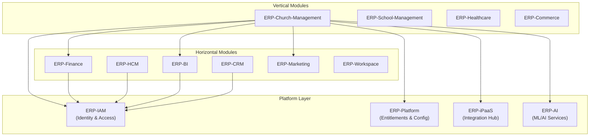
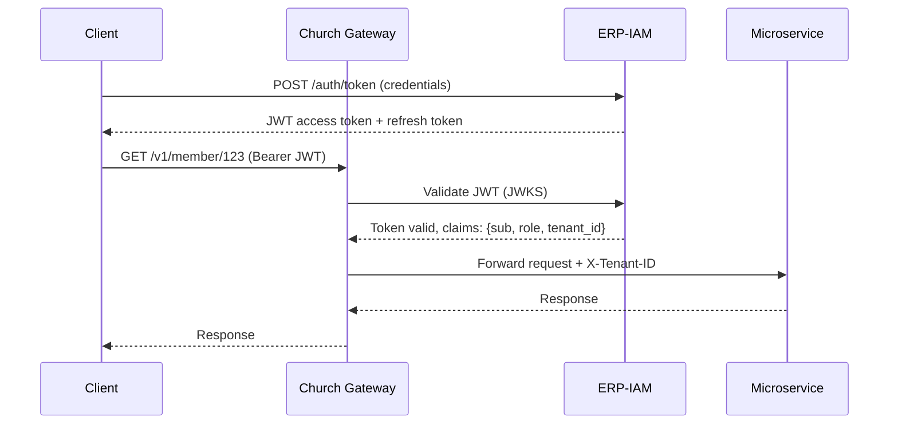
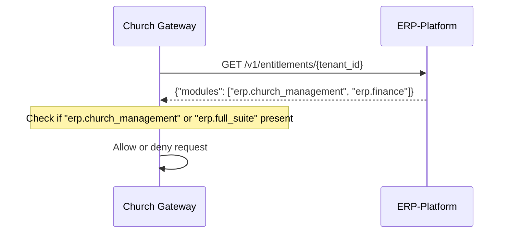
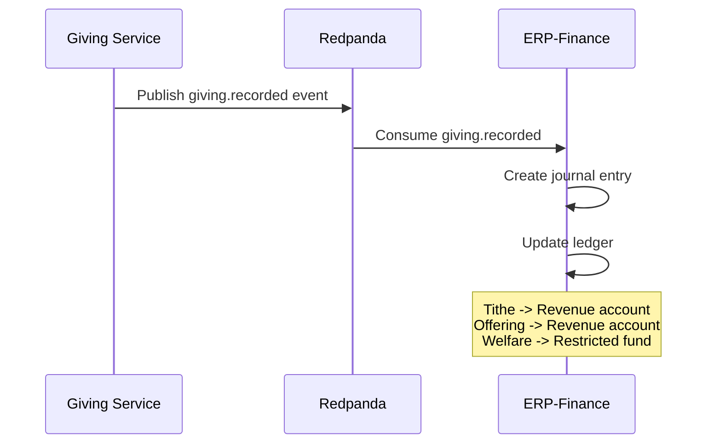
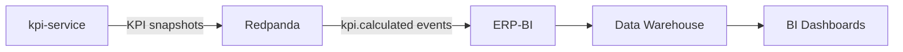
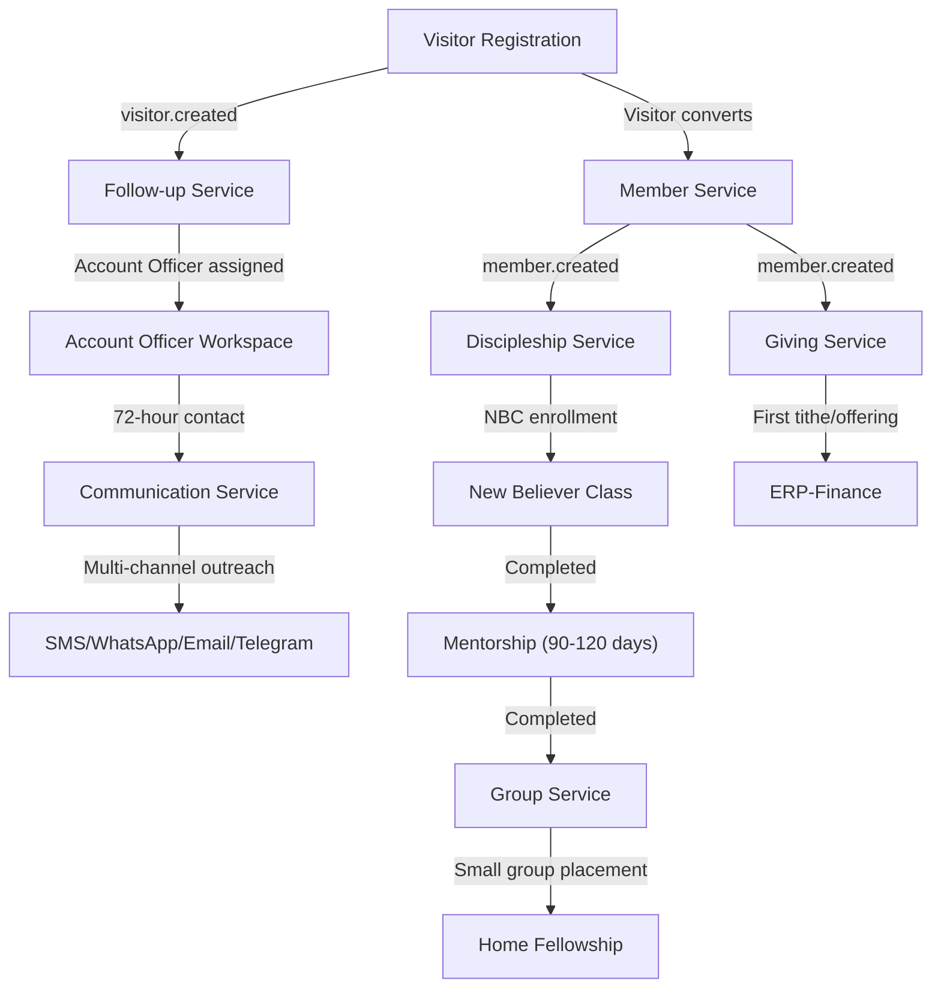
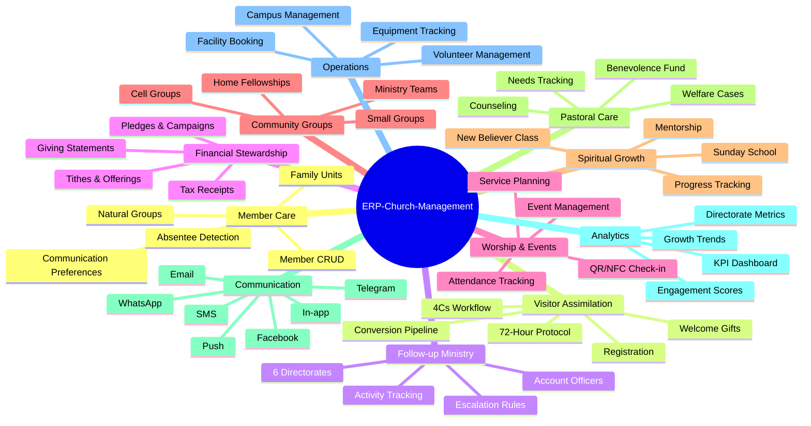
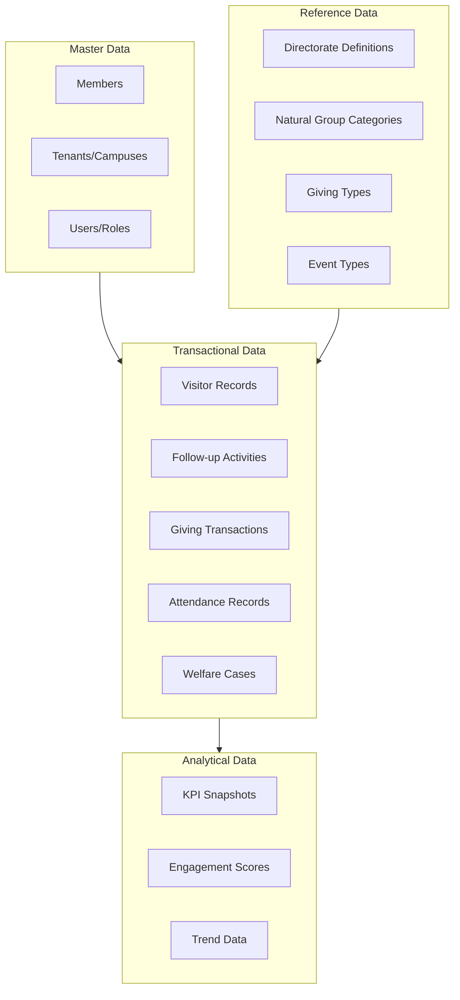

# Enterprise Architecture -- ERP-Church-Management
> Version: 1.0 | Last Updated: 2026-02-23 | Status: Draft
> Classification: Internal | Author: AIDD System

---

## 1. Enterprise Context

ERP-Church-Management is one vertical module within the BillyRonks ERP ecosystem. It serves the Faith/Nonprofit sector, operating alongside horizontal modules (Finance, HCM, BI, CRM) and other vertical modules (Healthcare, School Management, Commerce, BSS-OSS).

---

## 2. Enterprise Integration Map

---

## 3. Integration Patterns

### 3.1 Authentication Flow (ERP-IAM)

### 3.2 Entitlement Check (ERP-Platform)

The gateway implements a graceful degradation pattern: if ERP-Platform is unreachable and `ALLOW_ON_ENTITLEMENT_FAILURE=true`, requests proceed. This ensures standalone operation.

### 3.3 Financial Integration (ERP-Finance)

### 3.4 Analytics Integration (ERP-BI)

---

## 4. Data Flow Architecture

### 4.1 Member Lifecycle Data Flow

---

## 5. Capability Map

---

## 6. TOGAF Architecture Layers

### 6.1 Business Architecture

| Business Function | Process Owner | Supporting Service |
|---|---|---|
| Soul Winning | Senior Pastor | visitor-service, followup-service |
| Discipleship | Discipleship Director | discipleship-service |
| Worship | Worship Director | event-service |
| Finance | Finance Director | giving-service |
| Welfare | Welfare Director | welfare-service |
| Communication | Media Director | communication-service |
| Facilities | Facilities Manager | facility-service |
| Volunteer Coordination | Volunteer Coordinator | volunteer-service |

### 6.2 Application Architecture

| Application Component | Technology | Deployment |
|---|---|---|
| Web Application | React/Next.js | Vercel / Kubernetes |
| Mobile Application | Flutter | App Store / Play Store |
| API Gateway | Go | Kubernetes Pod |
| 12 Microservices | Go | Kubernetes Pods |
| Background Jobs | Kafka Consumers | Kubernetes Jobs |

### 6.3 Technology Architecture

| Layer | Component | Technology |
|---|---|---|
| Presentation | Web, Mobile, Kiosk | React, Flutter, React (kiosk mode) |
| API | Gateway, REST | Go net/http, httputil |
| Application | Business Logic | Go services |
| Data | Relational | PostgreSQL 16 |
| Data | Cache | Redis 7 |
| Data | Event Stream | Redpanda/Kafka |
| Infrastructure | Containers | Docker + Kubernetes |
| Infrastructure | CI/CD | GitHub Actions |
| Infrastructure | Monitoring | Prometheus + Grafana |

### 6.4 Information Architecture

---

## 7. Governance Model

### 7.1 Data Governance

| Principle | Implementation |
|---|---|
| Data Ownership | Each service owns its domain data |
| Data Privacy | GDPR-compliant erasure via choreographed saga |
| Data Quality | Validation at API layer (express-validator legacy, Go validators target) |
| Data Retention | Configurable per data class (giving: 7 years, communications: 1 year) |

### 7.2 Service Governance

| Principle | Implementation |
|---|---|
| API Contract | OpenAPI 3.0 specification per service |
| Versioning | URL-based (/v1/, /v2/) |
| SLA | 99.9% uptime, p95 < 200ms |
| Ownership | Each service has a designated team owner |

---

## 8. Disaster Recovery

| Component | RPO | RTO | Strategy |
|---|---|---|---|
| PostgreSQL | 1 hour | 4 hours | WAL archiving + daily snapshots |
| Redis | 24 hours | 1 hour | Rebuild from database |
| Redpanda | 0 (replicated) | 30 minutes | Multi-AZ replication |
| Application | 0 | 15 minutes | Kubernetes rolling restart |
| Frontend | 0 | 5 minutes | CDN + fallback origin |
