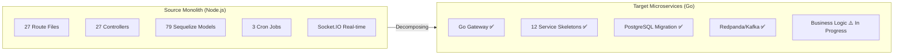
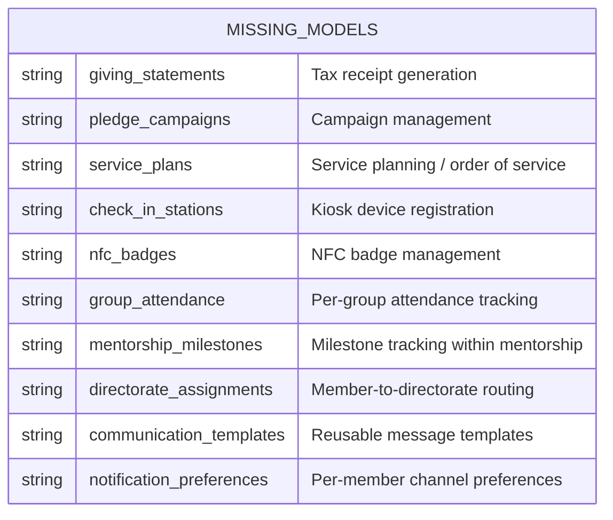
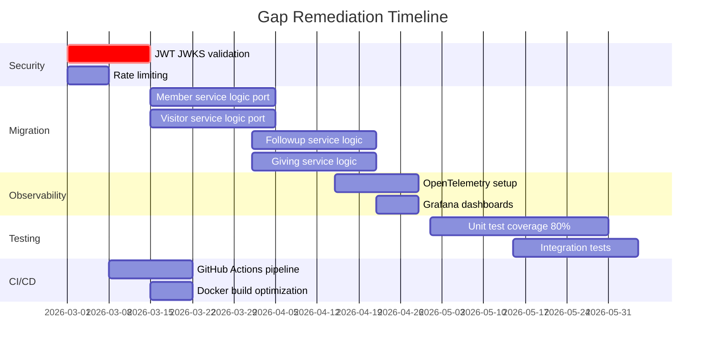

# Gap Analysis -- ERP-Church-Management
> Version: 1.0 | Last Updated: 2026-02-23 | Status: Draft
> Classification: Internal | Author: AIDD System

---

## 1. Purpose

This document identifies gaps between the current source-monolith implementation (Node.js/Express/Sequelize) and the target microservices architecture (12 Go services behind a Go API gateway), as well as feature gaps relative to competing ChMS platforms and the RCCG Follow-up & Visitation Ministry requirements.

---

## 2. Architecture Gap Assessment

### 2.1 Migration Status

### 2.2 Service Migration Matrix

| Domain | Monolith Routes | Target Service | Migration Status | Gap |
|---|---|---|---|---|
| Auth | auth.routes.js | ERP-IAM (external) | Planned | SSO integration not yet wired |
| Members | member.routes.js | member-service | Skeleton exists | Business logic not ported |
| Visitors | visitor.routes.js | visitor-service | Skeleton exists | Business logic not ported |
| Follow-up | followUp.routes.js, accountOfficer.routes.js, directorate.routes.js | followup-service | Skeleton exists | 3 route files to consolidate |
| Giving | donation.routes.js, finance.routes.js | giving-service | Skeleton exists | Finance routes split needed |
| Events | event.routes.js | event-service | Skeleton exists | Attendance merge needed |
| Groups | smallGroup.routes.js, ministry.routes.js | group-service | Skeleton exists | 2 route files to merge |
| Discipleship | spiritualGrowth.routes.js | discipleship-service | Skeleton exists | NBC, mentorship, Sunday School |
| Welfare | welfare.routes.js, care.routes.js | welfare-service | Skeleton exists | Care routes merge needed |
| Communication | communication.routes.js, social.routes.js | communication-service | Skeleton exists | Social features to integrate |
| KPIs | kpi.routes.js, dashboard.routes.js, analytics.routes.js | kpi-service | Skeleton exists | 3 route files to consolidate |
| Volunteers | volunteer.routes.js | volunteer-service | Skeleton exists | Business logic not ported |
| Facilities | facilities.routes.js | facility-service | Skeleton exists | Business logic not ported |
| Workflows | workflow.routes.js | Cross-cutting (ERP-Platform) | Not started | Workflow engine external |
| Integrations | integration.routes.js | Cross-cutting (ERP-iPaaS) | Not started | iPaaS integration planned |
| Children | children.routes.js | TBD (sub-domain of member-service or separate) | Not started | Scope decision needed |
| Missions | missions.routes.js | TBD (potential separate service) | Not started | Scope decision needed |
| Prayer | prayer.routes.js | TBD (sub-domain of group-service) | Not started | Scope decision needed |

---

## 3. Feature Gap Assessment

### 3.1 Gaps vs. RCCG Ministry Manual

| RCCG Requirement | Current Status | Gap Description | Priority |
|---|---|---|---|
| 72-hour follow-up automation | Implemented (cron job) | Needs migration to Kafka consumer pattern | P0 |
| 6 Directorate structure | Model exists | Routing logic across directorates incomplete | P0 |
| Account Officer capacity limits | Not implemented | Officers need max assignment limits | P1 |
| Quarterly Shepherding KPI reports | Basic KPI calculator | Missing: Sunday School enrollment, House Fellowship participation, Workforce integration KPIs | P0 |
| Come and See / Go and Tell events | Event types defined | Specific workflow triggers missing | P1 |
| Natural Group lifecycle | CRUD exists | Age-based auto-classification missing | P2 |
| Directorate-level reporting | Dashboard exists | Per-directorate drill-down not implemented | P1 |

### 3.2 Gaps vs. Competitors

| Feature | Competitor Reference | Gap |
|---|---|---|
| Drag-and-drop service planning | Planning Center Services | No service planning UI in current scope |
| Recurring giving (autopay) | Tithe.ly | Payment gateway integration not implemented |
| Background check integration | Planning Center | Not in scope -- potential future integration |
| Contribution import from bank | ChurchTrac | CSV import exists but bank API integration missing |
| Attendance trends visualization | Breeze | Charts defined but frontend rendering not complete |
| Parent paging (children's ministry) | Planning Center | Socket.IO event defined but mobile UI not built |

### 3.3 Technical Gaps

| Area | Gap | Impact | Remediation |
|---|---|---|---|
| Gateway JWT validation | Token format check only (length >= 16) | Security risk | Integrate with ERP-IAM JWKS endpoint for signature verification |
| Event sourcing | Events published but no event store | Cannot replay state | Add event store table or adopt EventStoreDB |
| Rate limiting | No rate limiting on gateway | DDoS vulnerability | Add Redis-based rate limiter middleware |
| API versioning | Only v1 exists | Future breaking changes blocked | Design v2 namespace in gateway |
| Observability | Winston logging only | No distributed tracing | Add OpenTelemetry instrumentation |
| Testing | Jest configured but minimal tests | Quality risk | Target 80% coverage per service |
| CI/CD | GitHub workflows directory exists but empty | Manual deployments | Implement GitHub Actions pipeline |

---

## 4. Data Model Gaps

### 4.1 Missing Tables/Models for Target Architecture

### 4.2 Model Consolidation Needed

The source monolith has 79 Sequelize models. The target 17-table schema needs careful mapping:

| Target Table | Source Models to Merge |
|---|---|
| `members` | Member, MemberEngagementScore, SpiritualJourney, SpiritualMilestone |
| `visitors` | Visitor (1:1 mapping) |
| `followups` | FollowUpActivity, AccountOfficerAssignment, Directorate |
| `donations` | Donation, GivingStatement, BlockchainDonation |
| `pledges` | Pledge, PledgeCampaign |
| `events` | Event, Sermon, SermonSeries |
| `attendance` | Attendance, ChildCheckin |
| `groups` | SmallGroup, Ministry |
| `discipleship_programs` | DiscipleshipPath, NewBelieverClass |
| `discipleship_progress` | DiscipleshipEnrollment, Mentorship |
| `welfare_cases` | WelfareCase, CareRequest, CounselingCase |
| `communications` | Communication, DirectMessage, Conversation |
| `kpis` | KPI, AnalyticsDashboard, AnalyticsReport |
| `volunteers` | Volunteer, VolunteerRole, VolunteerShift |
| `facilities` | Facility, FacilityBooking, Asset |
| `users` | User (1:1 mapping) |
| `tenants` | Tenant, Campus |

---

## 5. Documentation Gaps

| Document | Status Before | Status After This Generation |
|---|---|---|
| PRD | Existed in source-monolith/docs | Regenerated with competitive analysis |
| BRD | Existed in source-monolith/docs | Regenerated with ROI analysis |
| Architecture | Existed (basic) | Expanded with C4 diagrams |
| Database Schema | Existed (basic ER) | Expanded with full relationships |
| Use Cases | Existed (basic) | Expanded to 20+ use cases |
| Figma Prompts | Existed (basic) | Expanded to 14 screens |
| All 32 AIDD docs | 28 existed, 4 missing | Full 32-document set generated |

---

## 6. Remediation Roadmap

---

## 7. Risk Assessment

| Gap | Risk Level | Likelihood | Impact |
|---|---|---|---|
| JWT not properly validated | Critical | High | Full auth bypass possible |
| No rate limiting | High | Medium | Service degradation under load |
| 79 models to 17 tables mapping | Medium | High | Data loss during migration |
| Missing CI/CD | Medium | High | Deployment errors |
| Incomplete KPI calculations | Medium | Medium | Inaccurate dashboards |
