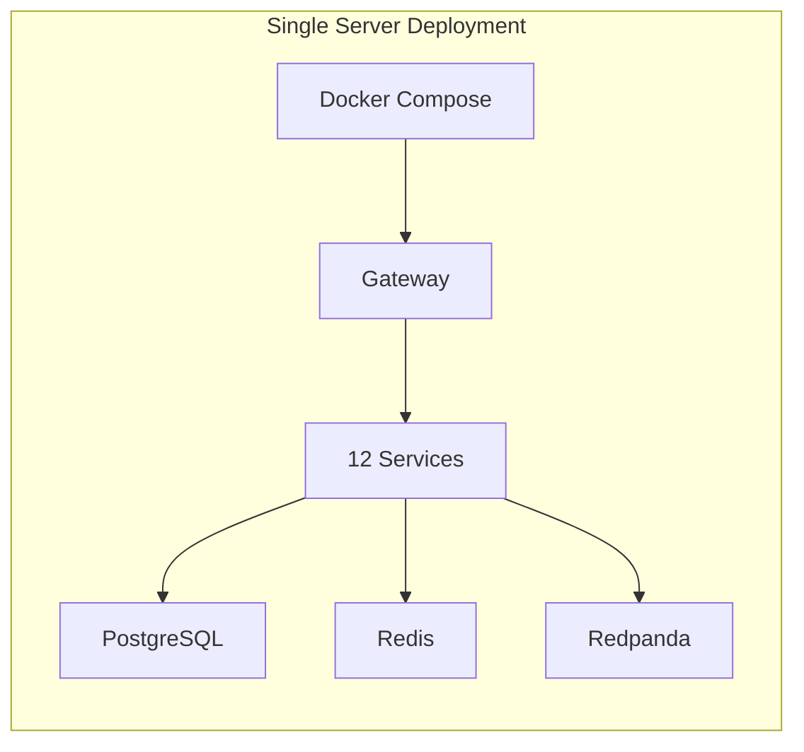
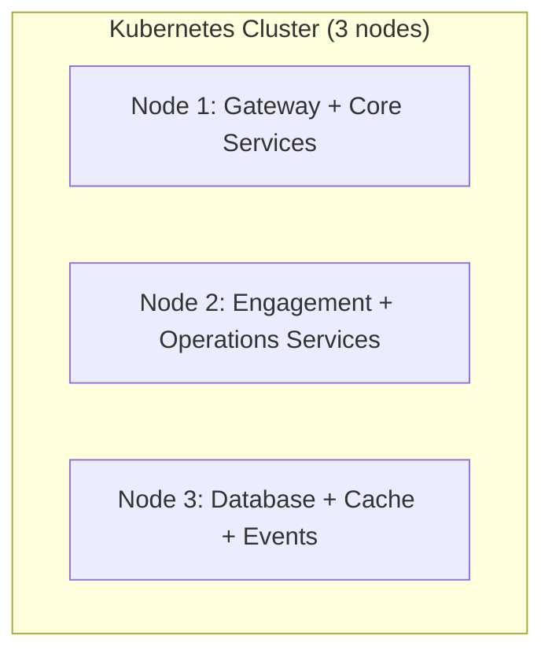
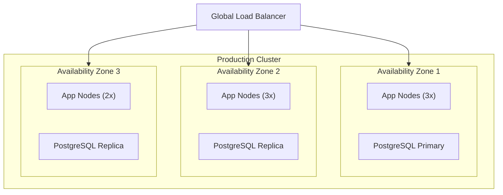
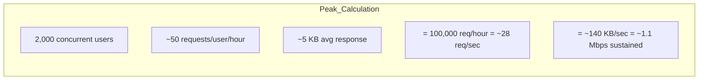

# Hardware Requirements -- ERP-Church-Management
> Version: 1.0 | Last Updated: 2026-02-23 | Status: Draft
> Classification: Internal | Author: AIDD System

---

## 1. Deployment Tiers

ERP-Church-Management supports three deployment tiers based on church size and congregation count.

---

## 2. Tier Definitions

### 2.1 Small Church (< 500 members)

| Component | Specification |
|---|---|
| **Server** | 1x physical or virtual server |
| CPU | 4 vCPU (Intel Xeon E5 / AMD EPYC or equivalent) |
| RAM | 16 GB DDR4 |
| Storage | 100 GB SSD (NVMe preferred) |
| Network | 100 Mbps uplink |
| OS | Ubuntu 22.04 LTS / Debian 12 |
| Runtime | Docker 24+ with Docker Compose |

**Estimated monthly cost (cloud)**: $80-120 (AWS t3.xlarge or GCP e2-standard-4)

### 2.2 Medium Church (500-5,000 members)

| Component | Specification |
|---|---|
| **Compute Nodes** | 3x application nodes |
| CPU per node | 4 vCPU |
| RAM per node | 16 GB |
| **Database** | Managed PostgreSQL (RDS/CloudSQL) |
| DB Instance | db.r6g.large (2 vCPU, 16 GB RAM) |
| DB Storage | 200 GB gp3 SSD |
| **Cache** | Managed Redis (ElastiCache/Memorystore) |
| Cache Instance | cache.t4g.medium (2 vCPU, 3 GB) |
| **Event Stream** | Managed Kafka or self-hosted Redpanda |
| Storage | 50 GB SSD |
| **Load Balancer** | Application Load Balancer (ALB) |
| **CDN** | CloudFront / Cloud CDN for frontend |

**Estimated monthly cost**: $400-600

### 2.3 Large Church / Multi-Campus (5,000+ members)

| Component | Specification |
|---|---|
| **Compute Nodes** | 6-8 application nodes across 2+ AZs |
| CPU per node | 8 vCPU |
| RAM per node | 32 GB |
| **Database** | Multi-AZ PostgreSQL with read replicas |
| DB Primary | db.r6g.xlarge (4 vCPU, 32 GB RAM) |
| DB Replicas | 2x db.r6g.large (read replicas) |
| DB Storage | 500 GB io2 SSD (provisioned IOPS) |
| **Cache** | Redis Cluster (3 shards) |
| Cache per shard | cache.r6g.large (2 vCPU, 13 GB) |
| **Event Stream** | 3-broker Kafka/Redpanda cluster |
| Broker spec | 4 vCPU, 16 GB, 200 GB SSD each |
| **Load Balancer** | Global LB with SSL termination |
| **CDN** | Multi-region CDN |
| **Object Storage** | S3/GCS for documents, photos |
| **Monitoring** | Prometheus + Grafana + Loki |

**Estimated monthly cost**: $1,500-3,000

---

## 3. Client Device Requirements

### 3.1 Web Application (React/Next.js)

| Requirement | Minimum | Recommended |
|---|---|---|
| Browser | Chrome 90+, Firefox 90+, Safari 15+, Edge 90+ | Latest stable |
| Display | 1280x720 | 1920x1080 |
| RAM | 4 GB | 8 GB |
| Internet | 5 Mbps | 25 Mbps |

### 3.2 Mobile Application (Flutter)

| Requirement | Android | iOS |
|---|---|---|
| OS Version | Android 8.0 (API 26)+ | iOS 14.0+ |
| RAM | 3 GB | 3 GB |
| Storage | 100 MB app + 200 MB data | 100 MB app + 200 MB data |
| Camera | Required (QR scanning) | Required (QR scanning) |
| NFC | Optional (check-in) | Optional (check-in) |

### 3.3 Check-in Kiosk

| Component | Specification |
|---|---|
| Device | iPad (10th gen+) or Android tablet (10"+) |
| Mount | Wall-mount or floor-stand kiosk enclosure |
| Network | Wi-Fi 5+ or Ethernet |
| Accessories | QR code scanner (optional, camera works), NFC reader (optional) |
| Power | Continuous power supply |

---

## 4. Network Requirements

### 4.1 Internal Network

| Path | Bandwidth | Latency |
|---|---|---|
| Gateway <-> Services | 1 Gbps | < 1ms |
| Services <-> PostgreSQL | 1 Gbps | < 2ms |
| Services <-> Redis | 1 Gbps | < 1ms |
| Services <-> Redpanda | 1 Gbps | < 5ms |

### 4.2 External Network

| Path | Bandwidth | Latency |
|---|---|---|
| Client <-> Load Balancer | 25 Mbps per client | < 100ms |
| Services <-> Twilio API | 10 Mbps | < 200ms |
| Services <-> WhatsApp API | 10 Mbps | < 200ms |
| Services <-> ERP-IAM | 10 Mbps | < 50ms |
| Services <-> ERP-Platform | 10 Mbps | < 50ms |

### 4.3 Sunday Peak Bandwidth

Including static assets, WebSocket connections, and burst handling: **Recommended: 100 Mbps uplink minimum for 5,000+ member church.**

---

## 5. Storage Capacity Planning

| Data Type | Growth Rate | Year 1 | Year 3 | Year 5 |
|---|---|---|---|---|
| Member records | 500 new/year | 5 MB | 15 MB | 25 MB |
| Visitor records | 2,000 new/year | 10 MB | 30 MB | 50 MB |
| Giving transactions | 50,000/year | 100 MB | 300 MB | 500 MB |
| Attendance records | 100,000/year | 200 MB | 600 MB | 1 GB |
| Communications | 500,000/year | 500 MB | 1.5 GB | 2.5 GB |
| KPI snapshots | 2,000/year | 5 MB | 15 MB | 25 MB |
| Audit logs | Continuous | 1 GB | 3 GB | 5 GB |
| Event stream (Kafka) | Continuous | 2 GB | 6 GB | 10 GB |
| **Total** | | **~4 GB** | **~12 GB** | **~20 GB** |

Note: Profile photos and documents stored in object storage can add 10-50 GB/year depending on adoption.

---

## 6. High Availability Requirements

| Component | HA Strategy | Minimum Replicas |
|---|---|---|
| API Gateway | Active-active behind LB | 2 |
| Microservices | Rolling update, pod disruption budgets | 1 (2 for critical) |
| PostgreSQL | Primary + sync replica | 2 |
| Redis | Sentinel or Cluster | 3 (sentinel) |
| Redpanda | Multi-broker with replication factor 3 | 3 |
| Load Balancer | Cloud-managed (inherently HA) | N/A |
