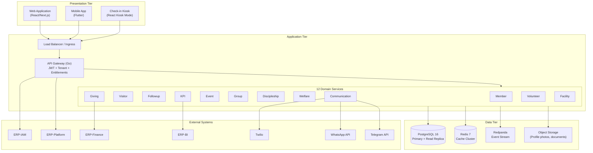
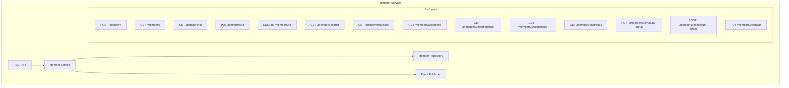
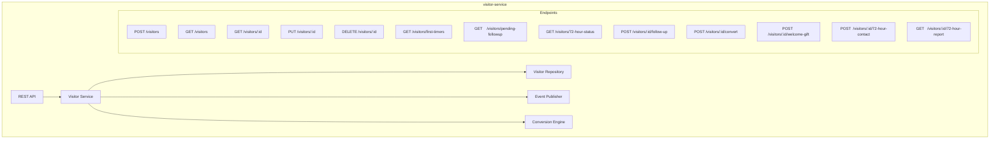
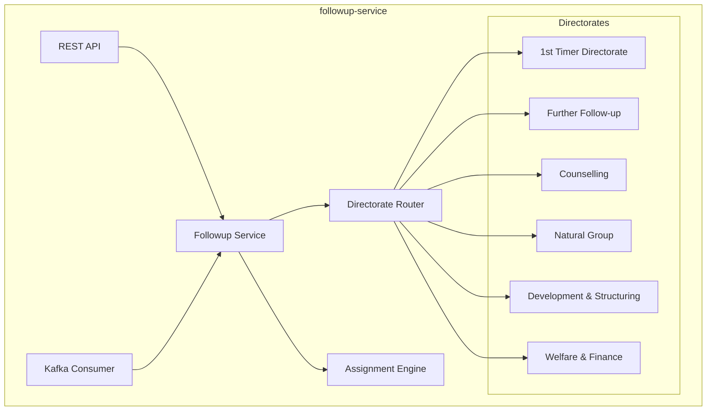
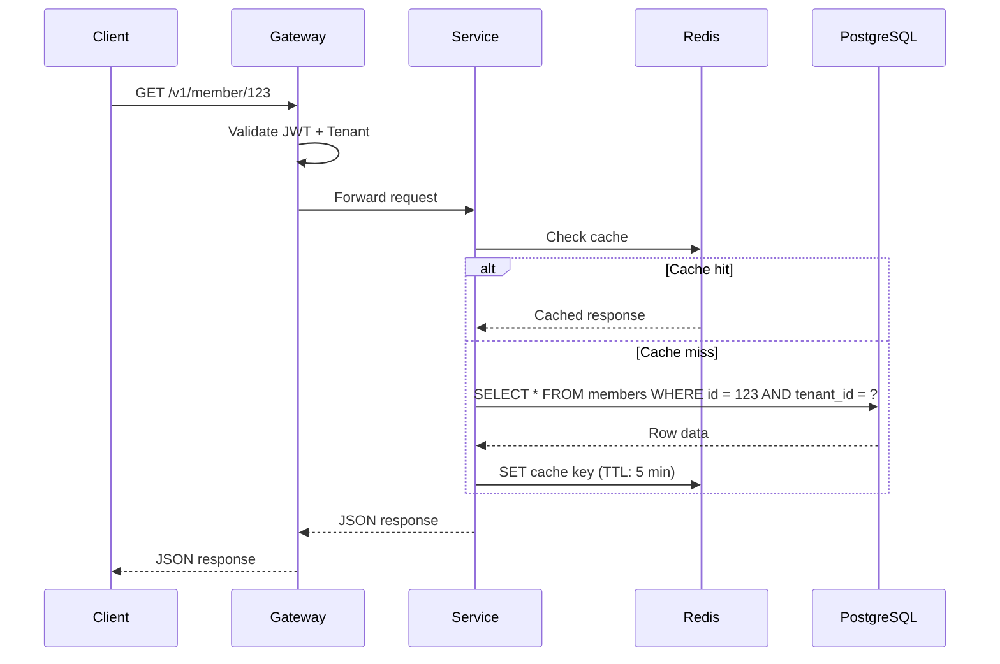
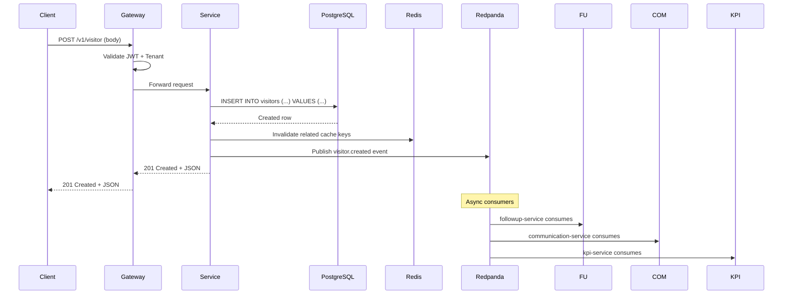
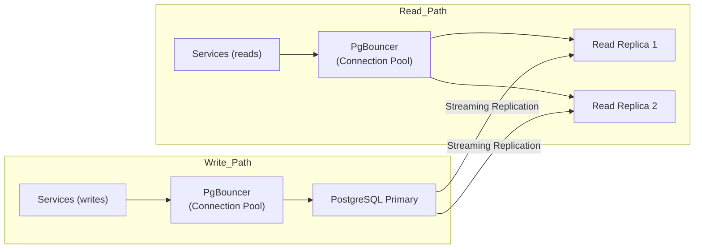
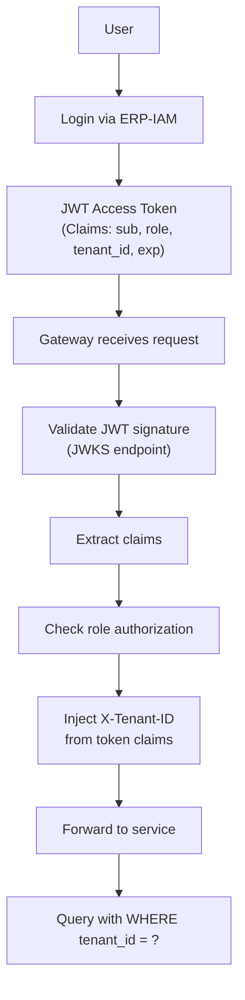
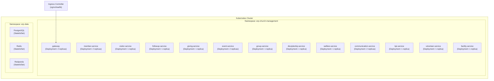
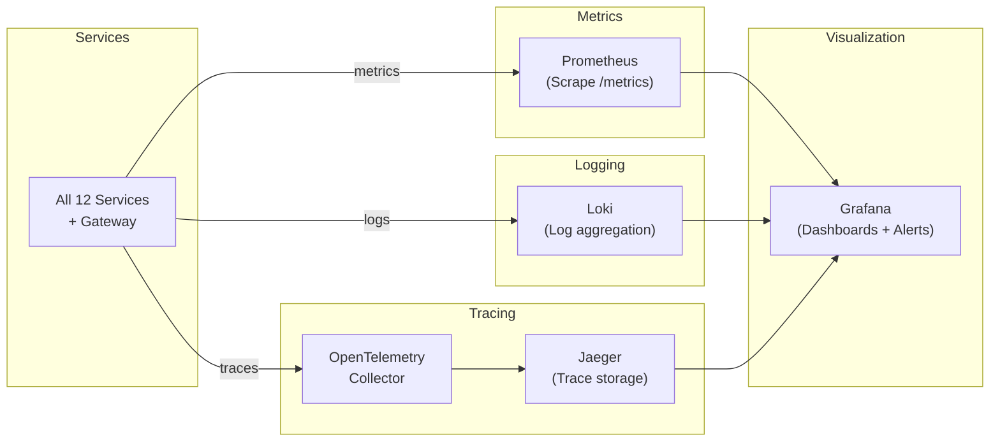

# High-Level Design (HLD) -- ERP-Church-Management
> Version: 1.0 | Last Updated: 2026-02-23 | Status: Draft
> Classification: Internal | Author: AIDD System

---

## 1. System Overview

ERP-Church-Management is a multi-tenant, microservices-based Church Management System supporting 12 domain services, a Go API gateway, React/Next.js web frontend, and Flutter mobile applications. The system manages the complete lifecycle of church members from first-time visitor to fully assimilated, serving member through an event-driven architecture.

---

## 2. High-Level System Diagram

---

## 3. Component Design

### 3.1 API Gateway

| Aspect | Design Decision |
|---|---|
| Language | Go (stdlib net/http) |
| Routing | Path-prefix based: `/v1/{service}/...` |
| Auth | JWT Bearer token validation |
| Multi-tenancy | `X-Tenant-ID` header enforcement |
| Entitlements | REST call to ERP-Platform with graceful degradation |
| Proxying | `httputil.NewSingleHostReverseProxy` |
| Correlation | Auto-generated `X-Correlation-ID` |
| Port | 8090 (mapped to 8093 externally) |

### 3.2 Service Design Principles

Each of the 12 microservices follows these principles:

1. **Single Responsibility**: Each service owns one bounded context
2. **Database per Service (future)**: Phase 1 uses shared DB; Phase 2 splits
3. **Event-Driven Communication**: Async communication via Kafka topics
4. **Stateless**: No in-process state; all state in PostgreSQL/Redis
5. **Health Check**: Every service exposes `GET /healthz`
6. **Idempotent Writes**: All mutations are idempotent with deduplication keys

### 3.3 Core Services Deep Design

#### member-service

#### visitor-service

#### followup-service

---

## 4. Data Flow Design

### 4.1 Read Path (Query)

### 4.2 Write Path (Command)

---

## 5. Scalability Design

### 5.1 Horizontal Scaling

| Component | Scaling Strategy | Min Replicas | Max Replicas | Trigger |
|---|---|---|---|---|
| Gateway | HPA | 2 | 10 | CPU > 70% |
| member-service | HPA | 2 | 8 | CPU > 70% or RPS > 500 |
| visitor-service | HPA | 1 | 6 | CPU > 70% |
| event-service | HPA | 2 | 10 | CPU > 70% (Sunday spike) |
| communication-service | HPA | 2 | 12 | Queue depth > 1000 |
| kpi-service | HPA | 1 | 4 | CPU > 80% |
| Other services | HPA | 1 | 4 | CPU > 70% |

### 5.2 Database Scaling

---

## 6. Security Design

### 6.1 Authentication Flow

### 6.2 Data Encryption

| Data State | Encryption Method |
|---|---|
| In Transit | TLS 1.3 (all connections) |
| At Rest (DB) | PostgreSQL TDE / Volume encryption |
| At Rest (Cache) | Redis TLS + encrypted volumes |
| At Rest (Events) | Redpanda TLS + encrypted storage |
| Sensitive Fields | AES-256 application-level encryption (PII) |
| Passwords | bcrypt (cost factor 12) |

---

## 7. Deployment Design

### 7.1 Container Topology

### 7.2 Resource Requirements (Per Pod)

| Service | CPU Request | CPU Limit | Memory Request | Memory Limit |
|---|---|---|---|---|
| gateway | 100m | 500m | 64Mi | 256Mi |
| member-service | 100m | 500m | 128Mi | 512Mi |
| visitor-service | 100m | 500m | 128Mi | 512Mi |
| followup-service | 100m | 500m | 128Mi | 512Mi |
| giving-service | 100m | 500m | 128Mi | 512Mi |
| event-service | 200m | 1000m | 256Mi | 1Gi |
| group-service | 100m | 500m | 128Mi | 512Mi |
| discipleship-service | 100m | 500m | 128Mi | 512Mi |
| welfare-service | 100m | 500m | 128Mi | 512Mi |
| communication-service | 200m | 1000m | 256Mi | 1Gi |
| kpi-service | 200m | 1000m | 256Mi | 1Gi |
| volunteer-service | 100m | 500m | 128Mi | 512Mi |
| facility-service | 100m | 500m | 128Mi | 512Mi |

---

## 8. Monitoring Design

### 8.1 Key Alerts

| Alert | Condition | Severity |
|---|---|---|
| Service Down | healthz returns non-200 for > 30s | Critical |
| High Latency | p95 > 500ms for > 5 min | Warning |
| Error Rate | 5xx rate > 1% for > 2 min | Critical |
| DB Connection Pool Exhausted | Available connections < 5 | Critical |
| Kafka Consumer Lag | Lag > 10,000 messages | Warning |
| 72-Hour SLA Breach | Uncontacted visitors > 72 hours | Business Critical |
| Disk Usage > 80% | PostgreSQL/Redpanda disk | Warning |
