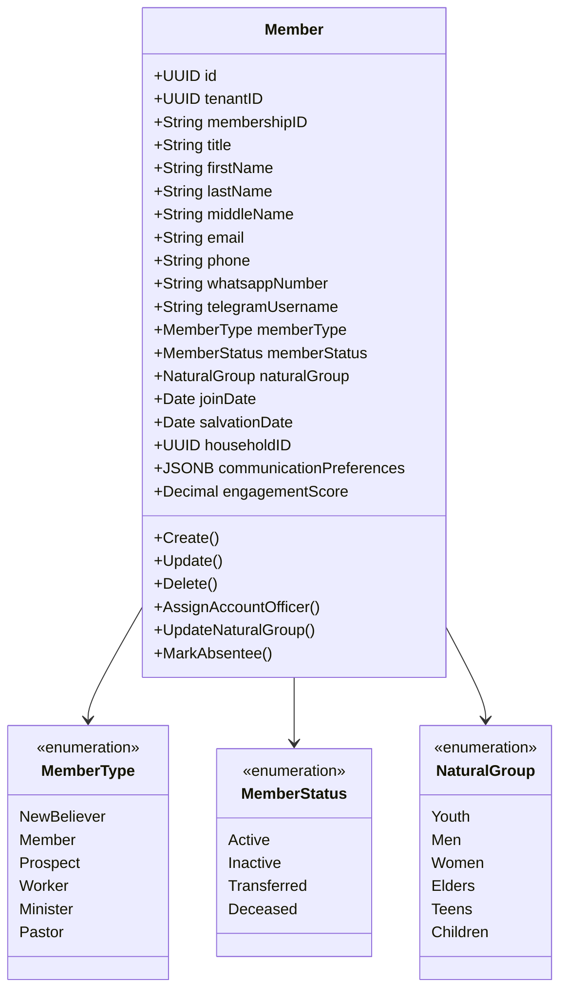
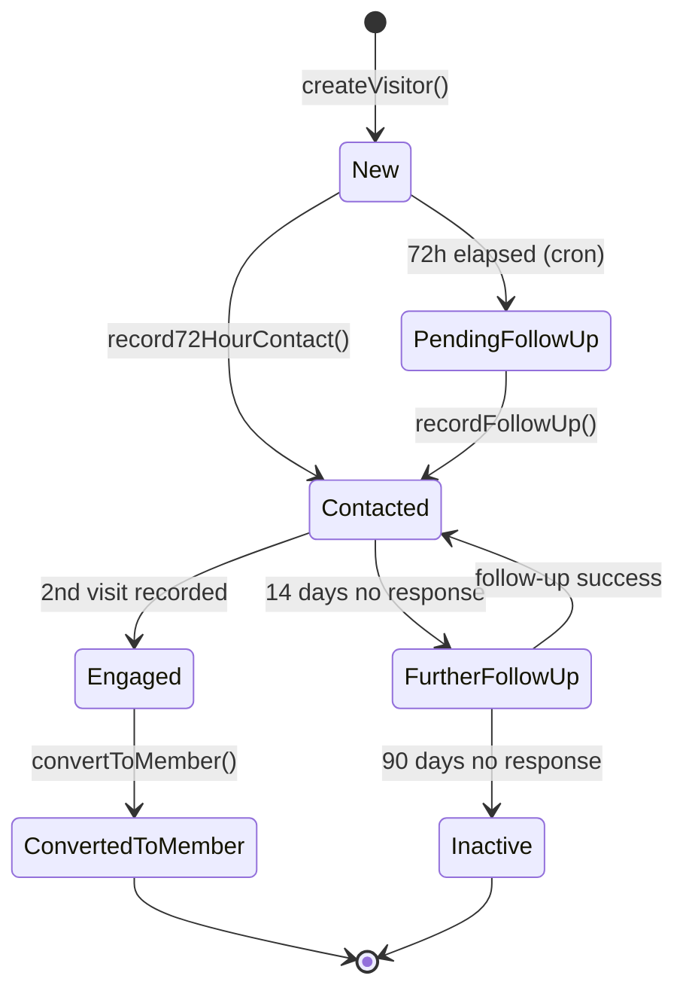
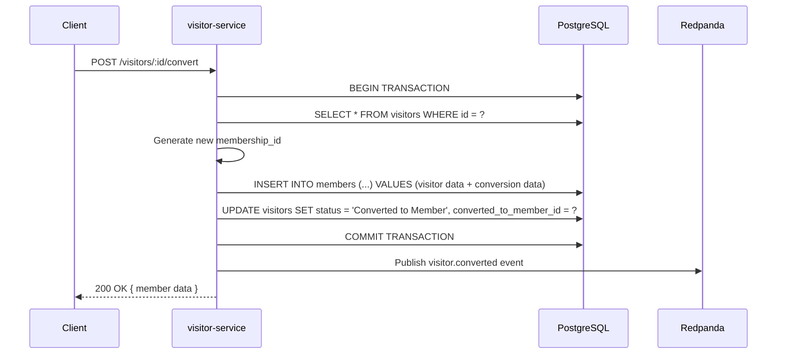
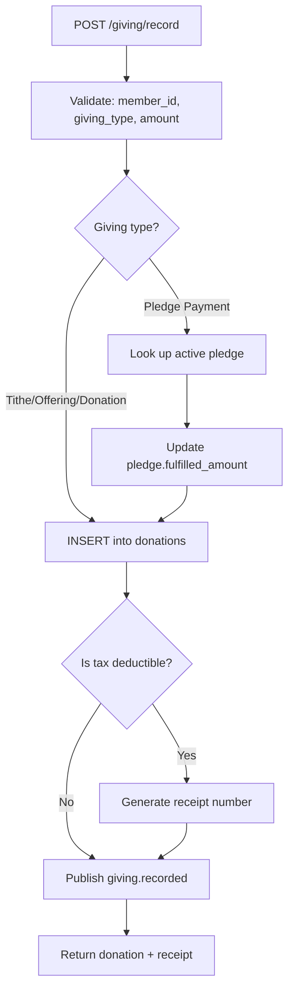
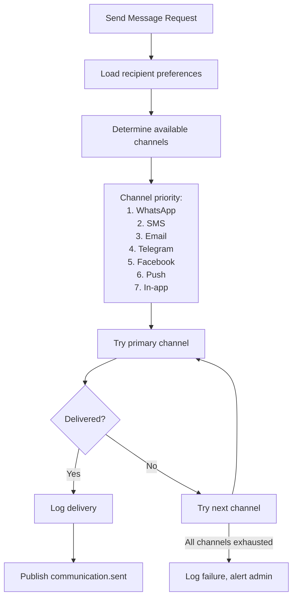

# Low-Level Design (LLD) -- ERP-Church-Management
> Version: 1.0 | Last Updated: 2026-02-23 | Status: Draft
> Classification: Internal | Author: AIDD System

---

## 1. Purpose

This document provides detailed low-level design for each microservice, including internal class structures, algorithm specifications, API endpoint contracts, and database query patterns.

---

## 2. Gateway Low-Level Design

### 2.1 Middleware Pipeline

```mermaid
flowchart TD
    REQ["HTTP Request"] --> MW1["withCorrelationID()"]
    MW1 --> MW2["requireJWT()"]
    MW2 --> MW3["requireEntitlement('erp.church_management')"]
    MW3 --> MW4["requireTenant()"]
    MW4 --> MUX["buildMux()"]
    MUX --> ROUTE{"Route match?"}
    ROUTE -->|/healthz| H1["Health handler"]
    ROUTE -->|/v1/capabilities| H2["Capabilities handler"]
    ROUTE -->|/v1/{svc}/...| H3["Reverse proxy"]
    ROUTE -->|No match| H4["404 handler"]
```

### 2.2 Service Registry

```go
func serviceRegistry() map[string]string {
    return map[string]string{
        "member":        env("CHURCH_UPSTREAM_MEMBER", "http://member-service:8080"),
        "visitor":       env("CHURCH_UPSTREAM_VISITOR", "http://visitor-service:8080"),
        "followup":      env("CHURCH_UPSTREAM_FOLLOWUP", "http://followup-service:8080"),
        "giving":        env("CHURCH_UPSTREAM_GIVING", "http://giving-service:8080"),
        "event":         env("CHURCH_UPSTREAM_EVENT", "http://event-service:8080"),
        "group":         env("CHURCH_UPSTREAM_GROUP", "http://group-service:8080"),
        "discipleship":  env("CHURCH_UPSTREAM_DISCIPLESHIP", "http://discipleship-service:8080"),
        "welfare":       env("CHURCH_UPSTREAM_WELFARE", "http://welfare-service:8080"),
        "communication": env("CHURCH_UPSTREAM_COMMUNICATION", "http://communication-service:8080"),
        "kpi":           env("CHURCH_UPSTREAM_KPI", "http://kpi-service:8080"),
        "volunteer":     env("CHURCH_UPSTREAM_VOLUNTEER", "http://volunteer-service:8080"),
        "facility":      env("CHURCH_UPSTREAM_FACILITY", "http://facility-service:8080"),
    }
}
```

### 2.3 Proxy Header Injection

When proxying to an upstream service, the gateway injects:
- `X-Tenant-ID` from the original request
- `Authorization` Bearer token (passed through)
- `X-Correlation-ID` (generated or forwarded)

---

## 3. member-service Low-Level Design

### 3.1 Domain Model



### 3.2 Membership ID Generation Algorithm

```
Algorithm: GenerateMembershipID
Input: None (reads from database)
Output: String in format "MEM000001"

1. Query: SELECT membership_id FROM members ORDER BY created_at DESC LIMIT 1
2. IF no result: RETURN "MEM000001"
3. ELSE:
   a. Extract numeric part: membership_id.replace("MEM", "")
   b. Parse to integer: lastNum = parseInt(numericPart)
   c. Increment: newNum = lastNum + 1
   d. Format: "MEM" + padStart(newNum, 6, "0")
4. RETURN formatted ID
```

### 3.3 Absentee Detection Algorithm

```
Algorithm: DetectAbsenteeMembers
Input: weeks (default: 3)
Output: List<Member>

1. Calculate cutoff: cutoffDate = NOW() - (weeks * 7 days)
2. Query active members:
   SELECT m.* FROM members m
   WHERE m.member_status = 'Active'
   AND m.tenant_id = ?
   AND m.id NOT IN (
     SELECT DISTINCT a.member_id FROM attendance a
     WHERE a.date >= cutoffDate AND a.tenant_id = ?
   )
3. For each absentee:
   a. Create FollowUpActivity (type: 'Absentee Check', status: 'Pending')
   b. Publish member.absentee.detected event to Kafka
4. RETURN absentee list
```

### 3.4 Search Implementation

```sql
-- Full-text search with trigram similarity
SELECT * FROM members
WHERE tenant_id = $1
AND (
  first_name ILIKE '%' || $2 || '%'
  OR last_name ILIKE '%' || $2 || '%'
  OR membership_id ILIKE '%' || $2 || '%'
  OR email ILIKE '%' || $2 || '%'
  OR phone ILIKE '%' || $2 || '%'
)
ORDER BY
  CASE WHEN first_name ILIKE $2 || '%' THEN 0 ELSE 1 END,
  first_name ASC
LIMIT $3 OFFSET $4;
```

---

## 4. visitor-service Low-Level Design

### 4.1 72-Hour Protocol State Machine



### 4.2 72-Hour Window Calculation

```
Algorithm: Check72HourWindow
Input: visitorID
Output: { isPending, hoursRemaining, isOverdue }

1. Fetch visitor record
2. Calculate: deadline = visitor.visitDate + 72 hours
3. Calculate: now = current timestamp
4. IF visitor.contactedWithin72Hours == true:
   RETURN { isPending: false, hoursRemaining: 0, isOverdue: false }
5. IF now < deadline:
   RETURN { isPending: true, hoursRemaining: (deadline - now) / 3600000, isOverdue: false }
6. ELSE:
   RETURN { isPending: true, hoursRemaining: 0, isOverdue: true }
```

### 4.3 Visitor-to-Member Conversion



---

## 5. followup-service Low-Level Design

### 5.1 Account Officer Assignment Algorithm

```
Algorithm: AutoAssignAccountOfficer
Input: visitorID, tenantID
Output: AccountOfficerAssignment

1. Query available officers:
   SELECT u.* FROM users u
   WHERE u.tenant_id = $1
   AND u.role = 'account_officer'
   AND u.is_active = true
   ORDER BY (
     SELECT COUNT(*) FROM followups f
     WHERE f.account_officer_id = u.id
     AND f.status IN ('Pending', 'In Progress')
   ) ASC
   LIMIT 1

2. IF no officers available:
   a. Fallback: Assign to directorate_head of '1st Timer' directorate
   b. Create escalation notification

3. Create AccountOfficerAssignment:
   {
     visitorID: visitorID,
     accountOfficerID: selectedOfficer.id,
     assignedDate: NOW(),
     status: 'Active'
   }

4. Publish followup.assigned event
5. Notify officer via communication-service
6. RETURN assignment
```

### 5.2 Directorate Routing Logic

```
Algorithm: RouteToDirectorate
Input: memberOrVisitorID, currentStage
Output: directorate assignment

SWITCH currentStage:
  CASE 'new_visitor':
    ROUTE TO '1st Timer Directorate'
  CASE 'contacted_no_response':
    ROUTE TO 'Further Follow-up Directorate'
  CASE 'needs_counseling':
    ROUTE TO 'Counselling Directorate'
  CASE 'ready_for_group':
    ROUTE TO 'Natural Group Directorate'
  CASE 'in_group_needs_development':
    ROUTE TO 'Development & Structuring Directorate'
  CASE 'welfare_need':
    ROUTE TO 'Welfare & Finance Directorate'
  DEFAULT:
    ROUTE TO '1st Timer Directorate'
```

---

## 6. giving-service Low-Level Design

### 6.1 Giving Recording Flow



### 6.2 Tax Receipt Number Generation

```
Algorithm: GenerateReceiptNumber
Input: tenantID, fiscalYear
Output: String "RCP-2026-000001"

1. Query: SELECT MAX(receipt_number) FROM giving_statements
   WHERE tenant_id = $1 AND fiscal_year = $2
2. IF null: RETURN "RCP-{year}-000001"
3. Extract sequence, increment, pad to 6 digits
4. RETURN formatted receipt number
```

### 6.3 Annual Giving Statement Generation

```sql
-- Generate annual giving statement for a member
SELECT
  m.membership_id,
  m.first_name || ' ' || m.last_name AS member_name,
  m.address,
  d.giving_type,
  SUM(d.amount) AS total_amount,
  COUNT(*) AS transaction_count,
  MIN(d.donation_date) AS first_donation,
  MAX(d.donation_date) AS last_donation
FROM donations d
JOIN members m ON d.member_id = m.id
WHERE d.tenant_id = $1
  AND d.member_id = $2
  AND EXTRACT(YEAR FROM d.donation_date) = $3
  AND d.is_tax_deductible = true
GROUP BY m.membership_id, m.first_name, m.last_name, m.address, d.giving_type
ORDER BY d.giving_type;
```

---

## 7. kpi-service Low-Level Design

### 7.1 KPI Calculation Algorithms

```
Algorithm: Calculate72HourContactRate
Input: tenantID, periodStart, periodEnd
Output: KPI record

1. totalVisitors = COUNT(visitors WHERE visit_date BETWEEN periodStart AND periodEnd)
2. contactedIn72h = COUNT(visitors WHERE contacted_within_72_hours = true
   AND visit_date BETWEEN periodStart AND periodEnd)
3. rate = totalVisitors > 0 ? (contactedIn72h / totalVisitors) * 100 : 0
4. status = rate >= 90 ? 'Achieved' : rate >= 70 ? 'On Track' : 'Behind'
5. INSERT KPI record { name, category, target: 90, actual: rate, unit: '%', period, status }
```

```
Algorithm: CalculateVisitorConversionRate
Input: tenantID, periodStart, periodEnd
Output: KPI record

1. totalVisitors = COUNT(visitors WHERE visit_date BETWEEN periodStart AND periodEnd)
2. converted = COUNT(visitors WHERE status = 'Converted'
   AND converted_to_member_id IS NOT NULL
   AND visit_date BETWEEN periodStart AND periodEnd)
3. rate = totalVisitors > 0 ? (converted / totalVisitors) * 100 : 0
4. status = rate >= 60 ? 'Achieved' : rate >= 45 ? 'On Track' : 'Behind'
5. INSERT KPI record
```

### 7.2 KPI Dashboard Query

```sql
-- Get latest KPIs for tenant dashboard
SELECT DISTINCT ON (category)
  id, name, category, target, actual, unit, period,
  period_start, period_end, status, created_at
FROM kpis
WHERE tenant_id = $1
ORDER BY category, created_at DESC;
```

---

## 8. communication-service Low-Level Design

### 8.1 Unified Messaging Pipeline



### 8.2 Channel Adapter Interfaces

```
Interface: ChannelAdapter
  - send(recipient: Contact, message: Message): Promise<DeliveryResult>
  - getDeliveryStatus(messageID: string): Promise<DeliveryStatus>
  - validateRecipient(contact: Contact): boolean

Implementations:
  - TwilioSMSAdapter
  - WhatsAppBusinessAdapter
  - TelegramBotAdapter
  - FacebookMessengerAdapter
  - NodemailerEmailAdapter
  - FCMPushAdapter
  - InAppNotificationAdapter
```

---

## 9. Error Handling Patterns

### 9.1 Service Error Response Structure

```json
{
  "success": false,
  "message": "Human-readable error message",
  "error": "Technical error detail (dev only)",
  "code": "ERR_MEMBER_NOT_FOUND",
  "correlation_id": "20260223T100000.000000000"
}
```

### 9.2 Error Code Catalog

| Code | HTTP Status | Description |
|---|---|---|
| ERR_MEMBER_NOT_FOUND | 404 | Member ID does not exist |
| ERR_VISITOR_NOT_FOUND | 404 | Visitor ID does not exist |
| ERR_DUPLICATE_MEMBERSHIP | 409 | Membership ID already exists |
| ERR_INVALID_CONVERSION | 422 | Visitor already converted |
| ERR_TENANT_REQUIRED | 400 | X-Tenant-ID header missing |
| ERR_AUTH_REQUIRED | 401 | JWT token missing or invalid |
| ERR_ENTITLEMENT_DENIED | 403 | Module not entitled |
| ERR_RATE_LIMIT | 429 | Too many requests |
| ERR_INTERNAL | 500 | Unexpected server error |

---

## 10. Database Transaction Patterns

### 10.1 Saga Pattern: Visitor Conversion

The visitor-to-member conversion involves multiple tables and must be atomic:

```sql
BEGIN;
  -- Step 1: Create member record
  INSERT INTO members (id, tenant_id, membership_id, first_name, ...)
  VALUES ($1, $2, $3, $4, ...);

  -- Step 2: Update visitor status
  UPDATE visitors
  SET status = 'Converted to Member',
      converted_to_member_id = $1
  WHERE id = $5 AND tenant_id = $2;

  -- Step 3: Transfer account officer assignment
  UPDATE followups
  SET member_id = $1
  WHERE visitor_id = $5 AND tenant_id = $2 AND member_id IS NULL;

COMMIT;
-- Step 4 (async): Publish visitor.converted event to Kafka
```

### 10.2 Outbox Pattern for Reliable Events

```sql
-- Within the same transaction as the business operation:
INSERT INTO outbox_events (id, event_type, payload, status, created_at)
VALUES (gen_random_uuid(), 'visitor.created', $1::jsonb, 'pending', NOW());

-- Background worker polls outbox_events, publishes to Kafka, marks as 'published'
```
