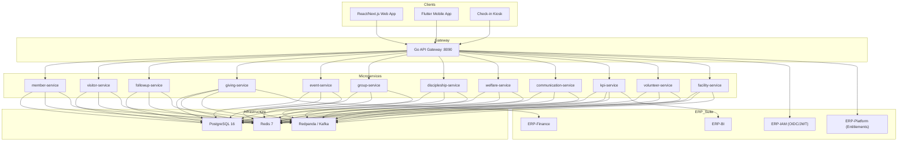
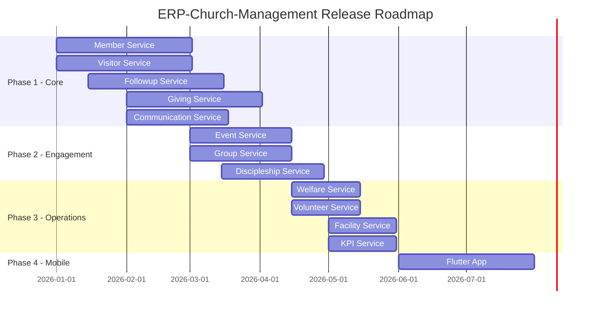

# Product Requirements Document (PRD) -- ERP-Church-Management
> Version: 1.0 | Last Updated: 2026-02-23 | Status: Draft
> Classification: Internal | Author: AIDD System

---

## 1. Executive Summary

ERP-Church-Management is the Faith/Nonprofit vertical module within the BillyRonks ERP suite, delivering a comprehensive Church Management System (ChMS) purpose-built for denominations following the RCCG Follow-up & Visitation Ministry model. The platform unifies member care, visitor assimilation, giving, discipleship, welfare, and multi-channel communication into a single, multi-tenant system supporting campuses of 50 to 50,000+ members.

The system is benchmarked against **Planning Center**, **Tithe.ly**, **ChurchTrac**, and **Breeze** -- adopting their strongest capabilities while adding differentiated features around the 4Cs assimilation workflow, 6-directorate follow-up structure, Account Officers for Souls, and Quarterly Shepherding KPIs.

---

## 2. Problem Statement

Churches today face:

| Pain Point | Current State | Impact |
|---|---|---|
| Visitor leakage | 70-85% of first-timers never return | Lost souls, stunted growth |
| Fragmented tools | 3-5 disconnected SaaS per church | Data silos, reconciliation burden |
| Manual follow-up | Spreadsheet-based tracking | Missed 72-hour window |
| No discipleship pipeline | Ad-hoc mentorship | Low spiritual maturity progression |
| Giving opacity | Separate giving platforms | Delayed tax receipts, no pledge tracking |
| Communication sprawl | WhatsApp groups + SMS + email without coordination | Message fatigue, missed contacts |

---

## 3. Competitive Landscape

### 3.1 Feature Comparison Matrix

| Capability | Planning Center | Tithe.ly | ChurchTrac | Breeze | **ERP-ChMS** |
|---|---|---|---|---|---|
| Member CRUD | Yes | Basic | Yes | Yes | **Yes + Family Units + Natural Groups** |
| Visitor Assimilation | Check-in only | No | Manual | Basic | **Full 4Cs Workflow + 72hr Automation** |
| Follow-up Directorates | No | No | No | No | **6 Directorates + Account Officers** |
| Giving (tithes/offerings) | Limited | **Core strength** | Yes | Yes | **Tithes + Offerings + Pledges + Tax Receipts** |
| Event Management | **Core strength** | Basic | Yes | Basic | **Events + QR/NFC Check-in + Service Planning** |
| Small Groups | Yes | No | Yes | Yes | **Small Groups + Ministries + Cell Groups + Home Fellowships** |
| Discipleship Tracking | No | No | Basic | No | **NBC + Mentorship + Sunday School + Progress** |
| Welfare Management | No | No | No | No | **Welfare Cases + Benevolence Fund + Needs Tracking** |
| Multi-channel Comms | Email only | Email + SMS | Email + SMS | Email + SMS | **SMS + WhatsApp + Telegram + Facebook + Email + Push + In-app** |
| KPI Dashboard | Reports | Giving reports | Reports | Basic | **Real-time KPIs + Directorate Dashboards + Growth Analytics** |
| Volunteer Management | **Core strength** | No | Basic | Basic | **Scheduling + Skill Matching + Team Management** |
| Facility Booking | No | No | Basic | No | **Room Booking + Equipment + Campus Management** |
| Mobile App | Yes | Yes | No | Limited | **Flutter (iOS + Android) + Offline Capable** |
| Multi-tenant / Multi-campus | Limited | No | No | No | **Full Multi-tenant with X-Tenant-ID** |
| API / Integration | REST | Limited | No | Limited | **REST + GraphQL + Kafka Events + Socket.IO** |

### 3.2 Competitive Advantages

1. **Only platform with the RCCG 6-Directorate structure** built natively (1st Timer, Further Follow-up, Counselling, Natural Group, Development & Structuring, Welfare & Finance)
2. **Account Officers for Souls** -- dedicated shepherding assignment absent from all competitors
3. **4Cs Assimilation Workflow** (Connect, Capture, Communicate, Convert) as a first-class automation pipeline
4. **Quarterly Shepherding KPIs** computed automatically: 72-hour contact, NBC enrollment, Sunday School enrollment, House Fellowship participation, Mentorship completion, Workforce integration, Welfare support
5. **7-channel communication** vs. the 2-channel maximum of competitors
6. **ERP-suite integration** -- seamless connection to Finance, HCM, BI, and other modules

---

## 4. Target Users & Personas

| Role | Persona | Primary Jobs-to-be-Done |
|---|---|---|
| `super_admin` | Denominational IT Admin | Platform configuration, multi-campus setup, entitlement management |
| `admin` | Church Administrator | Day-to-day operations, reports, user management |
| `pastor` | Senior/Campus Pastor | Dashboard oversight, pastoral care, strategic metrics |
| `minister` | Associate Minister | Ministry-specific oversight, teaching assignments |
| `HOD` | Head of Department | Department management, volunteer coordination |
| `directorate_head` | Follow-up Directorate Head | Directorate workflow, KPI tracking, team oversight |
| `account_officer` | Account Officer for Souls | Individual shepherding, follow-up execution, visit logging |
| `worker` | Church Worker | Task execution, attendance marking, group facilitation |
| `member` | Church Member | Profile management, giving, group discovery, event registration |

---

## 5. Product Architecture

### 5.1 High-Level Architecture

### 5.2 Service Inventory

| # | Service | Port | Domain Responsibilities |
|---|---|---|---|
| 1 | member-service | 8080 | Member CRUD, family units, communication preferences, natural groups |
| 2 | visitor-service | 8080 | Visitor registration, first-timer tracking, 72-hour follow-up automation |
| 3 | followup-service | 8080 | Account officer assignment, 6 directorate workflows, follow-up activities |
| 4 | giving-service | 8080 | Tithes, offerings, pledges, donations, tax receipts, giving statements |
| 5 | event-service | 8080 | Events, attendance, QR/NFC check-in, service planning |
| 6 | group-service | 8080 | Small groups, ministries, cell groups, home fellowships |
| 7 | discipleship-service | 8080 | NBC, mentorship (90-120 day), Sunday School, progress tracking |
| 8 | welfare-service | 8080 | Welfare cases, benevolence fund, needs tracking |
| 9 | communication-service | 8080 | SMS/WhatsApp/Telegram/Facebook/Email/Push/In-app |
| 10 | kpi-service | 8080 | Dashboard metrics, directorate KPIs, growth analytics |
| 11 | volunteer-service | 8080 | Scheduling, skill matching, team management |
| 12 | facility-service | 8080 | Room booking, equipment management, campus management |

---

## 6. Feature Requirements

### 6.1 Member Management (P0)

**FR-MEM-001**: The system SHALL provide full CRUD operations for member records with auto-generated membership IDs (format: `MEM000001`).

**FR-MEM-002**: The system SHALL support member categorization: Members, Prospects, Workers, Ministers, Pastors.

**FR-MEM-003**: The system SHALL support Natural Group segmentation: Youth, Men, Women, Elders, Teens, Children.

**FR-MEM-004**: The system SHALL support family unit grouping via the Household model.

**FR-MEM-005**: The system SHALL track communication preferences across 7 channels (phone, email, WhatsApp, Telegram, Facebook Messenger, push, in-app).

**FR-MEM-006**: The system SHALL detect absentee members (configurable threshold, default 3 weeks) and auto-create follow-up activities.

**FR-MEM-007**: The system SHALL provide member statistics by natural group and member type.

### 6.2 Visitor Management & Assimilation (P0)

**FR-VIS-001**: The system SHALL register visitors with full contact details including multi-channel identifiers.

**FR-VIS-002**: The system SHALL implement the 72-hour follow-up protocol with automated reminders running hourly.

**FR-VIS-003**: The system SHALL track 72-hour contact completion rate with a target of 90%.

**FR-VIS-004**: The system SHALL support the 4Cs assimilation workflow:
- **Connect**: Initial welcome, relationship building, welcome gift tracking
- **Capture**: Visitor card data entry, contact information collection
- **Communicate**: 72-hour multi-channel outreach, ongoing follow-up
- **Convert**: Visitor-to-member conversion with full data migration

**FR-VIS-005**: The system SHALL track welcome gift distribution per visitor.

**FR-VIS-006**: The system SHALL emit real-time Socket.IO events on new visitor creation.

### 6.3 Follow-up & Directorates (P0)

**FR-FU-001**: The system SHALL support 6 directorates:
1. 1st Timer Directorate
2. Further Follow-up Directorate
3. Counselling Directorate
4. Natural Group Directorate
5. Development & Structuring Directorate
6. Welfare & Finance Directorate

**FR-FU-002**: The system SHALL assign Account Officers to members/visitors with active/inactive status tracking.

**FR-FU-003**: The system SHALL record follow-up activities with type, status, scheduled date, performed date, and notes.

**FR-FU-004**: The system SHALL route individuals through directorates based on their assimilation stage.

### 6.4 Giving & Finance (P0)

**FR-GIV-001**: The system SHALL support giving types: Tithes, Offerings, Donations, Special Seeds.

**FR-GIV-002**: The system SHALL manage pledge campaigns with tracking against fulfillment.

**FR-GIV-003**: The system SHALL generate tax-deductible giving statements per member per fiscal year.

**FR-GIV-004**: The system SHALL integrate with ERP-Finance for consolidated financial reporting.

### 6.5 Events & Attendance (P0)

**FR-EVT-001**: The system SHALL manage events with types: Services, Outreach, Classes, Come and See, Go and Tell.

**FR-EVT-002**: The system SHALL support QR code and NFC check-in for attendance tracking.

**FR-EVT-003**: The system SHALL track attendance per event per member with date stamps.

### 6.6 Groups & Ministries (P1)

**FR-GRP-001**: The system SHALL manage small groups, home fellowships, cell groups, and ministry teams.

**FR-GRP-002**: The system SHALL support group multiplication tracking for cell group growth.

### 6.7 Discipleship (P1)

**FR-DIS-001**: The system SHALL manage New Believer Class (NBC) enrollment with status tracking (Enrolled, In Progress, Completed).

**FR-DIS-002**: The system SHALL support mentorship pairs with 90-120 day duration and completion tracking.

**FR-DIS-003**: The system SHALL manage Sunday School programs with attendance.

### 6.8 Welfare (P1)

**FR-WEL-001**: The system SHALL manage welfare cases with status lifecycle (Open, In Progress, Fulfilled, Closed).

**FR-WEL-002**: The system SHALL track benevolence fund allocation and disbursement.

### 6.9 Communication (P0)

**FR-COM-001**: The system SHALL support 7 communication channels: SMS (Twilio), WhatsApp (Business API), Telegram (Bot API), Facebook Messenger, Email (SMTP/Nodemailer), Push notifications, In-app notifications.

**FR-COM-002**: The system SHALL implement a unified messaging service with channel fallback.

### 6.10 KPIs & Analytics (P1)

**FR-KPI-001**: The system SHALL auto-calculate Quarterly Shepherding KPIs daily:
- 72-hour contact completion rate (target: 90%)
- NBC enrollment rate (target: 100%)
- Mentorship completion rate (target: 85%)
- Visitor conversion rate (target: 60%)
- Welfare cases fulfilled (target: 20/month)

**FR-KPI-002**: The system SHALL provide real-time dashboards with Socket.IO live updates.

### 6.11 Volunteer Management (P1)

**FR-VOL-001**: The system SHALL manage volunteer profiles with skills, availability, and certifications.

**FR-VOL-002**: The system SHALL support shift scheduling and skill-based matching.

### 6.12 Facility Management (P2)

**FR-FAC-001**: The system SHALL manage rooms, equipment, and campus assets.

**FR-FAC-002**: The system SHALL support facility booking with conflict detection.

---

## 7. Non-Functional Requirements

| Category | Requirement | Target |
|---|---|---|
| Performance | API response time (p95) | < 200ms |
| Performance | Dashboard load time | < 2s |
| Scalability | Concurrent users per campus | 500 |
| Scalability | Total members per tenant | 100,000 |
| Availability | Uptime SLA | 99.9% |
| Security | Authentication | OIDC/JWT via ERP-IAM |
| Security | Authorization | RBAC with 9 roles |
| Security | Data isolation | Tenant-scoped via X-Tenant-ID |
| Compliance | GDPR | Data export, right to erasure |
| Compliance | PCI-DSS | Giving data tokenized |

---

## 8. Success Metrics

| Metric | Baseline (Spreadsheet) | Year-1 Target |
|---|---|---|
| 72-hour contact rate | 35% | 90% |
| Visitor conversion rate | 15% | 60% |
| NBC enrollment rate | 40% | 100% |
| Average follow-up response time | 5 days | < 24 hours |
| Giving statement generation time | 2 weeks manual | Real-time |
| Communication channel coverage | 2 (SMS + phone) | 7 channels |

---

## 9. Release Phases

---

## 10. Risks & Mitigations

| Risk | Probability | Impact | Mitigation |
|---|---|---|---|
| WhatsApp Business API rate limits | High | Medium | Channel fallback, message queuing via Redpanda |
| Multi-tenant data leakage | Low | Critical | Tenant middleware on gateway + per-service row-level filtering |
| KPI calculation at scale | Medium | Medium | Materialized views, background Kafka consumers |
| Mobile offline sync conflicts | Medium | High | Conflict-free merge strategy, last-write-wins with audit trail |
| GDPR right-to-erasure across 12 services | Medium | High | Choreographed saga via Kafka `member.erasure.requested` event |

---

## 11. Appendix: Domain Event Catalog

| Event | Publisher | Consumers |
|---|---|---|
| `visitor.created` | visitor-service | followup-service, communication-service, kpi-service |
| `visitor.72hr.contact.recorded` | visitor-service | kpi-service, followup-service |
| `visitor.converted` | visitor-service | member-service, kpi-service |
| `member.created` | member-service | discipleship-service, group-service, kpi-service |
| `member.absentee.detected` | member-service | followup-service, communication-service |
| `followup.assigned` | followup-service | communication-service |
| `giving.recorded` | giving-service | kpi-service, communication-service |
| `event.checkin` | event-service | kpi-service, member-service |
| `kpi.calculated` | kpi-service | communication-service (alerts) |
| `welfare.case.created` | welfare-service | followup-service, communication-service |
