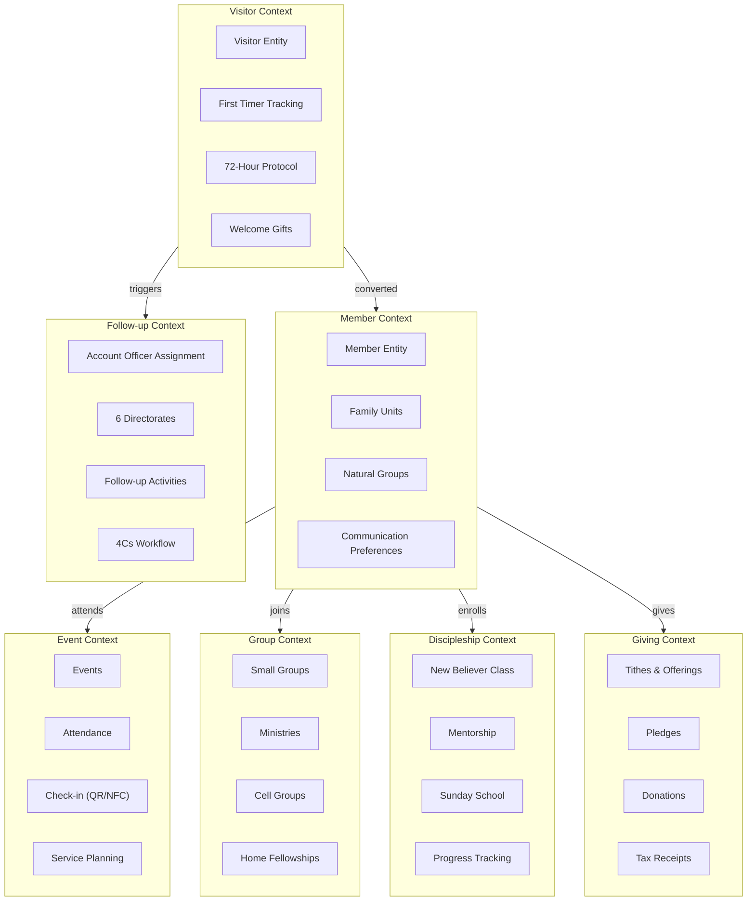
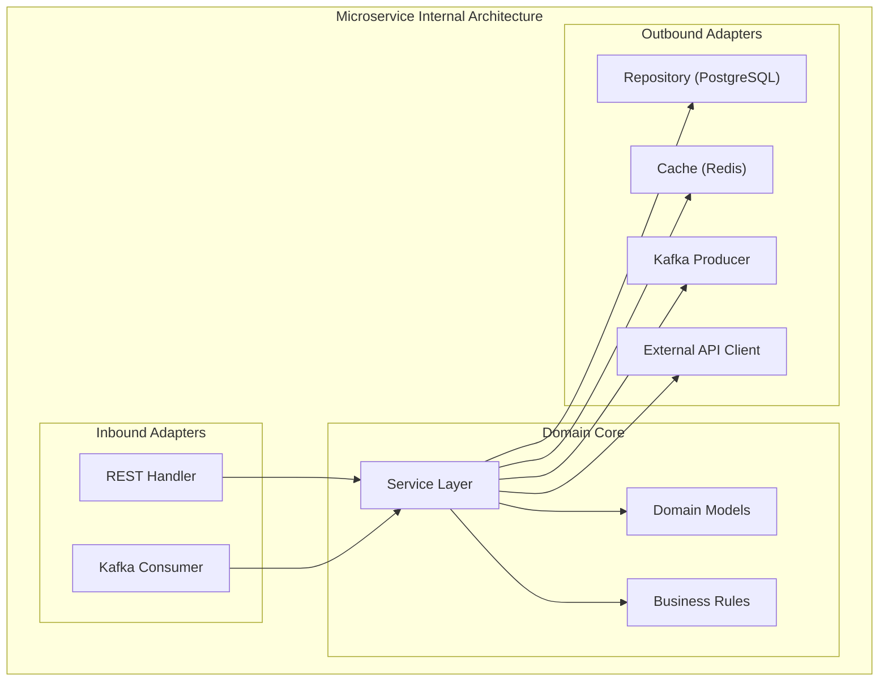
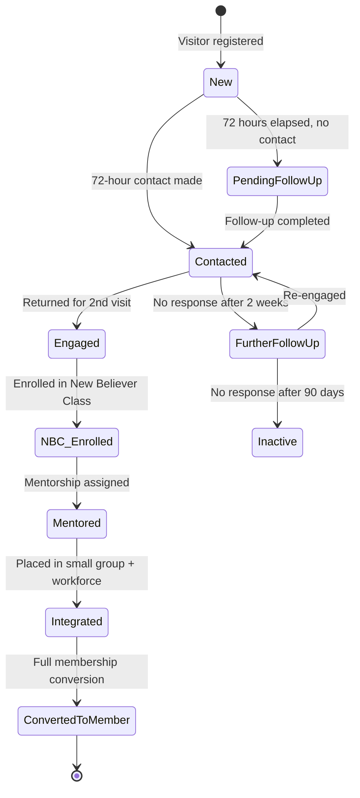
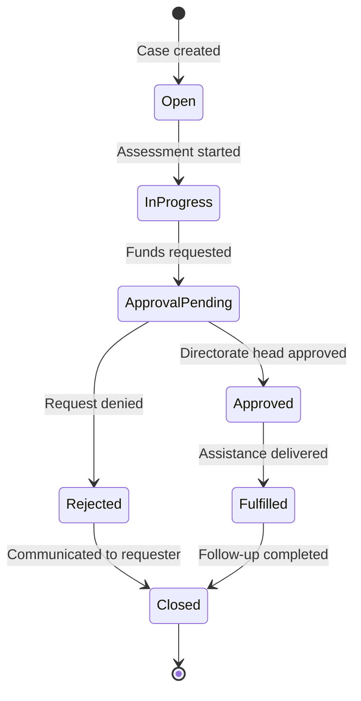
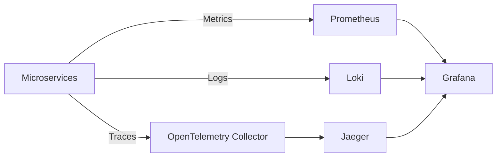

# Software Architecture -- ERP-Church-Management
> Version: 1.0 | Last Updated: 2026-02-23 | Status: Draft
> Classification: Internal | Author: AIDD System

---

## 1. Architecture Style

ERP-Church-Management employs a **Domain-Driven Microservices** architecture, decomposed along bounded contexts derived from the RCCG Follow-up & Visitation Ministry model. Each of the 12 services owns its domain logic, communicates via REST (synchronous) and Kafka/Redpanda (asynchronous), and shares a PostgreSQL database in Phase 1 with planned migration to per-service databases in Phase 2.

---

## 2. Bounded Contexts



---

## 3. Service Internal Architecture

Each microservice follows a clean hexagonal (ports & adapters) architecture:



### 3.1 Package Structure (Go Services)

```
services/{service-name}/
  cmd/
    main.go              # Entry point
  internal/
    domain/
      model.go           # Domain entities
      events.go          # Domain events
      rules.go           # Business rules
    handler/
      rest.go            # HTTP handlers
      consumer.go        # Kafka consumers
    repository/
      postgres.go        # PostgreSQL implementation
      redis.go           # Redis cache implementation
    service/
      service.go         # Application service / orchestration
  Dockerfile
  go.mod
```

---

## 4. API Design

### 4.1 Gateway Routing Convention

All requests follow the pattern: `GET/POST/PUT/DELETE /v1/{service}/{resource}[/{id}]`

The Go gateway extracts the service name from the URL path and reverse-proxies to the corresponding upstream:

```
/v1/member/...        -> http://member-service:8080/...
/v1/visitor/...       -> http://visitor-service:8080/...
/v1/followup/...      -> http://followup-service:8080/...
/v1/giving/...        -> http://giving-service:8080/...
/v1/event/...         -> http://event-service:8080/...
/v1/group/...         -> http://group-service:8080/...
/v1/discipleship/...  -> http://discipleship-service:8080/...
/v1/welfare/...       -> http://welfare-service:8080/...
/v1/communication/... -> http://communication-service:8080/...
/v1/kpi/...           -> http://kpi-service:8080/...
/v1/volunteer/...     -> http://volunteer-service:8080/...
/v1/facility/...      -> http://facility-service:8080/...
```

### 4.2 Standard Response Envelope

```json
{
  "success": true,
  "message": "Operation completed",
  "data": { ... },
  "pagination": {
    "total": 100,
    "page": 1,
    "limit": 50,
    "totalPages": 2
  }
}
```

### 4.3 Error Response

```json
{
  "success": false,
  "message": "Descriptive error message",
  "error": "Technical error detail"
}
```

---

## 5. Domain Event Architecture

### 5.1 Event Schema

```json
{
  "event_id": "uuid",
  "event_type": "visitor.created",
  "tenant_id": "uuid",
  "timestamp": "2026-02-23T10:00:00Z",
  "correlation_id": "uuid",
  "source_service": "visitor-service",
  "payload": { ... }
}
```

### 5.2 Topic Design

| Topic | Partitions | Retention | Publishers | Consumers |
|---|---|---|---|---|
| `church.visitor.events` | 6 | 7 days | visitor-service | followup, communication, kpi |
| `church.member.events` | 12 | 7 days | member-service | discipleship, group, kpi |
| `church.giving.events` | 6 | 30 days | giving-service | kpi, finance (ERP-Finance) |
| `church.event.events` | 6 | 7 days | event-service | member, kpi |
| `church.followup.events` | 6 | 7 days | followup-service | communication |
| `church.welfare.events` | 3 | 30 days | welfare-service | followup, communication |
| `church.kpi.events` | 3 | 30 days | kpi-service | communication (alerts) |
| `church.communication.events` | 12 | 3 days | communication-service | (audit only) |

---

## 6. State Machine: Visitor Lifecycle



---

## 7. State Machine: Welfare Case Lifecycle



---

## 8. Cross-Cutting Concerns

### 8.1 Observability Stack



### 8.2 Configuration Management

- **Environment variables**: Injected via Docker Compose / Kubernetes ConfigMaps
- **Secrets**: Managed via Kubernetes Secrets / AWS Secrets Manager
- **Feature flags**: Redis-backed feature flag service (future)

### 8.3 Database Migrations

- SQL migration files in `/database/migrations/`
- Sequelize-based migrations in source monolith (legacy)
- golang-migrate for target microservices

### 8.4 Health Check Contract

Every service exposes `GET /healthz` returning:

```json
{
  "status": "healthy",
  "service": "member-service",
  "version": "1.0.0",
  "uptime": 3600
}
```

---

## 9. Technology Stack Summary

| Layer | Technology | Version | Justification |
|---|---|---|---|
| Gateway | Go (net/http) | 1.22+ | Low latency, small binary, stdlib sufficient |
| Services (target) | Go | 1.22+ | Consistent with gateway, good concurrency |
| Services (legacy) | Node.js/Express | 18+ | Source monolith, being migrated |
| ORM (legacy) | Sequelize | 6.35 | Source monolith |
| Database | PostgreSQL | 16 | ACID, JSONB, full-text search |
| Cache | Redis | 7 | Sub-ms latency, pub/sub |
| Event Streaming | Redpanda (Kafka-compatible) | 24.2 | Kafka API without JVM overhead |
| Web Frontend | React/Next.js | 14+ | SSR, RSC for dashboards |
| Mobile | Flutter | 3.x | Single codebase for iOS + Android |
| Real-time (legacy) | Socket.IO | 4.6 | Being replaced by SSE + Kafka |
| SMS | Twilio | REST API | Proven deliverability |
| WhatsApp | WhatsApp Business API | Cloud API | Official channel |
| Containerization | Docker | 24+ | Standard container runtime |
| Orchestration | Kubernetes | 1.28+ | Production auto-scaling |
