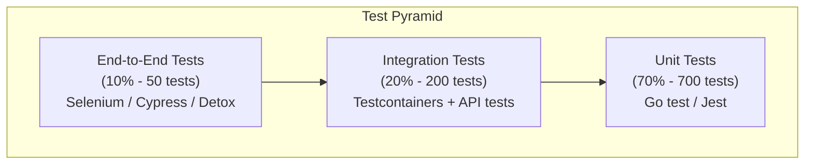
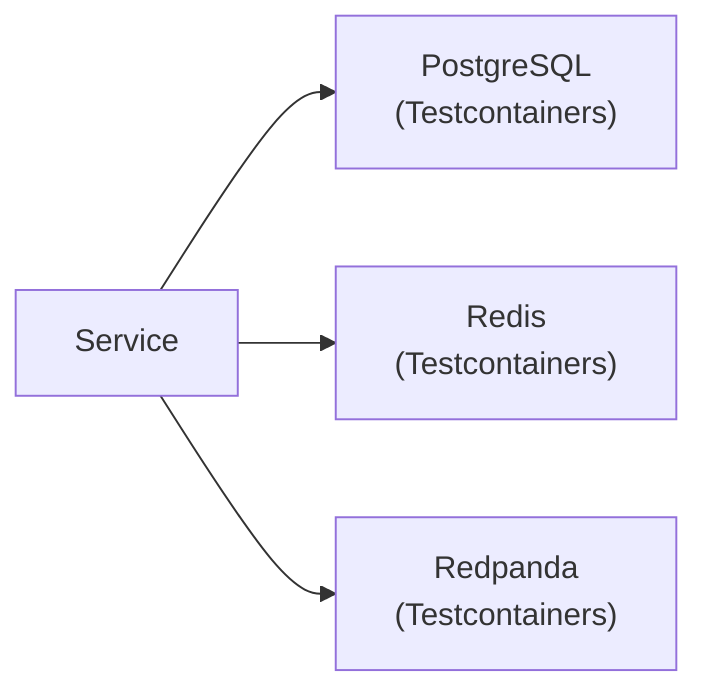
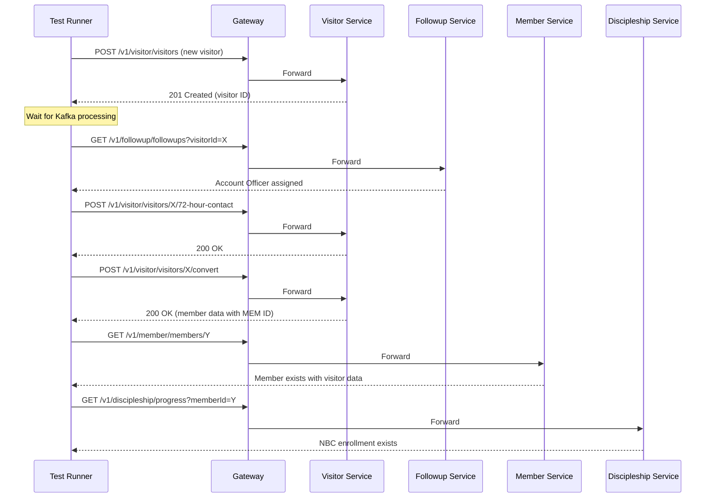

# AIDD Testing Requirements -- ERP-Church-Management
> Version: 1.0 | Last Updated: 2026-02-23 | Status: Draft
> Classification: Internal | Author: AIDD System

---

## 1. Testing Strategy

ERP-Church-Management follows the AIDD-28 testing standard with a comprehensive test pyramid: Unit Tests (70%), Integration Tests (20%), and End-to-End Tests (10%).

---

## 2. Unit Test Requirements

### 2.1 Coverage Targets

| Service | Target Coverage | Priority |
|---|---|---|
| Gateway | 90% | P0 |
| member-service | 85% | P0 |
| visitor-service | 85% | P0 |
| followup-service | 85% | P0 |
| giving-service | 85% | P0 |
| event-service | 80% | P1 |
| group-service | 80% | P1 |
| discipleship-service | 80% | P1 |
| welfare-service | 80% | P1 |
| communication-service | 85% | P0 |
| kpi-service | 85% | P0 |
| volunteer-service | 80% | P1 |
| facility-service | 75% | P2 |

### 2.2 Unit Test Categories

#### Gateway Tests
| Test ID | Test Description | Input | Expected Output |
|---|---|---|---|
| GW-UT-001 | Health check returns healthy | GET /healthz | 200, {"status":"healthy"} |
| GW-UT-002 | Capabilities returns doc | GET /v1/capabilities | 200, capability document |
| GW-UT-003 | Missing tenant returns 400 | GET /v1/member/ (no X-Tenant-ID) | 400 |
| GW-UT-004 | Missing JWT returns 401 | GET /v1/member/ (no Auth header) | 401 |
| GW-UT-005 | Short JWT returns 401 | GET /v1/member/ (Bearer "abc") | 401 |
| GW-UT-006 | Unknown service returns 404 | GET /v1/unknown/path | 404 |
| GW-UT-007 | Valid request proxied | GET /v1/member/123 (valid headers) | Proxied to member-service |
| GW-UT-008 | Correlation ID generated | GET /healthz (no X-Correlation-ID) | Response includes X-Correlation-ID |
| GW-UT-009 | Correlation ID forwarded | GET /healthz (with X-Correlation-ID) | Same ID in response |

#### Member Service Tests
| Test ID | Test Description |
|---|---|
| MEM-UT-001 | Create member with valid data returns 201 |
| MEM-UT-002 | Create member with missing firstName returns 400 |
| MEM-UT-003 | Get member by valid ID returns member |
| MEM-UT-004 | Get member by invalid ID returns 404 |
| MEM-UT-005 | Search with matching query returns results |
| MEM-UT-006 | Search with no match returns empty array |
| MEM-UT-007 | Update member status to Inactive |
| MEM-UT-008 | Delete member removes record |
| MEM-UT-009 | Membership ID generation increments correctly |
| MEM-UT-010 | Absentee detection with 3-week threshold |
| MEM-UT-011 | Natural group filter returns correct members |
| MEM-UT-012 | Account officer assignment creates record |

#### Visitor Service Tests
| Test ID | Test Description |
|---|---|
| VIS-UT-001 | Create visitor returns 201 |
| VIS-UT-002 | First-timer flag set correctly |
| VIS-UT-003 | 72-hour window calculation (within window) |
| VIS-UT-004 | 72-hour window calculation (overdue) |
| VIS-UT-005 | Record 72-hour contact updates fields |
| VIS-UT-006 | Convert visitor to member creates member record |
| VIS-UT-007 | Convert visitor updates visitor status |
| VIS-UT-008 | Welcome gift recording updates visitor |
| VIS-UT-009 | Duplicate visitor detection by phone |
| VIS-UT-010 | 72-hour completion rate calculation |

---

## 3. Integration Test Requirements

### 3.1 Service-Level Integration Tests

| Test ID | Test Description | Services Involved |
|---|---|---|
| INT-001 | Create visitor triggers Account Officer assignment | visitor-service, followup-service, Kafka |
| INT-002 | 72-hour cron job sends multi-channel outreach | visitor-service, communication-service, Kafka |
| INT-003 | Visitor conversion creates member and enrolls in NBC | visitor-service, member-service, discipleship-service |
| INT-004 | Giving record publishes event consumed by KPI service | giving-service, kpi-service, Kafka |
| INT-005 | Event check-in updates member attendance | event-service, member-service |
| INT-006 | Welfare case creation notifies directorate | welfare-service, followup-service, Kafka |
| INT-007 | KPI calculator produces correct rates from real data | kpi-service, PostgreSQL |
| INT-008 | Communication fallback from WhatsApp to SMS | communication-service, Twilio mock |
| INT-009 | Gateway routes to correct upstream service | gateway, member-service |
| INT-010 | Tenant isolation across all services | all services, PostgreSQL |

### 3.2 Database Integration Tests

| Test ID | Test Description |
|---|---|
| DB-INT-001 | Migration runs successfully on empty database |
| DB-INT-002 | All tables created with correct schema |
| DB-INT-003 | Foreign key constraints enforced |
| DB-INT-004 | Indexes improve query performance (EXPLAIN ANALYZE) |
| DB-INT-005 | Tenant-scoped queries never return cross-tenant data |
| DB-INT-006 | Concurrent writes handle membership ID generation correctly |

---

## 4. End-to-End Test Requirements

### 4.1 Critical User Journeys

| Test ID | Journey | Steps |
|---|---|---|
| E2E-001 | Visitor Registration to Member Conversion | Register visitor -> 72-hour follow-up -> NBC enrollment -> Mentorship -> Group placement -> Member conversion |
| E2E-002 | Sunday Service Flow | Create event -> Members check in (QR) -> Visitors registered -> Attendance report generated |
| E2E-003 | Giving Workflow | Member records tithe -> Receipt generated -> Statement available -> KPI updated |
| E2E-004 | Welfare Case Lifecycle | Case created -> Assessment -> Approval -> Disbursement -> Follow-up -> Closure |
| E2E-005 | Multi-Channel Communication | Compose message -> Select audience -> Send via SMS+WhatsApp+Email -> Track delivery |

### 4.2 E2E Test Flow: Visitor to Member

---

## 5. Performance Test Requirements

| Test ID | Scenario | SLA |
|---|---|---|
| PERF-001 | 500 concurrent check-ins (Sunday peak) | p99 < 1s |
| PERF-002 | 1000 member searches in 1 minute | p95 < 200ms |
| PERF-003 | 100 concurrent giving records | p95 < 300ms |
| PERF-004 | KPI dashboard with 100,000 members | Load < 2s |
| PERF-005 | 10,000 SMS messages queued | Queue drain < 5 min |

---

## 6. Security Test Requirements

| Test ID | Test Description | Tool |
|---|---|---|
| SEC-001 | SQL injection on all text input fields | SQLMap |
| SEC-002 | XSS on all user-facing endpoints | OWASP ZAP |
| SEC-003 | JWT token manipulation (expired, tampered, different tenant) | Manual + Burp Suite |
| SEC-004 | RBAC enforcement for all role combinations | Automated test suite |
| SEC-005 | Cross-tenant data access attempt | Automated test suite |
| SEC-006 | Rate limiting under DDoS simulation | Locust / k6 |
| SEC-007 | HTTPS enforcement (no plaintext) | SSL Labs |
| SEC-008 | Sensitive data not in logs | Log audit script |

---

## 7. Test Environment Requirements

| Environment | Purpose | Database | External Services |
|---|---|---|---|
| Local | Developer testing | Docker PostgreSQL | Mocked (WireMock) |
| CI | Automated pipeline | Testcontainers PostgreSQL | Mocked |
| Staging | Pre-production validation | Managed PostgreSQL (isolated) | Sandbox APIs (Twilio test) |
| Production | Smoke tests only | Production (read-only tests) | Production APIs |

---

## 8. AIDD Guardrails Testing

| Test ID | Guardrail | Verification |
|---|---|---|
| AIDD-001 | Autonomous actions require human approval | Verify no automated action bypasses approval flow |
| AIDD-002 | Data modifications are auditable | Verify audit log entry for every write operation |
| AIDD-003 | Rollback capability for automated jobs | Verify KPI recalculation can be reverted |
| AIDD-004 | Rate-limited external API calls | Verify Twilio/WhatsApp calls respect rate limits |
