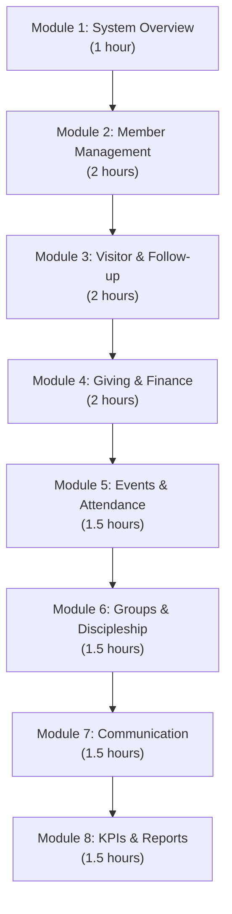
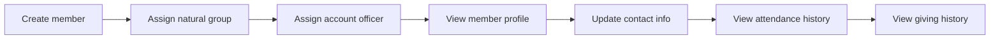

# Training Manual: Administrator -- ERP-Church-Management
> Version: 1.0 | Last Updated: 2026-02-23 | Status: Draft
> Classification: Internal | Author: AIDD System

---

## 1. Training Overview

This training manual provides a structured curriculum for church administrators learning to operate ERP-Church-Management. The curriculum consists of 8 modules, each requiring 1-2 hours of hands-on practice.

---

## 2. Training Curriculum

---

## 3. Module 1: System Overview

### Learning Objectives
- Understand the system architecture and 12 modules
- Navigate the admin dashboard
- Understand user roles and permissions

### 3.1 Exercise: Dashboard Tour

1. Log into the system with your admin credentials
2. Identify the following dashboard widgets:
   - Quick Stats bar (members, visitors, attendance, giving)
   - Action Items panel (pending tasks)
   - Charts (attendance trend, giving trend)
   - Quick Actions (add member, register visitor)
3. Click on each stat to navigate to the detailed view
4. Note the data freshness indicator (last KPI calculation timestamp)

### 3.2 Exercise: Role Exploration

1. Navigate to Settings > Users
2. Create test accounts for each role: pastor, minister, HOD, directorate_head, account_officer, worker, member
3. Log in as each role and note which menu items are visible
4. Document the permissions difference in a table

---

## 4. Module 2: Member Management

### Learning Objectives
- Create, search, update, and deactivate members
- Understand natural groups and member types
- Manage family units and account officer assignments

### 4.1 Exercise: Member Lifecycle

1. Create 5 sample members with different natural groups (Youth, Men, Women, Elders, Teens)
2. Assign account officers to each member
3. Search for members using different criteria
4. View member statistics and verify natural group counts
5. Simulate marking a member as "Inactive"

### 4.2 Exercise: Absentee Management

1. Navigate to Members > Absentees
2. Set threshold to 1 week (for testing purposes)
3. Identify absentee members
4. Create follow-up activities for 3 absentees
5. Verify Account Officers received notifications

---

## 5. Module 3: Visitor & Follow-up

### Learning Objectives
- Register visitors and first-timers
- Monitor the 72-hour follow-up dashboard
- Convert visitors to members
- Understand the 6-directorate routing

### 5.1 Exercise: Visitor Registration & Follow-up

1. Register 3 visitors as first-timers
2. Verify Account Officers were auto-assigned
3. Navigate to the 72-Hour Dashboard
4. Observe the countdown timers
5. Record a 72-hour contact for one visitor
6. Verify the KPI updates

### 5.2 Exercise: Visitor Conversion

1. Select a visitor who has completed follow-up
2. Click "Convert to Member"
3. Assign natural group and salvation date
4. Verify: member record created, membership ID generated, visitor status updated
5. Check that NBC enrollment was triggered

### 5.3 Exercise: Directorate Routing

1. Navigate to Follow-up > Directorates
2. View cases in each of the 6 directorates
3. Move a case from "1st Timer" to "Further Follow-up"
4. Move a case from "Further Follow-up" to "Natural Group"
5. Verify the activity log captures each transition

---

## 6. Module 4: Giving & Finance

### Learning Objectives
- Record tithes, offerings, and donations
- Manage pledge campaigns
- Generate tax statements

### 6.1 Exercise: Giving Recording

1. Record 5 giving transactions:
   - 1 Tithe (cash)
   - 1 Offering (bank transfer)
   - 1 Donation (online)
   - 1 Building Fund contribution
   - 1 Pledge payment
2. Verify each transaction appears in the member's giving history
3. Check the giving summary dashboard for totals by type

### 6.2 Exercise: Pledge Campaign

1. Create a new pledge campaign: "Building Fund 2026"
2. Set target: $500,000, duration: 12 months
3. Register pledges for 3 members
4. Record partial payments against one pledge
5. View the campaign dashboard progress

### 6.3 Exercise: Statements

1. Generate an annual giving statement for one member
2. Download as PDF and verify contents
3. Batch-generate statements for all members
4. Verify tax-deductible amounts are correctly calculated

---

## 7. Module 5: Events & Attendance

### Learning Objectives
- Create and manage events
- Configure check-in methods
- Analyze attendance data

### 7.1 Exercise: Event Creation & Check-In

1. Create a Sunday Service event
2. Set expected attendance to 100
3. Simulate check-ins for 10 members (manual method)
4. View the attendance list and verify timestamps
5. Compare actual vs. expected attendance

---

## 8. Module 6: Groups & Discipleship

### Learning Objectives
- Create and manage small groups and home fellowships
- Manage discipleship programs (NBC, Mentorship, Sunday School)

### 8.1 Exercise: Group Management

1. Create 3 groups: 1 Small Group, 1 Home Fellowship, 1 Ministry
2. Add members to each group
3. Set leaders and meeting schedules
4. Verify member count updates

### 8.2 Exercise: Discipleship Pipeline

1. Create an NBC program (start date, facilitator, curriculum)
2. Enroll 3 newly converted members
3. Update progress for each (25%, 50%, 75%, 100%)
4. On completion, assign mentors (90-120 day pairs)
5. Track mentorship milestones

---

## 9. Module 7: Communication

### Learning Objectives
- Send targeted messages across channels
- Create and use message templates
- Monitor delivery reports

### 9.1 Exercise: Multi-Channel Message

1. Compose a message: "Service reminder for this Sunday"
2. Target audience: All Active Members
3. Select channels: SMS + WhatsApp + Email
4. Send the message
5. Monitor the delivery report (delivered, failed, pending)

---

## 10. Module 8: KPIs & Reports

### Learning Objectives
- Read and interpret the KPI dashboard
- Understand KPI calculation methodology
- Generate directorate-specific reports

### 10.1 Exercise: KPI Dashboard

1. Navigate to KPI Dashboard
2. Identify each KPI: 72-hour contact, NBC enrollment, mentorship completion, visitor conversion, welfare cases
3. Check traffic-light status (Achieved=green, On Track=yellow, Behind=red)
4. Drill down into "Behind" KPIs to identify root causes
5. Trigger a manual KPI recalculation

### 10.2 Exercise: Directorate Report

1. Navigate to KPIs > Directorate View
2. Select "1st Timer Directorate"
3. View: active cases, completion rate, average time to contact
4. Export report as CSV

---

## 11. Assessment Checklist

| # | Competency | Pass Criteria |
|---|---|---|
| 1 | Navigate admin dashboard | Can describe all widgets and their purpose |
| 2 | Create and search members | Create member in < 60 seconds, find via search |
| 3 | Register visitor and track 72-hour | Register visitor, observe auto-assignment, monitor countdown |
| 4 | Convert visitor to member | Complete conversion with all data migrated |
| 5 | Record giving transaction | Record tithe with correct type, generate receipt |
| 6 | Create and manage event | Create event, record check-ins, view attendance |
| 7 | Send multi-channel message | Compose, target, send, check delivery report |
| 8 | Interpret KPI dashboard | Explain each KPI, identify actions for "Behind" KPIs |
