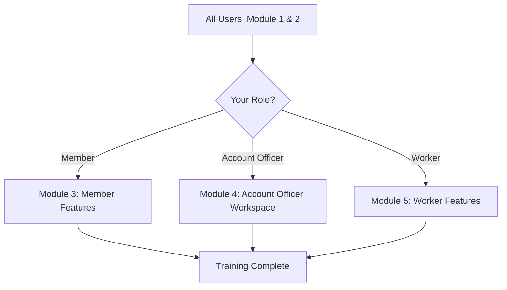
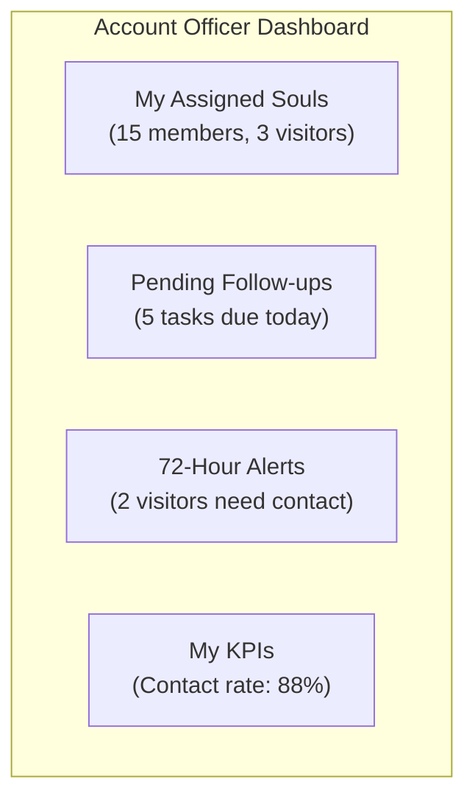

# Training Manual: End User -- ERP-Church-Management
> Version: 1.0 | Last Updated: 2026-02-23 | Status: Draft
> Classification: Internal | Author: AIDD System

---

## 1. Welcome

Welcome to ERP-Church-Management. This training manual will help church members, Account Officers, and workers learn how to use the system effectively. The training consists of 5 modules, each taking approximately 30-60 minutes.

---

## 2. Training Path by Role

---

## 3. Module 1: First Steps (All Users)

### 3.1 Logging In

**Web Application**:
1. Open your browser and go to the church's web address
2. Enter your email and password
3. Click "Sign In"

**Mobile App**:
1. Download the app from your device's app store
2. Open the app and enter the church URL
3. Enter your email and password
4. Allow notifications when prompted

### 3.2 Exercise: Profile Setup

1. Click your name in the top corner
2. Select "My Profile"
3. Verify your information is correct
4. Click "Edit Profile" and update:
   - Your preferred phone number
   - Your email address
   - Your communication preferences (how you want to be contacted)
5. Save your changes

---

## 4. Module 2: Navigation (All Users)

### 4.1 Main Menu Items

| Menu Item | What It Does |
|---|---|
| Dashboard | Your personal home screen with quick stats |
| Events | Upcoming church events and your attendance history |
| Groups | Small groups, home fellowships, and ministries |
| Giving | Your giving history and tax statements |
| Discipleship | Your spiritual growth programs and progress |
| Notifications | Messages from church leadership |
| Profile | Your personal information and settings |

### 4.2 Exercise: Navigation Tour

1. Visit each menu item listed above
2. On each page, identify:
   - What information is displayed
   - What actions you can take
   - How to go back to the dashboard

---

## 5. Module 3: Member Features

### 5.1 Event Check-In

**Using QR Code (recommended)**:
1. Open the mobile app
2. Tap "Check In" on the home screen
3. Your personal QR code appears
4. Hold it up to the scanner at the entrance

**Manual Check-In**:
1. Tell the check-in attendant your name
2. They will mark your attendance

### 5.2 Exercise: Check-In Practice

1. Open the mobile app
2. Find your QR code under Profile > My QR Code
3. Practice scanning at a test station (if available)

### 5.3 Viewing Giving History

1. Navigate to **Giving**
2. See your giving summary at the top
3. Scroll down to see individual transactions
4. Use filters to find specific records

### 5.4 Exercise: Download Tax Statement

1. Navigate to **Giving** > **Statements**
2. Select the current year
3. Click "Download PDF"
4. Open and review the statement

### 5.5 Finding and Joining Groups

1. Navigate to **Groups**
2. Browse available groups
3. Filter by: meeting day, time, or group type
4. Click on a group to see details
5. Click "Request to Join"

### 5.6 Exercise: Join a Group

1. Browse the available groups
2. Find one that matches your schedule and interests
3. Click "Request to Join"
4. Check your notifications for approval

---

## 6. Module 4: Account Officer Workspace

### 6.1 Your Dashboard

As an Account Officer, your dashboard shows:
- **Assigned souls**: Members and visitors you are responsible for
- **Pending follow-ups**: Tasks that need your attention
- **72-hour alerts**: Visitors approaching or past the contact deadline
- **KPI progress**: Your personal shepherding KPIs

### 6.2 Recording a Follow-up

1. Open a visitor or member profile
2. Click "Record Follow-up"
3. Select activity type: Phone Call, WhatsApp, Home Visit, etc.
4. Enter notes about the interaction
5. Set status: Completed or In Progress
6. Click Save

### 6.3 Exercise: Complete Follow-up Workflow

1. Open your Account Officer Dashboard
2. Find a visitor with a pending 72-hour contact
3. Make a phone call or send a WhatsApp message
4. Return to the system and record the follow-up
5. Verify the 72-hour alert clears
6. Check your KPI update

### 6.4 Creating Welfare Referrals

1. If a soul expresses a need during follow-up
2. Navigate to their profile > "Create Welfare Case"
3. Select category (Financial, Medical, Housing, etc.)
4. Describe the need and urgency
5. Submit -- the Welfare Directorate will be notified

### 6.5 Exercise: Welfare Case Creation

1. Open a member profile
2. Click "Create Welfare Case"
3. Fill in: Category = "Financial", Description, Urgency = "Medium"
4. Submit the case
5. Navigate to Follow-up > Welfare Directorate to see it appear

---

## 7. Module 5: Worker Features

### 7.1 Marking Attendance

As a worker, you may be responsible for check-in duty:
1. Navigate to **Events** > today's event
2. Click "Start Check-In"
3. Search for arriving members by name
4. Click "Check In" next to their name
5. For visitors: click "Register Visitor" and fill in their card

### 7.2 Volunteer Scheduling

1. Navigate to **Volunteer** > **My Schedule**
2. View your upcoming shifts
3. Confirm or request change for each shift
4. After serving, your hours are automatically logged

### 7.3 Exercise: Practice Check-In

1. Open the Events page
2. Select a test event
3. Search for and check in 5 members
4. Register 2 new visitors
5. View the attendance count update in real-time

---

## 8. Tips for Success

| Tip | Why It Matters |
|---|---|
| Update your profile regularly | Ensures the church can reach you |
| Set communication preferences | Controls how you receive messages |
| Check in every Sunday | Tracks attendance for pastoral care |
| Log follow-ups promptly (Account Officers) | Maintains accurate 72-hour KPIs |
| Report technical issues to admin | Helps improve the system |

---

## 9. Frequently Asked Questions

**Q: I forgot my password.**
A: Click "Forgot Password" on the login screen. A reset link will be sent to your email.

**Q: My attendance was not recorded.**
A: Contact your church admin. They can manually add your attendance record.

**Q: I want to change my natural group.**
A: Contact your church admin. Only administrators can change natural group assignments.

**Q: How do I see my giving total for the year?**
A: Navigate to Giving. Your annual summary is displayed at the top of the page.

**Q: Can I use the system offline?**
A: The mobile app has limited offline support. Data will sync when you reconnect.
