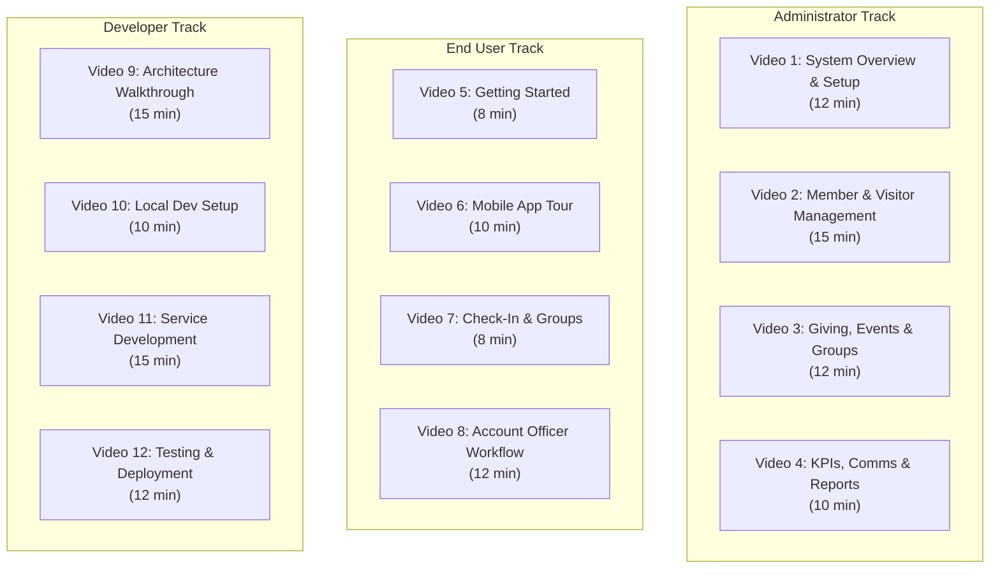

# Training Video Scripts -- ERP-Church-Management
> Version: 1.0 | Last Updated: 2026-02-23 | Status: Draft
> Classification: Internal | Author: AIDD System

---

## 1. Video Series Overview

The training video series consists of 12 videos organized into 3 tracks: Administrator (4 videos), End User (4 videos), and Developer (4 videos). Each video is 8-15 minutes in length.

---

## 2. Video 1: System Overview & Setup (Admin)

### Script

**[INTRO - 0:00-0:30]**
"Welcome to ERP-Church-Management. In this video, you'll learn what this system does, how it's organized, and how to navigate the administrator dashboard. This system manages your church's complete member lifecycle -- from the moment a visitor walks through the door to their full integration as a serving member."

**[SCREEN: Architecture Diagram - 0:30-2:00]**
"ERP-Church-Management consists of 12 interconnected modules. Let me walk you through each one:
- Member Service: Your church directory and member database
- Visitor Service: First-timer registration and the critical 72-hour follow-up
- Follow-up Service: Account Officer assignments and the 6-Directorate workflow
- Giving Service: Tithes, offerings, pledges, and tax receipts
- Event Service: Service planning, attendance tracking, and QR/NFC check-in
- Group Service: Small groups, home fellowships, and ministries
- Discipleship Service: New Believer Class, mentorship, and Sunday School
- Welfare Service: Benevolence cases and needs tracking
- Communication Service: SMS, WhatsApp, Telegram, Facebook, email, and push notifications
- KPI Service: Real-time dashboards for your quarterly shepherding KPIs
- Volunteer Service: Scheduling and skill-based team management
- Facility Service: Room booking and campus equipment management"

**[SCREEN: Login & Dashboard - 2:00-5:00]**
"Let me show you the admin dashboard. When you log in, you'll see four key areas..."
[Walk through Quick Stats, Action Items, Charts, Quick Actions]

**[SCREEN: User Roles - 5:00-8:00]**
"The system supports 9 user roles, each with different permissions..."
[Demonstrate creating users with different roles]

**[SCREEN: Settings - 8:00-11:00]**
"Let's configure your church's basic settings..."
[Walk through tenant settings, communication channels, KPI targets]

**[OUTRO - 11:00-12:00]**
"You now have a complete overview of the system. In the next video, we'll dive into member and visitor management."

---

## 3. Video 2: Member & Visitor Management (Admin)

### Script

**[INTRO - 0:00-0:30]**
"In this video, you'll learn to manage church members and visitors, including the 4Cs assimilation workflow and the 72-hour follow-up protocol."

**[SCREEN: Create Member - 0:30-3:00]**
"Let's create a new member. Navigate to Members, click Add Member..."
[Demonstrate full member creation with all fields]
"Notice the system auto-generates a membership ID in the format MEM followed by a 6-digit number."

**[SCREEN: Natural Groups - 3:00-4:30]**
"Natural Groups are a key concept in our follow-up framework. Every member belongs to one: Youth, Men, Women, Elders, Teens, or Children. This determines their pastoral care pathway..."
[Show natural group assignment and filtering]

**[SCREEN: Register Visitor - 4:30-7:00]**
"Now let's register a first-time visitor..."
[Demonstrate visitor registration]
"Watch what happens automatically: an Account Officer is assigned within seconds, and the 72-hour countdown begins."

**[SCREEN: 72-Hour Dashboard - 7:00-10:00]**
"This is the 72-hour follow-up dashboard. It shows three columns: Pending, In Progress, and Completed..."
[Show countdown timers, contact recording, KPI updates]

**[SCREEN: Visitor Conversion - 10:00-13:00]**
"When a visitor is ready for membership, click Convert to Member..."
[Demonstrate the full conversion process]
"Notice that the system automatically enrolls them in the New Believer Class."

**[SCREEN: Absentee Detection - 13:00-15:00]**
"The system automatically detects members who haven't attended in 3 or more weeks..."
[Show absentee list and follow-up creation]

---

## 4. Video 3: Giving, Events & Groups (Admin)

### Script

**[INTRO - 0:00-0:30]**
"This video covers three essential modules: Giving management, Event & Attendance tracking, and Group management."

**[SCREEN: Record Giving - 0:30-4:00]**
[Demonstrate recording a tithe, offering, pledge payment]
"The system supports multiple giving types and payment methods. Tax-deductible giving automatically generates receipts."

**[SCREEN: Pledge Campaigns - 4:00-6:00]**
[Demonstrate creating a campaign, registering pledges, tracking fulfillment]

**[SCREEN: Create Event & Check-In - 6:00-9:00]**
[Demonstrate event creation, QR code check-in, attendance viewing]

**[SCREEN: Group Management - 9:00-12:00]**
[Demonstrate creating groups, adding members, setting leaders]

---

## 5. Video 5: Getting Started (End User)

### Script

**[INTRO - 0:00-0:30]**
"Welcome to ERP-Church-Management. This short video will help you get started as a church member."

**[SCREEN: Login - 0:30-1:30]**
"Your church administrator has created an account for you. Let's log in..."

**[SCREEN: Profile Setup - 1:30-3:00]**
"The first thing you should do is complete your profile and set your communication preferences..."

**[SCREEN: Giving History - 3:00-5:00]**
"Navigate to Giving to see your complete giving history..."

**[SCREEN: Groups - 5:00-7:00]**
"The Groups page shows available groups you can join..."

**[OUTRO - 7:00-8:00]**
"That covers the basics. Download the mobile app for on-the-go access to all these features."

---

## 6. Video 8: Account Officer Workflow (End User)

### Script

**[INTRO - 0:00-0:30]**
"If you are an Account Officer for Souls, this video is essential. You'll learn to manage your assigned souls, record follow-ups, and track your KPIs."

**[SCREEN: AO Dashboard - 0:30-3:00]**
"Your Account Officer dashboard shows your assigned souls, pending follow-ups, 72-hour alerts, and personal KPIs..."
[Walk through each section]

**[SCREEN: Recording Follow-up - 3:00-6:00]**
"When you make a phone call, send a WhatsApp message, or conduct a home visit, you must record it in the system..."
[Demonstrate recording a follow-up with notes]

**[SCREEN: 72-Hour Contact - 6:00-9:00]**
"The most critical task is the 72-hour contact for new visitors..."
[Show the alert, demonstrate completing it, observe KPI update]

**[SCREEN: Welfare Referral - 9:00-11:00]**
"If a soul expresses a need during your follow-up, you can create a welfare case..."
[Demonstrate welfare case creation]

**[OUTRO - 11:00-12:00]**
"Remember: consistent follow-up recording is the key to accurate KPIs and effective soul care."

---

## 7. Video 9: Architecture Walkthrough (Developer)

### Script

**[INTRO - 0:00-0:30]**
"Welcome, developers. This video provides a technical architecture walkthrough of ERP-Church-Management."

**[SCREEN: C4 Context - 0:30-3:00]**
"The system consists of 12 microservices behind a Go API gateway..."
[Walk through the C4 context diagram]

**[SCREEN: Gateway Code - 3:00-7:00]**
"Let's look at the gateway source code in gateway/main.go..."
[Walk through middleware chain, service registry, reverse proxy]

**[SCREEN: Service Structure - 7:00-10:00]**
"Each microservice follows a hexagonal architecture..."
[Show package structure, handler, service, repository layers]

**[SCREEN: Event-Driven Communication - 10:00-13:00]**
"Services communicate asynchronously via Redpanda/Kafka topics..."
[Show event publishing, consuming, topic design]

**[SCREEN: Database & Migrations - 13:00-15:00]**
"All services share a PostgreSQL database with tenant_id isolation..."
[Show schema, migrations, query patterns]

---

## 8. Production Notes

### Recording Setup
- Screen recording: 1920x1080, 30fps
- Audio: Clear narration with no background music during demonstrations
- Cursor: Highlighted with click indicators
- Editing: Zoom into relevant UI sections when needed

### Captions
All videos must include English captions (SRT format) for accessibility.

### Distribution
- YouTube (unlisted) for broad access
- Learning Management System (LMS) for tracked completions
- In-app help center for contextual access
