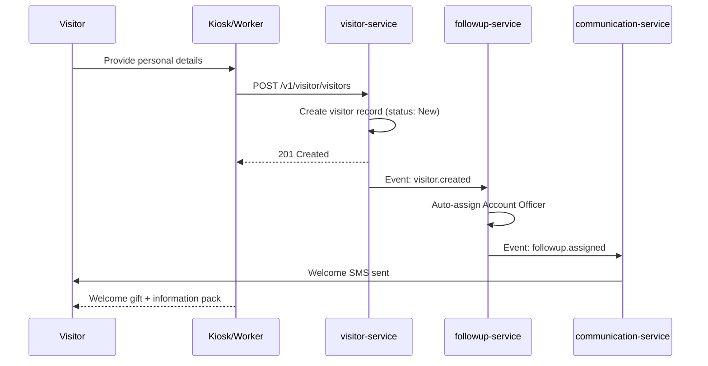
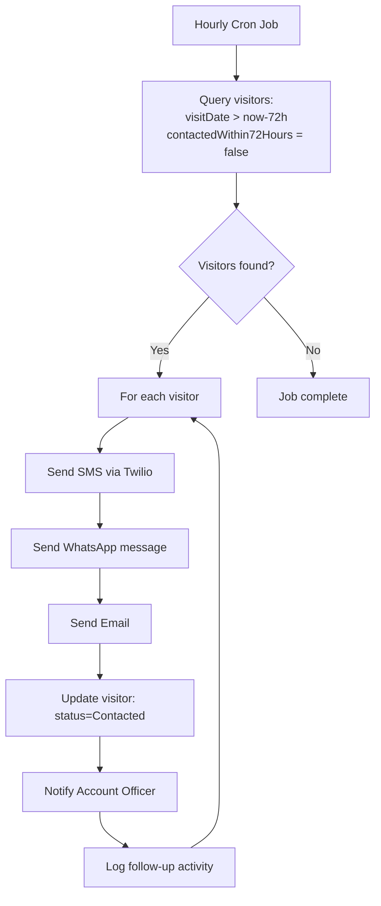
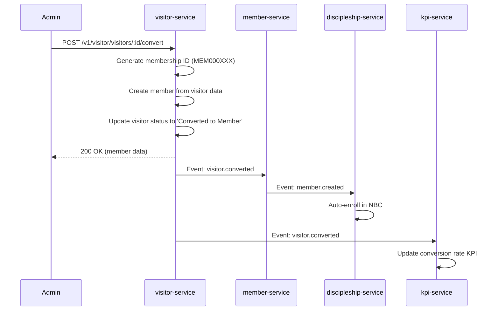
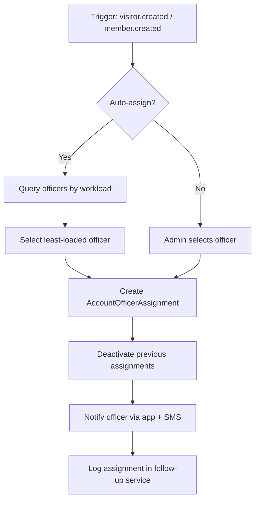
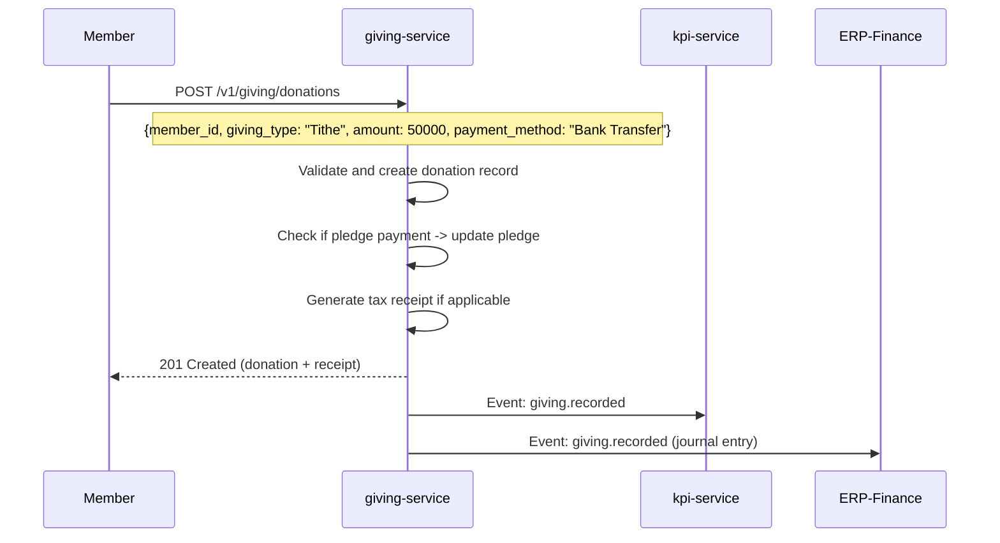
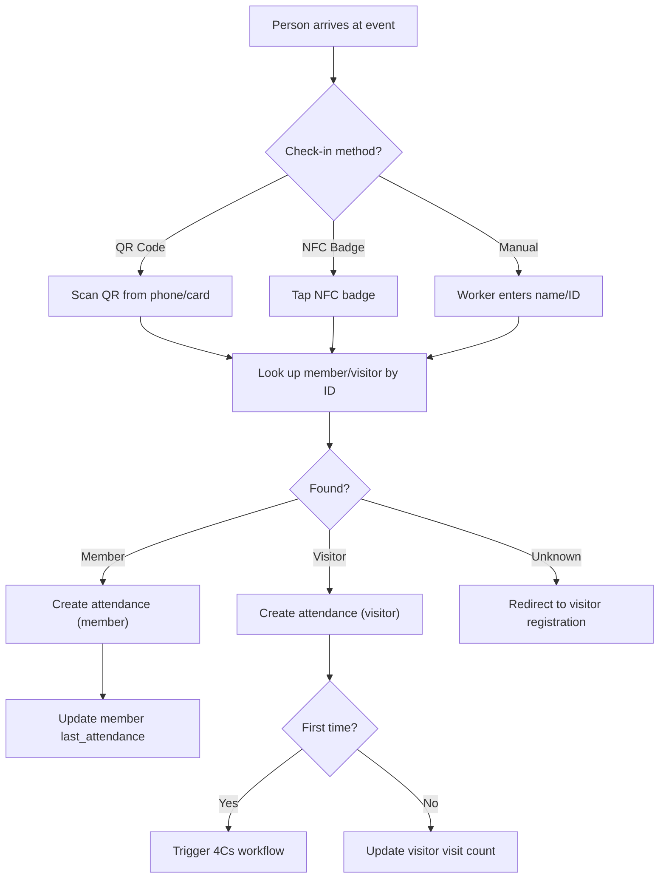
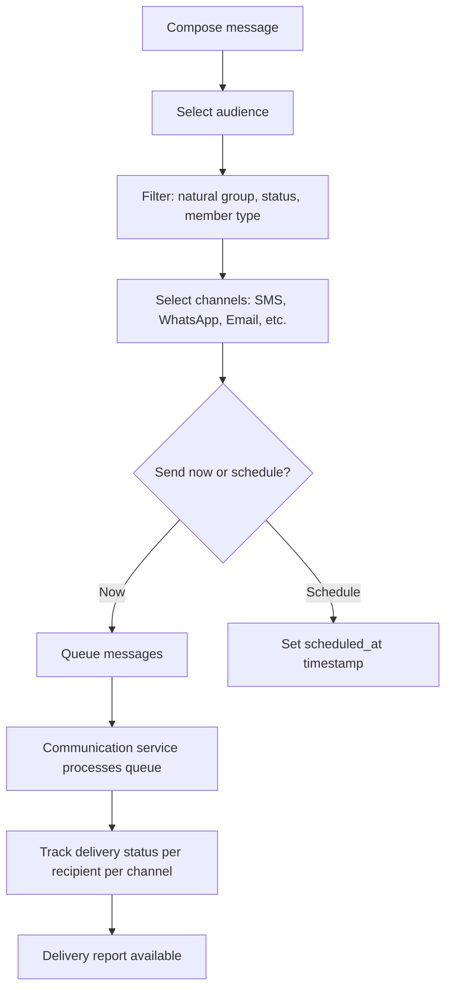
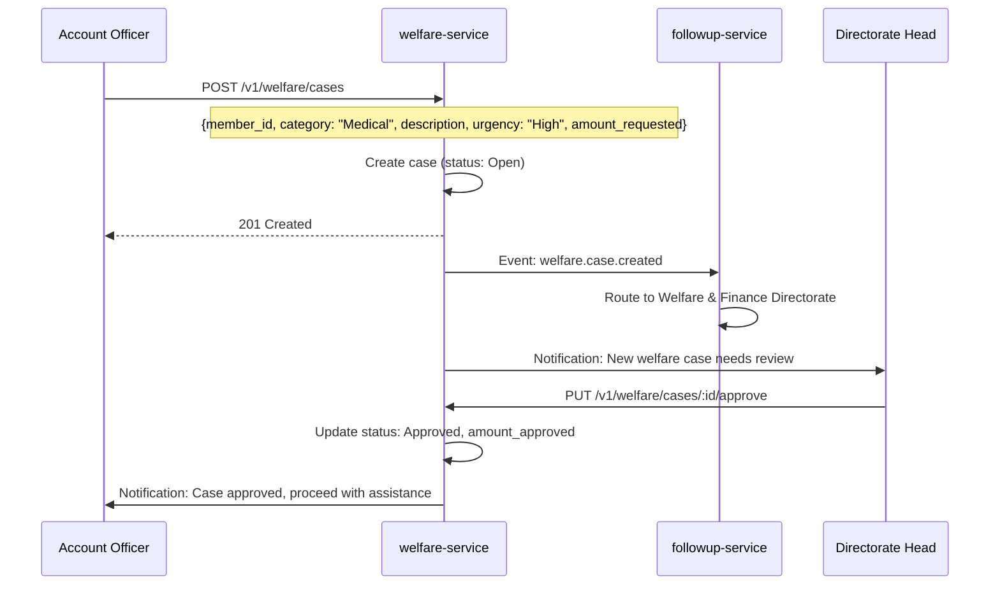
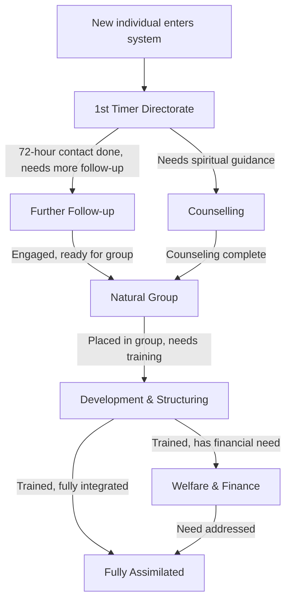

# Use Cases -- ERP-Church-Management
> Version: 1.0 | Last Updated: 2026-02-23 | Status: Draft
> Classification: Internal | Author: AIDD System

---

## 1. Use Case Index

| # | Use Case | Domain | Primary Actor | Priority |
|---|---|---|---|---|
| UC-01 | Register First-Time Visitor | Visitor | Worker/Kiosk | P0 |
| UC-02 | Execute 72-Hour Follow-up | Follow-up | Account Officer | P0 |
| UC-03 | Convert Visitor to Member | Member | Admin | P0 |
| UC-04 | Assign Account Officer | Follow-up | System/Admin | P0 |
| UC-05 | Record Giving Transaction | Giving | Member/Admin | P0 |
| UC-06 | Check In to Event (QR/NFC) | Event | Member | P0 |
| UC-07 | View Senior Pastor Dashboard | KPI | Pastor | P0 |
| UC-08 | Send Multi-Channel Communication | Communication | Admin | P0 |
| UC-09 | Enroll in New Believer Class | Discipleship | Admin | P1 |
| UC-10 | Create Welfare Case | Welfare | Account Officer | P1 |
| UC-11 | Join Small Group | Group | Member | P1 |
| UC-12 | Schedule Volunteer Shift | Volunteer | HOD | P1 |
| UC-13 | Book Facility | Facility | Admin | P2 |
| UC-14 | Track Mentorship Progress | Discipleship | Mentor | P1 |
| UC-15 | Generate Giving Statement | Giving | Member/Admin | P1 |
| UC-16 | Detect Absentee Members | Member | System | P1 |
| UC-17 | Route Through Directorates | Follow-up | System | P0 |
| UC-18 | View Directorate KPIs | KPI | Directorate Head | P1 |
| UC-19 | Register Pledge Campaign | Giving | Admin | P1 |
| UC-20 | Manage Family Unit | Member | Member/Admin | P2 |
| UC-21 | Plan Church Service | Event | Pastor/Admin | P2 |
| UC-22 | Discover Groups via Mobile | Group | Member | P1 |
| UC-23 | Manage Welfare Fund Disbursement | Welfare | Directorate Head | P1 |
| UC-24 | Track Member Engagement Score | KPI | Pastor | P2 |

---

## 2. Detailed Use Cases

### UC-01: Register First-Time Visitor

**Actor**: Worker, Kiosk, or Visitor (self-service)

**Preconditions**: Church service or event is in progress. Check-in kiosk or registration tablet is available.

**Trigger**: Visitor arrives at church for the first time.

**Main Flow**:
1. Visitor approaches info desk or kiosk
2. Worker/kiosk collects: name, phone, email, address, how-they-heard
3. System creates visitor record with `isFirstTime: true`
4. System auto-assigns Account Officer (least-loaded)
5. System sends welcome SMS/WhatsApp
6. Welcome gift is distributed and logged

**Postconditions**: Visitor record created, Account Officer assigned, 72-hour timer started.

**Exceptions**:
- E1: Visitor already exists (phone match) -- update visit count, do not create duplicate
- E2: No Account Officers available -- escalate to Directorate Head

---

### UC-02: Execute 72-Hour Follow-up

**Actor**: Account Officer (automated system + manual)

**Preconditions**: Visitor registered within past 72 hours.

**Main Flow**:
1. System checks hourly for visitors needing follow-up
2. For each uncontacted visitor within 72-hour window:
   a. Send automated welcome message via available channels
   b. Update `contactedWithin72Hours = true`
   c. Create FollowUpActivity record
3. Account Officer receives notification to make personal contact
4. Account Officer records personal follow-up notes in system
5. KPI service updates 72-hour completion rate

**Postconditions**: Visitor contacted, follow-up logged, KPI updated.

---

### UC-03: Convert Visitor to Member

**Actor**: Admin or Pastor

**Preconditions**: Visitor has completed assimilation steps and expressed commitment.

**Main Flow**:
1. Admin navigates to visitor profile
2. Admin clicks "Convert to Member"
3. System displays conversion form (natural group, salvation date)
4. System creates member record with auto-generated membership ID
5. System transfers all visitor data to member record
6. System updates visitor status to "Converted to Member"
7. System auto-enrolls member in New Believer Class
8. System assigns mentor

**Postconditions**: Member record created, visitor archived, discipleship pipeline initiated.

---

### UC-04: Assign Account Officer

**Actor**: System (automatic) or Admin (manual)

**Main Flow**:
1. System receives trigger (new visitor or manual request)
2. System queries active Account Officers ordered by current assignment count (ascending)
3. System selects officer with lowest active assignments
4. System creates assignment record with status "Active"
5. System deactivates any previous assignments for this individual
6. System notifies officer via push notification and SMS

---

### UC-05: Record Giving Transaction

**Actor**: Member (online) or Admin (manual entry)

**Main Flow**:
1. Member or admin initiates giving record
2. System validates member ID and amount
3. System classifies giving type (Tithe, Offering, Donation, etc.)
4. If pledge payment: system matches to active pledge and updates fulfillment
5. System generates tax receipt for deductible giving
6. System publishes event to KPI and Finance services

---

### UC-06: Check In to Event (QR/NFC)

**Actor**: Member or Visitor

---

### UC-07: View Senior Pastor Dashboard

**Actor**: Senior Pastor

**Main Flow**:
1. Pastor logs into web application
2. Dashboard displays:
   - Total membership (active/inactive)
   - This week's attendance vs. last week
   - New visitors this month
   - 72-hour contact completion rate
   - Visitor conversion rate
   - Giving totals (tithe, offering, total) vs. budget
   - Active welfare cases
   - NBC enrollment count
   - Mentorship completion rate
3. Pastor can drill down into any metric
4. Dashboard auto-refreshes via SSE/WebSocket

---

### UC-08: Send Multi-Channel Communication

**Actor**: Admin or Communication Team

---

### UC-09: Enroll in New Believer Class

**Actor**: Admin or Discipleship Leader

**Main Flow**:
1. Admin identifies newly converted members not yet enrolled in NBC
2. Admin creates or selects an active NBC program
3. Admin enrolls member with enrollment date
4. System creates discipleship_progress record (status: Enrolled)
5. System notifies member via preferred channel
6. Facilitator tracks weekly attendance and progress
7. On completion: status updated, KPI updated, next step (mentorship) triggered

---

### UC-10: Create Welfare Case

**Actor**: Account Officer or Admin

---

### UC-11: Join Small Group

**Actor**: Member

**Main Flow**:
1. Member opens "Group Finder" in mobile app or web portal
2. System displays available groups filtered by:
   - Natural group (age/gender)
   - Meeting day and time
   - Location proximity
   - Available capacity
3. Member requests to join group
4. Group leader receives notification
5. Group leader approves/rejects
6. On approval: member added to group, current_members count incremented
7. Member receives group details (meeting schedule, location, leader contact)

---

### UC-12: Schedule Volunteer Shift

**Actor**: HOD or Volunteer Coordinator

**Main Flow**:
1. Coordinator creates event requiring volunteers
2. System matches volunteers by:
   - Required skills
   - Availability (day/time preferences)
   - Previous service history
   - Active/non-leave status
3. System suggests optimal volunteer assignments
4. Coordinator confirms or adjusts assignments
5. Volunteers receive shift notification via app
6. Volunteers confirm or decline
7. System tracks attendance and hours served

---

### UC-13: Book Facility

**Actor**: Admin or Department Head

**Main Flow**:
1. User browses available facilities
2. User selects facility, date, time slot
3. System checks for conflicts (existing bookings)
4. System validates booking rules (min/max duration, advance notice)
5. System creates booking (status: Confirmed)
6. System sends confirmation to requester
7. Facility calendar updated

---

### UC-14: Track Mentorship Progress

**Actor**: Mentor

**Main Flow**:
1. Mentor logs into system
2. Views assigned mentees and their progress
3. Records meeting notes, milestones achieved
4. Updates progress percentage
5. At 90-120 days: system prompts completion assessment
6. On completion: KPI updated, mentee routed to group placement

---

### UC-15: Generate Giving Statement

**Actor**: Member (self-service) or Admin (batch)

**Main Flow**:
1. Member requests statement for fiscal year
2. System aggregates all tax-deductible giving
3. System generates PDF with: church details, member details, giving breakdown by type, total, receipt number
4. Statement available for download
5. Admin can batch-generate for all members (January 31 deadline)

---

### UC-16: Detect Absentee Members

**Actor**: System (automated cron)

**Main Flow**:
1. Daily cron job runs at midnight
2. System queries active members with no attendance in past 3 weeks
3. For each absentee:
   a. Create follow-up activity
   b. Notify Account Officer
   c. If no Account Officer: notify directorate head
4. KPI service tracks absentee restoration rate

---

### UC-17: Route Through Directorates

**Actor**: System

---

### UC-18: View Directorate KPIs

**Actor**: Directorate Head

**Main Flow**:
1. Directorate Head logs into dashboard
2. System shows directorate-specific metrics:
   - Active cases in directorate
   - Completion rate (cases resolved / total)
   - Average time to resolution
   - Account Officer performance within directorate
   - Transition rate to next directorate
3. Can drill down to individual cases and officers
4. Can export report for quarterly review

---

### UC-19: Register Pledge Campaign

**Actor**: Admin

**Main Flow**:
1. Admin creates pledge campaign (e.g., "Building Fund 2026")
2. Sets campaign target amount, start/end dates
3. Members register pledges with amounts and frequency
4. System tracks fulfillment against pledges
5. System sends reminders for upcoming/overdue pledges
6. Dashboard shows campaign progress

---

### UC-20: Manage Family Unit

**Actor**: Member or Admin

**Main Flow**:
1. Admin creates household record
2. Links family members to household
3. System displays family unit on member profiles
4. Giving statements can be consolidated per household
5. Communication can be sent per household

---

### UC-21: Plan Church Service

**Actor**: Pastor or Worship Leader

**Main Flow**:
1. Create service plan for upcoming Sunday
2. Add order of service items (worship, sermon, offering, etc.)
3. Assign personnel (worship leader, preacher, ushers, tech team)
4. Attach sermon notes, song lists, media assets
5. Share plan with all assigned volunteers
6. After service: record actual vs. planned attendance

---

### UC-22: Discover Groups via Mobile

**Actor**: Member

**Main Flow**:
1. Open Flutter app -> Groups tab
2. Browse available groups with filters (type, day, location)
3. View group details: leader, members, meeting info
4. Request to join (or auto-join if open enrollment)
5. Receive confirmation and group chat invite
6. Access group schedule in calendar view

---

### UC-23: Manage Welfare Fund Disbursement

**Actor**: Welfare & Finance Directorate Head

**Main Flow**:
1. Review pending welfare cases
2. Assess case details and supporting documentation
3. Approve/reject with notes and approved amount
4. On approval: funds disbursed from benevolence fund
5. Case worker delivers assistance and logs confirmation
6. Follow-up scheduled to verify effectiveness

---

### UC-24: Track Member Engagement Score

**Actor**: Pastor or Admin

**Main Flow**:
1. System calculates engagement score based on:
   - Attendance frequency (weight: 30%)
   - Giving consistency (weight: 20%)
   - Group participation (weight: 20%)
   - Volunteer hours (weight: 15%)
   - Discipleship progress (weight: 15%)
2. Score displayed on member profile (0-100)
3. Dashboard shows distribution of engagement scores
4. Low-engagement members flagged for follow-up
