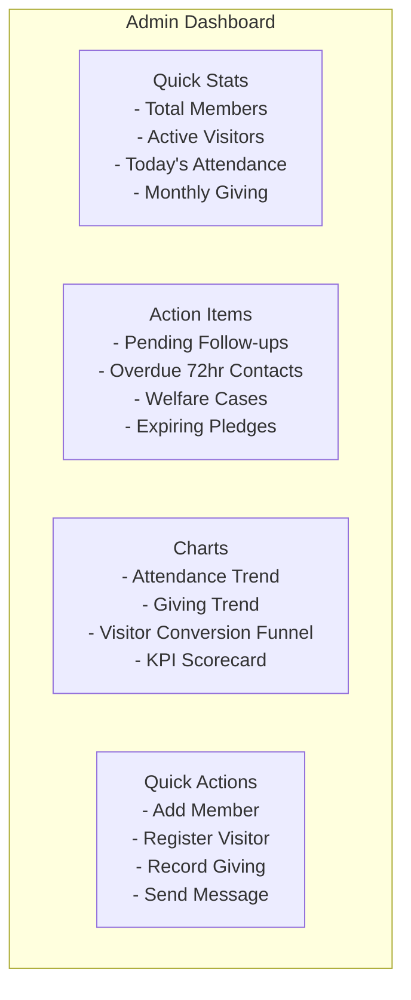

# User Manual: Administrator -- ERP-Church-Management
> Version: 1.0 | Last Updated: 2026-02-23 | Status: Draft
> Classification: Internal | Author: AIDD System

---

## 1. Introduction

This manual is for users with `admin` or `super_admin` roles in ERP-Church-Management. Administrators are responsible for system configuration, user management, data oversight, and operational coordination across all 12 modules.

---

## 2. Getting Started

### 2.1 Logging In

1. Navigate to `https://your-church.erp.example.com`
2. Enter your email and password
3. If SSO is configured, click "Sign in with ERP-IAM"
4. Upon successful login, you will see the Admin Dashboard

### 2.2 Admin Dashboard Overview

---

## 3. Member Management

### 3.1 Creating a New Member

1. Navigate to **Members** > **Add Member**
2. Fill in required fields: First Name, Last Name, Phone
3. Set Member Type (New Believer, Member, Worker, etc.)
4. Assign Natural Group (Youth, Men, Women, etc.)
5. Set communication preferences (preferred channels)
6. Click **Save** -- system auto-generates Membership ID

### 3.2 Searching Members

Use the search bar on the Members page. You can search by:
- Name (first, last)
- Membership ID (e.g., MEM000123)
- Email
- Phone number

Advanced filters include: Member Type, Status, Natural Group, Join Date range.

### 3.3 Managing Absentees

1. Navigate to **Members** > **Absentees**
2. Set the absence threshold (default: 3 weeks)
3. View list of members who have not attended within the threshold
4. Bulk-assign follow-up activities or individual assignment
5. Follow-up activities are automatically created and assigned to Account Officers

---

## 4. Visitor Management

### 4.1 Registering Visitors

1. Navigate to **Visitors** > **Register Visitor**
2. Enter visitor details (name, contact, how they heard about the church)
3. Mark as First-Timer if applicable
4. System automatically: assigns Account Officer, starts 72-hour timer
5. Optional: Record welcome gift distribution

### 4.2 72-Hour Follow-up Monitoring

1. Navigate to **Visitors** > **72-Hour Dashboard**
2. View three columns: Pending (not yet contacted), In Progress, Completed
3. Red indicators show visitors approaching or past the 72-hour deadline
4. Click on a visitor to see assigned Account Officer and follow-up history

### 4.3 Converting Visitors to Members

1. Navigate to visitor profile
2. Click **Convert to Member**
3. Fill in additional fields: Natural Group, Salvation Date
4. System creates member record, transfers all data, updates visitor status
5. Discipleship enrollment is triggered automatically

---

## 5. Giving Administration

### 5.1 Recording Giving

1. Navigate to **Giving** > **Record**
2. Search for member by name or ID
3. Select giving type: Tithe, Offering, Donation, Special Seed, Building Fund
4. Enter amount, payment method, date
5. If pledge payment: system matches to active pledge
6. Click **Save** -- receipt generated if tax-deductible

### 5.2 Pledge Campaign Management

1. Navigate to **Giving** > **Campaigns**
2. Create new campaign: name, target amount, start/end dates
3. Members register pledges with amounts and payment frequency
4. Dashboard shows campaign progress bar and fulfillment rate

### 5.3 Generating Statements

1. Navigate to **Giving** > **Statements**
2. Select fiscal year
3. Generate for individual member or batch for all members
4. Statements include all tax-deductible giving with totals
5. Download as PDF or email directly to members

---

## 6. Event Management

### 6.1 Creating Events

1. Navigate to **Events** > **Create Event**
2. Enter: Title, Date, Time, Location, Event Type
3. Set expected attendance
4. Configure check-in method (QR, NFC, Manual)
5. Optionally link to a facility booking

### 6.2 Attendance Reports

1. Navigate to **Events** > select event > **Attendance**
2. View check-in list with timestamps and methods
3. Export attendance data as CSV
4. Compare actual vs. expected attendance

---

## 7. Communication Center

### 7.1 Sending Messages

1. Navigate to **Communication** > **New Message**
2. Select audience: All Members, Natural Group, Custom Filter
3. Compose message (supports templates)
4. Select channels: SMS, WhatsApp, Email, Telegram, Push
5. Choose: Send Now or Schedule for later
6. Review delivery report after sending

---

## 8. User Management

### 8.1 Creating Users

1. Navigate to **Settings** > **Users**
2. Click **Add User**
3. Enter name, email, phone
4. Assign role: admin, pastor, minister, HOD, directorate_head, account_officer, worker, member
5. Set initial password (user must change on first login)

### 8.2 Role Permissions Summary

| Action | admin | pastor | minister | HOD | directorate_head | account_officer | worker | member |
|---|---|---|---|---|---|---|---|---|
| Manage users | Yes | No | No | No | No | No | No | No |
| View all members | Yes | Yes | Yes | Yes | Yes | No (assigned only) | Limited | No (self) |
| Record giving | Yes | No | No | No | No | No | No | No |
| Create events | Yes | Yes | No | Yes | No | No | No | No |
| View KPIs | Yes | Yes | No | No | Yes | No | No | No |
| Send broadcasts | Yes | Yes | No | Yes | No | No | No | No |

---

## 9. System Configuration

### 9.1 Tenant Settings

1. Navigate to **Settings** > **Organization**
2. Configure: Church name, address, timezone, currency
3. Set follow-up deadline (default: 72 hours)
4. Configure absentee threshold (default: 3 weeks)
5. Set KPI targets per category

### 9.2 Communication Channel Setup

1. Navigate to **Settings** > **Integrations**
2. Configure each channel:
   - **SMS**: Enter Twilio Account SID, Auth Token, Phone Number
   - **WhatsApp**: Enter API Key and Phone Number ID
   - **Telegram**: Enter Bot Token
   - **Email**: Enter SMTP Host, Port, credentials
3. Test each channel with a test message

---

## 10. Troubleshooting

| Issue | Resolution |
|---|---|
| Member search returns no results | Check that tenant is correct; try broader search terms |
| 72-hour reminder not sending | Verify communication channel credentials; check cron job logs |
| Giving statement shows $0 | Verify giving records exist for the selected fiscal year |
| User cannot access module | Check role assignment and ERP-Platform entitlement |
| Dashboard data stale | KPI calculator runs daily; trigger manual recalculation in Settings |
