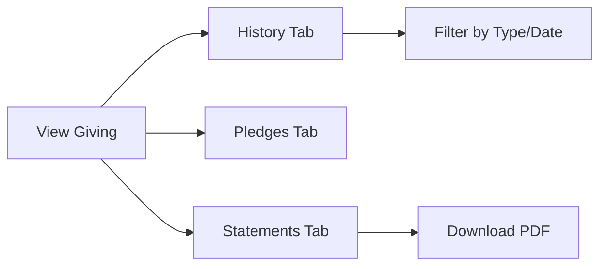

# User Manual: End User (Member/Visitor) -- ERP-Church-Management
> Version: 1.0 | Last Updated: 2026-02-23 | Status: Draft
> Classification: Internal | Author: AIDD System

---

## 1. Introduction

This manual is for church members using ERP-Church-Management to manage their profiles, view giving history, discover groups, register for events, and track their spiritual growth. The system is accessible via web browser and the mobile app (iOS/Android).

---

## 2. Getting Started

### 2.1 Creating Your Account

1. Your church admin will create your account and send you login credentials
2. Open the web app at `https://your-church.erp.example.com` or download the mobile app
3. Log in with your email and temporary password
4. Change your password on first login
5. Complete your profile setup

### 2.2 Mobile App Installation

**Android**: Search "Church Management" in Google Play Store
**iOS**: Search "Church Management" in Apple App Store

After installation:
1. Open the app
2. Enter your church URL (provided by your admin)
3. Log in with your credentials

---

## 3. Your Profile

### 3.1 Viewing Your Profile

1. Click your avatar or name in the top-right corner
2. Select **My Profile**
3. View your: personal information, membership ID, natural group, join date

### 3.2 Updating Your Information

1. Open your profile
2. Click **Edit Profile**
3. You can update:
   - Phone number
   - Email address
   - Address
   - Communication preferences (preferred channels: SMS, WhatsApp, Email, etc.)
4. Click **Save Changes**

Note: Some fields (Membership ID, Natural Group, Member Type) can only be changed by administrators.

### 3.3 Communication Preferences

Control how the church contacts you:
1. Navigate to **Profile** > **Communication Preferences**
2. Toggle channels on/off: SMS, WhatsApp, Telegram, Email, Push Notifications, In-app
3. Set preferred language
4. Set notification frequency preferences

---

## 4. Giving

### 4.1 Viewing Giving History

1. Navigate to **Giving** in the side menu
2. View your giving summary: total tithes, offerings, donations for the current year
3. Filter by: giving type, date range
4. Each record shows: date, type, amount, payment method, receipt number

### 4.2 Pledges

1. Navigate to **Giving** > **My Pledges**
2. View active pledges with progress bars showing fulfillment
3. See upcoming payment schedules
4. View completed pledges in history tab

### 4.3 Tax Statements

1. Navigate to **Giving** > **Statements**
2. Select the fiscal year
3. Click **Download Statement** to get a PDF
4. Statement includes all tax-deductible giving for the year with church details

---

## 5. Events & Attendance

### 5.1 Browsing Events

1. Navigate to **Events** in the side menu
2. View upcoming events in calendar or list view
3. Filter by: event type, date, location

### 5.2 Event Check-In

**QR Code Check-In (Mobile)**:
1. Open the mobile app
2. Tap **Check In** on the home screen
3. Your personal QR code is displayed
4. Present QR code to the scanner at the entrance

**Manual Check-In**:
1. Provide your name or membership ID to the check-in attendant
2. Attendant marks your attendance in the system

### 5.3 Viewing Your Attendance

1. Navigate to **My Profile** > **Attendance History**
2. View a calendar view of your attendance
3. See streak information and attendance percentage

---

## 6. Groups & Ministries

### 6.1 Finding Groups

1. Navigate to **Groups** in the side menu
2. Browse available groups:
   - Small Groups
   - Home Fellowships
   - Cell Groups
   - Ministries
3. Filter by: meeting day, time, location, group type

### 6.2 Joining a Group

1. Click on a group to view details
2. See: leader name, meeting schedule, location, current members, description
3. Click **Request to Join**
4. Group leader will receive your request
5. You will be notified when approved

### 6.3 Your Groups

1. Navigate to **My Groups**
2. View all groups you belong to
3. See meeting schedules
4. Access group communication channels

---

## 7. Discipleship

### 7.1 Programs

1. Navigate to **Discipleship** in the side menu
2. View your enrolled programs:
   - New Believer Class (NBC)
   - Sunday School
   - Mentorship
   - Bible Study groups

### 7.2 Tracking Progress

1. Each program shows your progress percentage
2. View completed milestones
3. See upcoming sessions or assignments
4. Your mentor (if assigned) is displayed with contact information

---

## 8. Welfare

### 8.1 Requesting Assistance

1. Navigate to **Welfare** > **Request Help**
2. Select category: Financial, Medical, Housing, Food, Education, Emergency, Other
3. Describe your need
4. Indicate urgency level
5. Submit request -- it will be reviewed by the welfare team
6. You can track the status of your request in **My Requests**

---

## 9. Communication

### 9.1 Notifications

1. Navigate to **Notifications** (bell icon)
2. View messages from church leadership
3. See event reminders
4. View follow-up communications

### 9.2 Channels

You may receive communications via:
- SMS text messages
- WhatsApp messages
- Telegram messages
- Email
- Push notifications (mobile app)
- In-app notifications

Control which channels are active in your Communication Preferences.

---

## 10. Mobile App Features

### 10.1 Home Screen

The mobile app home screen shows:
- Next upcoming event
- Quick check-in button
- Recent notifications
- Giving shortcut
- Group meetings this week

### 10.2 Offline Mode

The mobile app supports limited offline functionality:
- View cached profile information
- View cached group details
- Queue giving records for later sync
- View downloaded event schedules

Data syncs automatically when connection is restored.

### 10.3 QR Code

Your personal QR code is available under **Profile** > **My QR Code**. Use it for:
- Event check-in
- Group attendance
- Volunteer check-in

---

## 11. Privacy & Data

### 11.1 Your Data Rights

- **View**: You can view all data the church holds about you
- **Export**: Request a data export from your profile settings
- **Update**: Keep your information current via profile editing
- **Delete**: Contact your church admin to request data erasure

### 11.2 Data Sharing

Your information is only visible to:
- Church administrators
- Your assigned Account Officer
- Your group leaders (limited view)
- Ministry leaders you serve under (limited view)

Your giving information is private and only visible to you and authorized finance administrators.
