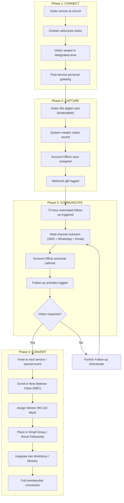
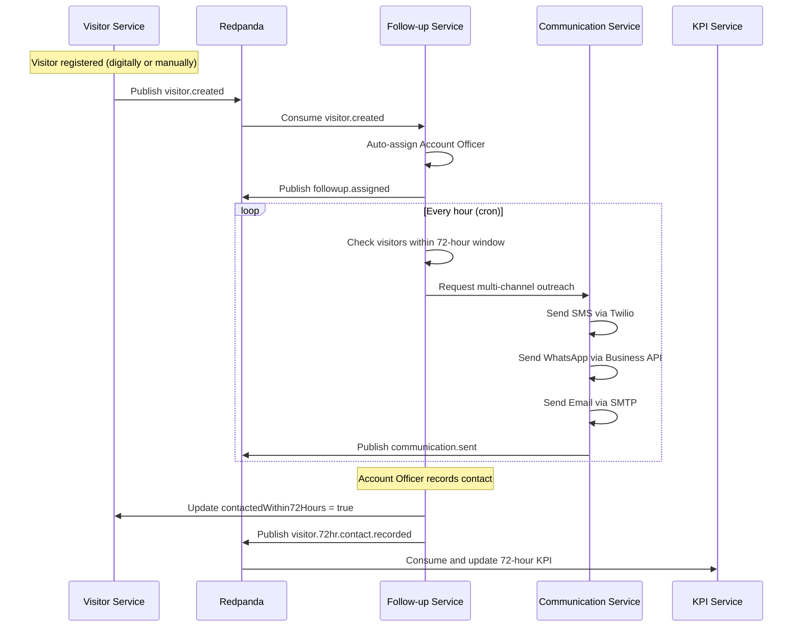
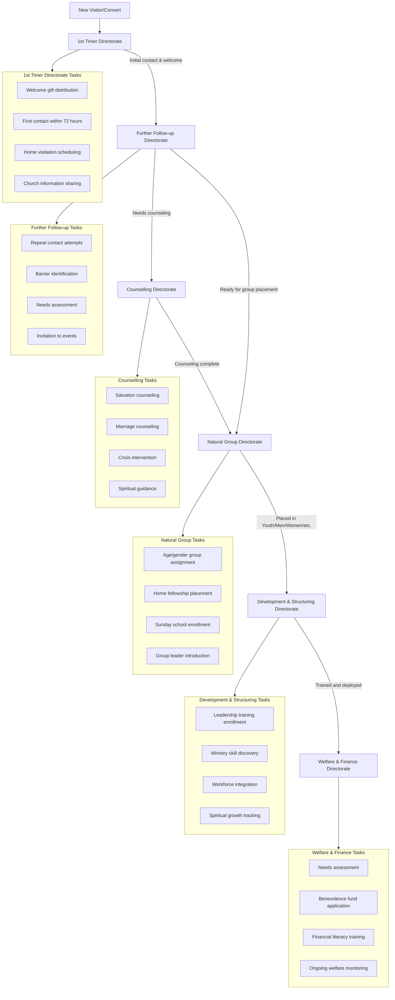
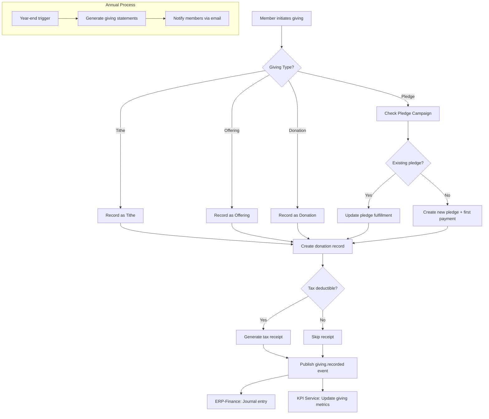
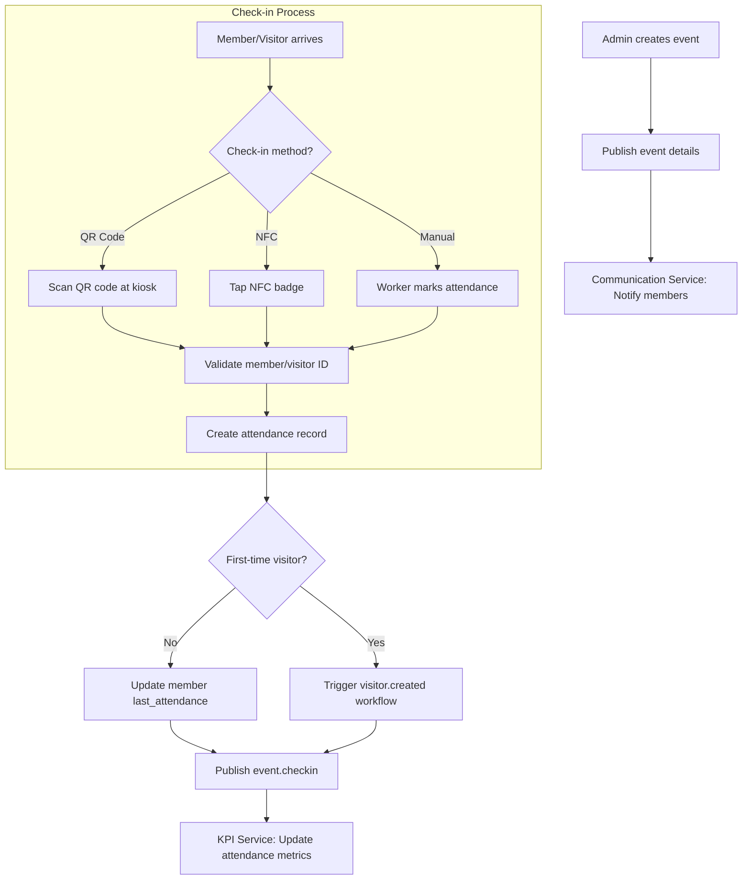
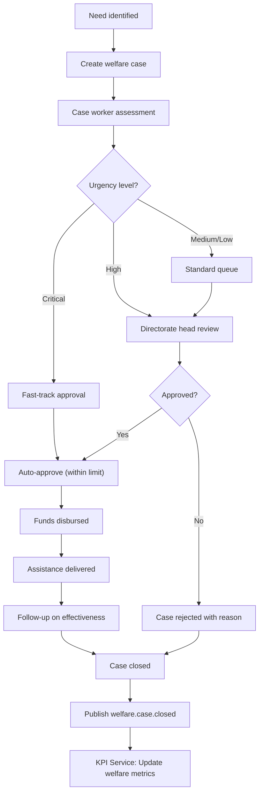
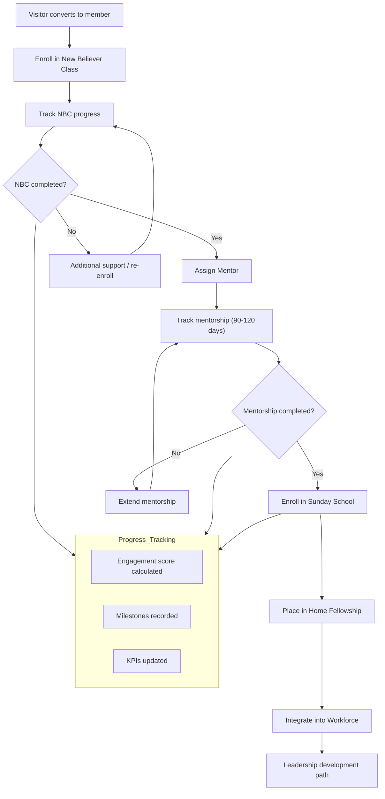
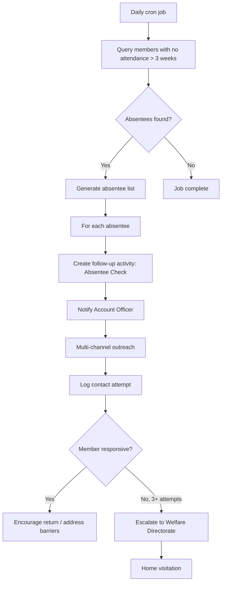
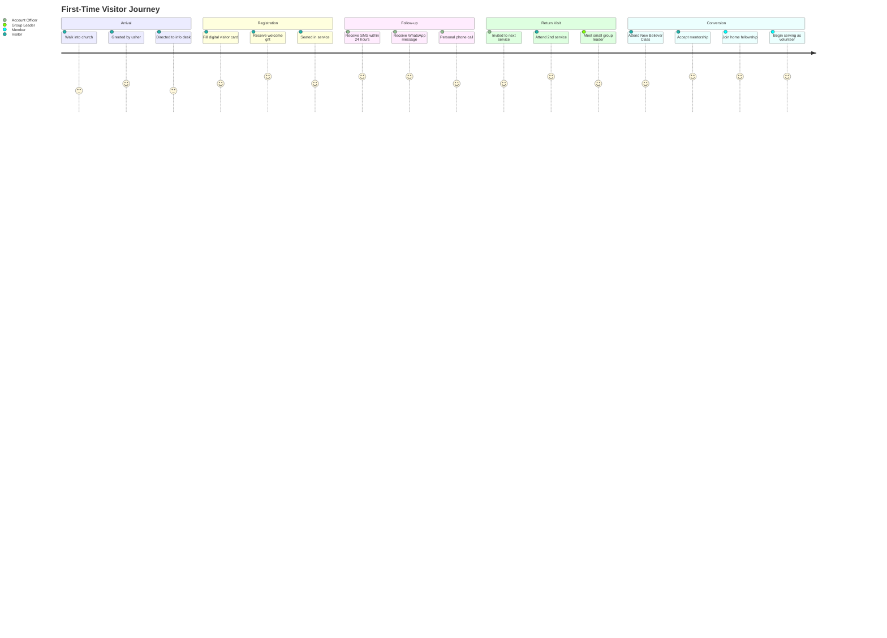
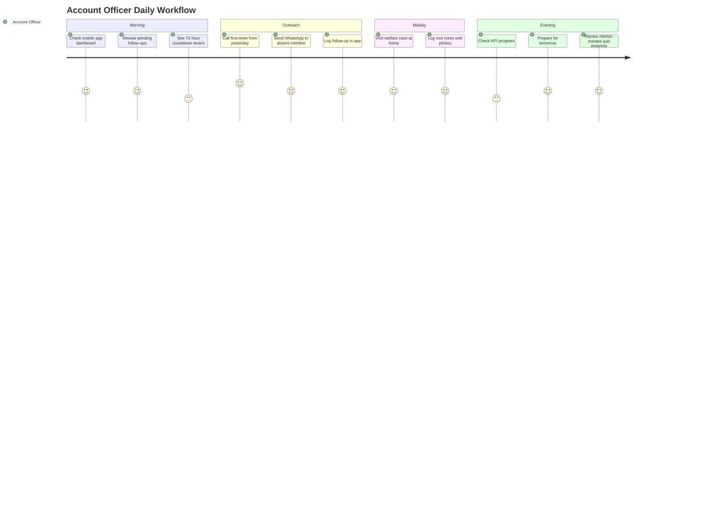

# Workflows -- ERP-Church-Management
> Version: 1.0 | Last Updated: 2026-02-23 | Status: Draft
> Classification: Internal | Author: AIDD System

---

## 1. Core Workflows Overview

ERP-Church-Management implements six primary workflows that map to the RCCG Follow-up & Visitation Ministry framework. Each workflow is event-driven, with Kafka/Redpanda messages triggering transitions between services.

---

## 2. Workflow 1: 4Cs Assimilation Pipeline

The 4Cs (Connect, Capture, Communicate, Convert) represent the end-to-end visitor-to-member journey.

---

## 3. Workflow 2: 72-Hour Follow-up Automation

---

## 4. Workflow 3: 6-Directorate Routing

Each directorate handles a specific phase of the soul-care pipeline:

---

## 5. Workflow 4: Giving Lifecycle

---

## 6. Workflow 5: Event & Attendance

---

## 7. Workflow 6: Welfare Case Management

---

## 8. Workflow 7: Discipleship Pipeline

---

## 9. Workflow 8: Absentee Member Detection

---

## 10. User Journey Maps

### 10.1 First-Time Visitor Journey

### 10.2 Account Officer Daily Journey

