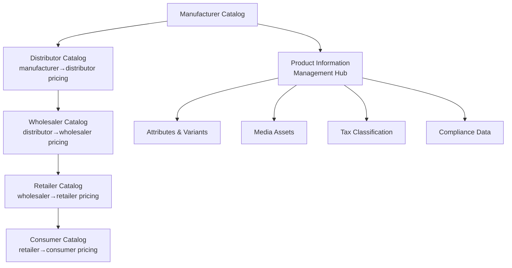
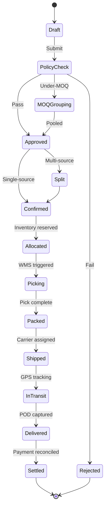

# ERP-Commerce -- Product Requirements Document (PRD)

## Document Control

| Field         | Value                                      |
|---------------|--------------------------------------------|
| Module        | ERP-Commerce (B2B/B2B2C Trade Platform)    |
| Version       | 2.0                                        |
| Date          | 2026-02-23                                 |
| Status        | Active Development                         |
| Repository    | `ERP-Commerce`                             |
| SKU           | `erp.commerce`                             |
| Integration   | standalone_plus_suite via ERP-Platform     |

---

## 1. Executive Summary

### 1.1 Product Vision

ERP-Commerce is a **multi-party trade commerce platform** that consolidates three former standalone modules (ERP-OmniRoute, ERP-POS-Software-for-Physical-Storefront, and ERP-opensase-ecommerce) into a unified B2B/B2B2C trade ecosystem. The platform orchestrates the complete commerce value chain from manufacturer through distributor, wholesaler, and retailer to the end consumer, enabling seamless multi-party order management, intelligent pricing, trade credit, distribution, and point-of-sale operations.

### 1.2 Target Markets

| Priority   | Markets                                   |
|------------|-------------------------------------------|
| Primary    | Nigeria, Kenya, South Africa, Ghana       |
| Secondary  | Other African nations, Southeast Asia     |
| Tertiary   | Global emerging markets, LATAM            |

### 1.3 Key Value Propositions

1. **Unified Multi-Party Trade Network** -- single platform connecting manufacturers, distributors, wholesalers, retailers, and consumers
2. **Offline-First Architecture** -- POS and field operations work in low-connectivity environments with automatic sync
3. **AI-Powered Trade Credit** -- ML-based credit scoring with automated Net 30/60/90 terms management
4. **13 Role-Specific Portals** -- each trade participant gets a purpose-built interface
5. **B2B Marketplace** -- vendor onboarding, commission management, dispute resolution
6. **EDI Integration** -- X12 and EDIFACT for enterprise interoperability

---

## 2. Competitive Landscape Analysis

### 2.1 Comparison Matrix

| Capability                        | ERP-Commerce | SAP Commerce Cloud | Oracle Commerce | TradeGlobal |
|-----------------------------------|:------------:|:-------------------:|:---------------:|:-----------:|
| Multi-party order orchestration   | Yes          | Partial             | Partial         | Yes         |
| Tiered pricing (mfg>dist>retail)  | Yes          | Yes                 | Yes             | Partial     |
| AI credit scoring                 | Yes          | No                  | No              | No          |
| Offline POS                       | Yes          | No                  | No              | No          |
| 13 role-specific portals          | Yes          | 3 portals           | 2 portals       | 5 portals   |
| EDI X12/EDIFACT native            | Yes          | Plugin              | Plugin          | Yes         |
| Van sales / pre-selling           | Yes          | No                  | No              | Partial     |
| B2B marketplace built-in          | Yes          | Separate product    | Separate        | No          |
| Route optimization (VRP)          | Yes          | No                  | No              | Partial     |
| Serialized/lot tracking           | Yes          | Yes                 | Yes             | Partial     |
| Consignment inventory             | Yes          | Partial             | Yes             | No          |
| Competitive price monitoring (AI) | Yes          | No                  | No              | No          |
| Multi-currency/emerging markets   | Yes          | Yes                 | Yes             | Partial     |
| Gig economy integration           | Yes          | No                  | No              | No          |
| USSD/WhatsApp channels            | Yes          | No                  | No              | No          |

### 2.2 Competitive Differentiation

**vs. SAP Commerce Cloud**: SAP excels in large enterprise B2C scenarios but lacks native multi-party B2B trade orchestration, offline POS, and emerging market features (USSD, mobile money, van sales). ERP-Commerce provides deeper trade-chain management with AI credit scoring absent from SAP.

**vs. Oracle Commerce**: Oracle provides strong catalog and pricing capabilities but is B2C-focused. It lacks native EDI, trade credit, distribution management, and the 13 specialized portals that ERP-Commerce offers for each trade participant role.

**vs. TradeGlobal**: TradeGlobal has strong EDI and distribution capabilities but lacks AI-powered features, a built-in B2B marketplace, offline POS, and the comprehensive portal coverage ERP-Commerce provides.

---

## 3. Target Users and Stakeholder Roles

### 3.1 Primary Trade Participants

| Role            | Description                           | Key Needs                                       |
|-----------------|---------------------------------------|------------------------------------------------|
| Manufacturer    | FMCG/CPG producers                   | Distribution tracking, pricing control, analytics |
| Distributor     | Regional/national distributors        | Inventory management, route optimization, credit |
| Wholesaler      | Bulk intermediaries                   | Order consolidation, volume pricing, territory   |
| Retailer        | Shops, stores, kiosks                 | Easy ordering, POS, credit terms, delivery       |
| Supermarket     | Large-format retail chains            | Planogram, promotions, shelf management          |

### 3.2 Operations and Logistics

| Role            | Description                           | Key Needs                                       |
|-----------------|---------------------------------------|------------------------------------------------|
| Warehouse Mgr   | Warehouse/DC operations              | Pick/pack/ship, zone management, wave planning  |
| Delivery Co      | 3PL and logistics providers          | Route assignment, POD, fleet management          |
| Driver           | Individual delivery personnel        | Navigation, POD capture, earnings tracking       |
| Field Sales      | Sales representatives                | Territory visits, order capture, merchandising   |
| Agent            | Marketplace/trade agents             | Commission tracking, customer acquisition        |

### 3.3 Brand and Marketing

| Role            | Description                           | Key Needs                                       |
|-----------------|---------------------------------------|------------------------------------------------|
| Brand Manager    | Brand/product managers               | Performance analytics, pricing oversight         |
| Merchandiser     | In-store merchandising               | Planogram compliance, shelf audits, competitor   |
| Trade Marketing  | Trade promotion managers             | Campaign management, ROI analysis, rebates       |

---

## 4. Core Feature Requirements

### 4.1 Multi-Level Product Catalog (PIM)

- Multi-tenant catalog management with 5-level deep category trees
- Manufacturer-to-consumer price waterfall with margin controls
- Product variants (size, color, pack size, unit of measure)
- Bulk import/export (CSV, Excel, JSON, EDI catalogs)
- Digital asset management for product media
- SEO metadata for marketplace listings

### 4.2 Multi-Party Order Orchestration

- Order splitting across multiple fulfillment sources
- Order consolidation for under-MOQ baskets
- EDI X12 (850/855/856/810) and EDIFACT (ORDERS/ORDRSP/DESADV/INVOIC) support
- Approval workflows based on credit limits, quantity thresholds, and brand policies
- Real-time order tracking with event-driven status updates

### 4.3 Pricing Engine

- **Tiered pricing**: manufacturer, distributor, wholesaler, retailer price levels
- **Volume discounts**: quantity-break pricing with configurable tiers
- **Promotional pricing**: time-limited offers, flash sales, seasonal pricing
- **Contract pricing**: customer-specific negotiated rates
- **Dynamic AI pricing**: ML-based price optimization based on demand, competition, and inventory
- **Competitive monitoring**: automated competitor price scraping and alerts
- **Bundle pricing**: product combination deals with margin protection
- **Geographic pricing**: location-based price adjustments for logistics costs

### 4.4 Multi-Location Inventory

- Multi-warehouse and multi-store inventory tracking
- Consignment inventory management (manufacturer-owned at distributor)
- Demand-driven replenishment with ML forecasting
- Serialized and lot/batch tracking with expiry management
- Inventory valuation (FIFO, LIFO, weighted average)
- Stock transfer and inter-warehouse movement
- Safety stock and reorder point automation

### 4.5 Trade Credit

- AI-powered credit scoring using transaction history, payment behavior, and external data
- Configurable payment terms (Net 30, Net 60, Net 90, custom)
- Credit insurance integration for high-risk accounts
- Trade finance facility connections (factoring, supply chain finance)
- Automated collections with aging analysis and escalation workflows
- Credit limit monitoring with real-time exposure tracking

### 4.6 Distribution Management

- Route-to-market strategy configuration per product/territory
- Van sales with offline order capture and cash collection
- Pre-selling workflow (order first, deliver later)
- Territory management with geo-fenced boundaries
- Beat planning and visit scheduling for field sales
- Distribution performance analytics by territory, agent, and product

### 4.7 Point of Sale (POS)

- Touch-optimized checkout interface for retail environments
- Barcode/QR scanning (1D, 2D, DataMatrix)
- Cash drawer integration and management
- Offline mode with automatic sync when connectivity restores
- Hardware support: Stripe Terminal, Square, Sunmi, PAX
- Receipt printing (thermal, A4), email, and SMS receipts
- Split payments, layaway, store credit
- Shift management and cash reconciliation

### 4.8 13 Role-Specific Portals

Each portal provides tailored dashboards, workflows, and analytics for its specific stakeholder role. See the Figma Prompts document for detailed UI specifications.

### 4.9 Logistics and Last-Mile Delivery

- Last-mile delivery assignment and tracking
- Vehicle Routing Problem (VRP) optimization with time windows and capacity constraints
- Real-time GPS tracking of delivery vehicles
- Digital proof-of-delivery (signature, photo, OTP)
- Fleet management and maintenance scheduling
- Delivery performance SLA monitoring

### 4.10 B2B Marketplace

- Vendor onboarding with KYC/KYB verification
- Commission structure management (flat, percentage, tiered)
- Dispute resolution workflow with arbitration support
- Vendor performance ratings and reviews
- Category-based vendor matching
- Marketplace analytics and GMV tracking

---

## 5. Non-Functional Requirements

| Requirement    | Target                                            |
|----------------|--------------------------------------------------|
| Availability   | 99.9% for core APIs, 99.95% for POS              |
| Latency        | < 200ms API response, < 50ms pricing engine       |
| Scalability    | 10M+ SKUs, 100K+ concurrent users                 |
| Offline        | Full POS operation for 72+ hours offline           |
| Security       | SOC 2 Type II, tenant isolation, field encryption  |
| Compliance     | PCI-DSS for payments, GDPR/NDPA for data privacy |
| Observability  | Distributed tracing, metrics, structured logging   |

---

## 6. Success Metrics

| Metric                    | Target           |
|---------------------------|-----------------|
| Order processing time     | < 2 seconds     |
| POS checkout time         | < 5 seconds     |
| Credit decision time      | < 30 seconds    |
| Route optimization time   | < 60 seconds    |
| System uptime             | 99.9%           |
| Vendor onboarding time    | < 24 hours      |
| EDI message processing    | < 5 seconds     |

---

## 7. Phased Delivery Roadmap

| Phase | Timeline    | Deliverables                                              |
|-------|-------------|----------------------------------------------------------|
| 1     | Q1 2026     | Core catalog, orders, inventory, pricing services         |
| 2     | Q2 2026     | POS, trade credit, distribution services                  |
| 3     | Q3 2026     | 13 portals, logistics, B2B marketplace                    |
| 4     | Q4 2026     | AI pricing, competitive monitoring, advanced analytics     |
| 5     | Q1 2027     | EDI full compliance, trade finance, credit insurance       |
