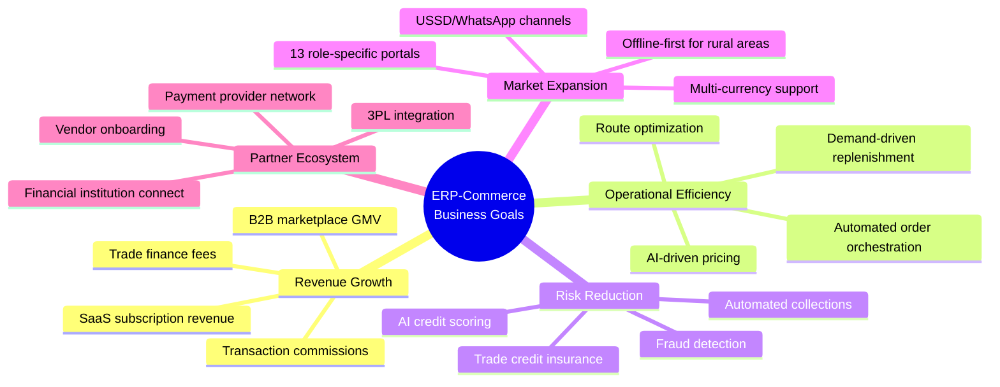
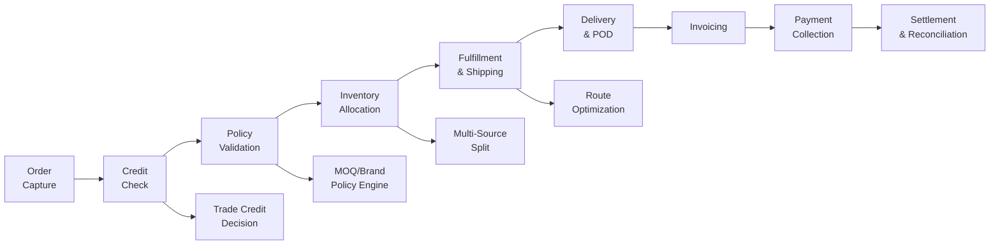

# ERP-Commerce -- Business Requirements Document (BRD)

## Document Control

| Field    | Value                                   |
|----------|-----------------------------------------|
| Module   | ERP-Commerce (B2B/B2B2C Trade Platform) |
| Version  | 2.0                                     |
| Date     | 2026-02-23                              |
| Status   | Approved                                |

---

## 1. Business Context

### 1.1 Problem Statement

The trade commerce ecosystem in emerging markets suffers from fragmentation. Manufacturers, distributors, wholesalers, and retailers each use disparate systems (or none at all) to manage orders, inventory, pricing, credit, and distribution. This fragmentation leads to:

- **Inventory blind spots** -- stock outs and overstocking across the value chain
- **Order inefficiency** -- manual order capture via phone/WhatsApp with no orchestration
- **Credit risk** -- ad-hoc trade credit decisions without data-driven scoring
- **Distribution gaps** -- suboptimal routes, lack of territory governance, no real-time tracking
- **Revenue leakage** -- inconsistent pricing across channels and trade levels

### 1.2 Business Opportunity

A unified multi-party trade platform that connects all participants in the commerce value chain can:

1. Reduce order processing costs by 60% through automation and EDI
2. Improve inventory accuracy to 98%+ with real-time multi-location tracking
3. Reduce bad debt by 45% with AI credit scoring and automated collections
4. Increase distribution coverage by 30% with route optimization and territory management
5. Enable 13 stakeholder roles with purpose-built portals

---

## 2. Business Objectives

### 2.1 Primary Business Objectives

| ID    | Objective                                           | KPI                        | Target       |
|-------|-----------------------------------------------------|---------------------------|--------------|
| BO-01 | Digitize multi-party trade ordering                 | Digital order %            | 80% in Y1    |
| BO-02 | Reduce order-to-delivery cycle time                 | Avg. cycle time            | < 48 hours   |
| BO-03 | Minimize trade credit defaults                      | Default rate               | < 3%         |
| BO-04 | Optimize distribution routes                        | Delivery cost per order    | -25%         |
| BO-05 | Enable offline retail operations                    | POS offline uptime         | 72+ hours    |
| BO-06 | Build B2B marketplace                               | Active vendor count        | 500+ in Y1   |
| BO-07 | Integrate EDI for enterprise customers              | EDI transaction volume     | 10K/month    |

### 2.2 Revenue Model

| Revenue Stream                | Description                                      |
|-------------------------------|------------------------------------------------|
| SaaS Subscription             | Monthly/annual fee per tenant by role tier       |
| Transaction Commission        | Percentage of GMV on marketplace transactions    |
| Trade Finance Origination     | Fee for facilitating trade credit and financing  |
| Premium Portal Features       | Advanced analytics, AI insights, custom reports  |
| Payment Processing Markup     | Margin on payment processing services            |
| Logistics Coordination Fee    | Fee for route optimization and delivery matching |

---

## 3. Stakeholder Analysis

### 3.1 Trade Participants

| Stakeholder     | Pain Points                                    | Desired Outcomes                               |
|-----------------|-----------------------------------------------|-----------------------------------------------|
| Manufacturer    | No visibility into downstream distribution    | Real-time sell-through data, price compliance  |
| Distributor     | Manual order taking, route inefficiency        | Automated ordering, optimized routes           |
| Wholesaler      | Credit risk, inventory overstocking            | AI credit scoring, demand forecasting          |
| Retailer        | Stockouts, no trade credit access              | Reliable supply, flexible payment terms        |
| Supermarket     | Planogram non-compliance, promo inefficiency   | Automated merchandising, promo analytics       |

### 3.2 Operations Stakeholders

| Stakeholder     | Pain Points                                    | Desired Outcomes                               |
|-----------------|-----------------------------------------------|-----------------------------------------------|
| Warehouse Mgr   | Manual pick/pack, inventory discrepancies     | WMS integration, barcode-driven workflows      |
| Delivery Co      | Route inefficiency, no proof of delivery      | VRP optimization, digital POD                  |
| Driver           | Paper-based deliveries, delayed payments      | Mobile app with navigation, instant earnings   |
| Field Sales      | No real-time stock visibility                 | Live inventory, mobile order capture           |
| Agent            | Manual commission tracking                     | Automated commission calculation and payout    |
| Brand Manager    | Delayed market insights                        | Real-time dashboards, competitive monitoring   |
| Merchandiser     | Manual shelf audits                            | Digital planogram compliance checking          |
| Trade Marketing  | Cannot measure promotion ROI                   | Campaign analytics, redemption tracking        |

---

## 4. Business Process Requirements

### 4.1 Order-to-Cash Process

### 4.2 Procure-to-Pay Process

1. Retailer browses distributor catalog in portal
2. Retailer creates purchase order (manual or reorder suggestion)
3. System validates against credit limit and MOQ policies
4. Order routed to optimal fulfillment source
5. Distributor warehouse picks, packs, ships
6. Driver delivers with digital POD
7. Invoice generated and sent electronically
8. Payment collected per agreed terms (Net 30/60/90)
9. Settlement to all parties including commissions

### 4.3 Distribution Management Process

1. Territory boundaries defined with geo-fencing
2. Beat plans created for field sales coverage
3. Van sales routes optimized daily via VRP solver
4. Pre-sell orders captured during field visits
5. Delivery routes planned for next-day fulfillment
6. Real-time GPS tracking during deliveries
7. POD captured at each delivery point
8. Cash/payment collected and reconciled at end of day

---

## 5. Compliance and Regulatory Requirements

| Requirement              | Standard              | Applicability               |
|--------------------------|-----------------------|-----------------------------|
| Payment Card Security    | PCI-DSS Level 1       | All payment processing      |
| Data Privacy (EU)        | GDPR                  | European customer data      |
| Data Privacy (Nigeria)   | NDPA 2023             | Nigerian operations          |
| Data Privacy (Kenya)     | DPA 2019              | Kenyan operations            |
| Financial Reporting      | IFRS 15               | Revenue recognition          |
| Tax Compliance           | Country-specific VAT  | All transactions             |
| EDI Compliance           | ANSI X12, EDIFACT     | Enterprise B2B transactions  |
| Consumer Protection      | Country-specific      | B2C transactions             |

---

## 6. Constraints and Assumptions

### 6.1 Constraints

- Must support offline operation for minimum 72 hours in POS and van sales scenarios
- Must integrate with existing ERP-IAM for authentication and ERP-Platform for entitlements
- Must operate within the NATS/Pulsar event backbone architecture
- Maximum API response time of 200ms for pricing and checkout flows
- Must support multi-currency with real-time exchange rates

### 6.2 Assumptions

- Trade participants have access to smartphones (Android 8.0+) or basic feature phones (USSD)
- Internet connectivity is intermittent in rural areas but available in urban centers
- Existing trade relationships and credit histories can be imported for initial credit scoring
- Payment infrastructure (mobile money, bank transfer) is available in target markets

---

## 7. Risk Assessment

| Risk                                     | Probability | Impact | Mitigation                                    |
|------------------------------------------|:-----------:|:------:|----------------------------------------------|
| Low adoption in informal trade sectors   | High        | High   | USSD/WhatsApp interface, agent-assisted model |
| Credit default in new markets            | Medium      | High   | Conservative initial limits, insurance         |
| Connectivity disruption                  | High        | Medium | Offline-first architecture, edge caching       |
| EDI integration complexity               | Medium      | Medium | Phased rollout, pre-built adapters             |
| Payment infrastructure gaps              | Medium      | High   | Multi-provider strategy, mobile money focus    |
