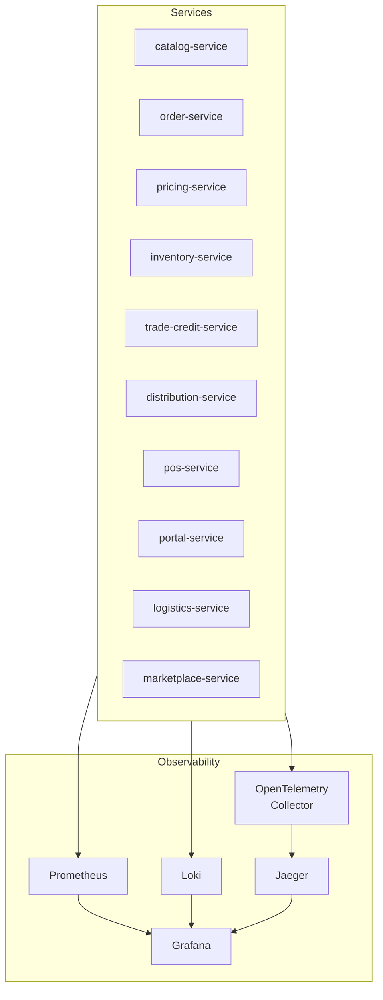

# ERP-Commerce -- Software Requirements Specification (SRS)

## Document Control

| Field    | Value                                   |
|----------|-----------------------------------------|
| Module   | ERP-Commerce                            |
| Version  | 2.0                                     |
| Date     | 2026-02-23                              |
| Status   | Active                                  |

---

## 1. Introduction

### 1.1 Purpose

This Software Requirements Specification defines the functional and non-functional requirements for the ERP-Commerce multi-party trade platform. It serves as the authoritative contract between product management, engineering, QA, and operations teams.

### 1.2 Scope

ERP-Commerce encompasses 10 microservices: catalog-service, order-service, pricing-service, inventory-service, trade-credit-service, distribution-service, pos-service, portal-service, logistics-service, and marketplace-service.

---

## 2. Functional Requirements

### 2.1 Catalog Service (FR-CAT)

| ID        | Requirement                                                                 | Priority |
|-----------|----------------------------------------------------------------------------|----------|
| FR-CAT-01 | System SHALL support multi-tenant product catalogs with tenant isolation   | P0       |
| FR-CAT-02 | System SHALL support 5-level hierarchical category trees                   | P0       |
| FR-CAT-03 | System SHALL support product variants (size, color, pack, UOM)             | P0       |
| FR-CAT-04 | System SHALL support multi-level pricing (manufacturer to consumer)        | P0       |
| FR-CAT-05 | System SHALL support bulk import/export in CSV, Excel, JSON formats        | P1       |
| FR-CAT-06 | System SHALL support digital asset management for product media            | P1       |
| FR-CAT-07 | System SHALL support EDI catalog exchange (X12 832, EDIFACT PRICAT)        | P2       |
| FR-CAT-08 | System SHALL enforce brand policy MOQ per category                         | P0       |
| FR-CAT-09 | System SHALL maintain product compliance metadata (origin, certifications) | P1       |
| FR-CAT-10 | System SHALL provide full-text search with faceted filtering               | P0       |

### 2.2 Order Service (FR-ORD)

| ID        | Requirement                                                                 | Priority |
|-----------|----------------------------------------------------------------------------|----------|
| FR-ORD-01 | System SHALL support multi-party order creation (B2B and B2B2C)            | P0       |
| FR-ORD-02 | System SHALL validate orders against brand MOQ policies                    | P0       |
| FR-ORD-03 | System SHALL support order splitting across multiple fulfillment sources   | P0       |
| FR-ORD-04 | System SHALL support order consolidation for under-MOQ baskets             | P0       |
| FR-ORD-05 | System SHALL support EDI order exchange (X12 850/855/856/810)              | P1       |
| FR-ORD-06 | System SHALL support EDIFACT order exchange (ORDERS/ORDRSP/DESADV/INVOIC) | P1       |
| FR-ORD-07 | System SHALL emit CloudEvents for all state transitions                    | P0       |
| FR-ORD-08 | System SHALL support approval workflows based on configurable rules        | P0       |
| FR-ORD-09 | System SHALL support returns and refund processing (RMA)                   | P1       |
| FR-ORD-10 | System SHALL maintain complete audit trail of order lifecycle              | P0       |

### 2.3 Pricing Service (FR-PRC)

| ID        | Requirement                                                                 | Priority |
|-----------|----------------------------------------------------------------------------|----------|
| FR-PRC-01 | System SHALL support tiered pricing per trade level                        | P0       |
| FR-PRC-02 | System SHALL support volume/quantity-break discount schedules              | P0       |
| FR-PRC-03 | System SHALL support time-limited promotional pricing                     | P0       |
| FR-PRC-04 | System SHALL support customer-specific contract pricing                   | P0       |
| FR-PRC-05 | System SHALL support AI-driven dynamic pricing optimization               | P2       |
| FR-PRC-06 | System SHALL support competitive price monitoring and alerts              | P2       |
| FR-PRC-07 | System SHALL support bundle/combo pricing                                 | P1       |
| FR-PRC-08 | System SHALL support geographic pricing adjustments                       | P1       |
| FR-PRC-09 | System SHALL respond within 50ms for pricing calculations                 | P0       |
| FR-PRC-10 | System SHALL support multi-currency with real-time exchange rates         | P0       |

### 2.4 Inventory Service (FR-INV)

| ID        | Requirement                                                                 | Priority |
|-----------|----------------------------------------------------------------------------|----------|
| FR-INV-01 | System SHALL track inventory across multiple warehouses and stores         | P0       |
| FR-INV-02 | System SHALL support consignment inventory (manufacturer-owned at dist.)   | P1       |
| FR-INV-03 | System SHALL support demand-driven replenishment with ML forecasting      | P2       |
| FR-INV-04 | System SHALL support serialized item tracking                             | P0       |
| FR-INV-05 | System SHALL support lot/batch tracking with expiry management            | P0       |
| FR-INV-06 | System SHALL support inventory valuation (FIFO, LIFO, weighted average)   | P0       |
| FR-INV-07 | System SHALL support stock reservations for pending orders                | P0       |
| FR-INV-08 | System SHALL generate low-stock alerts based on configurable thresholds   | P0       |
| FR-INV-09 | System SHALL support inter-warehouse stock transfers                      | P1       |
| FR-INV-10 | System SHALL provide real-time inventory visibility via event streaming   | P0       |

### 2.5 Trade Credit Service (FR-TCR)

| ID        | Requirement                                                                 | Priority |
|-----------|----------------------------------------------------------------------------|----------|
| FR-TCR-01 | System SHALL compute credit scores using AI/ML models                     | P0       |
| FR-TCR-02 | System SHALL support configurable payment terms (Net 30/60/90, custom)    | P0       |
| FR-TCR-03 | System SHALL integrate with credit insurance providers                    | P2       |
| FR-TCR-04 | System SHALL support trade finance facility connections                   | P2       |
| FR-TCR-05 | System SHALL automate collections with aging analysis                     | P1       |
| FR-TCR-06 | System SHALL monitor credit exposure in real-time                         | P0       |
| FR-TCR-07 | System SHALL generate escalation workflows for overdue accounts           | P1       |
| FR-TCR-08 | System SHALL support credit limit approval workflows                     | P0       |
| FR-TCR-09 | System SHALL maintain credit decision audit trail                        | P0       |
| FR-TCR-10 | System SHALL support external credit bureau integration                  | P1       |

### 2.6 Distribution Service (FR-DST)

| ID        | Requirement                                                                 | Priority |
|-----------|----------------------------------------------------------------------------|----------|
| FR-DST-01 | System SHALL support route-to-market strategy configuration               | P0       |
| FR-DST-02 | System SHALL support van sales with offline order capture                 | P0       |
| FR-DST-03 | System SHALL support pre-selling workflow                                 | P1       |
| FR-DST-04 | System SHALL support territory management with geo-fencing               | P0       |
| FR-DST-05 | System SHALL support beat planning and visit scheduling                   | P1       |
| FR-DST-06 | System SHALL support coverage lane management (state/category)           | P0       |
| FR-DST-07 | System SHALL enforce coverage governance and SLA monitoring               | P0       |
| FR-DST-08 | System SHALL support field sales mobile order capture                     | P0       |

### 2.7 POS Service (FR-POS)

| ID        | Requirement                                                                 | Priority |
|-----------|----------------------------------------------------------------------------|----------|
| FR-POS-01 | System SHALL provide touch-optimized checkout interface                   | P0       |
| FR-POS-02 | System SHALL support barcode/QR scanning (1D, 2D, DataMatrix)            | P0       |
| FR-POS-03 | System SHALL integrate with cash drawer hardware                         | P0       |
| FR-POS-04 | System SHALL support offline mode with 72+ hour operation                 | P0       |
| FR-POS-05 | System SHALL support Stripe Terminal, Square, Sunmi, PAX hardware        | P0       |
| FR-POS-06 | System SHALL support thermal and A4 receipt printing                     | P0       |
| FR-POS-07 | System SHALL support split payments and layaway                          | P1       |
| FR-POS-08 | System SHALL support shift management and cash reconciliation            | P0       |
| FR-POS-09 | System SHALL sync offline transactions when connectivity restores        | P0       |

### 2.8 Portal Service (FR-PRT)

| ID        | Requirement                                                                 | Priority |
|-----------|----------------------------------------------------------------------------|----------|
| FR-PRT-01 | System SHALL provide 13 role-specific portal interfaces                   | P0       |
| FR-PRT-02 | Each portal SHALL have role-appropriate dashboards and KPIs               | P0       |
| FR-PRT-03 | Portals SHALL support real-time data via WebSocket subscriptions          | P1       |
| FR-PRT-04 | Portals SHALL support responsive design for mobile and desktop            | P0       |

### 2.9 Logistics Service (FR-LOG)

| ID        | Requirement                                                                 | Priority |
|-----------|----------------------------------------------------------------------------|----------|
| FR-LOG-01 | System SHALL support last-mile delivery assignment and tracking           | P0       |
| FR-LOG-02 | System SHALL solve VRP with time windows and capacity constraints         | P0       |
| FR-LOG-03 | System SHALL provide real-time GPS tracking of deliveries                 | P0       |
| FR-LOG-04 | System SHALL support digital proof-of-delivery (signature, photo, OTP)   | P0       |
| FR-LOG-05 | System SHALL support fleet management and vehicle tracking                | P1       |
| FR-LOG-06 | System SHALL monitor delivery SLA compliance                             | P0       |

### 2.10 Marketplace Service (FR-MKT)

| ID        | Requirement                                                                 | Priority |
|-----------|----------------------------------------------------------------------------|----------|
| FR-MKT-01 | System SHALL support vendor onboarding with KYC/KYB verification         | P0       |
| FR-MKT-02 | System SHALL support commission management (flat, percentage, tiered)     | P0       |
| FR-MKT-03 | System SHALL support dispute resolution workflows                        | P1       |
| FR-MKT-04 | System SHALL support vendor performance ratings                          | P1       |
| FR-MKT-05 | System SHALL track marketplace GMV and analytics                         | P0       |

---

## 3. Non-Functional Requirements

### 3.1 Performance

| ID       | Requirement                                                          | Target        |
|----------|---------------------------------------------------------------------|---------------|
| NFR-P-01 | API response time for standard CRUD operations                      | < 200ms p95   |
| NFR-P-02 | Pricing engine calculation response time                            | < 50ms p95    |
| NFR-P-03 | Order orchestration completion (single source)                      | < 2 seconds   |
| NFR-P-04 | POS checkout transaction completion                                 | < 5 seconds   |
| NFR-P-05 | VRP route optimization for 100 stops                                | < 60 seconds  |
| NFR-P-06 | Credit scoring decision                                             | < 30 seconds  |
| NFR-P-07 | Concurrent user support                                             | 100K+         |
| NFR-P-08 | Product catalog size support                                        | 10M+ SKUs     |

### 3.2 Availability and Reliability

| ID       | Requirement                                                          | Target        |
|----------|---------------------------------------------------------------------|---------------|
| NFR-A-01 | Core API availability                                               | 99.9%         |
| NFR-A-02 | POS service availability                                            | 99.95%        |
| NFR-A-03 | Offline POS operation duration                                      | 72+ hours     |
| NFR-A-04 | Recovery Time Objective (RTO)                                       | < 15 minutes  |
| NFR-A-05 | Recovery Point Objective (RPO)                                      | < 1 minute    |

### 3.3 Security

| ID       | Requirement                                                          |
|----------|---------------------------------------------------------------------|
| NFR-S-01 | All API endpoints SHALL require JWT authentication via ERP-IAM       |
| NFR-S-02 | Tenant data SHALL be isolated at the database level                  |
| NFR-S-03 | PII fields SHALL be encrypted at rest using AES-256                  |
| NFR-S-04 | All inter-service communication SHALL use mTLS                       |
| NFR-S-05 | Payment processing SHALL comply with PCI-DSS Level 1                 |
| NFR-S-06 | API rate limiting SHALL be enforced per tenant and per endpoint       |

### 3.4 Observability

| ID       | Requirement                                                          |
|----------|---------------------------------------------------------------------|
| NFR-O-01 | All services SHALL emit structured JSON logs                         |
| NFR-O-02 | All services SHALL export OpenTelemetry traces                       |
| NFR-O-03 | All services SHALL expose Prometheus metrics at `/metrics`           |
| NFR-O-04 | All business events SHALL be audited with timestamp and actor        |

