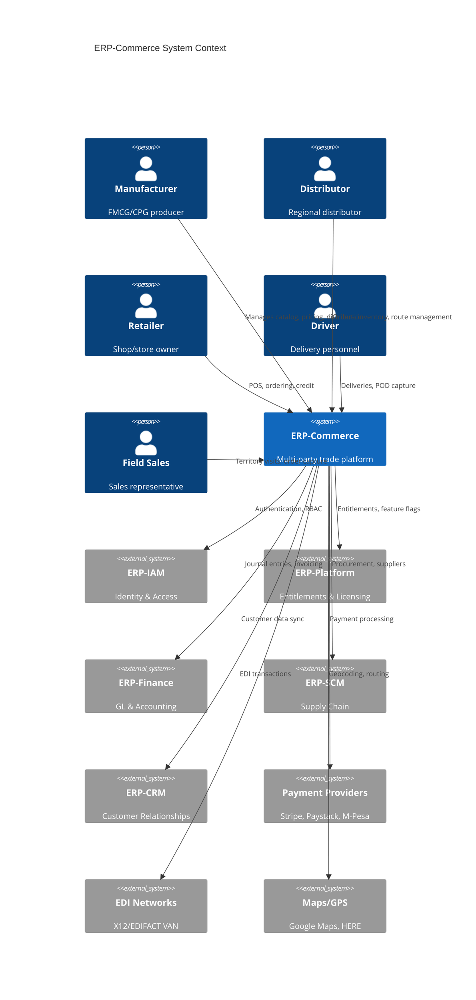
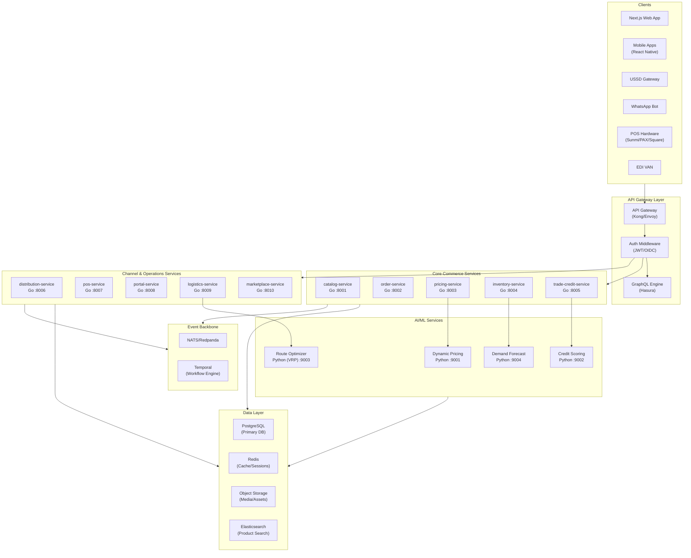
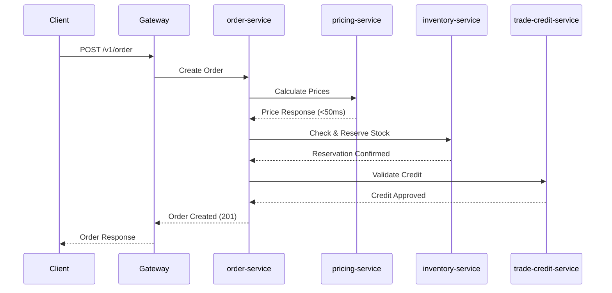
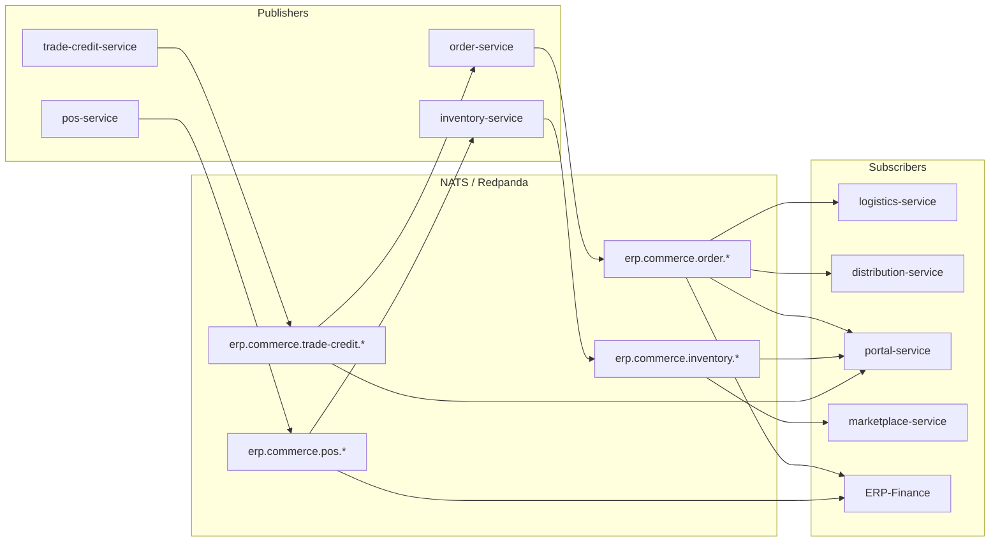
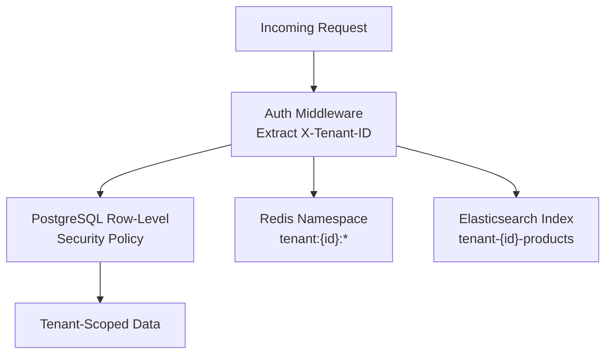
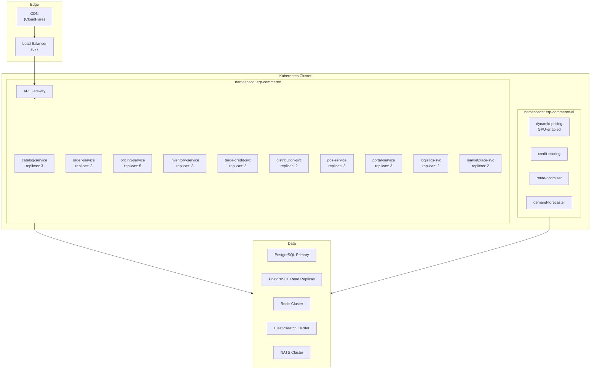
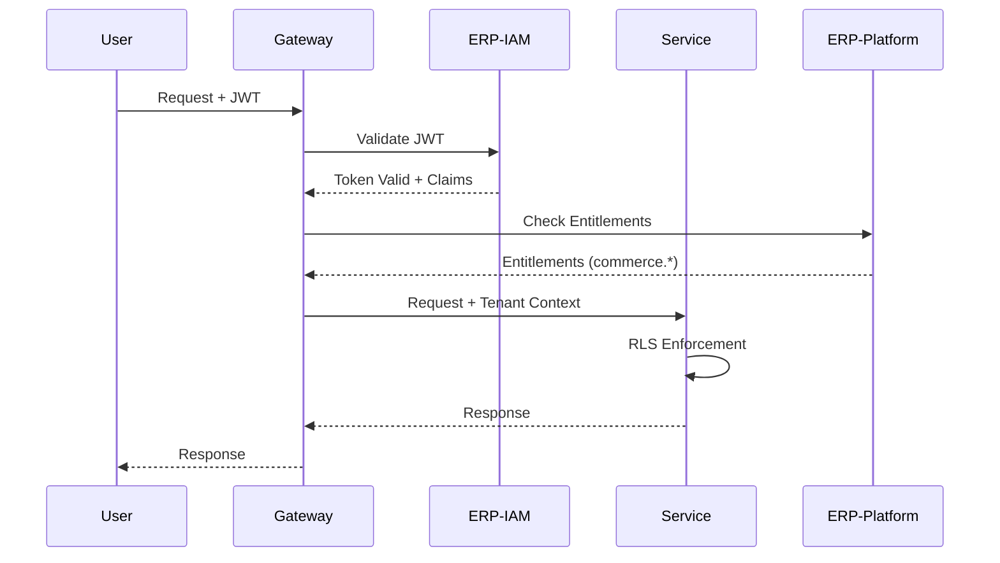

# ERP-Commerce -- System Architecture Document

## Document Control

| Field    | Value                                   |
|----------|-----------------------------------------|
| Module   | ERP-Commerce                            |
| Version  | 2.0                                     |
| Date     | 2026-02-23                              |
| Status   | Active                                  |

---

## 1. Architecture Overview

ERP-Commerce follows a microservices architecture with 10 domain services, an API gateway layer, event-driven communication, and integration with the broader ERP platform through ERP-IAM (identity), ERP-Platform (entitlements), and a NATS/Pulsar event backbone.

### 1.1 C4 Context Diagram

### 1.2 Container Diagram

---

## 2. Service Architecture

### 2.1 Service Inventory

| Service              | Language | Port | Domain                                    | Database Schema       |
|----------------------|----------|------|------------------------------------------|----------------------|
| catalog-service      | Go       | 8001 | Product catalog, PIM, categories          | `commerce_catalog`   |
| order-service        | Go       | 8002 | Order orchestration, splitting, EDI       | `commerce_orders`    |
| pricing-service      | Go       | 8003 | Pricing rules, promotions, contracts      | `commerce_pricing`   |
| inventory-service    | Go       | 8004 | Stock tracking, reservations, valuation   | `commerce_inventory` |
| trade-credit-service | Go       | 8005 | Credit scoring, terms, collections        | `commerce_credit`    |
| distribution-service | Go       | 8006 | RTM, territories, van sales, beat plans   | `commerce_dist`      |
| pos-service          | Go       | 8007 | Checkout, receipts, offline sync          | `commerce_pos`       |
| portal-service       | Go       | 8008 | Role-specific dashboards and workflows    | `commerce_portals`   |
| logistics-service    | Go       | 8009 | Delivery, routing, GPS, POD              | `commerce_logistics` |
| marketplace-service  | Go       | 8010 | Vendor mgmt, commissions, disputes       | `commerce_marketplace`|

### 2.2 AI/ML Sidecar Services

| Service              | Language | Port | Purpose                                  |
|----------------------|----------|------|------------------------------------------|
| dynamic-pricing      | Python   | 9001 | ML-based price optimization              |
| credit-scoring       | Python   | 9002 | AI credit score computation              |
| route-optimizer      | Python   | 9003 | VRP solving with OR-Tools                |
| demand-forecaster    | Python   | 9004 | Time-series demand prediction            |

### 2.3 Rust Components

| Component            | Purpose                                              |
|----------------------|-----------------------------------------------------|
| edi-parser           | High-performance EDI X12/EDIFACT parsing             |
| price-calculator     | Sub-millisecond pricing computation engine           |
| offline-sync-engine  | Conflict resolution for offline POS data sync        |

---

## 3. Communication Patterns

### 3.1 Synchronous Communication

### 3.2 Asynchronous Communication (Event-Driven)

### 3.3 Event Naming Convention

All events follow the pattern: `erp.commerce.<entity>.<action>` with CloudEvents envelope.

| Topic Pattern                      | Publisher           | Description                    |
|------------------------------------|--------------------|---------------------------------|
| `erp.commerce.order.created`       | order-service      | New order submitted             |
| `erp.commerce.order.updated`       | order-service      | Order status changed            |
| `erp.commerce.inventory.updated`   | inventory-service  | Stock level changed             |
| `erp.commerce.pos.created`         | pos-service        | POS transaction completed       |
| `erp.commerce.pricing.updated`     | pricing-service    | Price rule changed              |
| `erp.commerce.trade-credit.created`| trade-credit-svc   | Credit decision made            |
| `erp.commerce.logistics.updated`   | logistics-service  | Delivery status changed         |
| `erp.commerce.marketplace.created` | marketplace-svc    | New vendor onboarded            |

---

## 4. Data Architecture

### 4.1 Database Strategy

- **PostgreSQL** as the primary OLTP database with per-service schema isolation
- **Redis** for caching (pricing rules, session data, rate limiting)
- **Elasticsearch** for full-text product search and analytics
- **Object Storage** (S3-compatible) for media assets and EDI documents
- **TimescaleDB** extension for time-series metrics (inventory levels, price history)

### 4.2 Multi-Tenancy

All data access is tenant-scoped using:
1. `X-Tenant-ID` header extraction in middleware
2. PostgreSQL Row-Level Security (RLS) policies
3. Redis key namespacing
4. Per-tenant Elasticsearch indices

---

## 5. Deployment Architecture

---

## 6. Security Architecture

### 6.1 Authentication and Authorization

### 6.2 Security Controls

| Layer            | Control                                              |
|------------------|-----------------------------------------------------|
| Network          | mTLS between all services, network policies          |
| Authentication   | JWT/OIDC via ERP-IAM                                 |
| Authorization    | RBAC with 13 role definitions                        |
| Data             | AES-256 encryption at rest, TLS 1.3 in transit       |
| API              | Rate limiting, request validation, CORS              |
| Payments         | PCI-DSS Level 1 compliance, tokenization             |
| Audit            | CloudEvents decision logging, 24h rollback window    |

---

## 7. Integration Points

| System          | Protocol     | Direction | Purpose                                |
|-----------------|-------------|-----------|----------------------------------------|
| ERP-IAM         | OIDC/JWT    | Bidirectional | Authentication, role management    |
| ERP-Platform    | REST        | Outbound  | Entitlement validation                  |
| ERP-Finance     | Events      | Outbound  | Journal entries, invoices               |
| ERP-SCM         | Events      | Bidirectional | Procurement, supplier management  |
| ERP-CRM         | Events      | Bidirectional | Customer data synchronization     |
| Payment Providers| REST/Webhooks| Bidirectional | Payment processing              |
| EDI Networks    | AS2/SFTP    | Bidirectional | X12/EDIFACT document exchange    |
| Maps APIs       | REST        | Outbound  | Geocoding, routing, distance matrix    |
| Credit Bureaus  | REST        | Outbound  | External credit data                    |
