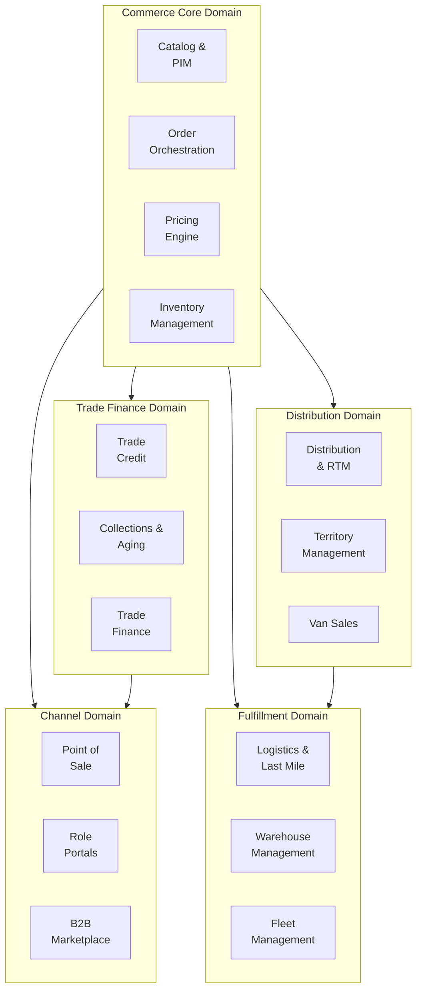
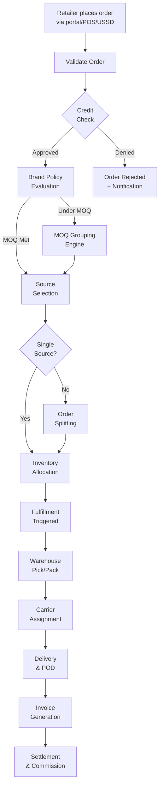
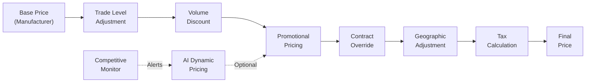
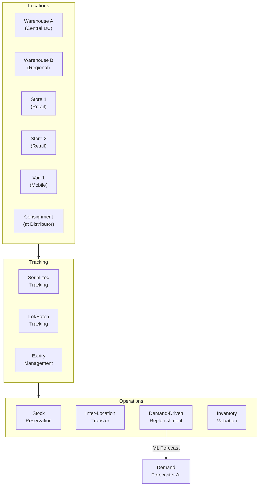
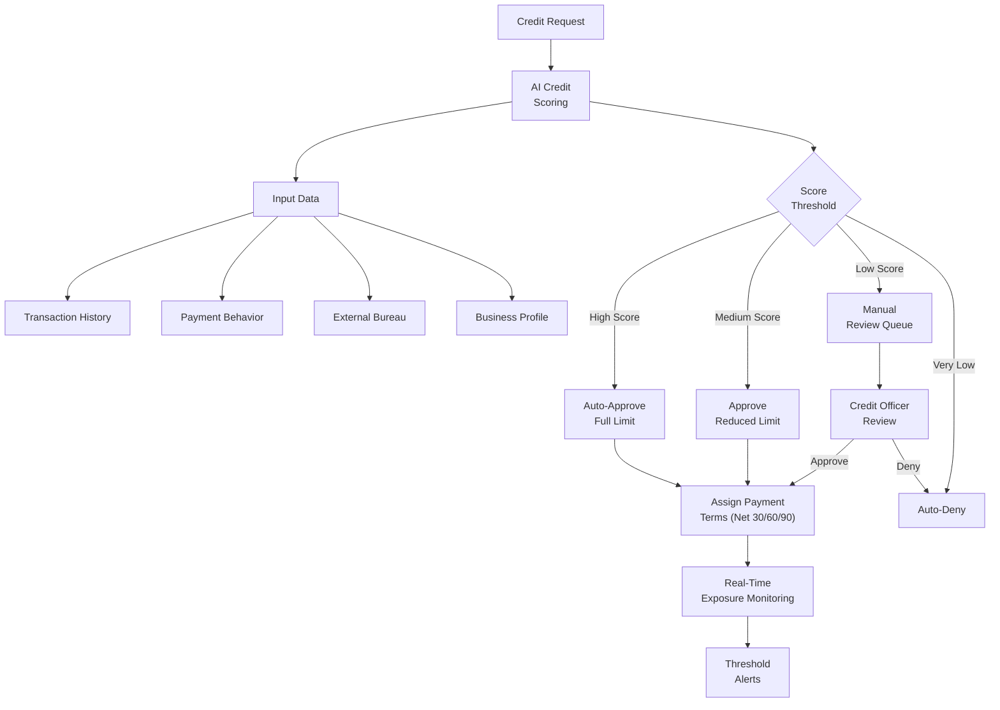
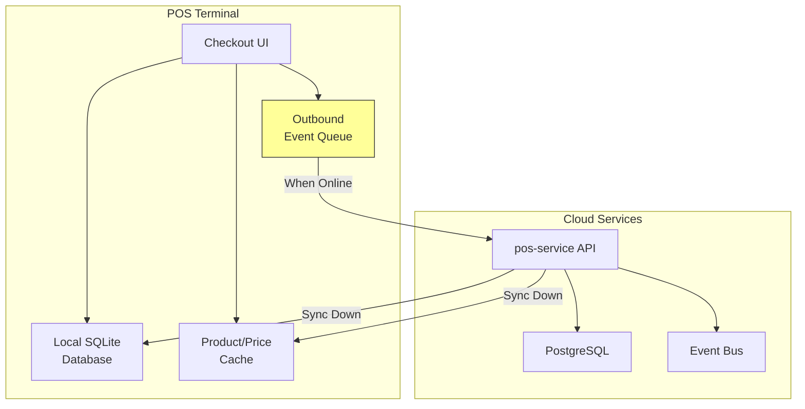
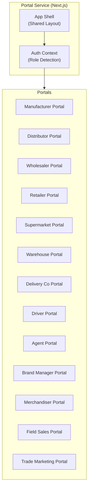

# ERP-Commerce -- High-Level Design (HLD)

## Document Control

| Field    | Value                                   |
|----------|-----------------------------------------|
| Module   | ERP-Commerce                            |
| Version  | 2.0                                     |
| Date     | 2026-02-23                              |

---

## 1. System Decomposition

### 1.1 Domain Boundaries

### 1.2 Service Interaction Matrix

| Service       | Calls To                                        | Called By                              |
|---------------|------------------------------------------------|---------------------------------------|
| catalog       | pricing, inventory                              | order, portal, marketplace, pos       |
| order         | pricing, inventory, trade-credit, logistics     | portal, pos, marketplace              |
| pricing       | (AI sidecar)                                    | catalog, order, pos, marketplace      |
| inventory     | (demand AI sidecar)                             | order, pos, distribution, logistics   |
| trade-credit  | (credit AI sidecar)                             | order, portal, marketplace            |
| distribution  | inventory, logistics                            | portal, order                         |
| pos           | catalog, pricing, inventory, order              | (direct terminal)                     |
| portal        | all services                                    | (browser/app)                         |
| logistics     | inventory, (route AI sidecar)                   | order, distribution                   |
| marketplace   | catalog, pricing, order, trade-credit           | portal                                |

---

## 2. Order Orchestration Design

### 2.1 Multi-Party Order Flow

### 2.2 Order Splitting Logic

When an order cannot be fulfilled from a single source, the order-service implements a splitting algorithm:

1. **Product-level split**: Group line items by optimal fulfillment location
2. **Quantity-level split**: Distribute quantities across multiple locations when single location has insufficient stock
3. **Geographic split**: Route items from the nearest warehouse to minimize shipping cost and time

Each sub-order becomes an independent fulfillment unit with its own tracking, delivery, and invoicing.

---

## 3. Pricing Engine Design

### 3.1 Price Waterfall

The pricing engine processes prices through a waterfall pipeline:

1. **Base Price** -- manufacturer's list price per product
2. **Trade Level** -- markup/discount per trade level (distributor, wholesaler, retailer)
3. **Volume Discount** -- quantity-break adjustments based on order size
4. **Promotional** -- time-limited promotional pricing overrides
5. **Contract** -- customer-specific negotiated pricing
6. **Geographic** -- location-based adjustments for logistics costs
7. **Tax** -- applicable VAT/GST calculation

The Rust price-calculator component executes the waterfall computation in sub-millisecond time for high-throughput scenarios.

---

## 4. Inventory Management Design

### 4.1 Multi-Location Inventory Model

### 4.2 Stock Reservation Strategy

1. **Soft Reserve** -- temporary hold during checkout (TTL: 15 minutes)
2. **Hard Reserve** -- confirmed allocation after order approval
3. **Release** -- automatic release on order cancellation or timeout

---

## 5. Trade Credit Design

### 5.1 Credit Decision Flow

---

## 6. POS Offline Architecture

### 6.1 Offline-First Design

**Offline Operation**:
1. Product catalog and pricing cached locally
2. Transactions stored in local SQLite database
3. Events queued in outbound buffer
4. On connectivity restoration, queue drains in FIFO order
5. Conflict resolution via last-write-wins with vector clocks

**Supported Hardware**:
- Stripe Terminal (Verifone P400, BBPOS WisePOS E)
- Square Terminal, Square Reader
- Sunmi V2 Pro, T2 Mini, L2
- PAX A920 Pro, A77

---

## 7. Portal Architecture

### 7.1 13 Role-Specific Portals

Each portal is a micro-frontend loaded based on the authenticated user's role, sharing a common app shell with role-specific navigation, dashboards, and workflows.

---

## 8. Technology Stack Summary

| Layer         | Technology                                       |
|---------------|--------------------------------------------------|
| Frontend      | Next.js 14, React 18, TypeScript, Ant Design     |
| API Gateway   | Kong / Envoy                                     |
| GraphQL       | Hasura                                           |
| Core Services | Go 1.22                                          |
| AI/ML         | Python 3.12, scikit-learn, TensorFlow, OR-Tools  |
| High-Perf     | Rust (EDI parser, price calculator, sync engine)  |
| Database      | PostgreSQL 16, TimescaleDB                       |
| Cache         | Redis 7 Cluster                                  |
| Search        | Elasticsearch 8                                  |
| Events        | NATS JetStream / Redpanda                        |
| Workflows     | Temporal                                         |
| Container     | Kubernetes (EKS/GKE)                             |
| CI/CD         | GitHub Actions, ArgoCD                           |
| Observability | OpenTelemetry, Prometheus, Grafana, Jaeger        |
