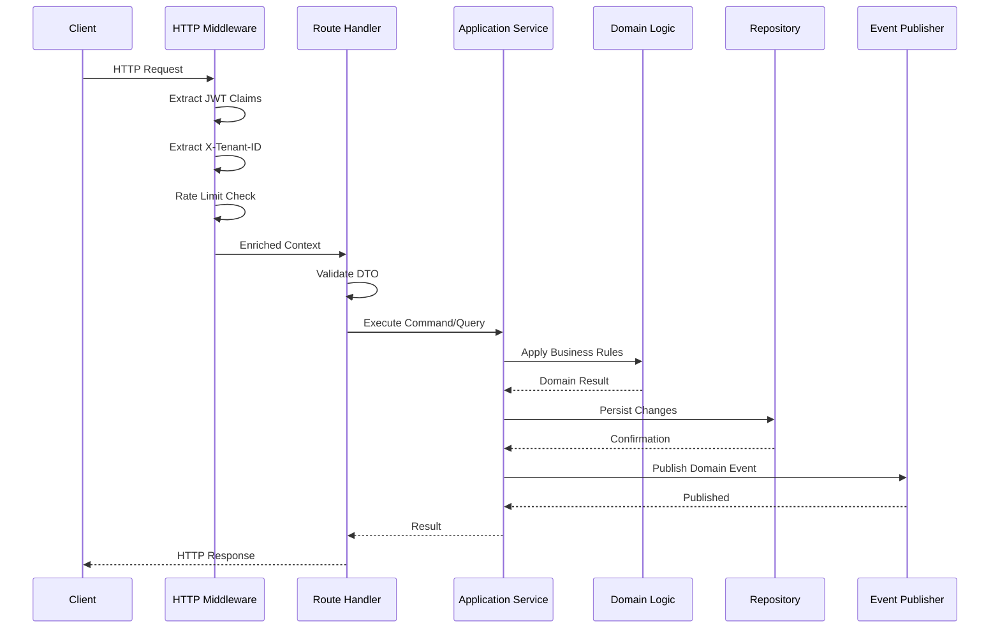
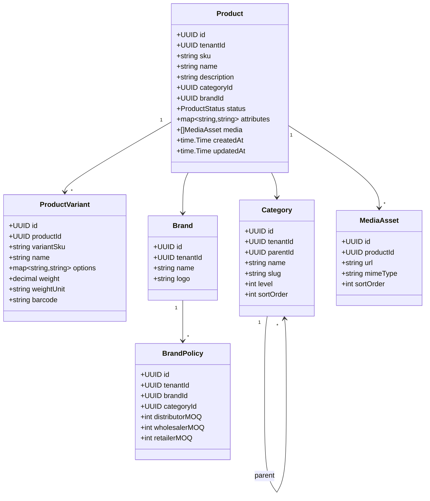
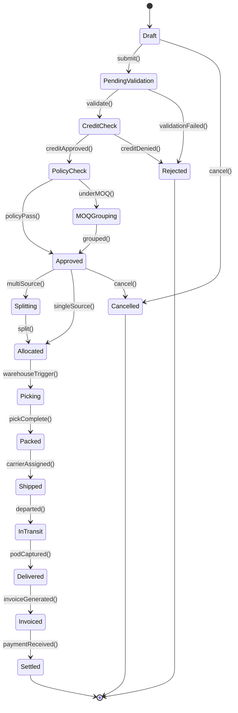
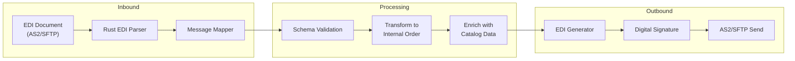
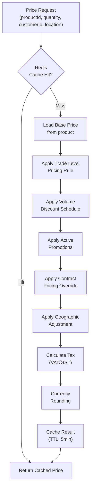
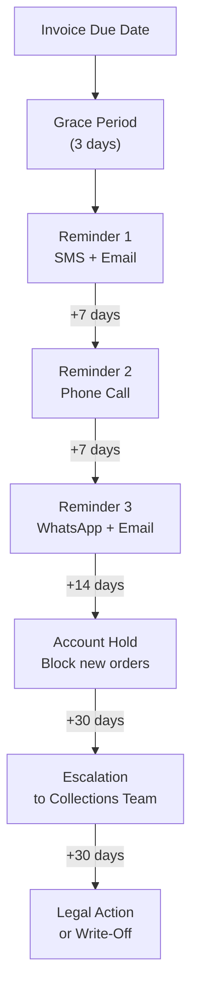
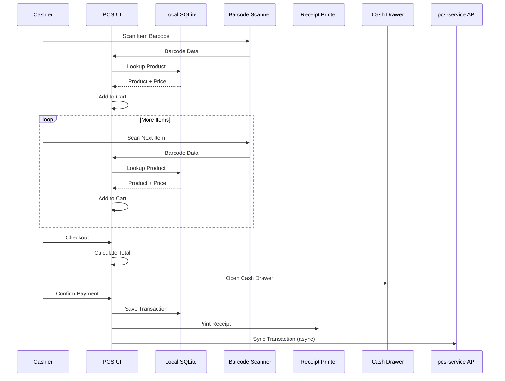
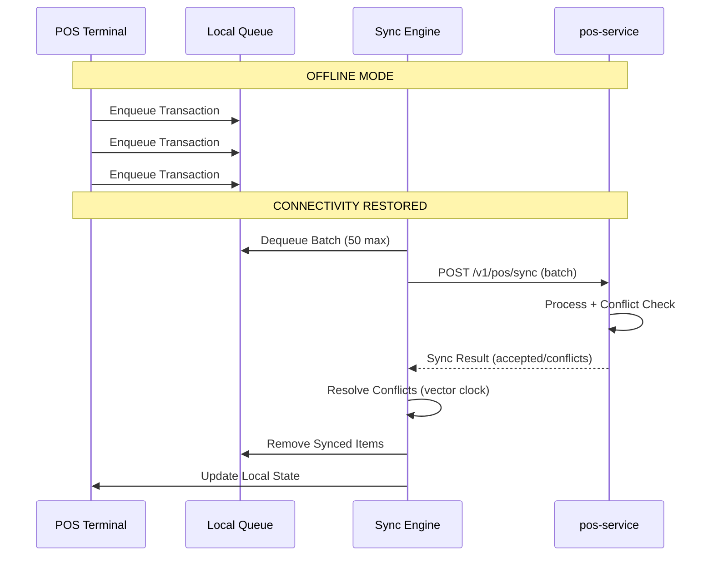
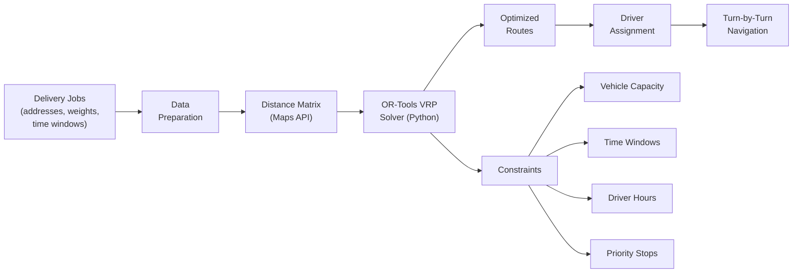

# ERP-Commerce -- Low-Level Design (LLD)

## Document Control

| Field    | Value                                   |
|----------|-----------------------------------------|
| Module   | ERP-Commerce                            |
| Version  | 2.0                                     |
| Date     | 2026-02-23                              |

---

## 1. Service Internal Architecture

Each Go microservice follows a consistent hexagonal (ports and adapters) architecture.

### 1.1 Service Package Structure

```
services/<name>-service/
  main.go                  # Entry point, HTTP server bootstrap
  internal/
    domain/
      models.go            # Domain entities and value objects
      events.go            # Domain event definitions
      errors.go            # Domain-specific errors
    ports/
      inbound.go           # Service interface (use cases)
      outbound.go          # Repository and external service interfaces
    adapters/
      http/
        handlers.go        # HTTP route handlers
        middleware.go       # Tenant extraction, auth, logging
        dto.go             # Request/response DTOs
      grpc/
        server.go          # gRPC service implementation
      repository/
        postgres.go        # PostgreSQL repository implementation
        redis.go           # Redis cache adapter
      events/
        publisher.go       # NATS/Redpanda event publisher
        subscriber.go      # Event subscription handlers
    application/
      service.go           # Application service (orchestrates ports)
      commands.go          # Command handlers
      queries.go           # Query handlers
  migrations/
    *.sql                  # Database migration scripts
  Dockerfile
  README.md
```

### 1.2 Request Processing Pipeline



---

## 2. Catalog Service Detailed Design

### 2.1 Domain Model



### 2.2 Key Algorithms

**Category Tree Retrieval** -- Uses materialized path pattern for efficient tree queries:

```sql
-- Materialized path: /root/electronics/phones/smartphones
SELECT * FROM categories
WHERE tenant_id = $1
  AND path LIKE $2 || '%'
ORDER BY path;
```

**Product Search** -- Elasticsearch with faceted filtering:

```json
{
  "query": {
    "bool": {
      "must": [
        { "match": { "name": "search term" } },
        { "term": { "tenant_id": "uuid" } }
      ],
      "filter": [
        { "term": { "category_id": "uuid" } },
        { "range": { "price": { "gte": 100, "lte": 500 } } }
      ]
    }
  },
  "aggs": {
    "brands": { "terms": { "field": "brand_id" } },
    "price_ranges": { "range": { "field": "price", "ranges": [...] } }
  }
}
```

---

## 3. Order Service Detailed Design

### 3.1 Order State Machine



### 3.2 EDI Message Processing



**Supported EDI Transactions**:

| Standard | Code     | Name           | Direction |
|----------|----------|----------------|-----------|
| X12      | 850      | Purchase Order | Inbound   |
| X12      | 855      | PO Acknowledgment | Outbound |
| X12      | 856      | Ship Notice    | Outbound  |
| X12      | 810      | Invoice        | Outbound  |
| EDIFACT  | ORDERS   | Purchase Order | Inbound   |
| EDIFACT  | ORDRSP   | Order Response | Outbound  |
| EDIFACT  | DESADV   | Dispatch Advice| Outbound  |
| EDIFACT  | INVOIC   | Invoice        | Outbound  |

---

## 4. Pricing Service Detailed Design

### 4.1 Price Calculation Pipeline



### 4.2 Rust Price Calculator

The high-performance price calculator is implemented in Rust and called via FFI from the Go pricing-service for bulk pricing operations (catalog repricing, promotional batch updates).

```rust
// Simplified interface
pub struct PriceRequest {
    pub product_id: Uuid,
    pub base_price: Decimal,
    pub trade_level: TradeLevel,
    pub quantity: u32,
    pub customer_id: Option<Uuid>,
    pub location: Option<GeoPoint>,
}

pub struct PriceResult {
    pub unit_price: Decimal,
    pub total_price: Decimal,
    pub discount_amount: Decimal,
    pub tax_amount: Decimal,
    pub applied_rules: Vec<AppliedRule>,
}
```

---

## 5. Trade Credit Service Detailed Design

### 5.1 Credit Scoring Model Inputs

| Feature Category    | Inputs                                                      |
|--------------------|-------------------------------------------------------------|
| Transaction History | Order frequency, average order value, total GMV, tenure     |
| Payment Behavior   | On-time rate, average days to pay, default count            |
| Business Profile   | Business type, years in operation, number of outlets        |
| External Data      | Credit bureau score, bank statements, mobile money history  |
| Network Score      | Supplier references, peer network strength                  |

### 5.2 Collections Escalation Flow



---

## 6. POS Service Detailed Design

### 6.1 Checkout Flow



### 6.2 Offline Sync Protocol



---

## 7. Logistics Service Detailed Design

### 7.1 VRP Solver Architecture



### 7.2 Proof of Delivery Capture

| POD Method    | Description                                | Use Case              |
|---------------|--------------------------------------------|-----------------------|
| Digital Signature | Recipient signs on driver's device     | Standard delivery     |
| Photo         | Photo of delivered goods at location        | Unattended delivery   |
| OTP           | One-time code sent to recipient via SMS     | High-value delivery   |
| Geofence      | GPS confirms driver at delivery location    | All deliveries        |
| Biometric     | Fingerprint verification                    | Cash-on-delivery      |
