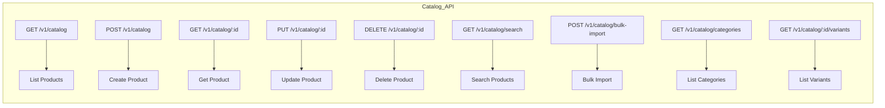

# ERP-Commerce -- API Reference

## Document Control

| Field    | Value                                   |
|----------|-----------------------------------------|
| Module   | ERP-Commerce                            |
| Version  | 2.0                                     |
| Date     | 2026-02-23                              |

---

## 1. API Overview

All ERP-Commerce APIs are RESTful, require JWT authentication from ERP-IAM, and require `X-Tenant-ID` header for tenant-scoped operations. Responses follow CloudEvents envelope for event-emitting operations.

### 1.1 Base URL

```
Production: https://api.erp-commerce.example.com
Staging:    https://api.staging.erp-commerce.example.com
```

### 1.2 Common Headers

| Header         | Required | Description                                |
|----------------|----------|--------------------------------------------|
| Authorization  | Yes      | `Bearer <JWT>` from ERP-IAM               |
| X-Tenant-ID    | Yes      | UUID of the active tenant                  |
| X-Request-ID   | No       | Idempotency key / correlation ID           |
| Content-Type   | Yes      | `application/json`                         |
| Accept         | No       | `application/json` (default)               |

### 1.3 Standard Response Format

```json
{
  "data": {},
  "meta": {
    "request_id": "uuid",
    "timestamp": "2026-02-23T10:00:00Z",
    "event_topic": "erp.commerce.entity.action"
  },
  "pagination": {
    "page": 1,
    "per_page": 20,
    "total": 100,
    "total_pages": 5
  }
}
```

### 1.4 Error Response Format

```json
{
  "error": {
    "code": "VALIDATION_ERROR",
    "message": "Human-readable message",
    "details": [
      { "field": "quantity", "message": "must be greater than 0" }
    ]
  },
  "meta": {
    "request_id": "uuid",
    "timestamp": "2026-02-23T10:00:00Z"
  }
}
```

---

## 2. Health and System Endpoints

### GET /healthz

Health check endpoint for load balancers and monitoring.

**Response 200**:
```json
{
  "status": "healthy",
  "module": "ERP-Commerce",
  "service": "gateway"
}
```

### GET /v1/capabilities

Returns the active capabilities for the tenant based on ERP-Platform entitlements.

**Response 200**:
```json
{
  "module": "ERP-Commerce",
  "capabilities": [
    "trade_network",
    "order_orchestration",
    "trade_credit",
    "rtm",
    "offline_pos",
    "marketplace"
  ]
}
```

---

## 3. Catalog Service API

### 3.1 Endpoints



### POST /v1/catalog

Create a new product in the tenant catalog.

**Request Body**:
```json
{
  "sku": "PROD-001",
  "name": "Premium Rice 50kg",
  "description": "Premium quality long grain rice",
  "category_id": "uuid",
  "brand_id": "uuid",
  "attributes": {
    "weight": "50kg",
    "origin": "Thailand",
    "grain_type": "long"
  },
  "base_price": {
    "amount": 45000,
    "currency": "NGN"
  },
  "variants": [
    {
      "variant_sku": "PROD-001-25KG",
      "name": "25kg Pack",
      "options": { "weight": "25kg" },
      "barcode": "8901234567890"
    }
  ]
}
```

**Response 201**:
```json
{
  "data": {
    "id": "uuid",
    "sku": "PROD-001",
    "name": "Premium Rice 50kg",
    "status": "active",
    "created_at": "2026-02-23T10:00:00Z"
  },
  "meta": {
    "event_topic": "erp.commerce.catalog.created"
  }
}
```

---

## 4. Order Service API

### 4.1 Endpoints

| Method | Path                          | Description                      |
|--------|-------------------------------|----------------------------------|
| GET    | /v1/order                     | List orders (filtered, paginated)|
| POST   | /v1/order                     | Create order                     |
| GET    | /v1/order/:id                 | Get order details                |
| PUT    | /v1/order/:id                 | Update order                     |
| DELETE | /v1/order/:id                 | Cancel order                     |
| POST   | /v1/order/:id/approve         | Approve order                    |
| POST   | /v1/order/:id/split           | Split order into sub-orders      |
| GET    | /v1/order/:id/tracking        | Get order tracking               |
| POST   | /v1/order/:id/return          | Initiate return/RMA              |
| POST   | /v1/order/edi/inbound         | Process inbound EDI document     |
| GET    | /v1/order/edi/outbound/:id    | Get outbound EDI document        |

### POST /v1/order

Create a multi-party trade order.

**Request Body**:
```json
{
  "buyer_tenant_id": "uuid",
  "seller_tenant_id": "uuid",
  "order_type": "b2b",
  "channel": "portal",
  "line_items": [
    {
      "product_id": "uuid",
      "variant_id": "uuid",
      "quantity": 100,
      "unit_price": 45000,
      "currency": "NGN"
    }
  ],
  "shipping_address": {
    "line1": "123 Trade Street",
    "city": "Lagos",
    "state": "Lagos",
    "country": "NG",
    "postal_code": "100001"
  },
  "payment_terms": "net_30",
  "requested_delivery_date": "2026-03-01"
}
```

**Response 201**:
```json
{
  "data": {
    "id": "uuid",
    "order_number": "ORD-2026-000001",
    "status": "pending_validation",
    "total_amount": 4500000,
    "currency": "NGN",
    "line_items": [...],
    "created_at": "2026-02-23T10:00:00Z"
  },
  "meta": {
    "event_topic": "erp.commerce.order.created"
  }
}
```

---

## 5. Pricing Service API

| Method | Path                              | Description                       |
|--------|-----------------------------------|-----------------------------------|
| POST   | /v1/pricing/calculate             | Calculate price for items         |
| GET    | /v1/pricing/rules                 | List pricing rules                |
| POST   | /v1/pricing/rules                 | Create pricing rule               |
| PUT    | /v1/pricing/rules/:id            | Update pricing rule               |
| GET    | /v1/pricing/promotions            | List active promotions            |
| POST   | /v1/pricing/promotions            | Create promotion                  |
| GET    | /v1/pricing/contracts/:customerId | Get customer contract pricing     |
| POST   | /v1/pricing/bulk-calculate        | Bulk price calculation            |

### POST /v1/pricing/calculate

**Request Body**:
```json
{
  "items": [
    {
      "product_id": "uuid",
      "variant_id": "uuid",
      "quantity": 100,
      "customer_id": "uuid",
      "trade_level": "distributor",
      "location": { "lat": 6.5244, "lng": 3.3792 }
    }
  ]
}
```

**Response 200**:
```json
{
  "data": {
    "items": [
      {
        "product_id": "uuid",
        "base_price": 50000,
        "unit_price": 42500,
        "total_price": 4250000,
        "discount_amount": 750000,
        "tax_amount": 318750,
        "applied_rules": [
          { "type": "trade_level", "adjustment": -10.0 },
          { "type": "volume_discount", "adjustment": -5.0 }
        ],
        "currency": "NGN"
      }
    ],
    "calculation_time_ms": 12
  }
}
```

---

## 6. Inventory Service API

| Method | Path                              | Description                       |
|--------|-----------------------------------|-----------------------------------|
| GET    | /v1/inventory                     | List inventory levels             |
| POST   | /v1/inventory                     | Create inventory record           |
| GET    | /v1/inventory/:id                 | Get inventory detail              |
| PUT    | /v1/inventory/:id                 | Update inventory                  |
| POST   | /v1/inventory/reserve             | Reserve stock                     |
| POST   | /v1/inventory/release             | Release reservation               |
| POST   | /v1/inventory/transfer            | Transfer between locations        |
| GET    | /v1/inventory/locations           | List warehouse/store locations    |
| GET    | /v1/inventory/alerts              | Get low-stock alerts              |
| GET    | /v1/inventory/valuation           | Get inventory valuation report    |

---

## 7. Trade Credit Service API

| Method | Path                              | Description                       |
|--------|-----------------------------------|-----------------------------------|
| POST   | /v1/trade-credit/score            | Request credit score              |
| GET    | /v1/trade-credit/limits/:customerId | Get credit limit               |
| PUT    | /v1/trade-credit/limits/:customerId | Update credit limit             |
| GET    | /v1/trade-credit/exposure/:customerId | Get credit exposure           |
| GET    | /v1/trade-credit/aging            | Get aging report                  |
| POST   | /v1/trade-credit/terms            | Set payment terms                 |
| GET    | /v1/trade-credit/collections      | List collection actions           |

---

## 8. Distribution Service API

| Method | Path                              | Description                       |
|--------|-----------------------------------|-----------------------------------|
| GET    | /v1/distribution/territories      | List territories                  |
| POST   | /v1/distribution/territories      | Create territory                  |
| GET    | /v1/distribution/routes           | List distribution routes          |
| POST   | /v1/distribution/van-sales        | Record van sale                   |
| GET    | /v1/distribution/beat-plans       | List beat plans                   |
| POST   | /v1/distribution/beat-plans       | Create beat plan                  |
| GET    | /v1/distribution/coverage-lanes   | List coverage lanes               |
| POST   | /v1/distribution/coverage-lanes   | Create coverage lane              |

---

## 9. POS Service API

| Method | Path                              | Description                       |
|--------|-----------------------------------|-----------------------------------|
| POST   | /v1/pos/transaction               | Process POS transaction           |
| GET    | /v1/pos/transaction/:id           | Get transaction details           |
| POST   | /v1/pos/sync                      | Sync offline transactions         |
| GET    | /v1/pos/shifts                    | List shifts                       |
| POST   | /v1/pos/shifts/open               | Open shift                        |
| POST   | /v1/pos/shifts/close              | Close shift with reconciliation   |
| GET    | /v1/pos/terminals                 | List registered terminals         |
| POST   | /v1/pos/terminals/register        | Register new terminal             |

---

## 10. Logistics Service API

| Method | Path                              | Description                       |
|--------|-----------------------------------|-----------------------------------|
| POST   | /v1/logistics/routes/optimize     | Run VRP optimization              |
| GET    | /v1/logistics/deliveries          | List deliveries                   |
| GET    | /v1/logistics/deliveries/:id      | Get delivery details              |
| POST   | /v1/logistics/deliveries/:id/pod  | Submit proof of delivery          |
| GET    | /v1/logistics/tracking/:orderId   | Get live GPS tracking             |
| GET    | /v1/logistics/fleet               | List fleet vehicles               |
| GET    | /v1/logistics/performance         | Delivery performance metrics      |

---

## 11. Marketplace Service API

| Method | Path                              | Description                       |
|--------|-----------------------------------|-----------------------------------|
| POST   | /v1/marketplace/vendors           | Onboard new vendor                |
| GET    | /v1/marketplace/vendors           | List vendors                      |
| GET    | /v1/marketplace/vendors/:id       | Get vendor details                |
| PUT    | /v1/marketplace/vendors/:id       | Update vendor profile             |
| GET    | /v1/marketplace/commissions       | List commission structures        |
| POST   | /v1/marketplace/commissions       | Create commission rule            |
| GET    | /v1/marketplace/disputes          | List disputes                     |
| POST   | /v1/marketplace/disputes          | Create dispute                    |
| PUT    | /v1/marketplace/disputes/:id      | Update dispute resolution         |
| GET    | /v1/marketplace/analytics         | Marketplace analytics/GMV         |

---

## 12. Portal Service API

| Method | Path                              | Description                       |
|--------|-----------------------------------|-----------------------------------|
| GET    | /v1/portal/dashboard/:role        | Get role-specific dashboard data  |
| GET    | /v1/portal/kpis/:role             | Get role-specific KPIs            |
| GET    | /v1/portal/notifications          | Get user notifications            |
| POST   | /v1/portal/preferences            | Set user preferences              |
| GET    | /v1/portal/widgets/:role          | Get available dashboard widgets   |

---

## 13. Rate Limiting

| Tier       | Requests/min | Burst |
|------------|:------------:|:-----:|
| Free       | 60           | 10    |
| Standard   | 300          | 50    |
| Enterprise | 1000         | 200   |
| Internal   | 5000         | 500   |

Rate limit headers are included in all responses:
```
X-RateLimit-Limit: 300
X-RateLimit-Remaining: 295
X-RateLimit-Reset: 1709100000
```
