# ERP-Commerce -- Entity Relationship Diagram (ERD)

## Document Control

| Field    | Value                                   |
|----------|-----------------------------------------|
| Module   | ERP-Commerce                            |
| Version  | 2.0                                     |
| Date     | 2026-02-23                              |

---

## 1. Complete ERD Overview

```mermaid
erDiagram
    tenants ||--o{ products : "owns"
    tenants ||--o{ orders : "places/receives"
    tenants ||--o{ inventory_locations : "operates"
    tenants ||--o{ credit_accounts : "has"
    tenants ||--o{ territories : "manages"
    tenants ||--o{ pos_terminals : "registers"
    tenants ||--o{ marketplace_vendors : "enrolls"

    products ||--o{ product_variants : "has"
    products ||--o{ product_media : "has"
    products }o--|| categories : "belongs to"
    products }o--|| brands : "manufactured by"

    brands ||--o{ brand_policies : "governs"
    categories ||--o{ categories : "parent of"

    orders ||--o{ order_line_items : "contains"
    orders ||--o{ order_status_history : "tracks"
    orders ||--o{ order_sub_orders : "splits into"
    orders }o--o| edi_transactions : "linked to"
    orders }o--|| credit_accounts : "charged to"

    order_line_items }o--|| product_variants : "references"
    order_line_items }o--|| inventory_reservations : "reserves"

    pricing_rules ||--o{ pricing_rule_tiers : "has"
    promotions ||--o{ promotion_products : "applies to"
    contracts }o--|| tenants : "for customer"
    contracts ||--o{ contract_prices : "defines"

    inventory_locations ||--o{ inventory_stock : "holds"
    inventory_stock }o--|| product_variants : "for"
    inventory_stock ||--o{ inventory_lots : "tracked by"
    inventory_stock ||--o{ inventory_serials : "tracked by"
    inventory_reservations }o--|| inventory_stock : "from"
    inventory_transfers }o--|| inventory_locations : "from/to"

    credit_accounts ||--o{ credit_transactions : "records"
    credit_accounts ||--o{ credit_scores : "computed"
    credit_accounts ||--o{ collection_actions : "triggers"
    credit_accounts }o--o| credit_insurance_policies : "insured by"

    territories ||--o{ territory_assignments : "assigned to"
    territories ||--o{ coverage_lanes : "covers"
    beat_plans ||--o{ beat_plan_visits : "schedules"
    van_sales ||--o{ van_sale_items : "contains"

    pos_terminals ||--o{ pos_transactions : "processes"
    pos_transactions ||--o{ pos_transaction_items : "contains"
    pos_transactions }o--o| pos_shifts : "during"
    pos_shifts }o--|| pos_terminals : "on"

    deliveries }o--|| orders : "fulfills"
    deliveries }o--|| delivery_routes : "assigned to"
    deliveries ||--o{ delivery_proofs : "proved by"
    delivery_routes ||--o{ route_stops : "includes"

    marketplace_vendors ||--o{ vendor_products : "lists"
    marketplace_vendors ||--o{ commission_records : "earns"
    marketplace_vendors ||--o{ vendor_disputes : "involved in"
    marketplace_vendors ||--o{ vendor_ratings : "rated"
```



---

## 2. Core Commerce Tables

### 2.1 Tenants and Organizations

```sql
CREATE TABLE tenants (
    id              UUID PRIMARY KEY DEFAULT gen_random_uuid(),
    name            VARCHAR(255) NOT NULL,
    type            VARCHAR(50) NOT NULL CHECK (type IN (
                        'manufacturer', 'distributor', 'wholesaler',
                        'retailer', 'supermarket', 'logistics_provider',
                        'marketplace_vendor'
                    )),
    status          VARCHAR(20) DEFAULT 'active',
    country_code    VARCHAR(3) NOT NULL,
    currency_code   VARCHAR(3) NOT NULL,
    settings        JSONB DEFAULT '{}',
    created_at      TIMESTAMPTZ DEFAULT NOW(),
    updated_at      TIMESTAMPTZ DEFAULT NOW()
);

CREATE TABLE tenant_relationships (
    id              UUID PRIMARY KEY DEFAULT gen_random_uuid(),
    parent_tenant_id UUID NOT NULL REFERENCES tenants(id),
    child_tenant_id  UUID NOT NULL REFERENCES tenants(id),
    relationship_type VARCHAR(50) NOT NULL,
    status          VARCHAR(20) DEFAULT 'active',
    created_at      TIMESTAMPTZ DEFAULT NOW()
);
```

### 2.2 Product Catalog

```sql
CREATE TABLE categories (
    id              UUID PRIMARY KEY DEFAULT gen_random_uuid(),
    tenant_id       UUID NOT NULL REFERENCES tenants(id),
    parent_id       UUID REFERENCES categories(id),
    name            VARCHAR(255) NOT NULL,
    slug            VARCHAR(255) NOT NULL,
    path            TEXT NOT NULL,
    level           INT NOT NULL DEFAULT 0,
    sort_order      INT DEFAULT 0,
    metadata        JSONB DEFAULT '{}',
    created_at      TIMESTAMPTZ DEFAULT NOW(),
    updated_at      TIMESTAMPTZ DEFAULT NOW(),
    UNIQUE(tenant_id, slug)
);

CREATE TABLE brands (
    id              UUID PRIMARY KEY DEFAULT gen_random_uuid(),
    tenant_id       UUID NOT NULL REFERENCES tenants(id),
    name            VARCHAR(255) NOT NULL,
    logo_url        TEXT,
    description     TEXT,
    status          VARCHAR(20) DEFAULT 'active',
    created_at      TIMESTAMPTZ DEFAULT NOW()
);

CREATE TABLE brand_policies (
    id              UUID PRIMARY KEY DEFAULT gen_random_uuid(),
    tenant_id       UUID NOT NULL REFERENCES tenants(id),
    brand_id        UUID NOT NULL REFERENCES brands(id),
    category_id     UUID REFERENCES categories(id),
    distributor_moq INT DEFAULT 0,
    wholesaler_moq  INT DEFAULT 0,
    retailer_moq    INT DEFAULT 0,
    effective_from  DATE NOT NULL,
    effective_to    DATE,
    created_at      TIMESTAMPTZ DEFAULT NOW()
);

CREATE TABLE products (
    id              UUID PRIMARY KEY DEFAULT gen_random_uuid(),
    tenant_id       UUID NOT NULL REFERENCES tenants(id),
    sku             VARCHAR(100) NOT NULL,
    name            VARCHAR(500) NOT NULL,
    description     TEXT,
    category_id     UUID REFERENCES categories(id),
    brand_id        UUID REFERENCES brands(id),
    status          VARCHAR(20) DEFAULT 'draft' CHECK (status IN (
                        'draft', 'active', 'inactive', 'archived'
                    )),
    attributes      JSONB DEFAULT '{}',
    compliance_data JSONB DEFAULT '{}',
    seo_metadata    JSONB DEFAULT '{}',
    created_at      TIMESTAMPTZ DEFAULT NOW(),
    updated_at      TIMESTAMPTZ DEFAULT NOW(),
    UNIQUE(tenant_id, sku)
);

CREATE TABLE product_variants (
    id              UUID PRIMARY KEY DEFAULT gen_random_uuid(),
    product_id      UUID NOT NULL REFERENCES products(id) ON DELETE CASCADE,
    variant_sku     VARCHAR(100) NOT NULL,
    name            VARCHAR(500),
    options         JSONB DEFAULT '{}',
    barcode         VARCHAR(100),
    weight          DECIMAL(10,3),
    weight_unit     VARCHAR(10) DEFAULT 'kg',
    dimensions      JSONB,
    status          VARCHAR(20) DEFAULT 'active',
    created_at      TIMESTAMPTZ DEFAULT NOW()
);

CREATE TABLE product_media (
    id              UUID PRIMARY KEY DEFAULT gen_random_uuid(),
    product_id      UUID NOT NULL REFERENCES products(id) ON DELETE CASCADE,
    url             TEXT NOT NULL,
    mime_type       VARCHAR(100),
    alt_text        VARCHAR(500),
    sort_order      INT DEFAULT 0,
    created_at      TIMESTAMPTZ DEFAULT NOW()
);
```

### 2.3 Orders

```sql
CREATE TABLE orders (
    id                  UUID PRIMARY KEY DEFAULT gen_random_uuid(),
    tenant_id           UUID NOT NULL REFERENCES tenants(id),
    order_number        VARCHAR(50) NOT NULL UNIQUE,
    buyer_tenant_id     UUID NOT NULL REFERENCES tenants(id),
    seller_tenant_id    UUID NOT NULL REFERENCES tenants(id),
    order_type          VARCHAR(20) NOT NULL CHECK (order_type IN ('b2b', 'b2b2c', 'b2c')),
    channel             VARCHAR(30) NOT NULL CHECK (channel IN (
                            'portal', 'pos', 'ussd', 'whatsapp', 'api', 'edi', 'van_sale'
                        )),
    status              VARCHAR(30) NOT NULL DEFAULT 'draft',
    parent_order_id     UUID REFERENCES orders(id),
    total_amount        DECIMAL(15,2) NOT NULL DEFAULT 0,
    tax_amount          DECIMAL(15,2) DEFAULT 0,
    discount_amount     DECIMAL(15,2) DEFAULT 0,
    currency            VARCHAR(3) NOT NULL,
    payment_terms       VARCHAR(20),
    shipping_address    JSONB,
    billing_address     JSONB,
    requested_delivery  DATE,
    actual_delivery     DATE,
    notes               TEXT,
    metadata            JSONB DEFAULT '{}',
    created_at          TIMESTAMPTZ DEFAULT NOW(),
    updated_at          TIMESTAMPTZ DEFAULT NOW()
);

CREATE TABLE order_line_items (
    id              UUID PRIMARY KEY DEFAULT gen_random_uuid(),
    order_id        UUID NOT NULL REFERENCES orders(id) ON DELETE CASCADE,
    product_id      UUID NOT NULL REFERENCES products(id),
    variant_id      UUID REFERENCES product_variants(id),
    quantity        INT NOT NULL CHECK (quantity > 0),
    unit_price      DECIMAL(15,2) NOT NULL,
    total_price     DECIMAL(15,2) NOT NULL,
    discount_amount DECIMAL(15,2) DEFAULT 0,
    tax_amount      DECIMAL(15,2) DEFAULT 0,
    currency        VARCHAR(3) NOT NULL,
    applied_rules   JSONB DEFAULT '[]',
    created_at      TIMESTAMPTZ DEFAULT NOW()
);

CREATE TABLE order_status_history (
    id              UUID PRIMARY KEY DEFAULT gen_random_uuid(),
    order_id        UUID NOT NULL REFERENCES orders(id),
    from_status     VARCHAR(30),
    to_status       VARCHAR(30) NOT NULL,
    changed_by      UUID NOT NULL,
    reason          TEXT,
    metadata        JSONB DEFAULT '{}',
    created_at      TIMESTAMPTZ DEFAULT NOW()
);

CREATE TABLE edi_transactions (
    id                UUID PRIMARY KEY DEFAULT gen_random_uuid(),
    tenant_id         UUID NOT NULL REFERENCES tenants(id),
    order_id          UUID REFERENCES orders(id),
    edi_standard      VARCHAR(10) NOT NULL CHECK (edi_standard IN ('x12', 'edifact')),
    transaction_type  VARCHAR(20) NOT NULL,
    direction         VARCHAR(10) NOT NULL CHECK (direction IN ('inbound', 'outbound')),
    raw_document      TEXT NOT NULL,
    parsed_data       JSONB,
    status            VARCHAR(20) DEFAULT 'pending',
    partner_id        VARCHAR(100),
    created_at        TIMESTAMPTZ DEFAULT NOW()
);
```

### 2.4 Pricing

```sql
CREATE TABLE pricing_rules (
    id              UUID PRIMARY KEY DEFAULT gen_random_uuid(),
    tenant_id       UUID NOT NULL REFERENCES tenants(id),
    name            VARCHAR(255) NOT NULL,
    rule_type       VARCHAR(30) NOT NULL CHECK (rule_type IN (
                        'trade_level', 'volume', 'promotional', 'contract',
                        'geographic', 'bundle', 'dynamic'
                    )),
    priority        INT DEFAULT 0,
    conditions      JSONB NOT NULL,
    adjustment_type VARCHAR(20) CHECK (adjustment_type IN ('percentage', 'fixed', 'override')),
    adjustment_value DECIMAL(15,4),
    effective_from  TIMESTAMPTZ NOT NULL,
    effective_to    TIMESTAMPTZ,
    is_active       BOOLEAN DEFAULT true,
    created_at      TIMESTAMPTZ DEFAULT NOW()
);

CREATE TABLE pricing_rule_tiers (
    id              UUID PRIMARY KEY DEFAULT gen_random_uuid(),
    rule_id         UUID NOT NULL REFERENCES pricing_rules(id) ON DELETE CASCADE,
    min_quantity    INT NOT NULL,
    max_quantity    INT,
    adjustment_value DECIMAL(15,4) NOT NULL,
    created_at      TIMESTAMPTZ DEFAULT NOW()
);

CREATE TABLE promotions (
    id              UUID PRIMARY KEY DEFAULT gen_random_uuid(),
    tenant_id       UUID NOT NULL REFERENCES tenants(id),
    name            VARCHAR(255) NOT NULL,
    promo_type      VARCHAR(30) NOT NULL,
    discount_type   VARCHAR(20) NOT NULL,
    discount_value  DECIMAL(15,4) NOT NULL,
    min_order_value DECIMAL(15,2),
    max_uses        INT,
    current_uses    INT DEFAULT 0,
    start_date      TIMESTAMPTZ NOT NULL,
    end_date        TIMESTAMPTZ NOT NULL,
    conditions      JSONB DEFAULT '{}',
    is_active       BOOLEAN DEFAULT true,
    created_at      TIMESTAMPTZ DEFAULT NOW()
);

CREATE TABLE contracts (
    id              UUID PRIMARY KEY DEFAULT gen_random_uuid(),
    tenant_id       UUID NOT NULL REFERENCES tenants(id),
    customer_tenant_id UUID NOT NULL REFERENCES tenants(id),
    name            VARCHAR(255) NOT NULL,
    status          VARCHAR(20) DEFAULT 'active',
    start_date      DATE NOT NULL,
    end_date        DATE NOT NULL,
    terms           JSONB DEFAULT '{}',
    created_at      TIMESTAMPTZ DEFAULT NOW()
);

CREATE TABLE contract_prices (
    id              UUID PRIMARY KEY DEFAULT gen_random_uuid(),
    contract_id     UUID NOT NULL REFERENCES contracts(id) ON DELETE CASCADE,
    product_id      UUID NOT NULL REFERENCES products(id),
    variant_id      UUID REFERENCES product_variants(id),
    price           DECIMAL(15,2) NOT NULL,
    currency        VARCHAR(3) NOT NULL,
    min_quantity    INT DEFAULT 1,
    created_at      TIMESTAMPTZ DEFAULT NOW()
);
```

### 2.5 Inventory

```sql
CREATE TABLE inventory_locations (
    id              UUID PRIMARY KEY DEFAULT gen_random_uuid(),
    tenant_id       UUID NOT NULL REFERENCES tenants(id),
    name            VARCHAR(255) NOT NULL,
    location_type   VARCHAR(30) NOT NULL CHECK (location_type IN (
                        'warehouse', 'store', 'van', 'consignment', 'virtual'
                    )),
    address         JSONB,
    geo_point       POINT,
    is_active       BOOLEAN DEFAULT true,
    metadata        JSONB DEFAULT '{}',
    created_at      TIMESTAMPTZ DEFAULT NOW()
);

CREATE TABLE inventory_stock (
    id              UUID PRIMARY KEY DEFAULT gen_random_uuid(),
    tenant_id       UUID NOT NULL REFERENCES tenants(id),
    location_id     UUID NOT NULL REFERENCES inventory_locations(id),
    variant_id      UUID NOT NULL REFERENCES product_variants(id),
    quantity_on_hand INT NOT NULL DEFAULT 0,
    quantity_reserved INT NOT NULL DEFAULT 0,
    quantity_available INT GENERATED ALWAYS AS (quantity_on_hand - quantity_reserved) STORED,
    reorder_point   INT DEFAULT 0,
    reorder_quantity INT DEFAULT 0,
    valuation_method VARCHAR(10) DEFAULT 'fifo' CHECK (valuation_method IN ('fifo', 'lifo', 'wac')),
    unit_cost       DECIMAL(15,4),
    last_counted_at TIMESTAMPTZ,
    updated_at      TIMESTAMPTZ DEFAULT NOW(),
    UNIQUE(location_id, variant_id)
);

CREATE TABLE inventory_lots (
    id              UUID PRIMARY KEY DEFAULT gen_random_uuid(),
    stock_id        UUID NOT NULL REFERENCES inventory_stock(id),
    lot_number      VARCHAR(100) NOT NULL,
    quantity        INT NOT NULL,
    manufacture_date DATE,
    expiry_date     DATE,
    supplier_id     UUID,
    cost_per_unit   DECIMAL(15,4),
    created_at      TIMESTAMPTZ DEFAULT NOW()
);

CREATE TABLE inventory_serials (
    id              UUID PRIMARY KEY DEFAULT gen_random_uuid(),
    stock_id        UUID NOT NULL REFERENCES inventory_stock(id),
    serial_number   VARCHAR(100) NOT NULL UNIQUE,
    status          VARCHAR(20) DEFAULT 'available',
    lot_id          UUID REFERENCES inventory_lots(id),
    created_at      TIMESTAMPTZ DEFAULT NOW()
);

CREATE TABLE inventory_reservations (
    id              UUID PRIMARY KEY DEFAULT gen_random_uuid(),
    stock_id        UUID NOT NULL REFERENCES inventory_stock(id),
    order_id        UUID NOT NULL REFERENCES orders(id),
    line_item_id    UUID NOT NULL REFERENCES order_line_items(id),
    quantity        INT NOT NULL,
    reservation_type VARCHAR(10) CHECK (reservation_type IN ('soft', 'hard')),
    expires_at      TIMESTAMPTZ,
    status          VARCHAR(20) DEFAULT 'active',
    created_at      TIMESTAMPTZ DEFAULT NOW()
);

CREATE TABLE inventory_transfers (
    id                  UUID PRIMARY KEY DEFAULT gen_random_uuid(),
    tenant_id           UUID NOT NULL REFERENCES tenants(id),
    from_location_id    UUID NOT NULL REFERENCES inventory_locations(id),
    to_location_id      UUID NOT NULL REFERENCES inventory_locations(id),
    variant_id          UUID NOT NULL REFERENCES product_variants(id),
    quantity            INT NOT NULL,
    status              VARCHAR(20) DEFAULT 'pending',
    initiated_by        UUID NOT NULL,
    completed_at        TIMESTAMPTZ,
    created_at          TIMESTAMPTZ DEFAULT NOW()
);
```

### 2.6 Trade Credit

```sql
CREATE TABLE credit_accounts (
    id              UUID PRIMARY KEY DEFAULT gen_random_uuid(),
    tenant_id       UUID NOT NULL REFERENCES tenants(id),
    customer_tenant_id UUID NOT NULL REFERENCES tenants(id),
    credit_limit    DECIMAL(15,2) NOT NULL DEFAULT 0,
    current_balance DECIMAL(15,2) NOT NULL DEFAULT 0,
    available_credit DECIMAL(15,2) GENERATED ALWAYS AS (credit_limit - current_balance) STORED,
    payment_terms   VARCHAR(20) NOT NULL DEFAULT 'net_30',
    risk_category   VARCHAR(20) DEFAULT 'medium',
    status          VARCHAR(20) DEFAULT 'active',
    last_reviewed_at TIMESTAMPTZ,
    created_at      TIMESTAMPTZ DEFAULT NOW(),
    updated_at      TIMESTAMPTZ DEFAULT NOW()
);

CREATE TABLE credit_scores (
    id              UUID PRIMARY KEY DEFAULT gen_random_uuid(),
    credit_account_id UUID NOT NULL REFERENCES credit_accounts(id),
    score           INT NOT NULL CHECK (score BETWEEN 0 AND 1000),
    model_version   VARCHAR(50) NOT NULL,
    input_features  JSONB NOT NULL,
    output_details  JSONB NOT NULL,
    computed_at     TIMESTAMPTZ DEFAULT NOW()
);

CREATE TABLE credit_transactions (
    id                UUID PRIMARY KEY DEFAULT gen_random_uuid(),
    credit_account_id UUID NOT NULL REFERENCES credit_accounts(id),
    order_id          UUID REFERENCES orders(id),
    transaction_type  VARCHAR(20) NOT NULL CHECK (transaction_type IN (
                          'charge', 'payment', 'adjustment', 'write_off'
                      )),
    amount            DECIMAL(15,2) NOT NULL,
    balance_after     DECIMAL(15,2) NOT NULL,
    due_date          DATE,
    paid_date         DATE,
    status            VARCHAR(20) DEFAULT 'pending',
    created_at        TIMESTAMPTZ DEFAULT NOW()
);

CREATE TABLE collection_actions (
    id                UUID PRIMARY KEY DEFAULT gen_random_uuid(),
    credit_account_id UUID NOT NULL REFERENCES credit_accounts(id),
    transaction_id    UUID REFERENCES credit_transactions(id),
    action_type       VARCHAR(30) NOT NULL,
    channel           VARCHAR(20),
    status            VARCHAR(20) DEFAULT 'pending',
    scheduled_at      TIMESTAMPTZ,
    executed_at       TIMESTAMPTZ,
    result            JSONB,
    created_at        TIMESTAMPTZ DEFAULT NOW()
);

CREATE TABLE credit_insurance_policies (
    id                UUID PRIMARY KEY DEFAULT gen_random_uuid(),
    credit_account_id UUID NOT NULL REFERENCES credit_accounts(id),
    provider          VARCHAR(100) NOT NULL,
    policy_number     VARCHAR(100) NOT NULL,
    coverage_amount   DECIMAL(15,2) NOT NULL,
    premium_amount    DECIMAL(15,2) NOT NULL,
    start_date        DATE NOT NULL,
    end_date          DATE NOT NULL,
    status            VARCHAR(20) DEFAULT 'active',
    created_at        TIMESTAMPTZ DEFAULT NOW()
);
```

### 2.7 Distribution

```sql
CREATE TABLE territories (
    id              UUID PRIMARY KEY DEFAULT gen_random_uuid(),
    tenant_id       UUID NOT NULL REFERENCES tenants(id),
    name            VARCHAR(255) NOT NULL,
    boundary        JSONB NOT NULL,
    parent_id       UUID REFERENCES territories(id),
    status          VARCHAR(20) DEFAULT 'active',
    created_at      TIMESTAMPTZ DEFAULT NOW()
);

CREATE TABLE territory_assignments (
    id              UUID PRIMARY KEY DEFAULT gen_random_uuid(),
    territory_id    UUID NOT NULL REFERENCES territories(id),
    assigned_to     UUID NOT NULL,
    role            VARCHAR(50) NOT NULL,
    start_date      DATE NOT NULL,
    end_date        DATE,
    created_at      TIMESTAMPTZ DEFAULT NOW()
);

CREATE TABLE coverage_lanes (
    id                UUID PRIMARY KEY DEFAULT gen_random_uuid(),
    owner_tenant_id   UUID NOT NULL REFERENCES tenants(id),
    owner_type        VARCHAR(50) NOT NULL,
    state             VARCHAR(100) NOT NULL,
    category          VARCHAR(100),
    service_level_hours INT NOT NULL DEFAULT 48,
    is_active         BOOLEAN DEFAULT true,
    created_at        TIMESTAMPTZ DEFAULT NOW()
);

CREATE TABLE beat_plans (
    id              UUID PRIMARY KEY DEFAULT gen_random_uuid(),
    tenant_id       UUID NOT NULL REFERENCES tenants(id),
    territory_id    UUID NOT NULL REFERENCES territories(id),
    assigned_to     UUID NOT NULL,
    day_of_week     INT NOT NULL CHECK (day_of_week BETWEEN 0 AND 6),
    status          VARCHAR(20) DEFAULT 'active',
    created_at      TIMESTAMPTZ DEFAULT NOW()
);

CREATE TABLE beat_plan_visits (
    id              UUID PRIMARY KEY DEFAULT gen_random_uuid(),
    beat_plan_id    UUID NOT NULL REFERENCES beat_plans(id),
    customer_tenant_id UUID NOT NULL REFERENCES tenants(id),
    visit_order     INT NOT NULL,
    estimated_duration_min INT DEFAULT 30,
    created_at      TIMESTAMPTZ DEFAULT NOW()
);

CREATE TABLE van_sales (
    id              UUID PRIMARY KEY DEFAULT gen_random_uuid(),
    tenant_id       UUID NOT NULL REFERENCES tenants(id),
    salesperson_id  UUID NOT NULL,
    vehicle_id      UUID,
    route_date      DATE NOT NULL,
    status          VARCHAR(20) DEFAULT 'in_progress',
    total_amount    DECIMAL(15,2) DEFAULT 0,
    created_at      TIMESTAMPTZ DEFAULT NOW()
);
```

### 2.8 POS

```sql
CREATE TABLE pos_terminals (
    id              UUID PRIMARY KEY DEFAULT gen_random_uuid(),
    tenant_id       UUID NOT NULL REFERENCES tenants(id),
    location_id     UUID REFERENCES inventory_locations(id),
    terminal_name   VARCHAR(100) NOT NULL,
    hardware_type   VARCHAR(50) NOT NULL,
    serial_number   VARCHAR(100),
    status          VARCHAR(20) DEFAULT 'active',
    last_sync_at    TIMESTAMPTZ,
    created_at      TIMESTAMPTZ DEFAULT NOW()
);

CREATE TABLE pos_shifts (
    id              UUID PRIMARY KEY DEFAULT gen_random_uuid(),
    terminal_id     UUID NOT NULL REFERENCES pos_terminals(id),
    cashier_id      UUID NOT NULL,
    opened_at       TIMESTAMPTZ NOT NULL,
    closed_at       TIMESTAMPTZ,
    opening_cash    DECIMAL(15,2) DEFAULT 0,
    closing_cash    DECIMAL(15,2),
    expected_cash   DECIMAL(15,2),
    variance        DECIMAL(15,2),
    status          VARCHAR(20) DEFAULT 'open',
    created_at      TIMESTAMPTZ DEFAULT NOW()
);

CREATE TABLE pos_transactions (
    id              UUID PRIMARY KEY DEFAULT gen_random_uuid(),
    tenant_id       UUID NOT NULL REFERENCES tenants(id),
    terminal_id     UUID NOT NULL REFERENCES pos_terminals(id),
    shift_id        UUID REFERENCES pos_shifts(id),
    order_id        UUID REFERENCES orders(id),
    transaction_number VARCHAR(50) NOT NULL,
    transaction_type VARCHAR(20) DEFAULT 'sale',
    subtotal        DECIMAL(15,2) NOT NULL,
    tax_amount      DECIMAL(15,2) DEFAULT 0,
    discount_amount DECIMAL(15,2) DEFAULT 0,
    total_amount    DECIMAL(15,2) NOT NULL,
    payment_method  VARCHAR(30) NOT NULL,
    payment_reference VARCHAR(100),
    is_offline      BOOLEAN DEFAULT false,
    synced_at       TIMESTAMPTZ,
    created_at      TIMESTAMPTZ DEFAULT NOW()
);

CREATE TABLE pos_transaction_items (
    id              UUID PRIMARY KEY DEFAULT gen_random_uuid(),
    transaction_id  UUID NOT NULL REFERENCES pos_transactions(id) ON DELETE CASCADE,
    variant_id      UUID NOT NULL REFERENCES product_variants(id),
    quantity        INT NOT NULL,
    unit_price      DECIMAL(15,2) NOT NULL,
    total_price     DECIMAL(15,2) NOT NULL,
    discount_amount DECIMAL(15,2) DEFAULT 0,
    created_at      TIMESTAMPTZ DEFAULT NOW()
);
```

### 2.9 Logistics

```sql
CREATE TABLE deliveries (
    id              UUID PRIMARY KEY DEFAULT gen_random_uuid(),
    tenant_id       UUID NOT NULL REFERENCES tenants(id),
    order_id        UUID NOT NULL REFERENCES orders(id),
    route_id        UUID REFERENCES delivery_routes(id),
    driver_id       UUID,
    vehicle_id      UUID,
    status          VARCHAR(30) DEFAULT 'pending',
    pickup_location JSONB,
    delivery_location JSONB,
    estimated_arrival TIMESTAMPTZ,
    actual_arrival  TIMESTAMPTZ,
    sla_hours       INT NOT NULL DEFAULT 48,
    created_at      TIMESTAMPTZ DEFAULT NOW(),
    updated_at      TIMESTAMPTZ DEFAULT NOW()
);

CREATE TABLE delivery_routes (
    id              UUID PRIMARY KEY DEFAULT gen_random_uuid(),
    tenant_id       UUID NOT NULL REFERENCES tenants(id),
    route_date      DATE NOT NULL,
    driver_id       UUID NOT NULL,
    vehicle_id      UUID,
    status          VARCHAR(20) DEFAULT 'planned',
    total_distance_km DECIMAL(10,2),
    total_duration_min INT,
    optimization_score DECIMAL(5,2),
    created_at      TIMESTAMPTZ DEFAULT NOW()
);

CREATE TABLE route_stops (
    id              UUID PRIMARY KEY DEFAULT gen_random_uuid(),
    route_id        UUID NOT NULL REFERENCES delivery_routes(id) ON DELETE CASCADE,
    delivery_id     UUID NOT NULL REFERENCES deliveries(id),
    stop_order      INT NOT NULL,
    arrival_window_start TIMESTAMPTZ,
    arrival_window_end   TIMESTAMPTZ,
    actual_arrival  TIMESTAMPTZ,
    status          VARCHAR(20) DEFAULT 'pending',
    created_at      TIMESTAMPTZ DEFAULT NOW()
);

CREATE TABLE delivery_proofs (
    id              UUID PRIMARY KEY DEFAULT gen_random_uuid(),
    delivery_id     UUID NOT NULL REFERENCES deliveries(id),
    proof_type      VARCHAR(20) NOT NULL CHECK (proof_type IN (
                        'signature', 'photo', 'otp', 'geofence', 'biometric'
                    )),
    data            JSONB NOT NULL,
    captured_by     UUID NOT NULL,
    captured_at     TIMESTAMPTZ DEFAULT NOW()
);
```

### 2.10 Marketplace

```sql
CREATE TABLE marketplace_vendors (
    id              UUID PRIMARY KEY DEFAULT gen_random_uuid(),
    tenant_id       UUID NOT NULL REFERENCES tenants(id),
    vendor_name     VARCHAR(255) NOT NULL,
    status          VARCHAR(20) DEFAULT 'pending_verification',
    kyc_data        JSONB DEFAULT '{}',
    kyb_data        JSONB DEFAULT '{}',
    verification_status VARCHAR(20) DEFAULT 'pending',
    commission_rate DECIMAL(5,4) DEFAULT 0.05,
    rating          DECIMAL(3,2) DEFAULT 0,
    total_gmv       DECIMAL(15,2) DEFAULT 0,
    payout_account  JSONB,
    created_at      TIMESTAMPTZ DEFAULT NOW(),
    updated_at      TIMESTAMPTZ DEFAULT NOW()
);

CREATE TABLE commission_records (
    id              UUID PRIMARY KEY DEFAULT gen_random_uuid(),
    vendor_id       UUID NOT NULL REFERENCES marketplace_vendors(id),
    order_id        UUID NOT NULL REFERENCES orders(id),
    commission_amount DECIMAL(15,2) NOT NULL,
    commission_rate DECIMAL(5,4) NOT NULL,
    status          VARCHAR(20) DEFAULT 'pending',
    payout_date     DATE,
    created_at      TIMESTAMPTZ DEFAULT NOW()
);

CREATE TABLE vendor_disputes (
    id              UUID PRIMARY KEY DEFAULT gen_random_uuid(),
    vendor_id       UUID REFERENCES marketplace_vendors(id),
    order_id        UUID NOT NULL REFERENCES orders(id),
    initiated_by    UUID NOT NULL,
    dispute_type    VARCHAR(50) NOT NULL,
    description     TEXT NOT NULL,
    status          VARCHAR(20) DEFAULT 'open',
    resolution      TEXT,
    resolved_at     TIMESTAMPTZ,
    created_at      TIMESTAMPTZ DEFAULT NOW()
);

CREATE TABLE vendor_ratings (
    id              UUID PRIMARY KEY DEFAULT gen_random_uuid(),
    vendor_id       UUID NOT NULL REFERENCES marketplace_vendors(id),
    rated_by        UUID NOT NULL,
    order_id        UUID REFERENCES orders(id),
    rating          INT NOT NULL CHECK (rating BETWEEN 1 AND 5),
    review          TEXT,
    created_at      TIMESTAMPTZ DEFAULT NOW()
);
```

---

## 3. Audit and Governance Tables

```sql
CREATE TABLE policy_evaluations (
    id                  UUID PRIMARY KEY DEFAULT gen_random_uuid(),
    order_id            UUID NOT NULL REFERENCES orders(id),
    tenant_id           UUID NOT NULL REFERENCES tenants(id),
    brand_id            UUID REFERENCES brands(id),
    destination_state   VARCHAR(100),
    compliant           BOOLEAN NOT NULL,
    selected_lane_id    UUID REFERENCES coverage_lanes(id),
    response_payload    JSONB NOT NULL,
    evaluated_at        TIMESTAMPTZ DEFAULT NOW()
);

CREATE TABLE automation_runs (
    id              UUID PRIMARY KEY DEFAULT gen_random_uuid(),
    workflow_id     VARCHAR(100) NOT NULL,
    trigger_reason  VARCHAR(100) NOT NULL,
    scope           VARCHAR(100),
    status          VARCHAR(20) DEFAULT 'running',
    input_data      JSONB,
    output_data     JSONB,
    started_at      TIMESTAMPTZ DEFAULT NOW(),
    completed_at    TIMESTAMPTZ
);

CREATE TABLE audit_logs (
    id              UUID PRIMARY KEY DEFAULT gen_random_uuid(),
    tenant_id       UUID NOT NULL,
    actor_id        UUID NOT NULL,
    action          VARCHAR(100) NOT NULL,
    resource_type   VARCHAR(100) NOT NULL,
    resource_id     UUID NOT NULL,
    old_value       JSONB,
    new_value       JSONB,
    ip_address      INET,
    user_agent      TEXT,
    created_at      TIMESTAMPTZ DEFAULT NOW()
);
```

---

## 4. Index Strategy

```sql
-- High-frequency query indexes
CREATE INDEX idx_products_tenant_status ON products(tenant_id, status);
CREATE INDEX idx_products_category ON products(category_id);
CREATE INDEX idx_products_brand ON products(brand_id);
CREATE INDEX idx_orders_tenant_status ON orders(tenant_id, status);
CREATE INDEX idx_orders_buyer ON orders(buyer_tenant_id);
CREATE INDEX idx_orders_seller ON orders(seller_tenant_id);
CREATE INDEX idx_order_items_order ON order_line_items(order_id);
CREATE INDEX idx_inventory_location_variant ON inventory_stock(location_id, variant_id);
CREATE INDEX idx_credit_customer ON credit_accounts(customer_tenant_id);
CREATE INDEX idx_pos_transactions_tenant ON pos_transactions(tenant_id, created_at);
CREATE INDEX idx_deliveries_order ON deliveries(order_id);
CREATE INDEX idx_audit_tenant_resource ON audit_logs(tenant_id, resource_type, created_at);

-- GIN indexes for JSONB
CREATE INDEX idx_products_attributes ON products USING GIN(attributes);
CREATE INDEX idx_orders_metadata ON orders USING GIN(metadata);

-- GiST index for spatial queries
CREATE INDEX idx_locations_geo ON inventory_locations USING GIST(geo_point);
```
