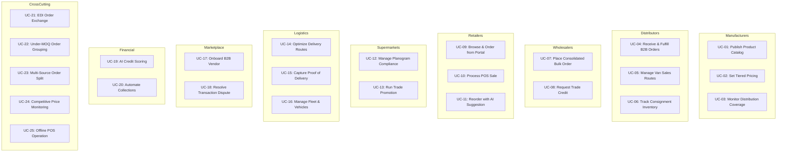
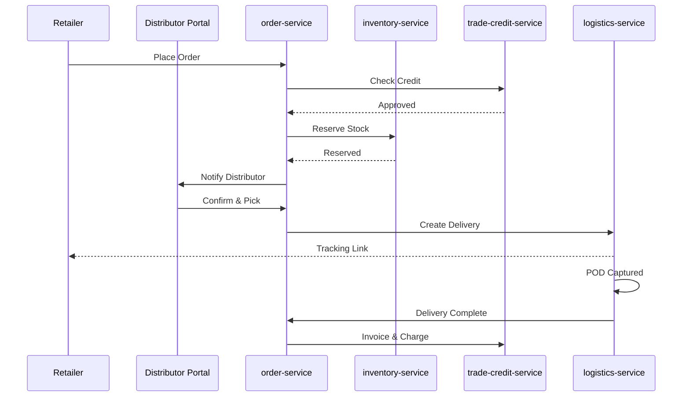
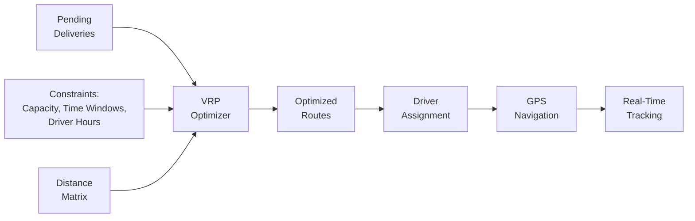

# ERP-Commerce -- Use Cases Document

## Document Control

| Field    | Value                                   |
|----------|-----------------------------------------|
| Module   | ERP-Commerce                            |
| Version  | 2.0                                     |
| Date     | 2026-02-23                              |

---

## 1. Use Case Map

---

## 2. Detailed Use Cases

### UC-01: Manufacturer Publishes Product Catalog

**Actor**: Manufacturer
**Priority**: P0
**Preconditions**: Manufacturer tenant registered and active

**Main Flow**:
1. Manufacturer logs into Manufacturer Portal
2. Navigates to Catalog Management section
3. Creates product with SKU, name, description, and category
4. Adds product variants (sizes, pack configurations)
5. Uploads product media (images, spec sheets)
6. Sets base pricing per trade level (distributor, wholesaler, retailer)
7. Configures brand policy MOQ per category
8. Publishes product to active status
9. System emits `erp.commerce.catalog.created` event
10. Product becomes visible in downstream partner catalogs

**Alternate Flows**:
- 3a. Manufacturer uses bulk import (CSV/Excel) for large catalog uploads
- 3b. Manufacturer sends EDI 832 (Price/Sales Catalog) for automated catalog sync

**Postconditions**: Product is active and available for ordering by authorized trade partners

---

### UC-02: Manufacturer Sets Tiered Pricing Strategy

**Actor**: Manufacturer / Brand Manager
**Priority**: P0
**Preconditions**: Product catalog published

**Main Flow**:
1. Brand Manager opens Pricing Management in Manufacturer Portal
2. Selects product or category
3. Defines trade-level pricing waterfall:
   - Manufacturer list price: 50,000 NGN
   - Distributor price: 42,500 NGN (-15%)
   - Wholesaler price: 45,000 NGN (-10%)
   - Retailer price: 47,500 NGN (-5%)
4. Sets volume discount tiers (100+ units: -3%, 500+ units: -5%)
5. Configures geographic adjustments for remote areas
6. Saves pricing rules
7. System validates no negative margin scenarios
8. Pricing engine updates and caches new rules

**Postconditions**: Pricing waterfall active for all trade levels

---

### UC-03: Manufacturer Monitors Distribution Coverage

**Actor**: Manufacturer / Brand Manager
**Priority**: P1

**Main Flow**:
1. Brand Manager opens Coverage Dashboard
2. Views map with territory-level coverage heat map
3. Identifies coverage gaps in specific states/regions
4. Reviews distributor performance metrics per territory
5. System detects coverage dip below threshold
6. Automated alert sent to regional distributor
7. Rebalance workflow assigns backup distribution partner
8. Coverage metrics updated in real-time

---

### UC-04: Distributor Receives and Fulfills B2B Order

**Actor**: Distributor
**Priority**: P0
**Preconditions**: Active distributor account with inventory

**Main Flow**:
1. System receives order (portal, API, EDI, or pre-sell)
2. Order validated against brand policies and MOQ rules
3. Trade credit checked against buyer's credit account
4. Inventory allocated from optimal warehouse location
5. Distributor reviews order in Distributor Portal
6. Warehouse receives picking instruction
7. Items picked, packed, and labeled
8. Carrier assigned for delivery
9. Shipment tracked via GPS
10. Delivery confirmed with POD
11. Invoice generated and sent to buyer

---

### UC-05: Distributor Manages Van Sales Route

**Actor**: Distributor / Field Sales
**Priority**: P0

**Main Flow**:
1. Distribution manager creates beat plan for territory
2. System generates optimized route for van salesperson
3. Van loaded with pre-determined product mix
4. Salesperson follows route on mobile app
5. At each stop, salesperson takes orders (online or offline)
6. Cash payments collected and recorded
7. Inventory decremented from van stock in real-time
8. End of day: salesperson reconciles cash and returns unsold stock
9. All offline transactions synced to cloud

---

### UC-06: Distributor Tracks Consignment Inventory

**Actor**: Distributor
**Priority**: P1

**Main Flow**:
1. Manufacturer places consignment stock at distributor warehouse
2. Inventory recorded as consignment type (manufacturer-owned)
3. As distributor sells consignment stock, ownership transfers
4. System tracks consignment vs. owned inventory separately
5. Monthly reconciliation report generated
6. Payment for sold consignment stock processed to manufacturer

---

### UC-07: Wholesaler Places Consolidated Bulk Order

**Actor**: Wholesaler
**Priority**: P0

**Main Flow**:
1. Wholesaler browses multiple manufacturer catalogs
2. Adds items from different manufacturers to single cart
3. System validates MOQ per brand/category
4. System identifies optimal fulfillment sources
5. Order split into sub-orders per manufacturer/distributor
6. Each sub-order processed independently
7. Wholesaler tracks consolidated view of all sub-orders
8. Volume discounts applied based on total quantity per brand

---

### UC-08: Wholesaler Requests Trade Credit

**Actor**: Wholesaler
**Priority**: P0

**Main Flow**:
1. Wholesaler applies for trade credit in portal
2. System collects business profile information
3. AI credit scoring model evaluates:
   - Transaction history (6-month order volume)
   - Payment behavior (on-time rate, average days to pay)
   - External credit bureau data
   - Business profile (years in operation, outlets)
4. Credit score computed (0-1000 scale)
5. Based on score threshold:
   - High (750+): Auto-approve full requested limit, Net 60
   - Medium (500-749): Approve reduced limit, Net 30
   - Low (300-499): Manual review by credit officer
   - Very Low (<300): Auto-deny with reason
6. Credit account created with approved limit and terms
7. Real-time exposure monitoring activated

---

### UC-09: Retailer Browses and Orders from Portal

**Actor**: Retailer
**Priority**: P0

**Main Flow**:
1. Retailer logs into Retailer Portal
2. Browses product catalog with category navigation and search
3. Views products with retailer-level pricing
4. Adds items to cart
5. System validates against MOQ policies
6. If under-MOQ: system suggests quantity increase or shows grouping option
7. Retailer proceeds to checkout
8. Payment terms selected (cash, credit if available)
9. Delivery address confirmed
10. Order submitted and confirmed

---

### UC-10: Retailer Processes POS Sale

**Actor**: Retailer Cashier
**Priority**: P0

**Main Flow**:
1. Cashier opens POS application on terminal
2. Scans item barcodes using barcode scanner
3. Items appear in checkout with prices
4. Customer requests quantity adjustment
5. Cashier updates quantities
6. Discount applied (promotional or manual with authorization)
7. Total calculated with applicable taxes
8. Customer pays (cash, card, mobile money, or split payment)
9. Cash drawer opens for cash payment
10. Receipt printed (thermal) and/or sent via SMS/email
11. Inventory decremented in real-time (or queued if offline)
12. Transaction recorded and synced

---

### UC-11: Retailer Reorders with AI Suggestion

**Actor**: Retailer
**Priority**: P2

**Main Flow**:
1. System analyzes retailer's sales history and current inventory
2. Demand forecasting model predicts upcoming needs
3. Reorder suggestions generated based on:
   - Historical sales velocity
   - Seasonal patterns
   - Current stock levels
   - Supplier lead times
4. Retailer reviews suggestions in portal
5. Retailer approves or modifies suggested order
6. Order submitted through standard flow

---

### UC-12: Supermarket Manages Planogram Compliance

**Actor**: Supermarket / Merchandiser
**Priority**: P1

**Main Flow**:
1. Brand manager defines planogram layout for category
2. Merchandiser visits store with mobile app
3. Captures shelf photo using device camera
4. System compares actual shelf layout against planogram
5. Compliance score calculated
6. Non-compliance items flagged
7. Corrective actions recommended
8. Compliance report sent to brand manager

---

### UC-13: Supermarket Runs Trade Promotion

**Actor**: Trade Marketing Manager
**Priority**: P1

**Main Flow**:
1. Trade Marketing Manager creates promotion campaign
2. Defines promotion parameters (products, discount, date range)
3. Assigns promotion to specific stores/regions
4. Promotion goes live on scheduled date
5. POS terminals receive promotion rules
6. Discounts auto-applied at checkout
7. Redemption data collected in real-time
8. Campaign ROI analytics displayed in Trade Marketing Portal

---

### UC-14: Logistics Provider Optimizes Delivery Routes

**Actor**: Logistics Provider / Delivery Company
**Priority**: P0

**Main Flow**:
1. Pending deliveries collected for route planning
2. System sends delivery data to VRP optimizer
3. VRP solver considers:
   - Vehicle capacity constraints
   - Delivery time windows
   - Driver shift hours
   - Priority deliveries
   - Geographic clustering
4. Optimized routes generated for each vehicle
5. Routes assigned to drivers
6. Drivers receive turn-by-turn navigation
7. Real-time route adjustments for traffic/delays

---

### UC-15: Driver Captures Proof of Delivery

**Actor**: Driver
**Priority**: P0

**Main Flow**:
1. Driver arrives at delivery location
2. System verifies driver is within geofence of delivery address
3. Driver hands over goods to recipient
4. Driver selects POD method:
   - Digital signature on device screen
   - Photo of delivered goods
   - OTP verification (sent to recipient via SMS)
5. POD data captured and timestamped
6. Delivery status updated to "delivered"
7. Recipient receives delivery confirmation
8. Order status updated for all parties

---

### UC-16: Fleet Manager Manages Vehicles

**Actor**: Delivery Company / Fleet Manager
**Priority**: P1

**Main Flow**:
1. Fleet manager registers vehicles with specifications
2. Assigns vehicles to drivers
3. Monitors real-time GPS location of all vehicles
4. Tracks vehicle utilization and mileage
5. Schedules maintenance based on mileage/time
6. Reviews fuel consumption reports
7. Analyzes delivery performance by vehicle

---

### UC-17: Vendor Onboards to B2B Marketplace

**Actor**: B2B Vendor / Marketplace Admin
**Priority**: P0

**Main Flow**:
1. Vendor registers on marketplace
2. Submits business documentation:
   - Business registration certificate
   - Tax identification number
   - Bank account details
   - Product catalog
3. KYC/KYB verification process initiated
4. Automated document verification checks
5. Manual review if automated checks inconclusive
6. Vendor approved and account activated
7. Commission structure assigned based on category
8. Vendor publishes products to marketplace
9. Products visible to marketplace buyers

---

### UC-18: Buyer Resolves Transaction Dispute

**Actor**: Buyer / Vendor / Marketplace Admin
**Priority**: P1

**Main Flow**:
1. Buyer identifies issue with received order
2. Opens dispute via marketplace portal
3. Selects dispute type (damaged goods, wrong item, non-delivery, etc.)
4. Provides evidence (photos, description)
5. Vendor receives dispute notification
6. Vendor responds within SLA (48 hours)
7. If resolved bilaterally, dispute closed
8. If unresolved, marketplace admin arbitrates
9. Resolution applied (refund, replacement, partial credit)
10. Resolution history maintained for vendor rating

---

### UC-19: System Performs AI Credit Scoring

**Actor**: System (Automated)
**Priority**: P0

**Main Flow**:
1. Credit scoring triggered by:
   - New credit application
   - Periodic review (monthly)
   - Significant order above threshold
2. Model collects input features from multiple sources
3. ML model computes composite credit score
4. Score decomposed into risk factors
5. Recommended credit limit and terms generated
6. Decision logged with full audit trail
7. If auto-approve threshold met, credit updated automatically
8. If manual review needed, added to credit officer queue

---

### UC-20: System Automates Collections

**Actor**: System (Automated) / Collections Team
**Priority**: P1

**Main Flow**:
1. Invoice due date passes without payment
2. 3-day grace period elapses
3. System sends first reminder (SMS + Email)
4. 7 days overdue: second reminder (phone call scheduled)
5. 14 days overdue: third reminder (WhatsApp + Email)
6. 30 days overdue: account placed on hold (new orders blocked)
7. 60 days overdue: escalated to collections team
8. 90 days overdue: legal action review or write-off assessment

---

### UC-21: Enterprise EDI Order Exchange

**Actor**: Enterprise Buyer / Seller
**Priority**: P1

**Main Flow**:
1. Enterprise buyer sends EDI 850 (Purchase Order) via AS2
2. Rust EDI parser validates and parses document
3. Parsed data mapped to internal order format
4. Order created through standard orchestration flow
5. EDI 855 (PO Acknowledgment) generated and sent
6. On shipment: EDI 856 (Ship Notice) generated
7. On delivery: EDI 810 (Invoice) generated
8. All EDI documents archived for compliance

---

### UC-22: Under-MOQ Order Grouping

**Actor**: Small Retailer / System
**Priority**: P0

**Main Flow**:
1. Small retailer places order below category MOQ
2. Policy engine detects MOQ gap
3. System identifies nearby demand (geographic clustering)
4. Pooled order created combining multiple under-MOQ orders
5. Pooled order meets MOQ threshold
6. Order routed to appropriate fulfillment source
7. Individual deliveries split from pooled order
8. Each retailer receives their portion

---

### UC-23: Multi-Source Order Fulfillment Split

**Actor**: System
**Priority**: P0

**Main Flow**:
1. Order received with multiple line items
2. Inventory check reveals no single source can fulfill all items
3. Splitting algorithm evaluates options:
   - Minimize number of shipments (consolidation preference)
   - Minimize total cost (cheapest fulfillment)
   - Minimize delivery time (fastest fulfillment)
4. Sub-orders created per fulfillment source
5. Each sub-order follows independent fulfillment path
6. Customer sees consolidated tracking view

---

### UC-24: AI Competitive Price Monitoring

**Actor**: Brand Manager / System
**Priority**: P2

**Main Flow**:
1. System monitors competitor pricing sources
2. Price changes detected for tracked products
3. Alert generated to Brand Manager
4. AI recommends pricing adjustment based on:
   - Competitor price movement
   - Current inventory levels
   - Historical demand elasticity
   - Margin targets
5. Brand Manager reviews and approves adjustment
6. Pricing engine updates in real-time

---

### UC-25: POS Offline Operation and Sync

**Actor**: Retailer Cashier
**Priority**: P0

**Main Flow**:
1. POS terminal loses internet connectivity
2. System detects offline state
3. POS continues operating with local cache:
   - Product catalog from last sync
   - Pricing rules from last sync
   - Customer data from last sync
4. Transactions stored in local SQLite database
5. Events queued in outbound buffer
6. Connectivity restored after 4 hours
7. Sync engine activates automatically
8. Queued transactions sent in FIFO order
9. Conflict resolution applied if needed
10. Local state updated from cloud
