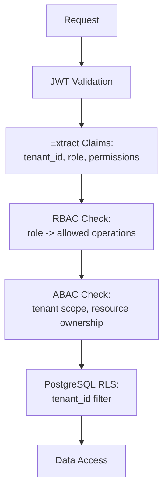

# ERP-Commerce -- Technical Specifications

## Document Control

| Field    | Value                                   |
|----------|-----------------------------------------|
| Module   | ERP-Commerce                            |
| Version  | 2.0                                     |
| Date     | 2026-02-23                              |

---

## 1. Technology Stack

### 1.1 Backend Services

| Component            | Technology         | Version    | Purpose                              |
|----------------------|-------------------|------------|--------------------------------------|
| Core Services        | Go                | 1.22+      | 10 microservices                     |
| AI/ML Services       | Python            | 3.12+      | Credit scoring, pricing, routing, demand |
| High-Performance     | Rust              | 1.75+      | EDI parser, price calculator, sync   |
| API Gateway          | Kong / Envoy      | Latest     | Routing, rate limiting, auth         |
| GraphQL              | Hasura            | 2.x        | Real-time subscriptions, queries     |
| Workflow Engine      | Temporal           | Latest     | Long-running process orchestration   |

### 1.2 Frontend

| Component            | Technology         | Version    | Purpose                              |
|----------------------|-------------------|------------|--------------------------------------|
| Web Application      | Next.js           | 14+        | SSR/SSG portal framework             |
| UI Framework         | React             | 18+        | Component rendering                  |
| Language             | TypeScript        | 5.x        | Type-safe frontend development       |
| Component Library    | Ant Design        | 5.x        | Enterprise UI components             |
| State Management     | Zustand           | 4.x        | Client state                         |
| Data Fetching        | TanStack Query    | 5.x        | Server state management              |
| Maps                 | Mapbox GL JS      | 3.x        | Interactive maps, route visualization|
| Charts               | Apache ECharts    | 5.x        | Data visualizations                  |

### 1.3 Data Layer

| Component            | Technology         | Version    | Purpose                              |
|----------------------|-------------------|------------|--------------------------------------|
| Primary Database     | PostgreSQL        | 16+        | OLTP data store                      |
| Time Series          | TimescaleDB       | Latest     | Inventory/price history              |
| Cache                | Redis             | 7.x        | Caching, sessions, rate limiting     |
| Search               | Elasticsearch     | 8.x        | Full-text product search             |
| Object Storage       | S3 (MinIO)        | Latest     | Media, EDI documents                 |
| Event Streaming      | NATS JetStream    | Latest     | Inter-service events                 |
| Message Queue        | Redpanda          | Latest     | High-throughput event streaming      |

### 1.4 Infrastructure

| Component            | Technology         | Purpose                              |
|----------------------|-------------------|--------------------------------------|
| Container Orchestration | Kubernetes (EKS/GKE) | Service deployment              |
| Service Mesh         | Istio / Linkerd   | mTLS, traffic management             |
| CI/CD                | GitHub Actions    | Build, test, deploy pipeline         |
| GitOps               | ArgoCD            | Kubernetes declarative deployments   |
| Secrets              | Vault / AWS SM    | Secret management                    |
| CDN                  | CloudFlare        | Static asset delivery, DDoS protection|

---

## 2. Performance Specifications

### 2.1 Latency Targets

```mermaid
gantt
    title API Latency Targets (p95)
    dateFormat X
    axisFormat %L ms

    section CRUD
    Standard CRUD        :0, 200
    section Pricing
    Price Calculation    :0, 50
    Bulk Pricing (100)   :0, 500
    section Orders
    Order Creation       :0, 2000
    Order Listing        :0, 300
    section Search
    Product Search       :0, 150
    section Credit
    Credit Score         :0, 30000
    section Route
    VRP (100 stops)      :0, 60000
```



### 2.2 Throughput Targets

| Operation                | Target TPS     | Burst TPS      |
|--------------------------|:-------------:|:--------------:|
| Product catalog reads    | 10,000         | 25,000         |
| Price calculations       | 5,000          | 15,000         |
| Order creation           | 1,000          | 3,000          |
| POS transactions         | 2,000          | 5,000          |
| Inventory updates        | 3,000          | 8,000          |
| Event publishing         | 20,000         | 50,000         |

### 2.3 Capacity Targets

| Metric                    | Target                  |
|---------------------------|------------------------|
| Total products/SKUs       | 10 million+            |
| Concurrent users          | 100,000+               |
| Active tenants            | 50,000+                |
| Daily orders              | 500,000+               |
| Daily POS transactions    | 1,000,000+             |
| Inventory locations       | 100,000+               |
| EDI transactions/month    | 100,000+               |

---

## 3. Service Communication Specifications

### 3.1 REST API Standards

- HTTP/2 enabled for all services
- JSON request/response bodies
- ISO 8601 timestamps in UTC
- UUID v7 for all primary keys (time-ordered)
- Pagination: cursor-based for large collections, offset-based for smaller
- Idempotency: `X-Request-ID` header for POST operations
- Versioning: URL path (`/v1/`, `/v2/`)

### 3.2 gRPC Internal Communication

- Used for high-frequency inter-service calls (pricing lookups, inventory checks)
- Protocol Buffers v3 for message serialization
- Bidirectional streaming for real-time inventory updates
- Connection pooling with health checking

### 3.3 Event Specifications

```
CloudEvents Envelope:
{
  "specversion": "1.0",
  "type": "erp.commerce.order.created",
  "source": "/erp-commerce/order-service",
  "id": "uuid-v7",
  "time": "2026-02-23T10:00:00Z",
  "datacontenttype": "application/json",
  "subject": "order-uuid",
  "data": { ... event payload ... }
}
```

- Delivery guarantee: at-least-once
- Consumer idempotency required
- Event retention: 7 days in stream
- Dead letter queue for failed processing

---

## 4. Security Specifications

### 4.1 Authentication

| Mechanism     | Usage                                    | Standard       |
|---------------|------------------------------------------|----------------|
| JWT Bearer    | All API endpoints                        | RFC 7519       |
| OIDC          | Portal authentication                    | OpenID Connect |
| API Key       | EDI/B2B partner integration              | Custom header  |
| mTLS          | Inter-service communication              | X.509          |

### 4.2 Authorization



### 4.3 Encryption

| Layer         | Algorithm    | Key Size |
|---------------|-------------|----------|
| Data at rest  | AES-256-GCM | 256-bit  |
| Data in transit | TLS 1.3   | -        |
| PII fields    | AES-256-GCM | 256-bit  |
| Payment data  | Tokenization| -        |
| Passwords     | Argon2id    | -        |

---

## 5. POS Hardware Specifications

### 5.1 Supported Hardware

| Device          | Type             | OS           | Screen     | Features                                |
|-----------------|------------------|--------------|------------|----------------------------------------|
| Sunmi V2 Pro    | Handheld         | Android 11   | 5.99"      | Built-in printer, NFC, barcode scanner |
| Sunmi T2 Mini   | Countertop       | Android 11   | 10.1"      | Customer display, printer, NFC          |
| Sunmi L2        | Handheld         | Android 9    | 5.5"       | Barcode scanner, NFC                    |
| PAX A920 Pro    | Handheld         | Android 10   | 5"         | Card reader, printer, NFC               |
| PAX A77         | Countertop       | Android 10   | 7"         | Printer, card reader                    |
| Square Terminal | Countertop       | Custom       | 5.5"       | Card reader, NFC, receipt              |
| Square Reader   | Card reader      | BLE          | -          | Tap/chip/swipe                         |
| Stripe Verifone P400 | Countertop | Custom       | 3.5"       | Card reader, NFC                       |
| Stripe WisePOS E     | Countertop | Android      | 5"         | Card reader, NFC, barcode              |

### 5.2 Peripheral Support

| Peripheral          | Protocol       | Supported Models                      |
|---------------------|---------------|---------------------------------------|
| Barcode Scanner     | USB HID, BLE  | Honeywell, Zebra, Socket Mobile       |
| Cash Drawer         | USB, RJ11     | Star, Epson, APG                      |
| Receipt Printer     | ESC/POS       | Epson TM-T88, Star TSP143, Sunmi     |
| Customer Display    | USB            | Sunmi built-in, standalone VFD        |
| Label Printer       | ZPL           | Zebra ZD420, Brother QL               |
| Scale               | USB Serial    | CAS, Ohaus                            |

---

## 6. EDI Specifications

### 6.1 X12 Transaction Sets

| Transaction Set | Name                | Direction | Usage                          |
|-----------------|---------------------|-----------|-------------------------------|
| 810             | Invoice             | Outbound  | Seller invoices buyer          |
| 832             | Price/Sales Catalog | Both      | Catalog exchange               |
| 846             | Inventory Inquiry   | Outbound  | Stock level notification       |
| 850             | Purchase Order      | Inbound   | Buyer orders from seller       |
| 855             | PO Acknowledgment   | Outbound  | Seller acknowledges PO         |
| 856             | Ship Notice (ASN)   | Outbound  | Shipment notification          |
| 860             | PO Change Request   | Inbound   | Buyer modifies PO              |
| 997             | Functional Ack      | Both      | Transaction acknowledgment     |

### 6.2 EDIFACT Message Types

| Message Type | Name              | Direction | Usage                          |
|-------------|-------------------|-----------|-------------------------------|
| ORDERS      | Purchase Order    | Inbound   | Buyer orders from seller       |
| ORDRSP      | Order Response    | Outbound  | Seller responds to PO          |
| DESADV      | Dispatch Advice   | Outbound  | Shipment notification          |
| INVOIC      | Invoice           | Outbound  | Seller invoices buyer          |
| INVRPT      | Inventory Report  | Outbound  | Stock level notification       |
| PRICAT      | Price Catalogue   | Both      | Catalog exchange               |

### 6.3 Transport Protocols

| Protocol | Usage              | Security                        |
|----------|--------------------|---------------------------------|
| AS2      | Primary            | S/MIME encryption + signing     |
| SFTP     | Fallback           | SSH key authentication          |
| HTTPS    | API-based          | TLS 1.3 + mutual authentication |
