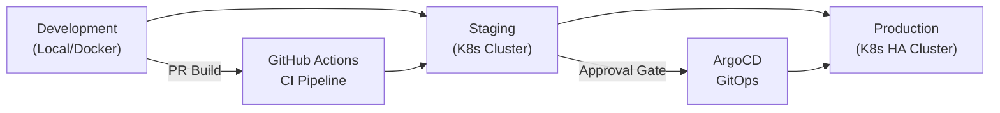
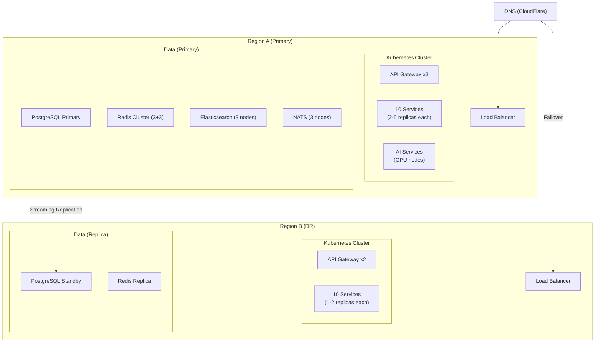
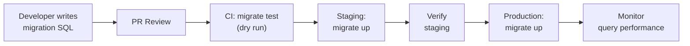

# ERP-Commerce -- Deployment Guide

## Document Control

| Field    | Value                                   |
|----------|-----------------------------------------|
| Module   | ERP-Commerce                            |
| Version  | 2.0                                     |
| Date     | 2026-02-23                              |

---

## 1. Deployment Architecture

### 1.1 Environment Strategy



| Environment   | Cluster        | Database         | Purpose                  |
|---------------|---------------|------------------|--------------------------|
| Development   | Docker Compose | PostgreSQL 16    | Local development        |
| Staging       | K8s (single)  | PostgreSQL 16    | Integration testing      |
| Production    | K8s (HA)      | PostgreSQL 16 HA | Live traffic             |

### 1.2 Production Topology



---

## 2. Container Images

### 2.1 Service Dockerfiles

All Go services use multi-stage builds for minimal image size:

```dockerfile
# Build stage
FROM golang:1.22-alpine AS builder
WORKDIR /app
COPY go.mod go.sum ./
RUN go mod download
COPY . .
RUN CGO_ENABLED=0 GOOS=linux go build -ldflags="-s -w" -o /service ./main.go

# Runtime stage
FROM gcr.io/distroless/static-debian12:nonroot
COPY --from=builder /service /service
EXPOSE 8080
USER nonroot:nonroot
ENTRYPOINT ["/service"]
```

### 2.2 Image Registry

| Registry        | Usage                            |
|-----------------|----------------------------------|
| ghcr.io         | GitHub Container Registry (primary) |
| ECR / GCR       | Cloud-native fallback            |

### 2.3 Image Tagging

```
ghcr.io/org/erp-commerce/<service>:<version>-<git-sha>
ghcr.io/org/erp-commerce/catalog-service:2.0.0-abc1234
```

---

## 3. Kubernetes Manifests

### 3.1 Namespace

```yaml
apiVersion: v1
kind: Namespace
metadata:
  name: erp-commerce
  labels:
    module: erp-commerce
    istio-injection: enabled
```

### 3.2 Service Deployment Template

```yaml
apiVersion: apps/v1
kind: Deployment
metadata:
  name: catalog-service
  namespace: erp-commerce
spec:
  replicas: 3
  selector:
    matchLabels:
      app: catalog-service
  template:
    metadata:
      labels:
        app: catalog-service
        module: erp-commerce
    spec:
      containers:
      - name: catalog-service
        image: ghcr.io/org/erp-commerce/catalog-service:latest
        ports:
        - containerPort: 8080
        env:
        - name: PORT
          value: "8080"
        - name: MODULE_NAME
          value: "ERP-Commerce"
        - name: DATABASE_URL
          valueFrom:
            secretKeyRef:
              name: erp-commerce-db
              key: url
        - name: NATS_URL
          value: "nats://nats.erp-platform:4222"
        - name: REDIS_URL
          value: "redis://redis.erp-commerce:6379"
        resources:
          requests:
            cpu: 100m
            memory: 128Mi
          limits:
            cpu: 500m
            memory: 512Mi
        livenessProbe:
          httpGet:
            path: /healthz
            port: 8080
          initialDelaySeconds: 5
          periodSeconds: 10
        readinessProbe:
          httpGet:
            path: /healthz
            port: 8080
          initialDelaySeconds: 5
          periodSeconds: 5
```

### 3.3 Horizontal Pod Autoscaler

```yaml
apiVersion: autoscaling/v2
kind: HorizontalPodAutoscaler
metadata:
  name: catalog-service-hpa
  namespace: erp-commerce
spec:
  scaleTargetRef:
    apiVersion: apps/v1
    kind: Deployment
    name: catalog-service
  minReplicas: 2
  maxReplicas: 10
  metrics:
  - type: Resource
    resource:
      name: cpu
      target:
        type: Utilization
        averageUtilization: 70
  - type: Resource
    resource:
      name: memory
      target:
        type: Utilization
        averageUtilization: 80
```

---

## 4. Database Deployment

### 4.1 PostgreSQL Configuration

```yaml
# Production PostgreSQL settings
max_connections: 200
shared_buffers: 4GB
effective_cache_size: 12GB
work_mem: 64MB
maintenance_work_mem: 1GB
random_page_cost: 1.1
effective_io_concurrency: 200
wal_level: replica
max_wal_senders: 10
max_replication_slots: 10
hot_standby: on
```

### 4.2 Migration Strategy



Migrations are managed using `golang-migrate` with numbered SQL files in each service's `migrations/` directory. All migrations are forward-only in production; rollback requires a new forward migration.

---

## 5. Configuration Management

### 5.1 Environment Variables

| Variable            | Service     | Description                         |
|---------------------|-------------|-------------------------------------|
| `PORT`              | All         | HTTP listen port (default: 8080)    |
| `MODULE_NAME`       | All         | Module identifier                   |
| `DATABASE_URL`      | All         | PostgreSQL connection string        |
| `REDIS_URL`         | All         | Redis connection string             |
| `NATS_URL`          | All         | NATS connection string              |
| `ES_URL`            | catalog     | Elasticsearch URL                   |
| `S3_ENDPOINT`       | catalog     | Object storage endpoint             |
| `IAM_JWKS_URL`      | All         | ERP-IAM JWKS endpoint               |
| `PLATFORM_URL`      | All         | ERP-Platform entitlement endpoint   |
| `STRIPE_SECRET`     | pos         | Stripe Terminal API key             |
| `MAPS_API_KEY`      | logistics   | Maps API key for geocoding/routing  |

### 5.2 Secrets Management

All secrets stored in HashiCorp Vault or AWS Secrets Manager, injected via Kubernetes External Secrets Operator.

---

## 6. CI/CD Pipeline

```mermaid
flowchart LR
    PUSH["Git Push"] --> LINT["Lint & Format"]
    LINT --> TEST["Unit Tests"]
    TEST --> BUILD["Build Images"]
    BUILD --> SCAN["Security Scan<br/>(Trivy)"]
    SCAN --> PUSH_IMG["Push to Registry"]
    PUSH_IMG --> DEPLOY_STG["Deploy Staging<br/>(ArgoCD)"]
    DEPLOY_STG --> INT_TEST["Integration Tests"]
    INT_TEST --> APPROVE["Manual Approval"]
    APPROVE --> DEPLOY_PROD["Deploy Production<br/>(ArgoCD + Canary)"]
    DEPLOY_PROD --> SMOKE["Smoke Tests"]
    SMOKE --> MONITOR["Monitor Metrics"]
```



### 6.1 Canary Deployment

Production deployments use canary strategy:
1. 5% traffic routed to new version
2. Monitor error rate and latency for 10 minutes
3. If healthy, roll to 25%, then 50%, then 100%
4. If unhealthy, automatic rollback to previous version

---

## 7. Monitoring and Alerting

### 7.1 Health Checks

Each service exposes `/healthz` returning:
```json
{
  "status": "healthy",
  "module": "ERP-Commerce",
  "service": "<service-name>",
  "version": "2.0.0",
  "uptime_seconds": 86400,
  "checks": {
    "database": "ok",
    "redis": "ok",
    "nats": "ok"
  }
}
```

### 7.2 Alert Rules

| Alert                          | Condition                       | Severity  |
|--------------------------------|---------------------------------|-----------|
| Service Down                   | healthz fails > 30s            | Critical  |
| High Error Rate                | 5xx rate > 1%                  | Critical  |
| High Latency                   | p95 > 500ms                    | Warning   |
| Database Connection Pool Full  | pool usage > 90%               | Warning   |
| Disk Usage High                | > 80%                          | Warning   |
| POS Offline Queue Growing      | queue size > 1000              | Warning   |
| Credit Exposure Threshold      | utilization > 90%              | Info      |
