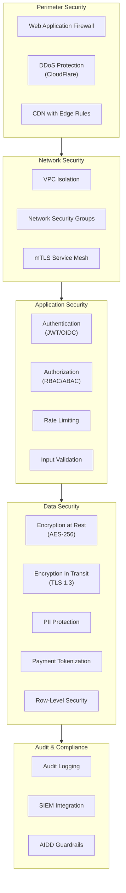
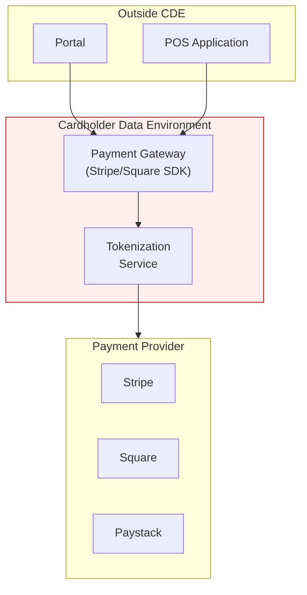
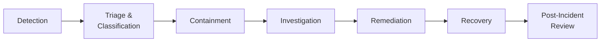

# ERP-Commerce -- Security Architecture Document

## Document Control

| Field    | Value                                   |
|----------|-----------------------------------------|
| Module   | ERP-Commerce                            |
| Version  | 2.0                                     |
| Date     | 2026-02-23                              |

---

## 1. Security Architecture Overview



---

## 2. Authentication

### 2.1 Identity Management

All authentication is delegated to ERP-IAM, which provides:

- OIDC-compliant authentication flows
- JWT token issuance with RS256 signing
- Multi-factor authentication (MFA) enforcement
- Session management with configurable timeouts

### 2.2 JWT Token Structure

```json
{
  "iss": "https://iam.erp-platform.com",
  "sub": "user-uuid",
  "aud": "erp-commerce",
  "exp": 1709200000,
  "iat": 1709100000,
  "tenant_id": "tenant-uuid",
  "roles": ["distributor_admin"],
  "permissions": [
    "commerce.order.create",
    "commerce.order.read",
    "commerce.inventory.read",
    "commerce.pricing.read"
  ],
  "portal_access": ["distributor"]
}
```

### 2.3 API Key Authentication (EDI/B2B)

For EDI partners and B2B API integrations:
- API keys issued per partner with scope restrictions
- Keys rotated every 90 days
- Rate limits applied per key
- IP whitelisting optional

---

## 3. Authorization

### 3.1 Role-Based Access Control (RBAC)

```mermaid
flowchart TD
    subgraph Roles
        R1["manufacturer_admin"]
        R2["distributor_admin"]
        R3["wholesaler_user"]
        R4["retailer_user"]
        R5["warehouse_operator"]
        R6["driver"]
        R7["field_sales"]
        R8["agent"]
        R9["brand_manager"]
        R10["merchandiser"]
        R11["trade_marketing"]
        R12["credit_officer"]
        R13["platform_admin"]
    end

    subgraph Permissions
        P_CAT["commerce.catalog.*"]
        P_ORD["commerce.order.*"]
        P_PRC["commerce.pricing.*"]
        P_INV["commerce.inventory.*"]
        P_CRD["commerce.credit.*"]
        P_DST["commerce.distribution.*"]
        P_POS["commerce.pos.*"]
        P_LOG["commerce.logistics.*"]
        P_MKT["commerce.marketplace.*"]
    end

    R1 --> P_CAT
    R1 --> P_PRC
    R2 --> P_ORD
    R2 --> P_INV
    R2 --> P_DST
    R4 --> P_POS
    R6 --> P_LOG
    R12 --> P_CRD
    R13 --> Permissions
```



### 3.2 Permission Matrix (Partial)

| Permission                    | Mfg Admin | Dist Admin | Retailer | Driver | Credit Officer |
|-------------------------------|:---------:|:----------:|:--------:|:------:|:--------------:|
| commerce.catalog.create       | Yes       | No         | No       | No     | No             |
| commerce.catalog.read         | Yes       | Yes        | Yes      | No     | No             |
| commerce.order.create         | No        | Yes        | Yes      | No     | No             |
| commerce.order.approve        | No        | Yes        | No       | No     | No             |
| commerce.pricing.manage       | Yes       | No         | No       | No     | No             |
| commerce.inventory.manage     | No        | Yes        | No       | No     | No             |
| commerce.credit.score         | No        | No         | No       | No     | Yes            |
| commerce.credit.adjust        | No        | No         | No       | No     | Yes            |
| commerce.pos.transact         | No        | No         | Yes      | No     | No             |
| commerce.logistics.pod        | No        | No         | No       | Yes    | No             |

### 3.3 Tenant Isolation

Every data access is scoped by `tenant_id` using PostgreSQL Row-Level Security:

```sql
ALTER TABLE orders ENABLE ROW LEVEL SECURITY;

CREATE POLICY tenant_isolation ON orders
    USING (tenant_id = current_setting('app.tenant_id')::UUID);
```

---

## 4. Data Protection

### 4.1 PII Classification

| Data Field          | Classification | Protection                     |
|--------------------|----------------|-------------------------------|
| Customer Name       | PII            | Encrypted at rest             |
| Email Address       | PII            | Encrypted at rest             |
| Phone Number        | PII            | Encrypted at rest             |
| Physical Address    | PII            | Encrypted at rest             |
| Payment Card Number | PCI            | Tokenized (never stored)      |
| Bank Account        | Sensitive      | Encrypted at rest             |
| Credit Score        | Sensitive      | Access-controlled             |
| KYC Documents       | Sensitive      | Encrypted, access-controlled  |

### 4.2 Encryption Specifications

| Context          | Algorithm      | Key Management          |
|------------------|---------------|------------------------|
| Database at rest | AES-256-GCM   | AWS KMS / Vault        |
| PII columns      | AES-256-GCM   | Application-level keys |
| TLS              | TLS 1.3       | Certificate Manager     |
| mTLS             | X.509         | Istio/Linkerd CA        |
| Backups          | AES-256       | Separate key set        |

---

## 5. Payment Security (PCI-DSS)

### 5.1 Cardholder Data Environment (CDE)



- Card data is never stored in ERP-Commerce databases
- All card processing handled by PCI-compliant payment providers
- Tokenized references stored for recurring payments
- PCI-DSS SAQ-A compliance (outsourced card processing)

---

## 6. AIDD Guardrails

Per `erp/aidd.guardrails.yaml`, the following controls are enforced for AI-driven actions:

| Action Category      | Policy                                  |
|----------------------|-----------------------------------------|
| Autonomous Actions   | Read-only queries, low-risk notifications |
| Supervised Actions   | Data mutations, workflow automation, bulk operations |
| Prohibited Actions   | Cross-tenant data access, irreversible delete without backup, privilege escalation |

Controls:
- Human-in-the-loop required for high-risk operations
- All AI decisions logged with full audit trail
- 24-hour rollback window for supervised actions

---

## 7. Audit and Compliance

### 7.1 Audit Trail

Every state-changing operation is logged:

```json
{
  "id": "audit-uuid",
  "tenant_id": "tenant-uuid",
  "actor_id": "user-uuid",
  "action": "commerce.order.approve",
  "resource_type": "order",
  "resource_id": "order-uuid",
  "old_value": { "status": "pending_approval" },
  "new_value": { "status": "approved" },
  "ip_address": "192.168.1.100",
  "timestamp": "2026-02-23T10:00:00Z"
}
```

### 7.2 Compliance Standards

| Standard    | Scope                              | Status    |
|-------------|------------------------------------|-----------|
| PCI-DSS     | Payment processing                 | Required  |
| SOC 2 Type II | Overall platform security        | Targeted  |
| GDPR        | EU customer data                   | Required  |
| NDPA 2023   | Nigerian customer data             | Required  |
| ISO 27001   | Information security management    | Targeted  |

---

## 8. Incident Response

### 8.1 Security Incident Classification

| Severity    | Description                           | Response Time  |
|-------------|---------------------------------------|----------------|
| Critical    | Data breach, active exploitation      | 15 minutes     |
| High        | Unauthorized access, privilege esc    | 1 hour         |
| Medium      | Suspicious activity, policy violation | 4 hours        |
| Low         | Minor misconfiguration, false alarm   | 24 hours       |

### 8.2 Response Workflow


