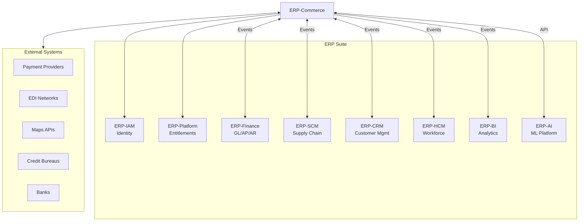
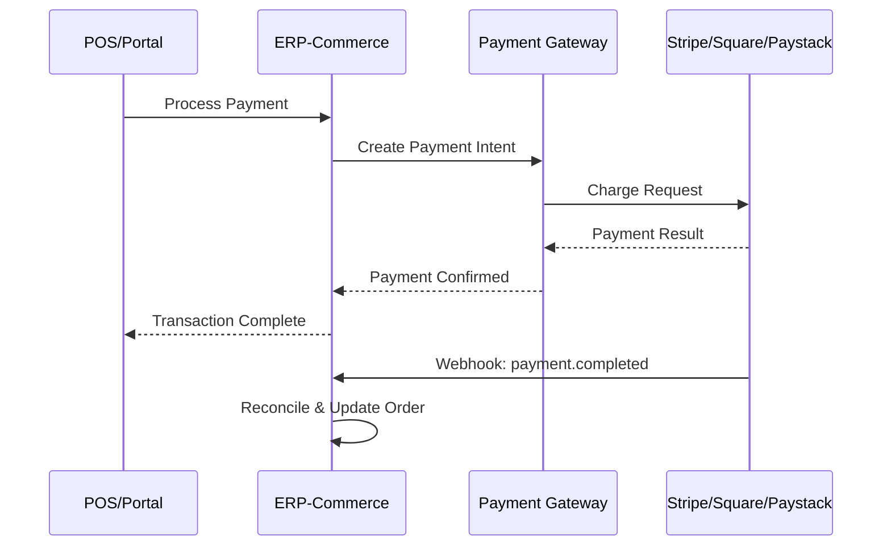
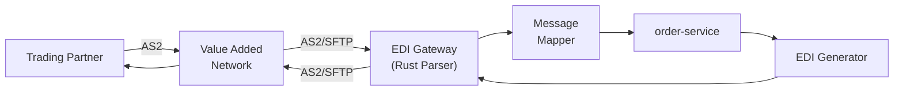

# ERP-Commerce -- Integration Guide

## Document Control

| Field    | Value                                   |
|----------|-----------------------------------------|
| Module   | ERP-Commerce                            |
| Version  | 2.0                                     |
| Date     | 2026-02-23                              |

---

## 1. Integration Overview

ERP-Commerce operates in both standalone and suite-integrated modes. In suite mode, it integrates with other ERP modules through the ERP-Platform control plane, ERP-IAM for identity, and the NATS/Pulsar event backbone.



---

## 2. ERP Suite Integrations

### 2.1 ERP-IAM Integration

| Aspect         | Detail                                          |
|----------------|-------------------------------------------------|
| Protocol       | OIDC / JWT (RS256)                              |
| Direction      | ERP-Commerce consumes ERP-IAM                   |
| Purpose        | Authentication, role management, tenant context  |
| Configuration  | `IAM_JWKS_URL` environment variable              |

**Flow**: All API requests carry a JWT issued by ERP-IAM. The ERP-Commerce gateway validates the token against the JWKS endpoint, extracts claims (tenant_id, roles, permissions), and propagates the context to downstream services.

### 2.2 ERP-Platform Integration

| Aspect         | Detail                                          |
|----------------|-------------------------------------------------|
| Protocol       | REST API                                        |
| Direction      | ERP-Commerce calls ERP-Platform                 |
| Purpose        | Feature entitlement, subscription validation     |
| Endpoint       | `GET /v1/entitlements/{tenant_id}/erp.commerce`  |

**Flow**: On tenant login and periodically, ERP-Commerce queries ERP-Platform to determine which capabilities are enabled (trade_network, order_orchestration, trade_credit, rtm, offline_pos, marketplace).

### 2.3 ERP-Finance Integration

| Aspect         | Detail                                           |
|----------------|--------------------------------------------------|
| Protocol       | Events (NATS/Pulsar)                             |
| Direction      | Bidirectional                                    |
| Purpose        | Journal entries, invoicing, payment reconciliation|

**Events Published by ERP-Commerce**:

| Event                              | Trigger                         | Data                          |
|------------------------------------|---------------------------------|-------------------------------|
| `erp.commerce.order.invoiced`      | Invoice generated               | Invoice details, line items   |
| `erp.commerce.pos.settled`         | POS shift closed                | Shift summary, totals         |
| `erp.commerce.credit.payment`      | Credit payment received         | Payment amount, account       |
| `erp.commerce.marketplace.payout`  | Vendor payout processed         | Vendor, amount, commission    |

**Events Consumed from ERP-Finance**:

| Event                              | Action in ERP-Commerce          |
|------------------------------------|---------------------------------|
| `erp.finance.payment.confirmed`    | Update order payment status     |
| `erp.finance.invoice.overdue`      | Trigger collections workflow    |

### 2.4 ERP-SCM Integration

| Aspect         | Detail                                           |
|----------------|--------------------------------------------------|
| Protocol       | Events (NATS/Pulsar)                             |
| Direction      | Bidirectional                                    |
| Purpose        | Purchase orders, supplier management, receiving   |

**Events Published**:
- `erp.commerce.inventory.reorder_triggered` -- When stock drops below reorder point
- `erp.commerce.order.procurement_needed` -- When fulfillment requires procurement

**Events Consumed**:
- `erp.scm.purchase_order.received` -- Update inventory on goods receipt
- `erp.scm.supplier.updated` -- Update vendor/supplier profiles

### 2.5 ERP-CRM Integration

| Aspect         | Detail                                           |
|----------------|--------------------------------------------------|
| Protocol       | Events (NATS/Pulsar)                             |
| Direction      | Bidirectional                                    |
| Purpose        | Customer profile sync, activity tracking          |

**Events Published**:
- `erp.commerce.order.created` -- New order for customer activity
- `erp.commerce.credit.scored` -- Credit score for customer profile
- `erp.commerce.marketplace.vendor.onboarded` -- New marketplace participant

**Events Consumed**:
- `erp.crm.customer.updated` -- Update customer details in commerce
- `erp.crm.segment.changed` -- Update pricing tier assignments

---

## 3. External System Integrations

### 3.1 Payment Provider Integration



**Supported Providers**:

| Provider    | Methods                              | Regions              |
|-------------|--------------------------------------|---------------------|
| Stripe      | Card, Terminal, Apple Pay, Google Pay | Global              |
| Square      | Card, Terminal, Cash App             | US, UK, AU, CA, JP  |
| Paystack    | Card, Bank Transfer, Mobile Money    | Nigeria, Ghana, SA  |
| Flutterwave | Card, Bank, Mobile Money, USSD      | Africa              |
| M-Pesa      | Mobile Money                         | Kenya, Tanzania     |

### 3.2 EDI Network Integration



### 3.3 Maps and Geocoding

| Provider      | API              | Usage                          |
|---------------|-----------------|-------------------------------|
| Google Maps   | Geocoding API    | Address validation             |
| Google Maps   | Distance Matrix  | Delivery time estimation       |
| Google Maps   | Directions API   | Turn-by-turn navigation        |
| HERE          | Routing API      | VRP distance matrix fallback   |
| Mapbox        | Geocoding        | Map display and interaction    |

### 3.4 Credit Bureau Integration

| Bureau          | Region      | Data Provided                    |
|-----------------|-------------|----------------------------------|
| CreditRegistry  | Nigeria     | Business credit reports          |
| TransUnion      | Kenya, SA   | Consumer credit scores           |
| Experian        | Global      | Business and consumer credit     |

---

## 4. Webhook Configuration

### 4.1 Outbound Webhooks

ERP-Commerce can send webhooks to external systems on key events:

```json
{
  "webhook_url": "https://partner.example.com/webhook",
  "events": [
    "order.created",
    "order.shipped",
    "order.delivered",
    "inventory.low_stock",
    "credit.decision"
  ],
  "secret": "hmac-secret-for-signature",
  "retry_policy": {
    "max_retries": 5,
    "backoff": "exponential",
    "initial_delay_ms": 1000
  }
}
```

### 4.2 Webhook Signature Verification

All outbound webhooks include HMAC-SHA256 signature:

```
X-Webhook-Signature: sha256=<hmac-hex>
X-Webhook-Timestamp: 1709100000
X-Webhook-ID: wh_uuid
```

---

## 5. SDK and Client Libraries

| Language     | Package                           | Status      |
|-------------|-----------------------------------|-------------|
| JavaScript  | `@erp/commerce-sdk`              | Available   |
| Python      | `erp-commerce-sdk`               | Available   |
| Go          | `github.com/org/erp-commerce-go` | Available   |
| Java        | `com.erp.commerce.sdk`           | Planned     |
