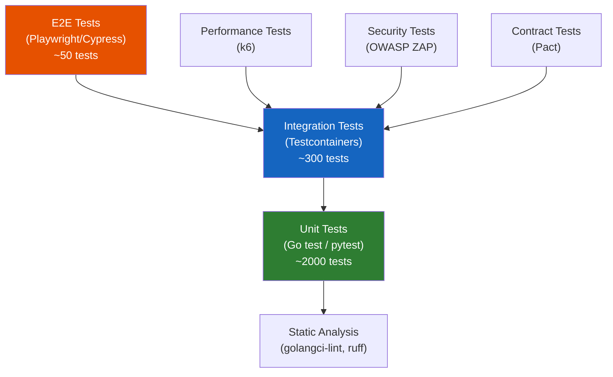
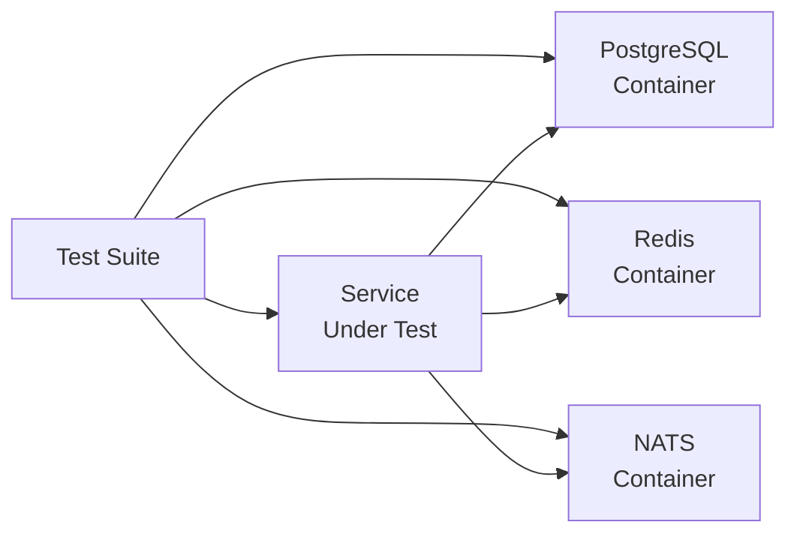
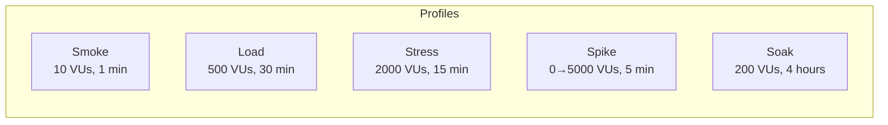

# ERP-Commerce -- Testing Strategy

## Document Control

| Field    | Value                                   |
|----------|-----------------------------------------|
| Module   | ERP-Commerce                            |
| Version  | 2.0                                     |
| Date     | 2026-02-23                              |

---

## 1. Testing Pyramid

---

## 2. Unit Testing

### 2.1 Go Services

| Framework  | Coverage Target | Approach                               |
|------------|:--------------:|----------------------------------------|
| `testing`  | 80%+           | Table-driven tests                     |
| `testify`  | -              | Assertions and mocking                 |
| `mockgen`  | -              | Interface mock generation              |

**Key Testing Areas**:
- Domain logic (pricing calculations, credit scoring rules, order state machine)
- HTTP handlers (request validation, response formatting)
- Event publishing (correct event topic and payload)
- Business rule evaluation (MOQ policy, credit limits)

### 2.2 Python AI/ML Services

| Framework  | Coverage Target | Approach                               |
|------------|:--------------:|----------------------------------------|
| `pytest`   | 85%+           | Parameterized tests                    |
| `hypothesis`| -             | Property-based testing for pricing     |

**Key Testing Areas**:
- Credit scoring model accuracy (precision, recall, F1)
- Pricing optimization convergence
- VRP solver optimality bounds
- Demand forecast MAPE targets

### 2.3 Rust Components

| Framework  | Coverage Target | Approach                               |
|------------|:--------------:|----------------------------------------|
| `cargo test`| 90%+          | Built-in test framework                |
| `proptest` | -              | Property-based testing for EDI parsing |

---

## 3. Integration Testing

### 3.1 Service Integration Tests

Using Testcontainers to spin up real PostgreSQL, Redis, NATS, and Elasticsearch instances:

**Test Scenarios**:
- Full order lifecycle (create, validate, allocate, fulfill, deliver, settle)
- Pricing waterfall calculation with all rule types
- Inventory reservation and release flows
- Trade credit scoring and limit enforcement
- POS offline sync and conflict resolution
- EDI message round-trip (parse, process, generate)

### 3.2 Contract Testing

Using Pact for consumer-driven contract testing between services:

| Consumer         | Provider           | Contract                              |
|------------------|--------------------|---------------------------------------|
| order-service    | pricing-service    | Price calculation request/response    |
| order-service    | inventory-service  | Stock reservation request/response    |
| order-service    | trade-credit-svc   | Credit check request/response         |
| portal-service   | all services       | Dashboard data contracts              |
| pos-service      | pricing-service    | POS pricing request/response          |

---

## 4. End-to-End Testing

### 4.1 Critical User Journeys

| Journey                          | Priority | Automated |
|----------------------------------|:--------:|:---------:|
| Retailer places order via portal | P0       | Yes       |
| POS checkout (online mode)       | P0       | Yes       |
| POS checkout (offline + sync)    | P0       | Yes       |
| Manufacturer publishes catalog   | P0       | Yes       |
| Distributor fulfills order       | P0       | Yes       |
| Trade credit application         | P0       | Yes       |
| Van sales offline order capture  | P1       | Yes       |
| B2B marketplace vendor onboarding| P1       | Yes       |
| EDI order exchange               | P1       | Yes       |
| Route optimization + delivery    | P1       | Partial   |

---

## 5. Performance Testing

### 5.1 Load Test Profiles

### 5.2 Performance Targets

| Endpoint                     | Target p95 | Target p99 | Max Error Rate |
|------------------------------|:----------:|:----------:|:--------------:|
| GET /v1/catalog              | 100ms      | 200ms      | 0.1%           |
| POST /v1/order               | 1500ms     | 3000ms     | 0.5%           |
| POST /v1/pricing/calculate   | 30ms       | 50ms       | 0.1%           |
| POST /v1/pos/transaction     | 2000ms     | 4000ms     | 0.1%           |
| POST /v1/logistics/optimize  | 30s        | 60s        | 1%             |

---

## 6. Security Testing

| Test Type            | Tool           | Frequency  |
|----------------------|---------------|------------|
| DAST                 | OWASP ZAP     | Weekly     |
| SAST                 | CodeQL        | Every PR   |
| Container Scan       | Trivy         | Every build|
| Dependency Audit     | Snyk / govulncheck | Daily |
| Penetration Testing  | External firm | Quarterly  |
| PCI Compliance Scan  | Approved vendor| Quarterly |

---

## 7. Test Data Management

### 7.1 Seed Data

Each test environment is seeded with realistic trade data:
- 5 manufacturer tenants, 20 distributor tenants, 100 retailer tenants
- 10,000 products across 50 categories
- 500 active orders in various stages
- Credit accounts with payment history
- 30 delivery routes with GPS tracks
- 10 marketplace vendors with ratings

### 7.2 Data Privacy

- No production data used in testing
- PII fields generated using Faker libraries
- Credit card numbers use Stripe test tokens
- All test data is ephemeral (destroyed after test run)
