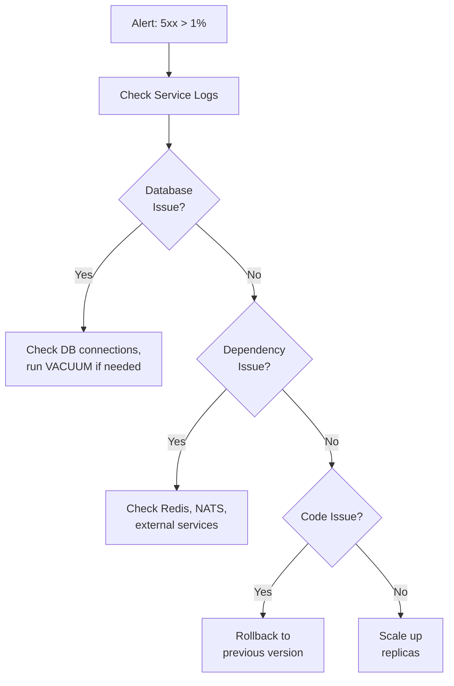

# ERP-Commerce -- DevOps Runbook

## Document Control

| Field    | Value                                   |
|----------|-----------------------------------------|
| Module   | ERP-Commerce                            |
| Version  | 2.0                                     |
| Date     | 2026-02-23                              |

---

## 1. Service Health Checks

### 1.1 Quick Health Verification

```bash
# Check all services
for svc in catalog order pricing inventory trade-credit distribution pos portal logistics marketplace; do
  curl -s http://${svc}-service:8080/healthz | jq .
done
```

### 1.2 Health Status Interpretation

| Status    | Meaning                                | Action Required          |
|-----------|----------------------------------------|--------------------------|
| healthy   | All dependencies connected             | None                     |
| degraded  | Partial dependency failure             | Investigate dependency   |
| unhealthy | Critical dependency failure            | Immediate investigation  |

---

## 2. Common Operational Procedures

### 2.1 Service Restart

```bash
# Restart a specific service
kubectl rollout restart deployment/<service-name> -n erp-commerce

# Verify rollout
kubectl rollout status deployment/<service-name> -n erp-commerce
```

### 2.2 Scale Service

```bash
# Scale up for high traffic
kubectl scale deployment/pricing-service --replicas=10 -n erp-commerce

# Scale down
kubectl scale deployment/pricing-service --replicas=3 -n erp-commerce
```

### 2.3 Database Migration

```bash
# Run pending migrations
kubectl exec -it deploy/<service-name> -n erp-commerce -- /service migrate up

# Check migration status
kubectl exec -it deploy/<service-name> -n erp-commerce -- /service migrate status
```

---

## 3. Incident Response Procedures

### 3.1 High Error Rate



### 3.2 POS Offline Queue Buildup

1. Check POS terminal connectivity: `GET /v1/pos/terminals?status=offline`
2. Check sync service health: `GET /healthz` on pos-service
3. Check queue depth: monitor `pos_sync_queue_depth` metric
4. If API-side issue: restart pos-service
5. If network issue: verify terminal network configuration
6. If persistent: trigger manual sync batch

### 3.3 Trade Credit System Failure

1. Check trade-credit-service health and logs
2. Verify credit-scoring AI service (Python) is responding
3. If AI service down: orders will queue for manual credit review
4. Notify credit operations team
5. Restart AI service if needed
6. Process queued credit decisions

---

## 4. Database Operations

### 4.1 Connection Pool Monitoring

```sql
-- Check active connections
SELECT count(*) FROM pg_stat_activity WHERE datname = 'erp_commerce';

-- Kill idle connections older than 10 minutes
SELECT pg_terminate_backend(pid)
FROM pg_stat_activity
WHERE datname = 'erp_commerce'
  AND state = 'idle'
  AND state_change < NOW() - INTERVAL '10 minutes';
```

### 4.2 Table Bloat Management

```sql
-- Check table sizes
SELECT schemaname, relname, pg_size_pretty(pg_total_relation_size(relid))
FROM pg_catalog.pg_statio_user_tables
ORDER BY pg_total_relation_size(relid) DESC
LIMIT 20;

-- Vacuum analyze high-traffic tables
VACUUM ANALYZE orders;
VACUUM ANALYZE pos_transactions;
VACUUM ANALYZE inventory_stock;
```

### 4.3 Backup and Restore

```bash
# Verify backup status
kubectl exec -it pg-primary-0 -n erp-data -- pg_basebackup --checkpoint=fast

# Point-in-time recovery
kubectl exec -it pg-primary-0 -n erp-data -- \
  psql -c "SELECT pg_create_restore_point('pre-deploy-2026-02-23');"
```

---

## 5. Event System Operations

### 5.1 NATS Monitoring

```bash
# Check stream status
nats stream info commerce-events

# Check consumer lag
nats consumer info commerce-events order-service-consumer

# Purge dead letter queue
nats stream purge commerce-events-dlq --force
```

### 5.2 Event Replay

```bash
# Replay events from specific time
nats consumer add commerce-events replay-consumer \
  --deliver=by-start-time \
  --start-time="2026-02-23T08:00:00Z"
```

---

## 6. Key Metrics to Monitor

| Metric                           | Warning Threshold | Critical Threshold |
|----------------------------------|:-----------------:|:------------------:|
| API error rate (5xx)             | > 0.5%            | > 1%               |
| API latency (p95)               | > 300ms           | > 500ms            |
| Database connection pool usage   | > 70%             | > 90%              |
| Redis memory usage               | > 70%             | > 85%              |
| POS offline queue depth          | > 500             | > 2000             |
| NATS consumer lag                | > 10,000          | > 50,000           |
| Credit scoring latency           | > 30s             | > 60s              |
| Disk usage                       | > 75%             | > 90%              |
| Certificate expiry               | < 30 days         | < 7 days           |

---

## 7. Escalation Matrix

| Level | Response Time | Who                          | Criteria                    |
|-------|:------------:|------------------------------|----------------------------|
| L1    | 15 min       | On-call engineer             | Service degradation         |
| L2    | 30 min       | Service team lead            | Service outage              |
| L3    | 1 hour       | Engineering manager          | Multi-service outage        |
| L4    | 2 hours      | VP Engineering + CTO         | Platform-wide outage        |
