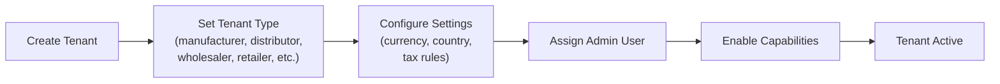

# ERP-Commerce -- Administrator Manual

## Document Control

| Field    | Value                                   |
|----------|-----------------------------------------|
| Module   | ERP-Commerce                            |
| Version  | 2.0                                     |
| Date     | 2026-02-23                              |

---

## 1. Administration Overview

The ERP-Commerce platform administrator manages tenant configuration, user access, system settings, marketplace governance, and operational monitoring across the multi-party trade platform.

### 1.1 Admin Portal Access

Administrators access the platform via the Platform Admin Portal at `https://admin.erp-commerce.example.com`. Authentication is handled through ERP-IAM with mandatory MFA for admin accounts.

---

## 2. Tenant Management

### 2.1 Creating a New Tenant

1. Navigate to **Tenants > Create New Tenant**
2. Enter tenant information: name, type, country, currency
3. Configure default settings (tax rules, payment methods, default terms)
4. Create initial admin user for the tenant
5. Select entitlement tier (determines available capabilities)
6. Review and activate tenant

### 2.2 Tenant Types and Capabilities

| Tenant Type     | Available Capabilities                                        |
|-----------------|--------------------------------------------------------------|
| Manufacturer    | Catalog, Pricing, Distribution Analytics, Brand Management   |
| Distributor     | Orders, Inventory, Distribution, Van Sales, Fleet            |
| Wholesaler      | Orders, Catalog Browse, Credit, Inventory                    |
| Retailer        | POS, Orders, Credit, Catalog Browse                          |
| Supermarket     | POS, Promotions, Planogram, Inventory, Analytics             |
| Logistics       | Delivery, Routes, Fleet, GPS Tracking                        |
| Marketplace Vendor | Vendor Store, Product Listing, Commission Tracking        |

### 2.3 Tenant Relationships

Administrators configure relationships between tenants to establish the trade network:
- Manufacturer-to-Distributor authorizations
- Distributor-to-Wholesaler agreements
- Wholesaler-to-Retailer coverage
- 3PL assignments

---

## 3. User and Role Management

### 3.1 Creating Users

1. Navigate to **Users > Create User**
2. Enter user details (name, email, phone)
3. Assign to tenant
4. Assign role (one of the 13 defined roles)
5. Set portal access permissions
6. Enable MFA if required by policy

### 3.2 Role Descriptions

| Role             | Portal Access      | Key Permissions                          |
|------------------|--------------------|------------------------------------------|
| Platform Admin   | Admin Portal       | Full system access                       |
| Manufacturer Admin| Manufacturer Portal| Catalog, pricing, distribution mgmt     |
| Distributor Admin| Distributor Portal | Orders, inventory, routes, customers     |
| Wholesaler User  | Wholesaler Portal  | Ordering, credit management              |
| Retailer User    | Retailer Portal    | POS, ordering, credit view               |
| Warehouse Operator| Warehouse Portal  | Pick/pack/ship, inventory                |
| Driver           | Driver App         | Deliveries, navigation, POD              |
| Field Sales      | Field Sales App    | Territory visits, order capture          |
| Agent            | Agent Portal       | Customer acquisition, commissions        |
| Brand Manager    | Brand Manager Portal| Analytics, pricing oversight            |
| Merchandiser     | Merchandiser App   | Shelf audits, planogram compliance       |
| Trade Marketing  | Trade Marketing Portal| Campaigns, promotions                 |
| Credit Officer   | Credit Manager     | Credit scoring, limits, collections      |

---

## 4. System Configuration

### 4.1 Pricing Configuration

1. Navigate to **Configuration > Pricing Rules**
2. Configure trade level markup/discount defaults
3. Set volume discount tier templates
4. Configure tax rates by country/region
5. Enable/disable dynamic pricing features

### 4.2 Inventory Configuration

1. Navigate to **Configuration > Inventory**
2. Set default valuation method (FIFO/LIFO/WAC)
3. Configure reorder point calculation method
4. Set safety stock policies
5. Enable/disable consignment inventory

### 4.3 Credit Configuration

1. Navigate to **Configuration > Trade Credit**
2. Set credit scoring model parameters
3. Configure payment term options (Net 30/60/90)
4. Set auto-approval thresholds
5. Configure collections escalation rules
6. Set credit insurance thresholds

---

## 5. Marketplace Administration

### 5.1 Vendor Approval Queue

1. Navigate to **Marketplace > Vendor Applications**
2. Review pending vendor applications
3. Verify KYC/KYB documents
4. Approve or reject with reason
5. Set commission rate for approved vendors

### 5.2 Dispute Management

1. Navigate to **Marketplace > Disputes**
2. Review open disputes
3. View evidence from both parties
4. Make arbitration decision
5. Apply resolution (refund, replacement, dismiss)

---

## 6. Monitoring Dashboard

### 6.1 System Health

The admin dashboard provides real-time visibility into:
- Service health status (all 10 microservices)
- API latency and error rates
- Database connection pool usage
- Event queue depth and consumer lag
- POS terminal online/offline status
- Active user sessions

### 6.2 Business Metrics

- Total GMV (daily, weekly, monthly)
- Order volume by channel and type
- Credit utilization across portfolio
- Marketplace commission revenue
- Delivery SLA compliance
- Platform adoption by tenant type
