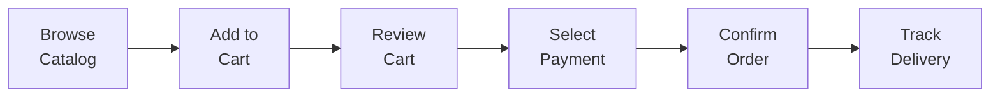

# ERP-Commerce -- End User Manual

## Document Control

| Field    | Value                                   |
|----------|-----------------------------------------|
| Module   | ERP-Commerce                            |
| Version  | 2.0                                     |
| Date     | 2026-02-23                              |

---

## 1. Getting Started

### 1.1 Logging In

1. Open your portal URL (provided by your organization's administrator)
2. Enter your email address and password
3. Complete MFA verification if prompted
4. You will be directed to your role-specific dashboard

### 1.2 Portal Navigation

Each portal includes:
- **Left Sidebar**: Primary navigation menu with icons and labels
- **Top Bar**: Search, notifications, and profile menu
- **Main Content Area**: Context-specific content based on selected navigation
- **Quick Actions**: Floating action button for common tasks

---

## 2. Retailer Guide

### 2.1 Placing an Order

1. Navigate to **Order > Browse Catalog**
2. Use categories or search to find products
3. Click product for details (price, availability, MOQ)
4. Set quantity and click **Add to Cart**
5. Review cart (adjust quantities, remove items)
6. Select payment method (credit account or cash on delivery)
7. Confirm delivery address and preferred date
8. Click **Place Order**
9. Track order status in **Orders > My Orders**

### 2.2 Using the POS

1. Open POS application on your terminal
2. **Open Shift**: Enter opening cash amount
3. **Scan Items**: Use barcode scanner or search by name
4. **Adjust Quantities**: Use +/- buttons on line items
5. **Apply Discounts**: Click discount icon and enter amount/percentage
6. **Process Payment**: Select payment method and complete
7. **Print Receipt**: Automatic printing or click **Print**
8. **Close Shift**: End of day, enter closing cash, review variance

### 2.3 Checking Credit Status

1. Navigate to **Credit > My Account**
2. View available credit, current balance, and payment terms
3. See upcoming payment due dates
4. View transaction history
5. Make payment through available payment methods

---

## 3. Distributor Guide

### 3.1 Processing Orders

1. Navigate to **Orders > Incoming Orders**
2. Review new orders in the queue
3. Click order to see full details
4. **Approve**: Click **Approve** to confirm the order
5. **Reject**: Click **Reject** with a reason if needed
6. Approved orders move to warehouse for fulfillment

### 3.2 Managing Inventory

1. Navigate to **Inventory > Stock Levels**
2. View stock across all warehouse locations
3. Filter by product, category, location, or status
4. Click product row for lot/serial details
5. **Transfer**: Move stock between locations
6. **Adjust**: Correct stock levels with reason code
7. **Alerts**: Review low-stock and expiry alerts

### 3.3 Van Sales

1. Navigate to **Van Sales > Today's Route**
2. View assigned route on map with customer stops
3. Load van with planned product mix
4. At each stop: capture order (online or offline)
5. Collect payment and record
6. End of day: reconcile cash and returned stock

---

## 4. Driver Guide

### 4.1 Daily Delivery Workflow

1. Open Driver App
2. View today's delivery route on map
3. Tap **Start Route** to begin navigation
4. At each stop:
   - Tap **Arrived** when at delivery location
   - Verify items with customer
   - Capture proof of delivery (signature or photo)
   - Collect payment if cash on delivery
   - Tap **Complete Delivery**
5. Navigate to next stop
6. End of route: review daily summary

### 4.2 Capturing Proof of Delivery

1. At delivery location, tap **Capture POD**
2. Select method:
   - **Signature**: Hand device to recipient for signature
   - **Photo**: Take photo of delivered items
   - **OTP**: Enter OTP code provided by recipient via SMS
3. System timestamps and geotags the proof
4. Delivery marked as complete

---

## 5. Field Sales Guide

### 5.1 Territory Visits

1. Open Field Sales App
2. View today's beat plan on map
3. Tap first customer to navigate
4. **Check In**: Tap check-in at customer location (GPS verified)
5. Review customer profile (last orders, credit status)
6. Capture new order or note customer feedback
7. **Check Out**: Mark visit complete with notes
8. Move to next customer on beat plan

### 5.2 Capturing Orders

1. During customer visit, tap **New Order**
2. Browse products or use **Quick Reorder** from history
3. Set quantities for each item
4. System validates against MOQ and credit
5. Confirm delivery preferences
6. Submit order
7. Works offline -- order queues for sync when online

---

## 6. Common Features

### 6.1 Notifications

All users receive notifications for relevant events:
- Order status changes
- Delivery updates
- Credit limit alerts
- Low stock warnings
- Promotion announcements

Notifications appear in the bell icon at the top of any portal.

### 6.2 Search

Use the global search bar (Cmd+K / Ctrl+K) to search across:
- Products (by name, SKU, barcode)
- Orders (by order number, customer)
- Customers (by name, ID)
- Deliveries (by tracking number)

### 6.3 Help and Support

- Click the **?** icon in any portal for contextual help
- Access knowledge base at **Help > Knowledge Base**
- Submit support ticket at **Help > Contact Support**
- Live chat available during business hours
