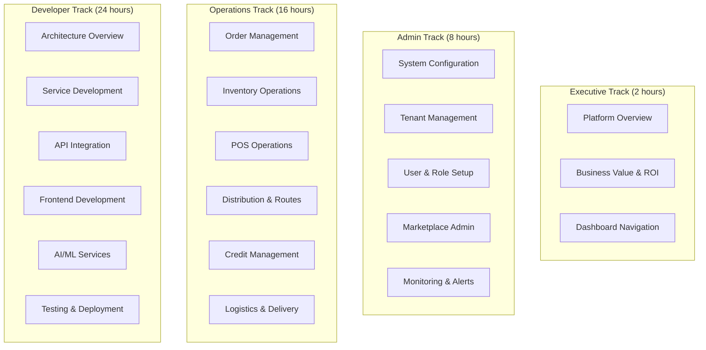
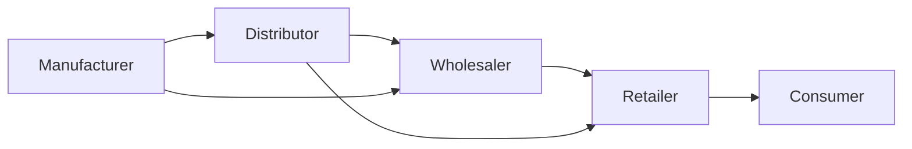
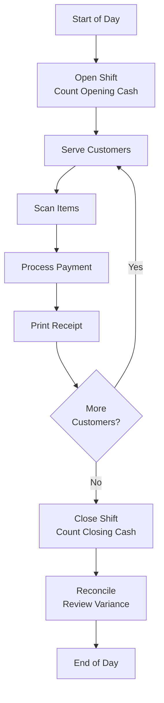

# ERP-Commerce -- Training Manual

## Document Control

| Field    | Value                                   |
|----------|-----------------------------------------|
| Module   | ERP-Commerce                            |
| Version  | 2.0                                     |
| Date     | 2026-02-23                              |

---

## 1. Training Program Overview

### 1.1 Training Tracks

### 1.2 Training Schedule

| Track       | Duration | Audience                    | Format           |
|-------------|:--------:|----------------------------|------------------|
| Executive   | 2 hours  | C-suite, VPs               | Presentation     |
| Admin       | 8 hours  | IT admins, system ops      | Workshop         |
| Operations  | 16 hours | Business users by role     | Hands-on lab     |
| Developer   | 24 hours | Engineering team           | Code workshop    |

---

## 2. Module 1: Platform Fundamentals

### Lesson 1.1: Understanding the Trade Network

**Duration**: 45 minutes

**Learning Objectives**:
- Understand the multi-party trade ecosystem
- Identify the 13 stakeholder roles
- Explain how orders flow through the trade chain

**Content**:

The ERP-Commerce platform connects all participants in the trade value chain:

Each participant has a purpose-built portal with role-specific features, dashboards, and workflows. The platform enables digital ordering, automated pricing, trade credit, distribution management, and last-mile delivery across the entire chain.

**Exercise**: Map your organization's trade network. Identify which roles each team member occupies. Draw the order flow for your most common transaction.

### Lesson 1.2: Navigating Your Portal

**Duration**: 30 minutes

**Content**:
- Logging in and MFA setup
- Dashboard overview and KPI interpretation
- Navigation sidebar and menu structure
- Global search functionality
- Notification center usage
- Profile and preference settings

**Exercise**: Log into the training environment. Customize your dashboard by rearranging widgets. Set notification preferences for order and delivery events.

---

## 3. Module 2: Order Management Training

### Lesson 2.1: Creating and Managing Orders

**Duration**: 1 hour

**Scenario-Based Training**:

**Scenario A: Standard B2B Order**
1. Retailer logs into portal
2. Browses distributor catalog
3. Adds 5 products to cart (meeting MOQ)
4. Proceeds to checkout with Net 30 terms
5. Order created and confirmed

**Scenario B: Under-MOQ Order**
1. Small retailer creates order below MOQ
2. System detects MOQ gap
3. Order enters grouping queue
4. Grouped with nearby demand
5. Fulfillment proceeds once MOQ met

**Scenario C: Multi-Source Order**
1. Wholesaler orders from multiple brands
2. System splits order by fulfillment source
3. Sub-orders tracked independently
4. Wholesaler sees consolidated view

### Lesson 2.2: Order Tracking and Status

**Order Status Reference**:

| Status           | Meaning                                | Who Can See      |
|------------------|----------------------------------------|------------------|
| Draft            | Order being composed                   | Buyer            |
| Pending Validation| Order submitted, awaiting validation  | Buyer, Seller    |
| Credit Check     | Awaiting credit validation             | Buyer, Seller    |
| Approved         | Order approved and confirmed           | All parties      |
| Allocated        | Inventory reserved                     | Seller, Warehouse|
| Picking          | Items being picked in warehouse        | Seller, Warehouse|
| Packed           | Items packed for shipment              | All parties      |
| Shipped          | Handed to carrier                      | All parties      |
| In Transit       | Being delivered                        | All parties      |
| Delivered        | POD captured                           | All parties      |
| Settled          | Payment processed                      | All parties      |

---

## 4. Module 3: POS Training

### Lesson 3.1: POS Setup and Daily Operations

**Duration**: 2 hours (hands-on with hardware)

**Equipment Required**: POS terminal (Sunmi T2 or PAX A920), barcode scanner, receipt printer, cash drawer

**Daily Workflow**:

**Hands-On Exercises**:
1. Open a new shift with cash count
2. Process 5 sale transactions with barcode scanning
3. Process a split payment (cash + card)
4. Apply a promotional discount
5. Process a return/refund
6. Close shift and reconcile cash

### Lesson 3.2: Offline Mode Operations

**When connectivity is lost**:
1. Notice the offline indicator (amber bar at top)
2. Continue processing sales normally
3. All transactions are saved locally
4. When connectivity restores, sync happens automatically
5. Review sync status in Settings > Sync Status

**Important**: Ensure the POS terminal is fully synced at least once per day. Pricing and product updates only apply after sync.

---

## 5. Module 4: Trade Credit Training

### Lesson 4.1: Understanding Credit Scores

**Duration**: 1 hour

**How Credit Scoring Works**:

The AI credit scoring model evaluates multiple factors:

| Factor              | Weight | Description                              |
|--------------------|:------:|------------------------------------------|
| Payment History     | 35%    | On-time payment rate, average days to pay|
| Transaction Volume  | 25%    | Order frequency and value                |
| Business Profile    | 20%    | Years in operation, size, type           |
| External Credit     | 15%    | Credit bureau data                       |
| Network Score       | 5%     | Trade partner references                 |

**Score Ranges**:
- 750-1000: Excellent (auto-approve, Net 60 available)
- 500-749: Good (auto-approve, Net 30)
- 300-499: Fair (manual review required)
- 0-299: Poor (auto-deny, cash-only)

---

## 6. Module 5: Distribution and Logistics Training

### Lesson 5.1: Route Planning

**Duration**: 1 hour

1. Navigate to **Routes > Plan Route**
2. Select date and assign driver/vehicle
3. Add delivery stops (manual or from pending orders)
4. Click **Optimize Route** for VRP optimization
5. Review optimized sequence on map
6. Adjust stops manually if needed (drag to reorder)
7. Assign route to driver
8. Monitor route execution in real-time

### Lesson 5.2: Proof of Delivery

**POD Methods and When to Use**:

| Method     | When to Use                    | How To                        |
|------------|--------------------------------|-------------------------------|
| Signature  | Standard deliveries            | Hand device to recipient      |
| Photo      | Unattended or disputed         | Photograph delivered goods    |
| OTP        | High-value shipments           | Recipient provides SMS code   |
| Geofence   | Always (automatic)             | GPS verifies location         |

---

## 7. Assessment and Certification

### 7.1 Knowledge Assessment

Each training module concludes with:
- 20-question multiple choice quiz (80% pass threshold)
- 3 practical scenario exercises
- 1 role-play simulation

### 7.2 Certification Levels

| Level       | Requirement                              | Badge         |
|-------------|------------------------------------------|---------------|
| Foundation  | Complete Module 1 + quiz                 | Bronze        |
| Practitioner| Complete all modules for role + exercises | Silver        |
| Expert      | Complete all modules + mentor assessment  | Gold          |
