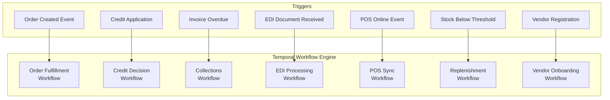
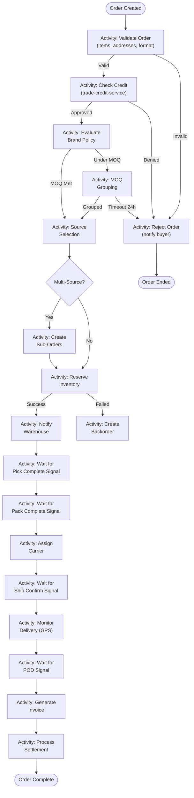
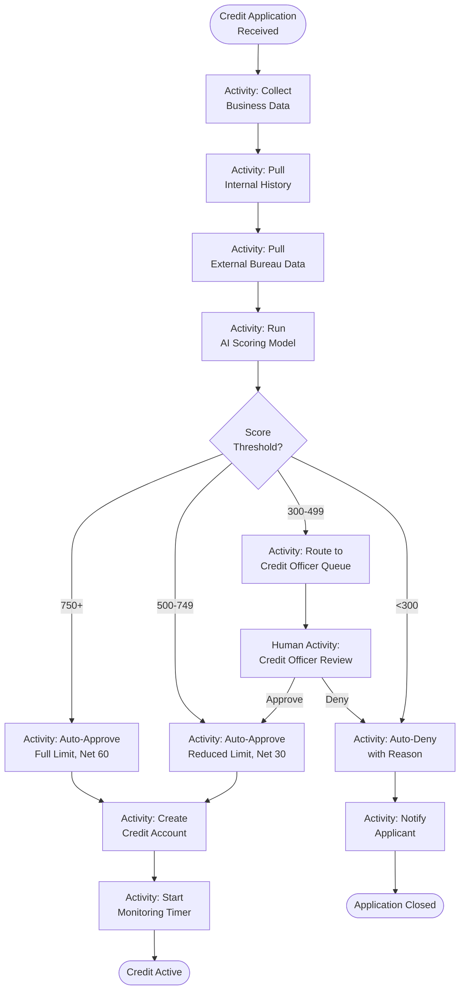
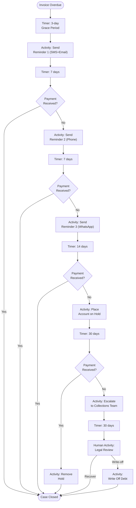
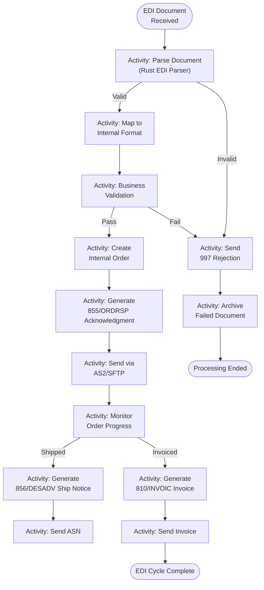
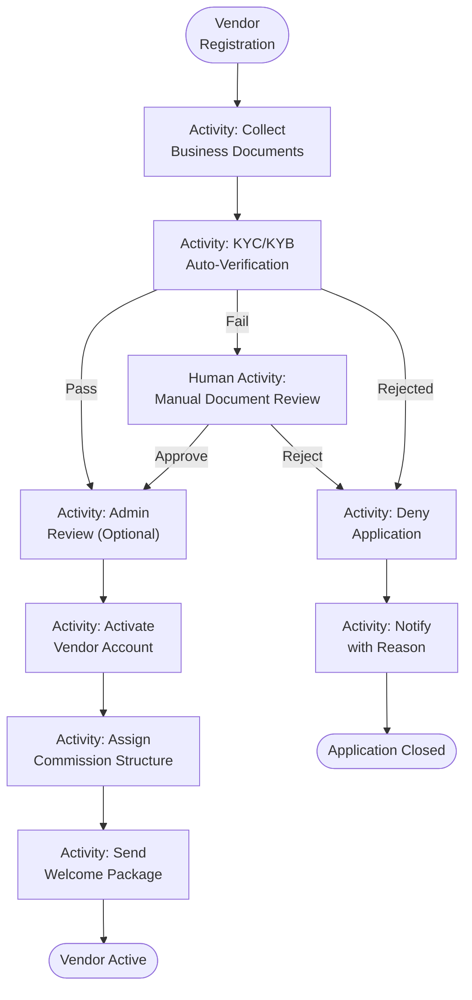
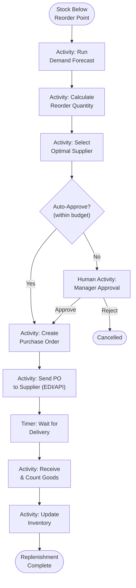
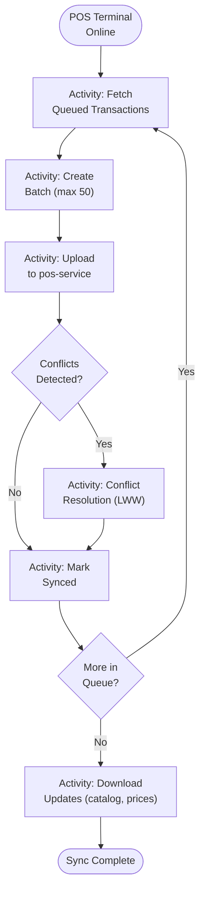

# ERP-Commerce -- Workflows Document

## Document Control

| Field    | Value                                   |
|----------|-----------------------------------------|
| Module   | ERP-Commerce                            |
| Version  | 2.0                                     |
| Date     | 2026-02-23                              |

---

## 1. Workflow Engine

ERP-Commerce uses Temporal for long-running workflow orchestration. Each workflow is durable, retryable, and auditable.

---

## 2. Order Fulfillment Workflow

### 2.1 Complete Flow

### 2.2 Retry and Compensation

| Activity          | Retry Policy           | Compensation Action         |
|-------------------|------------------------|-----------------------------|
| Validate Order    | 3 retries, 5s backoff  | Mark as validation failed   |
| Check Credit      | 3 retries, 10s backoff | Queue for manual review     |
| Reserve Inventory | 5 retries, 5s backoff  | Release any partial reserves|
| Assign Carrier    | 5 retries, 30s backoff | Reassign to backup carrier  |
| Generate Invoice  | 3 retries, 10s backoff | Queue for manual invoicing  |

---

## 3. Credit Decision Workflow

---

## 4. Collections Workflow

---

## 5. EDI Processing Workflow

---

## 6. Vendor Onboarding Workflow

---

## 7. Demand-Driven Replenishment Workflow

---

## 8. POS Sync Workflow

