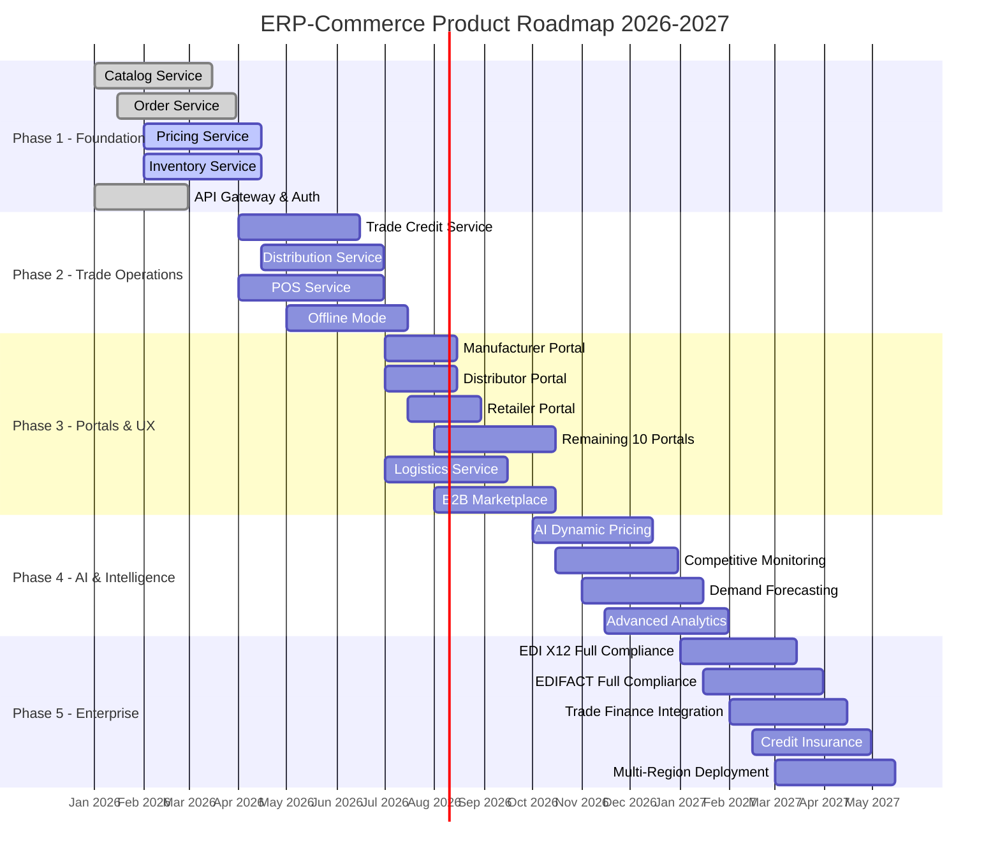

# ERP-Commerce -- Product Roadmap

## Document Control

| Field    | Value                                   |
|----------|-----------------------------------------|
| Module   | ERP-Commerce                            |
| Version  | 2.0                                     |
| Date     | 2026-02-23                              |

---

## 1. Roadmap Overview

---

## 2. Phase Details

### Phase 1: Foundation (Q1 2026)

| Deliverable             | Status   | Key Outcomes                                  |
|-------------------------|----------|-----------------------------------------------|
| Catalog Service         | Complete | Product CRUD, categories, variants, search    |
| Order Service           | Complete | Order lifecycle, status tracking, events       |
| Pricing Service         | Active   | Tiered pricing, volume discounts, promotions  |
| Inventory Service       | Active   | Multi-location stock, reservations, alerts     |
| API Gateway             | Complete | Kong/Envoy, JWT auth, rate limiting            |
| Event Backbone          | Complete | NATS JetStream, CloudEvents format             |

### Phase 2: Trade Operations (Q2 2026)

| Deliverable             | Key Outcomes                                            |
|-------------------------|--------------------------------------------------------|
| Trade Credit Service    | AI credit scoring, Net 30/60/90, exposure monitoring   |
| Distribution Service    | Territory management, van sales, beat planning          |
| POS Service             | Checkout, barcode scanning, receipt printing            |
| Offline Mode            | 72+ hour offline POS, automatic sync, conflict resolution |

### Phase 3: Portals and Marketplace (Q3 2026)

| Deliverable             | Key Outcomes                                            |
|-------------------------|--------------------------------------------------------|
| 13 Role Portals         | Tailored dashboards, workflows, and analytics per role |
| Logistics Service       | VRP optimization, GPS tracking, proof of delivery       |
| B2B Marketplace         | Vendor onboarding, commissions, dispute resolution      |

### Phase 4: AI and Intelligence (Q4 2026)

| Deliverable             | Key Outcomes                                            |
|-------------------------|--------------------------------------------------------|
| Dynamic AI Pricing      | ML-based price optimization per demand/inventory       |
| Competitive Monitoring  | Automated competitor price scraping and alerts          |
| Demand Forecasting      | Time-series prediction for replenishment               |
| Advanced Analytics      | Custom report builder, BI dashboard integration         |

### Phase 5: Enterprise (Q1 2027)

| Deliverable             | Key Outcomes                                            |
|-------------------------|--------------------------------------------------------|
| EDI Full Compliance     | All X12/EDIFACT transaction sets, AS2 transport        |
| Trade Finance           | Factoring, supply chain finance integrations           |
| Credit Insurance        | Automated coverage, claims processing                  |
| Multi-Region            | Deployment across Africa, Southeast Asia               |

---

## 3. Success Metrics per Phase

| Phase | Key Metric                  | Target                  |
|-------|-----------------------------|------------------------|
| 1     | API response time (p95)     | < 200ms                |
| 2     | POS offline reliability     | 72+ hours              |
| 2     | Credit decision time        | < 30 seconds           |
| 3     | Portal adoption rate        | 60% of onboarded users |
| 3     | Marketplace vendors         | 100+ in first quarter  |
| 4     | Pricing optimization lift   | 5-15% revenue increase |
| 4     | Forecast accuracy (MAPE)    | < 15%                  |
| 5     | EDI transaction volume      | 10,000+ per month      |

---

## 4. Technical Debt and Improvement Backlog

| Item                              | Priority | Target Phase |
|-----------------------------------|:--------:|:------------:|
| Migrate from offset to cursor pagination | Medium | Phase 2 |
| Implement CQRS for order reads    | High     | Phase 2      |
| Add gRPC for inter-service calls  | Medium   | Phase 3      |
| Implement GraphQL subscriptions   | High     | Phase 3      |
| Add database connection pooling   | High     | Phase 1      |
| Implement circuit breakers        | Medium   | Phase 2      |
| Add chaos engineering tests       | Low      | Phase 4      |
