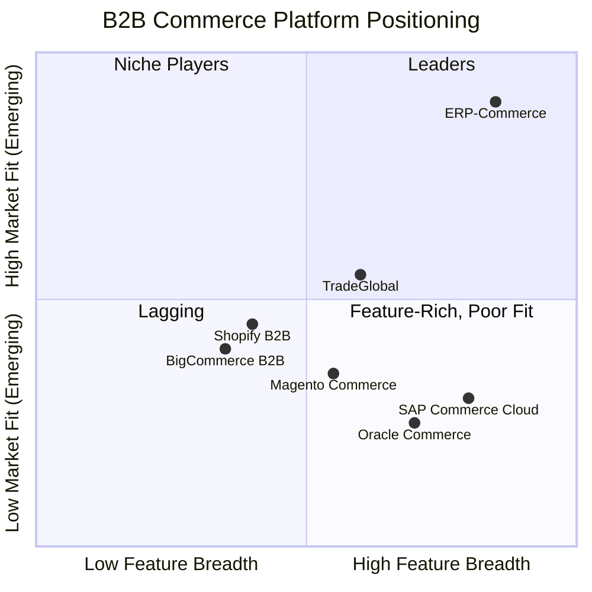

# ERP-Commerce -- Competitive Analysis

## Document Control

| Field    | Value                                   |
|----------|-----------------------------------------|
| Module   | ERP-Commerce                            |
| Version  | 2.0                                     |
| Date     | 2026-02-23                              |

---

## 1. Competitive Landscape

---

## 2. Detailed Competitor Profiles

### 2.1 SAP Commerce Cloud

**Strengths**: Mature enterprise platform, deep ERP integration, strong catalog and search, global scale, extensive partner ecosystem.

**Weaknesses**: No native offline POS, limited emerging market features (no USSD/WhatsApp channels), no built-in trade credit scoring, expensive licensing, complex implementation.

**Pricing**: USD 500K-5M+ annual license for enterprise deployments.

| Capability                  | SAP Commerce Cloud        | ERP-Commerce           |
|-----------------------------|--------------------------|------------------------|
| Catalog Management          | Excellent                | Excellent              |
| B2B Order Management        | Good                     | Excellent (multi-party)|
| Pricing Engine              | Good                     | Excellent (AI-powered) |
| Offline POS                 | Not available            | Native                 |
| Trade Credit AI             | Not available            | Native                 |
| EDI Support                 | Via partner/plugin       | Native (Rust parser)   |
| Emerging Market Channels    | Limited                  | USSD, WhatsApp, Voice  |
| Van Sales / Field Sales     | Not available            | Native                 |
| B2B Marketplace             | Separate product (Ariba) | Built-in               |
| Role-Specific Portals       | 3 (buyer, seller, admin) | 13 specialized portals |

### 2.2 Oracle Commerce Cloud

**Strengths**: Strong B2C capabilities, good integration with Oracle ERP, robust catalog and search, scalable cloud infrastructure.

**Weaknesses**: Primarily B2C-focused, limited B2B trade features, no native offline capability, no distribution management, expensive.

**Pricing**: USD 300K-3M+ annual license.

| Capability                  | Oracle Commerce          | ERP-Commerce           |
|-----------------------------|--------------------------|------------------------|
| B2C Commerce                | Excellent                | Good                   |
| B2B Trade Orchestration     | Basic                    | Excellent              |
| Multi-Party Orders          | Not available            | Native                 |
| Distribution Management     | Not available            | Native (RTM, van sales)|
| Credit Scoring              | Not available            | AI-powered             |
| Logistics Optimization      | Not available            | VRP solver             |
| POS Integration             | Third-party              | Native                 |
| Multi-Currency              | Good                     | Excellent              |

### 2.3 TradeGlobal

**Strengths**: Strong EDI capabilities, good distribution management, established in trade commerce, multi-party support.

**Weaknesses**: Legacy architecture, limited AI/ML features, no native POS, weaker marketplace capabilities, limited emerging market support.

**Pricing**: USD 200K-1M+ annual license.

| Capability                  | TradeGlobal              | ERP-Commerce           |
|-----------------------------|--------------------------|------------------------|
| EDI (X12/EDIFACT)           | Excellent                | Excellent              |
| Distribution Management     | Good                     | Excellent              |
| AI Credit Scoring           | Not available            | Native                 |
| Dynamic AI Pricing          | Not available            | Native                 |
| Offline POS                 | Not available            | Native                 |
| B2B Marketplace             | Basic                    | Full-featured          |
| Route Optimization          | Basic                    | Advanced (OR-Tools VRP)|
| Portal Coverage             | 5 roles                  | 13 roles               |

---

## 3. Feature Differentiation Matrix

| Feature Category           | ERP-Commerce | SAP | Oracle | TradeGlobal | Shopify B2B |
|----------------------------|:------------:|:---:|:------:|:-----------:|:-----------:|
| **Multi-Party Trade Network**|||||
| Manufacturer Portal        | Yes          | No  | No     | Yes         | No          |
| Distributor Portal         | Yes          | Yes | No     | Yes         | No          |
| Wholesaler Portal          | Yes          | No  | No     | Partial     | No          |
| Retailer Portal            | Yes          | Yes | Yes    | Yes         | Yes         |
| 13 Role-Specific Portals   | Yes          | No  | No     | No          | No          |
| **Order Orchestration**    |||||
| Multi-Source Splitting     | Yes          | Yes | Partial| Yes         | No          |
| Under-MOQ Grouping         | Yes          | No  | No     | No          | No          |
| EDI X12 Native             | Yes          | Plugin | No  | Yes         | No          |
| EDI EDIFACT Native         | Yes          | Plugin | No  | Yes         | No          |
| **Pricing Intelligence**   |||||
| Trade-Level Pricing        | Yes          | Yes | Yes    | Yes         | Partial     |
| AI Dynamic Pricing         | Yes          | No  | No     | No          | No          |
| Competitive Monitoring     | Yes          | No  | No     | No          | No          |
| **Inventory**              |||||
| Consignment Tracking       | Yes          | Partial | Yes| No          | No          |
| Demand-Driven Replenishment| Yes          | Yes | Partial| No          | No          |
| Serialized + Lot Tracking  | Yes          | Yes | Yes    | Partial     | No          |
| **Trade Finance**          |||||
| AI Credit Scoring          | Yes          | No  | No     | No          | No          |
| Net 30/60/90 Terms         | Yes          | Yes | Partial| Yes         | Partial     |
| Credit Insurance           | Yes          | No  | No     | No          | No          |
| Automated Collections      | Yes          | No  | No     | Partial     | No          |
| **Distribution**           |||||
| Van Sales                  | Yes          | No  | No     | Partial     | No          |
| Territory Management       | Yes          | No  | No     | Yes         | No          |
| Beat Planning              | Yes          | No  | No     | Partial     | No          |
| **POS & Retail**           |||||
| Native POS                 | Yes          | No  | No     | No          | Yes         |
| Offline Mode (72h)         | Yes          | No  | No     | No          | Partial     |
| Multi-Hardware Support     | Yes          | No  | No     | No          | Partial     |
| **Logistics**              |||||
| VRP Route Optimization     | Yes          | No  | No     | Partial     | No          |
| GPS Tracking               | Yes          | No  | No     | Yes         | No          |
| Digital POD                | Yes          | No  | No     | Yes         | No          |
| **Marketplace**            |||||
| B2B Marketplace            | Yes          | Separate| No | No          | No          |
| Commission Management      | Yes          | Separate| No | No          | No          |
| Dispute Resolution         | Yes          | Separate| No | No          | No          |

---

## 4. Total Cost of Ownership (5-Year)

| Cost Component        | ERP-Commerce  | SAP Commerce  | Oracle Commerce | TradeGlobal  |
|-----------------------|:-------------:|:-------------:|:---------------:|:------------:|
| License/Subscription  | $250K         | $2.5M         | $1.5M           | $500K        |
| Implementation        | $150K         | $2M           | $1.5M           | $400K        |
| Customization         | $100K         | $1.5M         | $1M             | $300K        |
| Infrastructure        | $200K         | $500K         | $400K           | $250K        |
| Maintenance/Support   | $125K         | $1.25M        | $750K           | $250K        |
| **5-Year Total**      | **$825K**     | **$7.75M**    | **$5.15M**      | **$1.7M**    |

---

## 5. Strategic Advantages

### 5.1 Emerging Market First

ERP-Commerce is purpose-built for emerging markets with offline-first architecture, USSD/WhatsApp channels, mobile money integration, and van sales support -- features that competitors have not prioritized.

### 5.2 AI-Native Trade Intelligence

Built-in AI for credit scoring, dynamic pricing, demand forecasting, and route optimization gives ERP-Commerce an intelligence layer that competitors require expensive third-party integrations to achieve.

### 5.3 Unified Platform

By consolidating POS, commerce, marketplace, distribution, and trade finance into a single platform, ERP-Commerce eliminates the integration cost and data silos that plague multi-vendor solutions.

### 5.4 Modern Architecture

Go/Python/Rust microservices with event-driven architecture provide significantly better performance and lower operational cost than the Java-based monoliths of SAP and Oracle.
