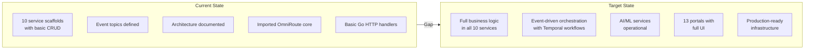
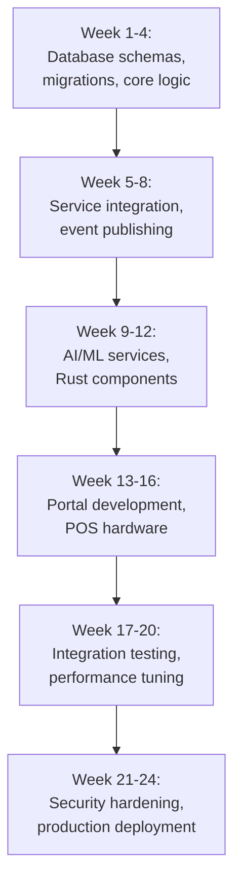

# ERP-Commerce -- Gap Analysis

## Document Control

| Field    | Value                                   |
|----------|-----------------------------------------|
| Module   | ERP-Commerce                            |
| Version  | 2.0                                     |
| Date     | 2026-02-23                              |

---

## 1. Gap Analysis Overview

This document identifies gaps between the current state of ERP-Commerce (as consolidated from ERP-OmniRoute, ERP-POS, and ERP-opensase-ecommerce) and the target state for full production readiness.

---

## 2. Service-Level Gap Analysis

### 2.1 Catalog Service

| Feature                       | Current State          | Target State                    | Gap    | Priority |
|-------------------------------|------------------------|----------------------------------|--------|----------|
| Product CRUD                  | Basic handler exists   | Full domain logic with validation| Medium | P0       |
| Category tree management      | Not implemented        | Materialized path queries        | High   | P0       |
| Product variants              | Not implemented        | Full variant management          | High   | P0       |
| Brand policy enforcement      | Schema defined         | Runtime MOQ validation           | High   | P0       |
| Full-text search              | Not implemented        | Elasticsearch integration        | High   | P0       |
| Bulk import/export            | Not implemented        | CSV, Excel, JSON parsers         | Medium | P1       |
| EDI catalog exchange          | Not implemented        | X12 832, EDIFACT PRICAT          | Medium | P2       |
| Digital asset management      | Not implemented        | S3 integration, media CRUD       | Medium | P1       |

### 2.2 Order Service

| Feature                       | Current State          | Target State                    | Gap    | Priority |
|-------------------------------|------------------------|----------------------------------|--------|----------|
| Order CRUD                    | Basic handler exists   | Full lifecycle with state machine| Medium | P0       |
| Credit check integration      | Not implemented        | Synchronous call to trade-credit | High   | P0       |
| Order splitting               | Not implemented        | Multi-source algorithm           | High   | P0       |
| MOQ grouping                  | Not implemented        | Temporal workflow                | High   | P0       |
| EDI order processing          | Not implemented        | Rust parser + mapper             | High   | P1       |
| Approval workflows            | Not implemented        | Configurable rule engine         | High   | P0       |
| Returns/RMA                   | Not implemented        | Reverse logistics flow           | Medium | P1       |

### 2.3 Pricing Service

| Feature                       | Current State          | Target State                    | Gap    | Priority |
|-------------------------------|------------------------|----------------------------------|--------|----------|
| Price calculation             | Basic handler exists   | Full waterfall pipeline          | High   | P0       |
| Trade-level pricing           | Not implemented        | Multi-level price rules          | High   | P0       |
| Volume discounts              | Not implemented        | Tier-based discount engine       | High   | P0       |
| Promotional pricing           | Not implemented        | Time-based promotion engine      | Medium | P0       |
| Contract pricing              | Not implemented        | Customer-specific overrides      | Medium | P0       |
| Dynamic AI pricing            | Not implemented        | Python ML service                | High   | P2       |
| Competitive monitoring        | Not implemented        | Price scraping + alerts          | High   | P2       |
| Rust price calculator         | Not implemented        | FFI binding for bulk operations  | Medium | P1       |

### 2.4 Inventory Service

| Feature                       | Current State          | Target State                    | Gap    | Priority |
|-------------------------------|------------------------|----------------------------------|--------|----------|
| Stock tracking                | Basic handler exists   | Multi-location real-time         | High   | P0       |
| Reservations                  | Not implemented        | Soft/hard reserve with TTL       | High   | P0       |
| Lot/batch tracking            | Not implemented        | Full lot lifecycle               | High   | P0       |
| Serial tracking               | Not implemented        | Individual item tracking         | High   | P0       |
| Consignment                   | Not implemented        | Ownership model                  | Medium | P1       |
| Demand forecasting            | Not implemented        | Python ML service                | High   | P2       |
| Valuation (FIFO/LIFO/WAC)    | Not implemented        | Cost accounting integration      | Medium | P0       |

### 2.5 Trade Credit Service

| Feature                       | Current State          | Target State                    | Gap    | Priority |
|-------------------------------|------------------------|----------------------------------|--------|----------|
| Credit account management     | Basic handler exists   | Full account lifecycle           | High   | P0       |
| AI credit scoring             | Not implemented        | Python ML model                  | High   | P0       |
| Payment terms                 | Not implemented        | Net 30/60/90 configurability     | High   | P0       |
| Collections automation        | Not implemented        | Temporal workflow                | High   | P1       |
| Credit insurance              | Not implemented        | Provider integration             | Medium | P2       |
| Trade finance                 | Not implemented        | Factoring integration            | Medium | P2       |

### 2.6 Distribution Service

| Feature                       | Current State          | Target State                    | Gap    | Priority |
|-------------------------------|------------------------|----------------------------------|--------|----------|
| Territory management          | Basic handler exists   | Geo-fenced boundaries            | High   | P0       |
| Van sales                     | Not implemented        | Offline-capable mobile flow      | High   | P0       |
| Beat planning                 | Not implemented        | Schedule optimization            | Medium | P1       |
| Coverage lanes                | Schema defined         | Runtime governance               | High   | P0       |
| RTM configuration             | Not implemented        | Product/territory strategy       | Medium | P1       |

### 2.7 POS Service

| Feature                       | Current State          | Target State                    | Gap    | Priority |
|-------------------------------|------------------------|----------------------------------|--------|----------|
| Transaction processing        | Basic handler exists   | Full checkout flow               | High   | P0       |
| Offline mode                  | Not implemented        | SQLite + sync engine             | High   | P0       |
| Hardware integration          | Not implemented        | Stripe/Square/Sunmi/PAX          | High   | P0       |
| Shift management              | Not implemented        | Open/close, reconciliation       | High   | P0       |
| Receipt printing              | Not implemented        | ESC/POS printer driver           | Medium | P0       |

### 2.8 Portal Service

| Feature                       | Current State          | Target State                    | Gap    | Priority |
|-------------------------------|------------------------|----------------------------------|--------|----------|
| App shell                     | Basic handler exists   | Next.js SSR framework            | High   | P0       |
| 13 role portals               | Not implemented        | Full portal implementations      | High   | P0       |
| Real-time dashboards          | Not implemented        | WebSocket subscriptions          | High   | P1       |
| Responsive design             | Not implemented        | Mobile + desktop layouts         | High   | P0       |

### 2.9 Logistics Service

| Feature                       | Current State          | Target State                    | Gap    | Priority |
|-------------------------------|------------------------|----------------------------------|--------|----------|
| Delivery management           | Basic handler exists   | Full delivery lifecycle          | High   | P0       |
| VRP optimization              | Not implemented        | Python OR-Tools solver           | High   | P0       |
| GPS tracking                  | Not implemented        | Real-time location streaming     | High   | P0       |
| Proof of delivery             | Not implemented        | Multi-method POD capture         | High   | P0       |
| Fleet management              | Not implemented        | Vehicle CRUD + maintenance       | Medium | P1       |

### 2.10 Marketplace Service

| Feature                       | Current State          | Target State                    | Gap    | Priority |
|-------------------------------|------------------------|----------------------------------|--------|----------|
| Vendor onboarding             | Basic handler exists   | KYC/KYB workflow                 | High   | P0       |
| Commission management         | Not implemented        | Configurable commission engine   | High   | P0       |
| Dispute resolution            | Not implemented        | Temporal workflow                | Medium | P1       |
| Vendor analytics              | Not implemented        | GMV, conversion dashboards       | Medium | P1       |

---

## 3. Infrastructure Gaps

| Component                     | Current State          | Target State                    | Gap    | Priority |
|-------------------------------|------------------------|----------------------------------|--------|----------|
| Database migrations           | Not implemented        | golang-migrate per service       | High   | P0       |
| Redis caching                 | Not connected          | Pricing cache, session store     | High   | P0       |
| Elasticsearch                 | Not connected          | Product search indices           | High   | P0       |
| Temporal cluster              | Not deployed           | Workflow engine running          | High   | P0       |
| CI/CD pipeline                | Not configured         | GitHub Actions + ArgoCD          | High   | P0       |
| Monitoring stack              | Not deployed           | Prometheus + Grafana + Jaeger    | High   | P0       |
| mTLS / Service mesh           | Not configured         | Istio/Linkerd deployment         | Medium | P1       |

---

## 4. Remediation Plan

| Sprint    | Focus Area                                  | Expected Outcomes                  |
|-----------|--------------------------------------------|------------------------------------|
| Sprint 1-2| Database schemas + migrations              | All tables created, RLS enabled    |
| Sprint 3-4| Core domain logic (catalog, order, pricing)| Business rules implemented         |
| Sprint 5-6| Inventory + trade credit                   | Reservation + scoring working      |
| Sprint 7-8| Distribution + POS                         | Van sales + checkout operational   |
| Sprint 9-10| Logistics + marketplace                   | VRP + vendor onboarding live       |
| Sprint 11-12| Portal frontend development              | 13 portals with core features      |
| Sprint 13-14| AI/ML services                           | Credit scoring, pricing, demand    |
| Sprint 15-16| EDI + Rust components                    | X12/EDIFACT parsing operational    |
| Sprint 17-18| Integration + performance testing        | All services integrated, load tested|
| Sprint 19-20| Security + production hardening          | PCI compliance, SOC 2 readiness    |
