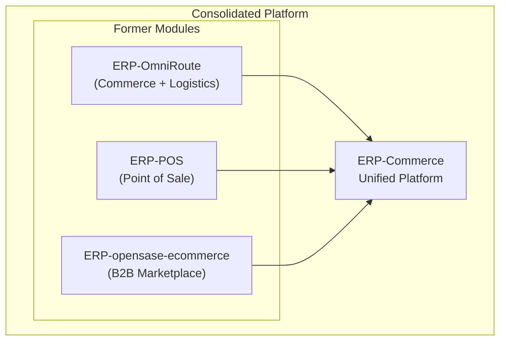

# ERP-Commerce -- Release Notes

## Document Control

| Field    | Value                                   |
|----------|-----------------------------------------|
| Module   | ERP-Commerce                            |
| Version  | 2.0                                     |
| Date     | 2026-02-23                              |

---

## Release 2.0.0 -- Trade Platform Consolidation (2026-02-23)

### Overview

This is the foundational release of ERP-Commerce, consolidating three former standalone modules (ERP-OmniRoute, ERP-POS-Software-for-Physical-Storefront, and ERP-opensase-ecommerce) into a unified multi-party trade commerce platform.

### What is New

#### New Architecture
- **10 Go microservices**: catalog, order, pricing, inventory, trade-credit, distribution, pos, portal, logistics, marketplace
- **Event-driven backbone**: NATS JetStream with CloudEvents envelope format
- **Multi-tenant isolation**: PostgreSQL Row-Level Security, X-Tenant-ID header enforcement
- **AIDD guardrails**: AI-driven development controls with human-in-the-loop for high-risk operations

#### Service Endpoints
All 10 services expose RESTful APIs:
- `/v1/catalog` -- Product catalog management
- `/v1/order` -- Order orchestration
- `/v1/pricing` -- Pricing engine
- `/v1/inventory` -- Inventory management
- `/v1/trade-credit` -- Trade credit management
- `/v1/distribution` -- Distribution management
- `/v1/pos` -- Point of sale
- `/v1/portal` -- Portal service
- `/v1/logistics` -- Logistics management
- `/v1/marketplace` -- B2B marketplace

#### Events
58 event topics defined across all 10 services following the convention `erp.commerce.<entity>.<action>`.

#### Infrastructure
- Kubernetes-native deployment with Helm charts
- Health checks at `/healthz` for all services
- Capability registry at `/v1/capabilities`

### Known Limitations (2.0.0)
- Services contain basic CRUD handlers; full business logic under active development
- AI/ML services (credit scoring, dynamic pricing, route optimization) not yet operational
- Portal frontend not yet implemented (service scaffold only)
- EDI parsing (Rust) not yet integrated
- Offline POS sync engine not yet implemented

### Migration Notes
- Organizations previously using ERP-OmniRoute, ERP-POS, or ERP-opensase-ecommerce should plan migration to ERP-Commerce
- Legacy API endpoints will be maintained for backward compatibility during transition
- Data migration scripts will be provided in release 2.1.0

---

## Planned: Release 2.1.0 -- Core Commerce (Target: Q1 2026)

### Expected Features
- Full catalog management with categories, variants, and search
- Complete order lifecycle with state machine
- Pricing waterfall engine (tiered, volume, promotional)
- Multi-location inventory with reservations
- Data migration scripts from legacy modules

---

## Planned: Release 2.2.0 -- Trade Operations (Target: Q2 2026)

### Expected Features
- AI credit scoring model
- POS checkout with offline mode
- Territory management and van sales
- Distribution route management
- Collections automation workflow

---

## Planned: Release 2.3.0 -- Portals and Marketplace (Target: Q3 2026)

### Expected Features
- 13 role-specific portal interfaces
- B2B marketplace with vendor onboarding
- VRP route optimization
- GPS tracking and proof of delivery
- Commission management and dispute resolution
