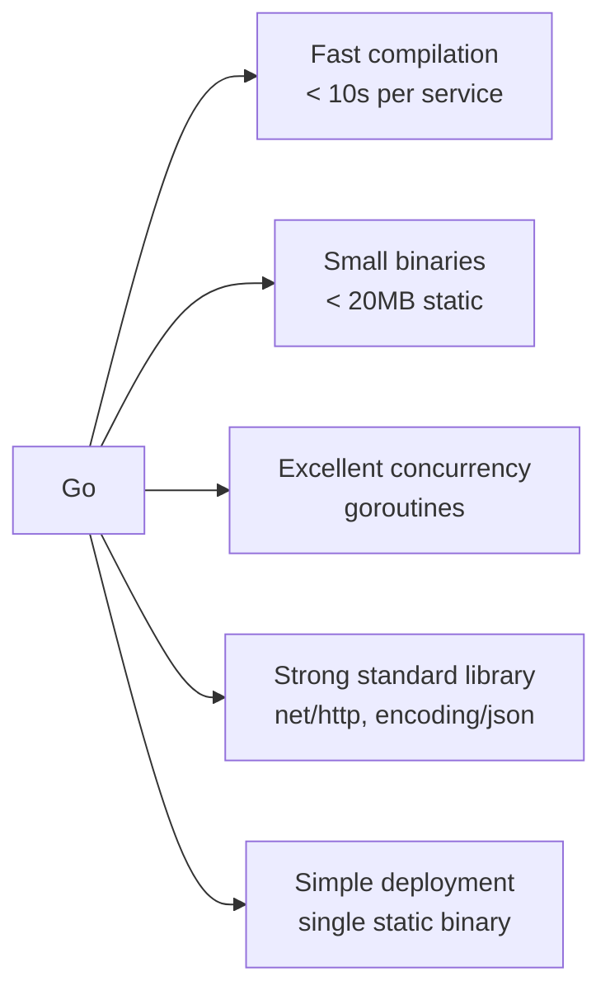
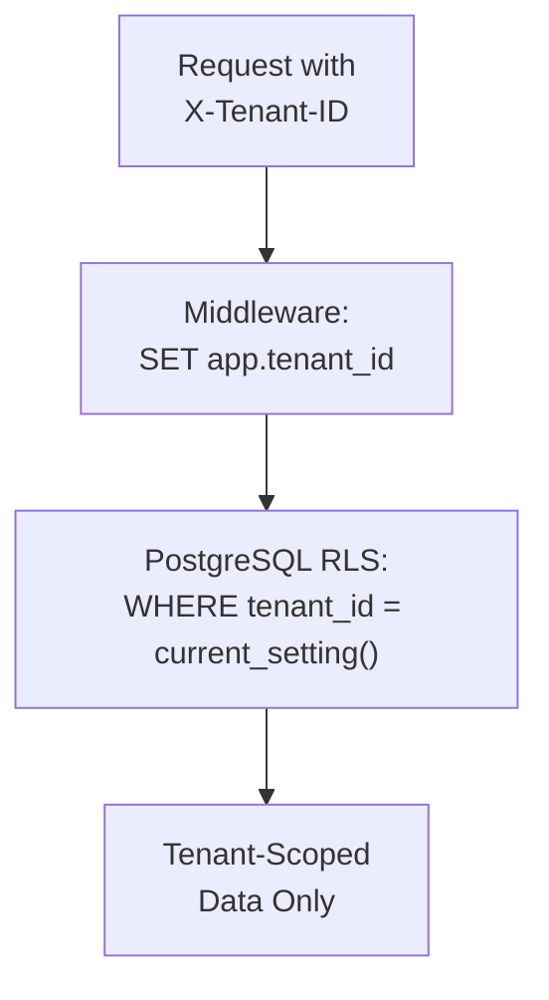
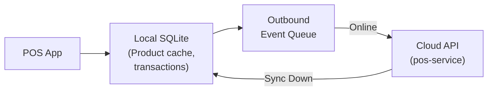

# ERP-Commerce -- Architecture Decision Records (ADR)

## Document Control

| Field    | Value                                   |
|----------|-----------------------------------------|
| Module   | ERP-Commerce                            |
| Version  | 2.0                                     |
| Date     | 2026-02-23                              |

---

## ADR-001: Primary Service Language Selection

**Status**: Accepted
**Date**: 2026-01-15

### Context

ERP-Commerce requires a primary language for its 10 core microservices. The language must support high concurrency, fast compilation, small container images, and be accessible to the development team.

### Decision

We chose **Go 1.22+** as the primary language for all core microservices.

### Rationale

- Go produces small, statically linked binaries ideal for containerized deployment
- Built-in concurrency (goroutines) handles high-throughput commerce workloads
- Standard library covers HTTP servers, JSON, crypto without external dependencies
- Fast CI/CD: build time under 10 seconds per service
- Lower memory footprint than Java/JVM alternatives (SAP/Oracle choice)

### Alternatives Considered

| Language | Pros                         | Cons                                    |
|----------|------------------------------|----------------------------------------|
| Java     | Ecosystem, tooling           | Heavy JVM, slow start, large images    |
| Rust     | Performance, safety          | Steep learning curve, slow compilation |
| Node.js  | JS full-stack, async         | Single-threaded, type safety concerns  |

### Consequences

- Team must develop Go expertise (positive: simple language, quick ramp-up)
- Rust used selectively for performance-critical components (EDI parsing, price calculation)
- Python used for AI/ML services where Go ecosystem is insufficient

---

## ADR-002: Event Streaming Platform

**Status**: Accepted
**Date**: 2026-01-20

### Context

ERP-Commerce requires an event streaming platform for asynchronous inter-service communication, event sourcing, and integration with other ERP modules.

### Decision

We chose **NATS JetStream** as the primary event streaming platform, with **Redpanda** as an alternative for high-throughput scenarios.

### Rationale

- NATS JetStream provides durable streams with at-least-once delivery
- Significantly lower operational overhead compared to Apache Kafka
- Native Go client with excellent performance
- Subject-based addressing matches CloudEvents topic naming
- Consistent with ERP-Platform event backbone

### Consequences

- All events follow CloudEvents specification (v1.0)
- Consumer idempotency required (at-least-once delivery)
- Dead letter queues configured for failed processing
- 7-day event retention policy

---

## ADR-003: Multi-Tenant Data Isolation

**Status**: Accepted
**Date**: 2026-01-22

### Context

ERP-Commerce serves multiple tenants (manufacturers, distributors, retailers) who must not access each other's data.

### Decision

We chose **PostgreSQL Row-Level Security (RLS)** with shared schema for multi-tenant data isolation.

### Rationale

- Shared schema simplifies operations (single database per region)
- RLS enforces isolation at the database level (defense in depth)
- Application-level tenant_id validation provides first layer
- Scales well to 50,000+ tenants without separate databases

### Alternatives Considered

| Approach        | Pros                      | Cons                                  |
|-----------------|---------------------------|---------------------------------------|
| Database-per-tenant | Perfect isolation      | Operational nightmare at scale        |
| Schema-per-tenant  | Good isolation          | Migration complexity, connection limits|
| Shared + RLS      | Simple ops, scalable     | Requires careful RLS policy management|

---

## ADR-004: Workflow Orchestration Engine

**Status**: Accepted
**Date**: 2026-02-01

### Context

ERP-Commerce has complex long-running workflows (order fulfillment, credit decisions, collections, vendor onboarding) that require durability, retries, and visibility.

### Decision

We chose **Temporal** for workflow orchestration.

### Rationale

- Durable execution: workflows survive service restarts
- Built-in retry policies with exponential backoff
- Activity timeouts and heartbeating
- Workflow versioning for zero-downtime upgrades
- Rich visibility and debugging UI
- Go SDK is production-proven

### Consequences

- Temporal cluster must be deployed and maintained
- Each workflow is a Go function with deterministic constraints
- Activities (side effects) are isolated and independently retryable
- Workflow state visible in Temporal Web UI for operations

---

## ADR-005: High-Performance Components in Rust

**Status**: Accepted
**Date**: 2026-02-05

### Context

Certain ERP-Commerce components require sub-millisecond performance that Go cannot guarantee:
- EDI X12/EDIFACT document parsing (complex grammar)
- Bulk pricing calculations (millions of price points)
- POS offline sync conflict resolution (vector clock operations)

### Decision

We chose **Rust** for these performance-critical components, called via FFI from Go services.

### Rationale

- Rust provides C-level performance with memory safety guarantees
- No garbage collection pauses (critical for pricing engine)
- Excellent parsing libraries (nom, pest) for EDI grammars
- FFI from Go via cgo is straightforward

### Consequences

- Rust components are separate crates compiled as shared libraries
- CI/CD must support Rust toolchain
- Go services call Rust via cgo FFI bindings
- Performance-critical paths benchmarked with criterion.rs

---

## ADR-006: Offline-First POS Architecture

**Status**: Accepted
**Date**: 2026-02-10

### Context

POS terminals in emerging markets frequently lose internet connectivity. The system must operate offline for at least 72 hours without data loss.

### Decision

We chose a **local SQLite database with event queue** architecture for offline POS operation.

### Rationale

- SQLite is embedded, zero-configuration, and battle-tested on Android devices
- Outbound event queue ensures no transaction is lost
- Last-write-wins with vector clocks for conflict resolution
- Product catalog and pricing cached locally with staleness indicators

### Consequences

- POS app must handle local database initialization and schema migration
- Sync engine must be thoroughly tested for conflict scenarios
- Pricing cached locally may become stale (acceptable trade-off)
- Maximum offline duration determined by local storage capacity

---

## ADR-007: 13 Role-Specific Portal Architecture

**Status**: Accepted
**Date**: 2026-02-15

### Context

ERP-Commerce serves 13 distinct user roles, each requiring different dashboards, workflows, and data views.

### Decision

We chose a **micro-frontend architecture** with a shared app shell and role-based module loading via Next.js dynamic imports.

### Rationale

- Shared app shell provides consistent navigation and authentication
- Role detection at login loads only the relevant portal module
- Each portal can be developed and deployed independently
- Code splitting ensures small initial bundle sizes
- Common components shared through a UI package library

### Consequences

- Portal-service acts as the host for all 13 portal micro-frontends
- Shared packages (UI, hooks, API client) maintained as internal npm packages
- Each portal team has independent release cycles
- E2E tests required per portal for critical user journeys
