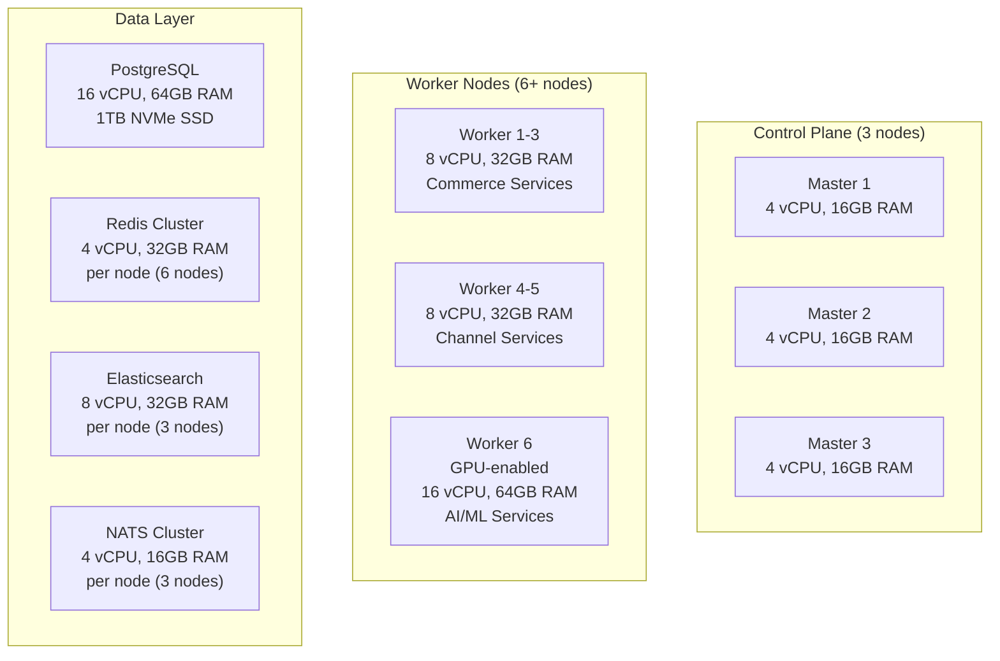

# ERP-Commerce -- Hardware Requirements

## Document Control

| Field    | Value                                   |
|----------|-----------------------------------------|
| Module   | ERP-Commerce                            |
| Version  | 2.0                                     |
| Date     | 2026-02-23                              |

---

## 1. Server Infrastructure Requirements

### 1.1 Production Environment (Kubernetes Cluster)

### 1.2 Minimum Server Specifications

| Component           | CPU      | RAM     | Storage        | Quantity |
|--------------------|----------|---------|----------------|:--------:|
| K8s Control Plane   | 4 vCPU   | 16 GB   | 100 GB SSD     | 3        |
| K8s Worker (Commerce)| 8 vCPU  | 32 GB   | 200 GB SSD     | 3        |
| K8s Worker (Channel) | 8 vCPU  | 32 GB   | 200 GB SSD     | 2        |
| K8s Worker (AI/ML)   | 16 vCPU | 64 GB   | 500 GB SSD + GPU| 1       |
| PostgreSQL Primary   | 16 vCPU | 64 GB   | 1 TB NVMe      | 1        |
| PostgreSQL Replica   | 8 vCPU  | 32 GB   | 1 TB NVMe      | 2        |
| Redis Node           | 4 vCPU  | 32 GB   | 100 GB SSD     | 6        |
| Elasticsearch Node   | 8 vCPU  | 32 GB   | 500 GB SSD     | 3        |
| NATS Node            | 4 vCPU  | 16 GB   | 200 GB SSD     | 3        |
| Temporal Server      | 4 vCPU  | 16 GB   | 100 GB SSD     | 3        |
| Monitoring Stack     | 4 vCPU  | 16 GB   | 500 GB SSD     | 2        |

### 1.3 Cloud Provider Equivalents

| Component           | AWS Instance    | GCP Machine Type | Azure VM       |
|--------------------|-----------------|------------------|----------------|
| Control Plane       | m6i.xlarge      | e2-standard-4    | D4s_v5         |
| Worker (Commerce)   | m6i.2xlarge     | e2-standard-8    | D8s_v5         |
| Worker (AI/ML)      | g5.4xlarge      | a2-highgpu-1g    | NC16as_T4_v3   |
| PostgreSQL          | r6i.4xlarge     | n2-highmem-16    | E16s_v5        |
| Redis               | r6g.xlarge      | m1-ultramem-4    | E4s_v5         |
| Elasticsearch       | r6i.2xlarge     | n2-standard-8    | E8s_v5         |

---

## 2. Network Requirements

| Requirement              | Specification                          |
|--------------------------|----------------------------------------|
| Internet Bandwidth       | 1 Gbps minimum, 10 Gbps recommended   |
| Internal Network         | 10 Gbps between all cluster nodes      |
| Latency (inter-service)  | < 1ms within cluster                   |
| Latency (to database)    | < 2ms                                  |
| DNS                      | CloudFlare or Route 53 for global LB   |
| TLS Certificates         | Wildcard cert for *.erp-commerce.com   |
| VPN                      | Site-to-site for EDI partner access     |

---

## 3. POS Hardware Requirements

### 3.1 Recommended POS Terminals

| Device          | Type         | Minimum Specs                    | Price Range   |
|-----------------|-------------|----------------------------------|---------------|
| Sunmi T2 Mini   | Countertop  | Android 11, 10.1" display, 2GB RAM | $300-400   |
| Sunmi V2 Pro    | Handheld    | Android 11, 5.99" display, 2GB RAM | $250-350   |
| PAX A920 Pro    | Handheld    | Android 10, 5" display, 2GB RAM    | $300-400   |
| PAX A77         | Countertop  | Android 10, 7" display, 2GB RAM    | $250-350   |
| Square Terminal | Countertop  | Custom OS, 5.5" display             | $299       |

### 3.2 POS Peripheral Requirements

| Peripheral        | Requirement                    | Recommended Models              |
|-------------------|-------------------------------|---------------------------------|
| Barcode Scanner   | USB HID or Bluetooth LE       | Honeywell Voyager 1200g         |
| Receipt Printer   | ESC/POS, 80mm thermal         | Epson TM-T88VI, Star TSP143     |
| Cash Drawer       | USB or RJ11 trigger           | Star CD3-1616                   |
| Customer Display  | USB or standalone              | Built-in on Sunmi T2            |
| Label Printer     | ZPL compatible                 | Zebra ZD420                     |

### 3.3 POS Network Requirements

| Requirement              | Specification                          |
|--------------------------|----------------------------------------|
| Connectivity             | WiFi (2.4/5GHz) or Ethernet (RJ45)    |
| Minimum bandwidth        | 1 Mbps (5 Mbps recommended)            |
| Offline storage          | 16 GB minimum internal storage          |
| Power                    | UPS recommended (2-hour backup minimum) |

---

## 4. Field Device Requirements

### 4.1 Field Sales / Driver Devices

| Requirement      | Minimum               | Recommended                    |
|------------------|-----------------------|-------------------------------|
| OS               | Android 8.0+          | Android 12+                    |
| RAM              | 2 GB                  | 4 GB                           |
| Storage          | 16 GB                 | 64 GB                          |
| Display          | 5"                    | 6"+                            |
| GPS              | Required              | A-GPS + GLONASS                |
| Camera           | 5 MP                  | 12 MP (for POD photos)         |
| Battery          | 3000 mAh              | 5000 mAh                       |
| Connectivity     | 4G LTE, WiFi          | 5G, WiFi 6                     |

---

## 5. Development Environment Requirements

| Requirement      | Minimum               | Recommended                    |
|------------------|-----------------------|-------------------------------|
| CPU              | 4 cores               | 8 cores (M-series or x86-64)  |
| RAM              | 16 GB                 | 32 GB                          |
| Storage          | 256 GB SSD            | 512 GB NVMe SSD                |
| OS               | macOS 13+ / Ubuntu 22+| macOS 14+ / Ubuntu 24+         |
| Docker           | Docker Desktop 4.x    | OrbStack or Docker Desktop     |
| Display          | 1920x1080             | 2560x1440 dual monitor         |

---

## 6. Disaster Recovery Site

| Component           | DR Specification                           |
|--------------------|-------------------------------------------|
| K8s Cluster         | 50% capacity of production (warm standby) |
| PostgreSQL          | Streaming replication from primary         |
| Redis               | Cross-region replication                   |
| Elasticsearch       | Cross-cluster replication                  |
| RTO                 | < 15 minutes                               |
| RPO                 | < 1 minute (streaming replication)         |
| Geographic Distance | Minimum 500 km from primary site           |
