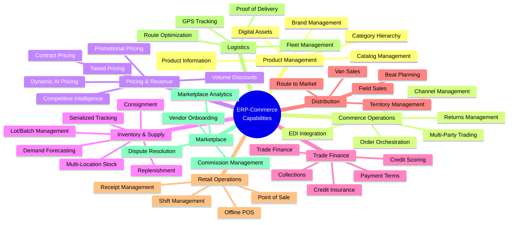
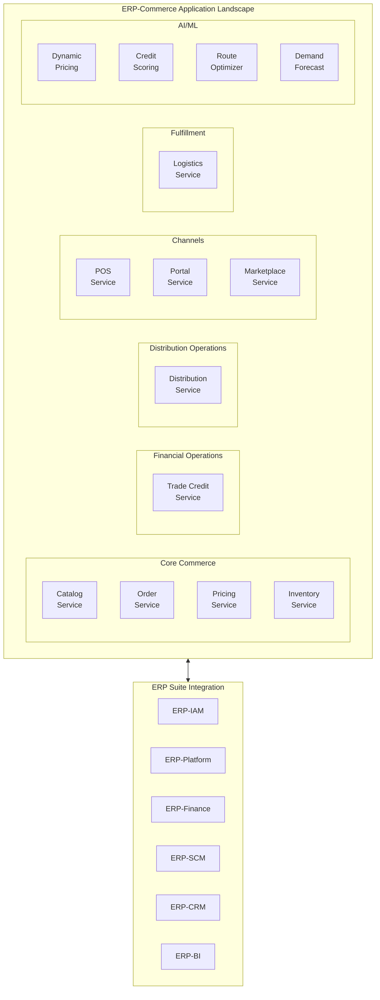
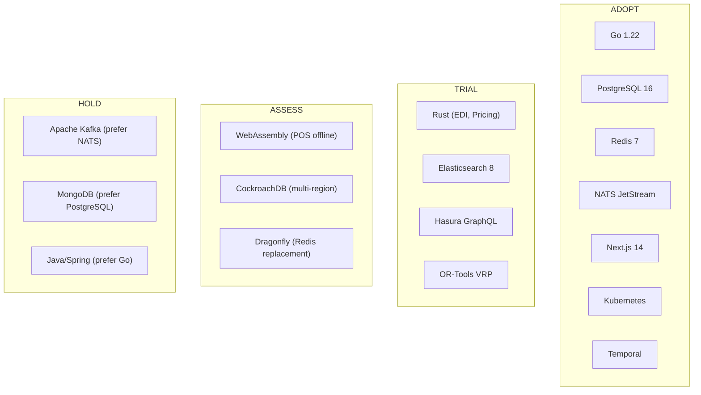
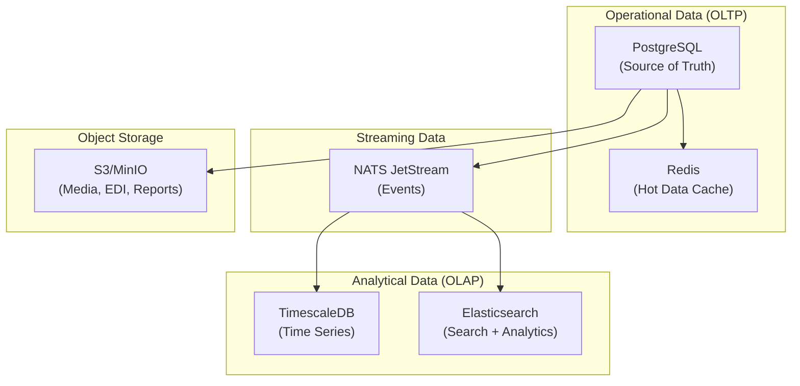

# ERP-Commerce -- Enterprise Architecture

## Document Control

| Field    | Value                                   |
|----------|-----------------------------------------|
| Module   | ERP-Commerce                            |
| Version  | 2.0                                     |
| Date     | 2026-02-23                              |

---

## 1. Business Architecture

### 1.1 Value Stream Map

```mermaid
flowchart LR
    subgraph Manufacture["Manufacture"]
        M1["Product<br/>Design"]
        M2["Production"]
        M3["Catalog<br/>Publishing"]
    end

    subgraph Distribute["Distribute"]
        D1["Warehouse<br/>Receipt"]
        D2["Inventory<br/>Management"]
        D3["Territory<br/>Coverage"]
    end

    subgraph Sell["Sell"]
        S1["Order<br/>Capture"]
        S2["Pricing &<br/>Credit"]
        S3["Order<br/>Fulfillment"]
    end

    subgraph Deliver["Deliver"]
        L1["Route<br/>Planning"]
        L2["Last-Mile<br/>Delivery"]
        L3["Proof of<br/>Delivery"]
    end

    subgraph Settle["Settle"]
        P1["Invoicing"]
        P2["Payment<br/>Collection"]
        P3["Commission<br/>Settlement"]
    end

    Manufacture --> Distribute --> Sell --> Deliver --> Settle
```

### 1.2 Business Capability Map

---

## 2. Application Architecture

### 2.1 Application Landscape

### 2.2 Application Integration Patterns

| Pattern              | Usage                                    | Technology          |
|----------------------|------------------------------------------|---------------------|
| Request-Reply        | Synchronous API calls                    | REST/gRPC           |
| Event-Driven         | Asynchronous state changes               | NATS JetStream      |
| Saga                 | Distributed transactions                 | Temporal workflows  |
| CQRS                 | Separate read/write models (orders)      | PostgreSQL + Redis  |
| API Gateway          | External API exposure                    | Kong/Envoy          |
| BFF                  | Portal-specific API aggregation          | GraphQL (Hasura)    |

---

## 3. Technology Architecture

### 3.1 Technology Radar

### 3.2 Technology Standards

| Layer               | Mandated Technology                       | Rationale                          |
|--------------------|-------------------------------------------|------------------------------------|
| Service Language   | Go 1.22+                                  | Concurrency, simplicity, perf      |
| AI/ML              | Python 3.12+                              | ML ecosystem (scikit, TF)          |
| High-Performance   | Rust 1.75+                                | Zero-cost abstractions, safety     |
| Frontend           | Next.js 14 + React 18 + TypeScript        | SSR, type safety, ecosystem        |
| Database           | PostgreSQL 16                              | RLS, JSONB, performance            |
| Cache              | Redis 7                                    | Caching, sessions, pub/sub         |
| Search             | Elasticsearch 8                            | Full-text search, analytics        |
| Events             | NATS JetStream                             | Lightweight, durable streams       |
| Workflows          | Temporal                                   | Durable execution, visibility      |
| Container          | Kubernetes                                 | Orchestration, scaling             |
| Observability      | OpenTelemetry + Prometheus + Grafana       | Standard observability stack       |

---

## 4. Data Architecture

### 4.1 Data Flow Architecture

### 4.2 Data Ownership Matrix

| Data Domain         | Owning Service          | Shared With                     |
|--------------------|------------------------|----------------------------------|
| Products/Catalog    | catalog-service        | All services (read)              |
| Orders              | order-service          | All services (events)            |
| Pricing Rules       | pricing-service        | catalog, order, pos (read)       |
| Inventory           | inventory-service      | order, pos, distribution (events)|
| Credit Accounts     | trade-credit-service   | order, portal (read)             |
| Territories         | distribution-service   | logistics, portal (read)         |
| POS Transactions    | pos-service            | inventory, finance (events)      |
| Deliveries          | logistics-service      | order, portal (events)           |
| Vendor Profiles     | marketplace-service    | catalog, portal (read)           |

---

## 5. Governance Model

### 5.1 Decision Rights

| Decision Area              | Decision Maker          | Escalation Path         |
|---------------------------|------------------------|-------------------------|
| Service API contracts      | Service team lead       | Architecture board       |
| Database schema changes    | Service team lead       | DBA + Architecture board|
| New technology adoption    | Architecture board      | CTO                     |
| Security policy changes    | Security team           | CISO                    |
| Cross-module integration   | Platform architect      | Architecture board       |
| Production deployment      | Service team lead       | Engineering manager      |

### 5.2 Architecture Review Board

Meets bi-weekly to review:
- New service proposals
- Technology adoption requests
- Cross-cutting architectural concerns
- Performance and scalability reviews
- Security architecture changes

---

## 6. Non-Functional Architecture Targets

| Quality Attribute | Target                  | Measurement Method          |
|-------------------|------------------------|-----------------------------|
| Performance       | < 200ms p95 API        | Prometheus + k6 benchmarks  |
| Availability      | 99.9% uptime           | Uptime monitoring           |
| Scalability       | 100K concurrent users  | Load testing                |
| Security          | SOC 2 Type II          | Annual audit                |
| Maintainability   | < 1 day to onboard dev | Developer survey             |
| Portability       | Multi-cloud ready      | Kubernetes + Terraform       |
| Observability     | < 5 min root cause     | MTTR tracking                |
