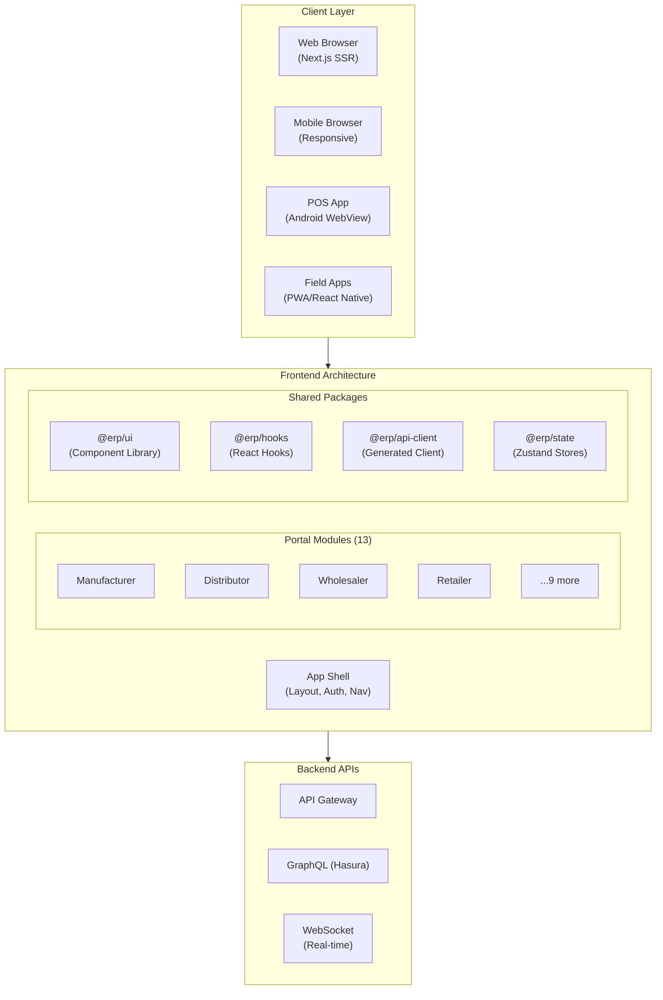
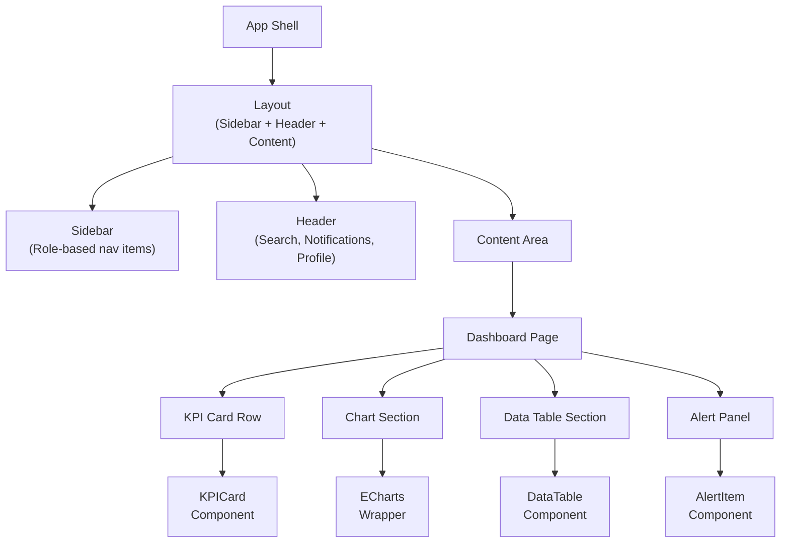
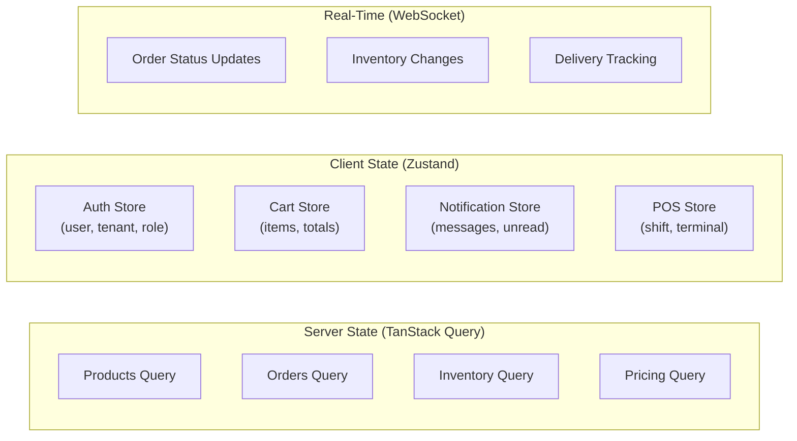
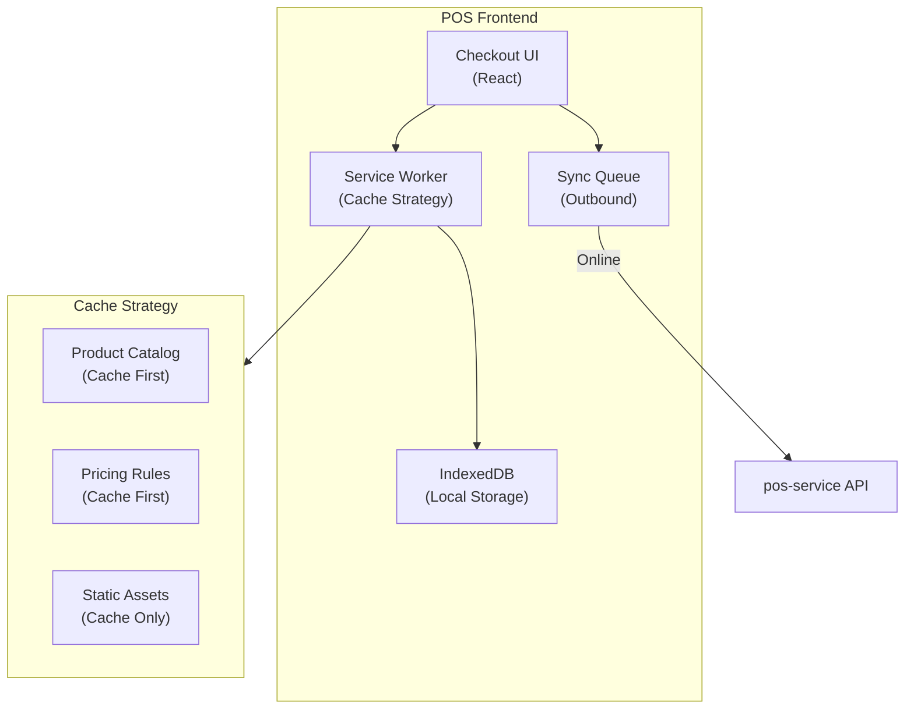

# ERP-Commerce -- Frontend Architecture

## Document Control

| Field    | Value                                   |
|----------|-----------------------------------------|
| Module   | ERP-Commerce                            |
| Version  | 2.0                                     |
| Date     | 2026-02-23                              |

---

## 1. Frontend Architecture Overview



---

## 2. Technology Stack

| Layer              | Technology                | Version  | Purpose                        |
|--------------------|--------------------------|----------|--------------------------------|
| Framework          | Next.js                  | 14+      | SSR, routing, API routes       |
| UI Library         | React                    | 18+      | Component rendering            |
| Language           | TypeScript               | 5.x      | Type safety                    |
| Component Library  | Ant Design               | 5.x      | Enterprise UI components       |
| State Management   | Zustand                  | 4.x      | Client-side state              |
| Server State       | TanStack Query           | 5.x      | API data management            |
| Forms              | React Hook Form          | 7.x      | Form handling + validation     |
| Validation         | Zod                      | 3.x      | Schema validation              |
| Charts             | Apache ECharts           | 5.x      | Data visualizations            |
| Maps               | Mapbox GL JS             | 3.x      | Interactive maps               |
| Tables             | TanStack Table           | 8.x      | Data tables with sorting/filter|
| Date               | Day.js                   | 1.x      | Date manipulation              |
| Icons              | Lucide React             | Latest   | Icon library                   |
| Testing            | Vitest + Playwright      | Latest   | Unit + E2E testing             |
| Bundler            | Turbopack (via Next.js)  | Latest   | Build tooling                  |

---

## 3. Project Structure

```
apps/
  web/
    shell/                    # App shell (shared layout)
      app/
        layout.tsx            # Root layout
        page.tsx              # Landing/redirect
        providers.tsx         # Auth, theme, query providers
        (auth)/
          login/page.tsx      # Login page
          callback/page.tsx   # OIDC callback
      components/
        sidebar.tsx           # Navigation sidebar
        header.tsx            # Top bar with search, notifications
        breadcrumb.tsx        # Breadcrumb navigation
    portals/
      manufacturer/           # Manufacturer portal
        app/
          dashboard/page.tsx
          catalog/page.tsx
          pricing/page.tsx
          distribution/page.tsx
          analytics/page.tsx
      distributor/            # Distributor portal
        app/
          dashboard/page.tsx
          orders/page.tsx
          inventory/page.tsx
          routes/page.tsx
          van-sales/page.tsx
      retailer/               # Retailer portal
        app/
          dashboard/page.tsx
          order/page.tsx
          credit/page.tsx
      pos/                    # POS application
        app/
          checkout/page.tsx
          shift/page.tsx
          sync/page.tsx
      ...                     # 9 more portals
packages/
  ui/                         # Shared component library
    src/
      components/
        ProductCard.tsx
        OrderTimeline.tsx
        CreditGauge.tsx
        PriceDisplay.tsx
        DeliveryMap.tsx
        KPICard.tsx
        DataTable.tsx
      theme/
        tokens.ts
        dark-theme.ts
  hooks/                      # Shared React hooks
    src/
      useAuth.ts
      useTenant.ts
      useProducts.ts
      useOrders.ts
      useInventory.ts
      useRealTime.ts
  api-client/                 # Generated API client
    src/
      catalog.ts
      orders.ts
      pricing.ts
      inventory.ts
      trade-credit.ts
      distribution.ts
      pos.ts
      logistics.ts
      marketplace.ts
  state/                      # Zustand stores
    src/
      cart-store.ts
      auth-store.ts
      notification-store.ts
```

---

## 4. Component Architecture

### 4.1 Component Hierarchy



### 4.2 Shared Component Library

| Component       | Description                                   | Used In               |
|-----------------|-----------------------------------------------|-----------------------|
| `KPICard`       | Metric card with value, trend, sparkline      | All dashboards        |
| `DataTable`     | Sortable, filterable table with pagination    | All list views        |
| `ProductCard`   | Product display with price and stock badge    | Catalog, marketplace  |
| `OrderTimeline` | Vertical timeline of order status changes     | Order detail views    |
| `CreditGauge`   | Circular gauge for credit utilization         | Credit views          |
| `PriceDisplay`  | Formatted price with currency and discount    | Catalog, cart, POS    |
| `DeliveryMap`   | Interactive map with route and stop pins      | Logistics, delivery   |
| `StatusBadge`   | Color-coded status indicator                  | All entity lists      |
| `SearchBar`     | Global search with Cmd+K shortcut            | App shell header      |
| `NotificationBell` | Bell icon with unread count badge          | App shell header      |

---

## 5. State Management

### 5.1 State Architecture



### 5.2 Data Fetching Pattern

```typescript
// TanStack Query hook pattern
export function useOrders(filters: OrderFilters) {
  return useQuery({
    queryKey: ['orders', filters],
    queryFn: () => apiClient.orders.list(filters),
    staleTime: 30_000,  // 30 seconds
    refetchInterval: 60_000, // 1 minute auto-refresh
  });
}

// Mutation with optimistic update
export function useCreateOrder() {
  const queryClient = useQueryClient();
  return useMutation({
    mutationFn: (data: CreateOrderRequest) =>
      apiClient.orders.create(data),
    onSuccess: () => {
      queryClient.invalidateQueries({ queryKey: ['orders'] });
    },
  });
}
```

---

## 6. POS Frontend Architecture

### 6.1 Offline-First Design



The POS frontend uses a **Service Worker** with **Cache-First** strategy for product catalog and pricing data. Transactions are stored in **IndexedDB** and synced via the outbound queue when online.

---

## 7. Performance Optimization

| Technique               | Implementation                              | Impact               |
|-------------------------|--------------------------------------------|-----------------------|
| Server-Side Rendering   | Next.js SSR for initial page load          | < 1.5s FCP           |
| Code Splitting          | Dynamic imports per portal module          | < 200KB initial JS   |
| Image Optimization      | Next.js Image component with WebP          | 40% size reduction   |
| Virtual Scrolling       | TanStack Virtual for large lists           | Smooth 10K+ rows     |
| Memoization             | React.memo + useMemo for expensive renders | Reduced re-renders   |
| Prefetching             | Next.js link prefetch for likely routes    | Near-instant nav     |
| Edge Caching            | CloudFlare for static assets               | < 50ms global TTFB   |

### 7.1 Performance Budgets

| Metric                  | Budget                |
|-------------------------|-----------------------|
| First Contentful Paint  | < 1.5 seconds         |
| Largest Contentful Paint| < 2.5 seconds         |
| Time to Interactive     | < 3.5 seconds         |
| Cumulative Layout Shift | < 0.1                 |
| Total Bundle Size       | < 500 KB (gzipped)    |
| Per-Portal Bundle       | < 200 KB (gzipped)    |

---

## 8. Accessibility

| Standard    | Target          | Audit Tool          |
|-------------|-----------------|---------------------|
| WCAG 2.1    | Level AA        | axe-core, Lighthouse|
| Keyboard Nav| Full support    | Manual testing       |
| Screen Reader| ARIA labels    | NVDA, VoiceOver      |
| Color Contrast| 4.5:1 minimum | Automated + visual   |
| Focus Management| Visible focus | Automated check     |
