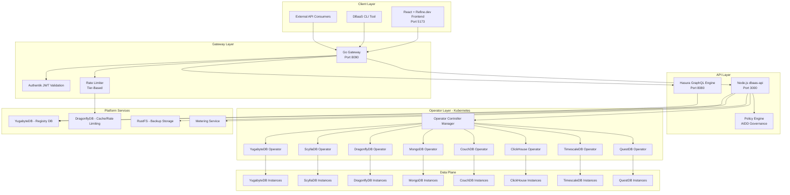
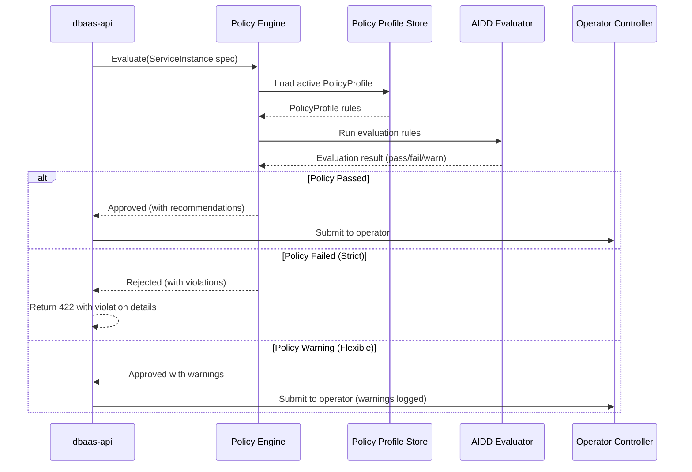

# ERP-DBaaS Technical Writeup

## Document Control

| Field             | Value                          |
|-------------------|--------------------------------|
| Document Title    | ERP-DBaaS Technical Writeup    |
| Version           | 1.0.0                         |
| Date              | 2026-02-24                     |
| Classification    | Internal - Engineering         |
| Author            | Platform Engineering Team      |

---

## 1. Executive Summary

ERP-DBaaS (Database-as-a-Service) is an enterprise-grade, multi-tenant database provisioning and lifecycle management platform purpose-built for the ERP ecosystem. It provides self-service database provisioning across eight supported database engines, delivering a unified management plane that reduces database provisioning time from days to minutes while enforcing AI-Driven Database Design (AIDD) governance policies.

The platform serves as the central data infrastructure layer for all 14+ ERP modules, enabling application teams to provision, scale, back up, and manage database instances without requiring deep database administration expertise. Through its Kubernetes-native operator model, ERP-DBaaS brings infrastructure-as-code principles to database lifecycle management, ensuring consistency, auditability, and compliance across all tenant environments.

### Key Value Propositions

- **Self-Service Provisioning**: Application teams provision databases in under 5 minutes through a guided wizard or API
- **Multi-Engine Support**: Eight database engines covering relational, document, time-series, columnar, key-value, and distributed SQL workloads
- **AIDD Governance**: AI-driven policy enforcement ensures database configurations meet organizational standards
- **Unified Management**: Single control plane for all database operations across the ERP ecosystem
- **Cost Attribution**: Per-tenant metering and quota management with granular cost visibility

---

## 2. System Architecture

### 2.1 High-Level Architecture



### 2.2 Request Flow

1. **Authentication**: All requests pass through the Go gateway (port 8090) which validates Authentik JWT tokens and extracts tenant context
2. **Rate Limiting**: DragonflyDB-backed rate limiter enforces tier-based request limits (free: 100/min, standard: 500/min, enterprise: 2000/min)
3. **Routing**: Gateway proxies requests to the Node.js dbaas-api (port 3000) or directly to Hasura for GraphQL queries
4. **Policy Evaluation**: Mutation requests (create, update, scale) pass through the AIDD policy engine before reaching operators
5. **Operator Execution**: Kubernetes operators reconcile desired state with actual state, provisioning or modifying database instances
6. **Event Propagation**: State changes are propagated back through the API layer via webhooks and GraphQL subscriptions

---

## 3. Technology Stack

### 3.1 Core Platform Components

| Component          | Technology                | Version  | Purpose                              |
|--------------------|---------------------------|----------|--------------------------------------|
| API Gateway        | Go (net/http)             | Go 1.22  | Authentication, routing, rate limiting |
| API Server         | Node.js (Express/TypeScript) | Node 20 | Business logic, orchestration        |
| GraphQL Engine     | Hasura                    | v2.38    | Real-time GraphQL API                |
| Registry Database  | YugabyteDB                | 2.20     | Platform metadata, tenant data       |
| Cache Layer        | DragonflyDB               | 1.15     | Rate limiting, session cache         |
| Backup Storage     | RustFS                    | 1.0      | S3-compatible backup object storage  |
| Frontend           | React + Refine.dev        | React 18 | Admin UI with Ant Design             |

### 3.2 Supported Database Engines

| Engine       | Category         | Use Cases                                    | Operator Version |
|--------------|------------------|----------------------------------------------|-----------------|
| YugabyteDB   | Distributed SQL  | ERP module primary databases, OLTP           | v2.20           |
| ScyllaDB     | Wide-Column      | High-throughput event stores, audit logs      | v1.12           |
| DragonflyDB  | In-Memory KV     | Caching, session management, rate limiting    | v1.15           |
| MongoDB      | Document Store   | Flexible schema workloads, CMS content        | v0.9            |
| CouchDB      | Document Store   | Offline-first sync, mobile backends           | v3.3            |
| ClickHouse   | Columnar OLAP    | Analytics, reporting, data warehousing         | v0.22           |
| TimescaleDB  | Time-Series      | IoT telemetry, metrics, monitoring data        | v0.15           |
| QuestDB      | Time-Series      | High-ingest time-series, financial tick data   | v7.4            |

### 3.3 Frontend Stack

| Library/Framework | Purpose                        |
|-------------------|--------------------------------|
| React 18          | UI framework                   |
| Refine.dev 4.x    | Admin panel framework           |
| Ant Design 5.x    | Component library (blue theme)  |
| graphql-request   | GraphQL client                  |
| graphql-ws        | GraphQL subscriptions           |
| Vite 5.x          | Build tool                      |

---

## 4. AIDD Governance Model

### 4.1 Overview

AI-Driven Database Design (AIDD) is the governance framework that ensures all database instances conform to organizational standards. It operates through policy profiles that define constraints and recommendations for database provisioning and management.

### 4.2 Policy Profiles

**Strict Profile**
- Enforced in production environments
- All configuration parameters must fall within approved ranges
- Backup schedules are mandatory with minimum retention of 30 days
- High availability (HA) mode is required for all engines that support it
- Resource limits cannot exceed tenant quota allocations
- Encryption at rest and in transit is mandatory

**Flexible Profile**
- Used in development and staging environments
- Configuration recommendations are provided but not enforced
- Backup schedules are recommended but optional
- Single-node deployments are permitted
- Resource limits are advisory with soft quotas
- Encryption in transit is required; at rest is recommended

### 4.3 Policy Evaluation Pipeline



---

## 5. Key Architectural Decisions

### ADR-001: Kubernetes Operator Pattern for Database Lifecycle

**Context**: Database provisioning requires managing complex lifecycle operations including creation, scaling, backup, restore, and decommissioning across multiple database engines.

**Decision**: Adopt the Kubernetes operator pattern with Custom Resource Definitions (CRDs) for each database engine.

**Rationale**: Operators provide declarative lifecycle management, self-healing capabilities, and native Kubernetes integration. The CRD model enables GitOps workflows and infrastructure-as-code practices.

### ADR-002: Separate Go Gateway and Node.js API

**Context**: The API layer needs to handle both high-throughput routing/authentication and complex business logic with database orchestration.

**Decision**: Split the API layer into a lightweight Go gateway for routing and authentication, and a Node.js API server for business logic.

**Rationale**: Go provides superior performance for the gateway's connection-handling and JWT validation workload. Node.js with TypeScript provides developer productivity advantages for the business logic layer, with excellent Kubernetes client library support.

### ADR-003: DragonflyDB for Cache and Rate Limiting

**Context**: The platform requires a high-performance cache layer for rate limiting and session management.

**Decision**: Use DragonflyDB as the cache layer instead of Redis.

**Rationale**: DragonflyDB offers Redis-compatible APIs with significantly better memory efficiency and multi-threaded performance. As a supported engine in the platform, using it internally demonstrates confidence in the technology.

### ADR-004: RustFS for Backup Object Storage

**Context**: Database backups require reliable, S3-compatible object storage with strong durability guarantees.

**Decision**: Use RustFS as the backup storage backend.

**Rationale**: RustFS provides S3-compatible APIs with high performance and low resource overhead. Its Rust-based implementation offers memory safety guarantees critical for a storage system handling database backups.

### ADR-005: AIDD Policy Engine as a Pre-Admission Controller

**Context**: Governance policies must be enforced before database instances are provisioned to prevent non-compliant configurations.

**Decision**: Implement the AIDD policy engine as a synchronous pre-admission check in the API layer, evaluated before any CRD is submitted to Kubernetes.

**Rationale**: Pre-admission evaluation provides immediate feedback to users and prevents non-compliant resources from ever reaching the cluster. This is more user-friendly than Kubernetes admission webhooks, which provide opaque rejection messages.

---

## 6. Performance Characteristics

### 6.1 Provisioning Latency

| Engine       | Small Instance | Medium Instance | Large Instance |
|--------------|---------------|-----------------|----------------|
| YugabyteDB   | ~90s          | ~150s           | ~300s          |
| ScyllaDB     | ~60s          | ~120s           | ~240s          |
| DragonflyDB  | ~15s          | ~30s            | ~45s           |
| MongoDB      | ~45s          | ~90s            | ~180s          |
| CouchDB      | ~30s          | ~60s            | ~120s          |
| ClickHouse   | ~60s          | ~120s           | ~240s          |
| TimescaleDB  | ~45s          | ~90s            | ~180s          |
| QuestDB      | ~30s          | ~60s            | ~120s          |

### 6.2 API Performance Targets

| Metric                     | Target      |
|----------------------------|-------------|
| Gateway p50 latency        | < 5ms       |
| Gateway p99 latency        | < 25ms      |
| API p50 latency (reads)    | < 50ms      |
| API p99 latency (reads)    | < 200ms     |
| API p50 latency (mutations)| < 100ms     |
| API p99 latency (mutations)| < 500ms     |
| GraphQL subscription delay | < 100ms     |
| Concurrent connections     | 10,000+     |

### 6.3 Throughput

| Tier        | Rate Limit   | Burst  |
|-------------|-------------|--------|
| Free        | 100/min     | 20     |
| Standard    | 500/min     | 100    |
| Enterprise  | 2,000/min   | 500    |

---

## 7. Security Architecture

### 7.1 Authentication

- **Identity Provider**: Authentik (OIDC/OAuth2)
- **Token Format**: JWT with RS256 signing
- **Token Claims**: `tenant_id`, `roles[]`, `tier`, `email`, `sub`
- **Token Validation**: Go gateway validates JWT signature, expiry, and issuer before forwarding requests

### 7.2 Authorization (RBAC)

| Role             | Permissions                                                    |
|------------------|----------------------------------------------------------------|
| `dbaas_admin`    | Full CRUD on all resources, tenant management, policy management |
| `dbaas_operator` | Provision, scale, backup, restore instances; view policies      |
| `dbaas_viewer`   | Read-only access to instances, metrics, and backup status       |

### 7.3 Data Security

- **Encryption at Rest**: AES-256 for all persistent data; managed through Kubernetes secrets
- **Encryption in Transit**: TLS 1.3 for all inter-service communication
- **Credential Management**: Database credentials stored in Kubernetes Secrets with automated rotation
- **Backup Encryption**: All backups encrypted with tenant-specific keys before storage in RustFS
- **Network Isolation**: Network policies enforce tenant namespace isolation in Kubernetes

### 7.4 Audit Trail

All operations are logged with the following attributes:
- Timestamp (UTC)
- Tenant ID
- User ID and email
- Action performed
- Resource type and identifier
- Source IP address
- Result (success/failure)
- Policy evaluation results

---

## 8. Compliance and Standards

### 8.1 Regulatory Alignment

| Standard   | Relevance                                  | Status      |
|------------|---------------------------------------------|-------------|
| SOC 2      | Security controls, audit logging            | Implemented |
| GDPR       | Data isolation, right to erasure            | Implemented |
| ISO 27001  | Information security management             | Aligned     |
| PCI DSS    | Encryption, access controls (if applicable) | Aligned     |

### 8.2 Operational Standards

- **SLA Target**: 99.95% uptime for the management plane
- **RPO**: Configurable per instance (minimum 1 hour for strict profile)
- **RTO**: < 30 minutes for managed restore operations
- **Backup Retention**: Configurable (7-365 days; minimum 30 days in strict profile)
- **Incident Response**: Integrated with platform alerting and on-call rotation

---

## 9. Deployment Model

### 9.1 Infrastructure Requirements

```
Kubernetes Cluster:
  - Control Plane: 3 nodes (HA)
  - Worker Nodes: 6+ nodes (auto-scaling)
  - Storage: CSI driver with dynamic provisioning
  - Networking: CNI with NetworkPolicy support

Platform Services:
  - YugabyteDB (registry): 3-node RF3 cluster
  - DragonflyDB (cache): 2-node HA pair
  - RustFS (backups): 4-node erasure-coded cluster
  - Hasura: 2 replicas behind load balancer
```

### 9.2 Continuous Delivery

- **Pipeline**: GitOps with ArgoCD
- **Image Registry**: Harbor (internal)
- **Configuration**: Helm charts with Kustomize overlays per environment
- **Promotion**: dev -> staging -> production with automated policy gates
- **Rollback**: Automated rollback on failed health checks within 5 minutes

---

## 10. Future Roadmap

| Quarter  | Feature                                         |
|----------|--------------------------------------------------|
| Q2 2026  | Multi-region support, cross-region replication    |
| Q3 2026  | AI-powered capacity planning and auto-scaling     |
| Q3 2026  | Database migration wizard (cross-engine)          |
| Q4 2026  | Serverless database instances                     |
| Q1 2027  | Marketplace for community database plugins        |

---

*This document is maintained by the Platform Engineering team and is reviewed quarterly.*
