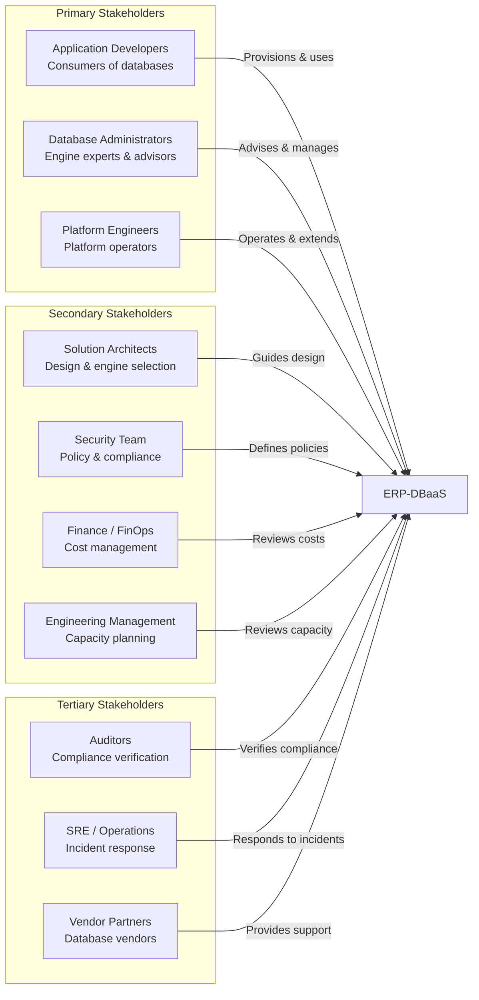
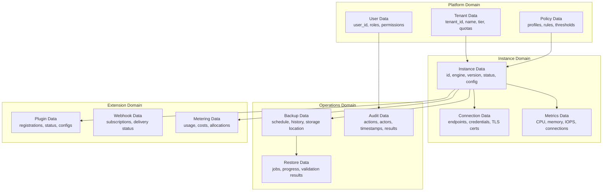
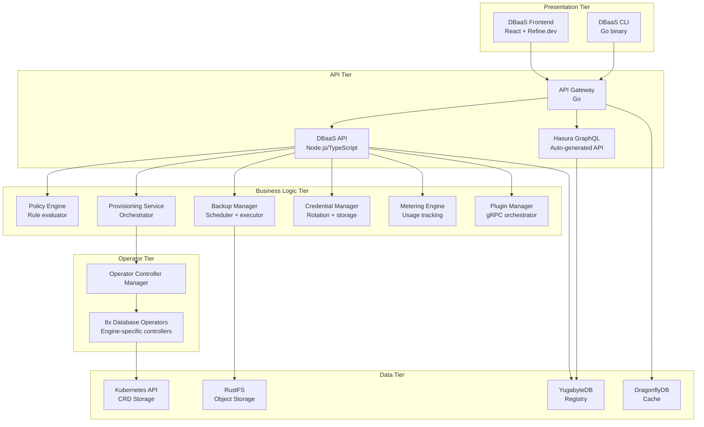
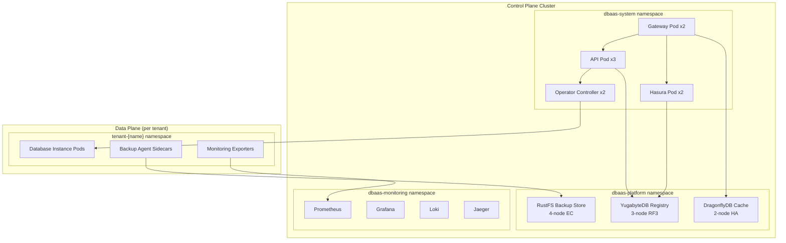

# ERP-DBaaS Enterprise Architecture

## Document Control

| Field             | Value                                  |
|-------------------|----------------------------------------|
| Document Title    | ERP-DBaaS Enterprise Architecture      |
| Version           | 1.0.0                                 |
| Date              | 2026-02-24                             |
| Framework         | TOGAF ADM Aligned                      |
| Classification    | Internal - Architecture                |

---

## 1. Business Architecture

### 1.1 Strategic Context

ERP-DBaaS exists within the broader ERP ecosystem as the foundational data infrastructure platform. It addresses the strategic imperative of enabling rapid, governed database provisioning across all 14+ ERP modules while maintaining security, compliance, and cost control.

**Strategic Alignment**:
- **Digital Transformation**: Enables self-service infrastructure as part of the organization's cloud-native transformation
- **Developer Productivity**: Removes database provisioning as a bottleneck in the application delivery pipeline
- **Operational Excellence**: Standardizes database operations, reducing toil and human error
- **Cost Optimization**: Provides visibility into database resource consumption and enables right-sizing

### 1.2 Business Capability Map

```mermaid
graph TB
    subgraph "Level 0: Database-as-a-Service"
        subgraph "Level 1: Self-Service Provisioning"
            L2_EP[Engine Selection & Planning]
            L2_IC[Instance Configuration]
            L2_LM[Lifecycle Management]
            L2_DR[Decommissioning & Cleanup]
        end

        subgraph "Level 1: Data Protection"
            L2_BS[Backup Scheduling]
            L2_BE[Backup Execution]
            L2_RR[Restore & Recovery]
            L2_RP[Retention Policy Management]
        end

        subgraph "Level 1: Governance & Compliance"
            L2_PE[Policy Enforcement (AIDD)]
            L2_AL[Audit Logging]
            L2_CM[Credential Management]
            L2_QM[Quota Management]
        end

        subgraph "Level 1: Observability"
            L2_HM[Health Monitoring]
            L2_PM[Performance Metrics]
            L2_AM[Alerting & Notification]
            L2_CR[Capacity Reporting]
        end

        subgraph "Level 1: Platform Operations"
            L2_TM[Tenant Management]
            L2_PI[Plugin Integration]
            L2_MT[Metering & Billing]
            L2_SS[Security & Access Control]
        end
    end
```

### 1.3 Value Streams

#### Value Stream 1: Database Provisioning

**Objective**: Enable application teams to go from database request to operational instance in under 5 minutes.

| Stage               | Activity                          | Time Target | Automation Level |
|----------------------|-----------------------------------|-------------|-----------------|
| Request              | Developer selects engine and size  | 30 seconds  | Full (UI wizard) |
| Configuration        | Parameters set via presets/custom  | 60 seconds  | Assisted         |
| Policy Evaluation    | AIDD governance check             | 2 seconds   | Full             |
| Approval             | Auto-approved or manual (by tier)  | 0-60 seconds| Configurable     |
| Provisioning         | Operator creates instance          | 60-300 seconds| Full           |
| Credential Delivery  | Connection details to requester    | 5 seconds   | Full             |
| Validation           | Health check and connectivity test | 15 seconds  | Full             |

**Total Time**: 2.5-8 minutes (vs. 2-5 days in legacy process)

#### Value Stream 2: Data Protection

**Objective**: Ensure all production databases have automated, policy-compliant backup coverage.

| Stage               | Activity                           | Frequency       | Automation Level |
|----------------------|------------------------------------|-----------------|-----------------|
| Policy Definition    | Define backup requirements per env  | Per policy change| Manual          |
| Schedule Creation    | Apply backup schedule to instance   | At provisioning  | Full            |
| Backup Execution     | Run scheduled or on-demand backup   | Daily/hourly     | Full            |
| Validation           | Verify backup integrity             | Per backup       | Full            |
| Retention Mgmt       | Expire backups per policy           | Daily            | Full            |
| Restore Testing      | Periodic restore validation         | Monthly          | Semi-automatic   |

#### Value Stream 3: Governance Enforcement

**Objective**: Ensure 100% of database instances comply with organizational standards.

| Stage               | Activity                           | Trigger          | Automation Level |
|----------------------|------------------------------------|------------------|-----------------|
| Policy Authoring     | Define AIDD rules and thresholds    | Per policy update | Manual          |
| Pre-Admission Check  | Evaluate request against policy     | Every mutation    | Full            |
| Runtime Audit        | Continuous compliance scanning      | Hourly            | Full            |
| Drift Detection      | Identify configuration drift        | Continuous        | Full            |
| Remediation          | Auto-fix or alert on violations     | On detection      | Configurable    |

### 1.4 Stakeholder Map



### 1.5 Stakeholder Concerns Matrix

| Stakeholder          | Primary Concerns                                      | DBaaS Solution                                    |
|----------------------|-------------------------------------------------------|--------------------------------------------------|
| Application Developers| Fast provisioning, simple API, connection reliability | Self-service wizard, auto-generated credentials   |
| Database Administrators| Engine optimization, HA, backup integrity            | Per-engine operators, automated backups           |
| Platform Engineers   | Operational burden, scalability, extensibility         | K8s-native, plugin system, CRD-driven            |
| Solution Architects  | Right engine for right workload, data modeling        | Engine catalog with recommendations               |
| Security Team        | Access control, encryption, audit trails              | RBAC, TLS/AES-256, comprehensive audit log       |
| FinOps               | Cost visibility, resource optimization                | Per-tenant metering, quota management             |
| Engineering Management| Delivery velocity, reliability                        | <5 min provisioning, 99.95% SLA                  |
| Auditors             | Compliance evidence, change tracking                  | Immutable audit log, policy evaluation records    |
| SRE/Operations       | Alerting, incident response, runbooks                 | Integrated monitoring, health checks, auto-healing|

---

## 2. Information Architecture

### 2.1 Data Domains



### 2.2 Data Classification

| Data Category    | Classification | Retention      | Encryption | Access Level       |
|------------------|---------------|----------------|------------|-------------------|
| Tenant profiles  | Internal      | Indefinite     | At rest    | Platform admins    |
| Instance configs | Internal      | Life of instance| At rest   | Tenant operators   |
| Credentials      | Confidential  | Until rotated  | At rest + transit | Instance owner |
| Backup data      | Confidential  | Per policy     | At rest + transit | Tenant operators |
| Audit logs       | Restricted    | 7 years        | At rest + transit | Auditors + admins |
| Metrics          | Internal      | 90 days (hot), 2 years (cold) | Transit | All authenticated |
| Metering data    | Internal      | 3 years        | At rest    | FinOps + admins    |

---

## 3. Application Architecture

### 3.1 Application Portfolio



### 3.2 Application Integration Patterns

| Integration         | Pattern              | Protocol     | Data Format |
|---------------------|----------------------|--------------|-------------|
| Frontend to Gateway | Request/Response     | HTTPS        | JSON        |
| Frontend to Hasura  | Subscription         | WSS (graphql-ws) | GraphQL |
| Gateway to API      | Reverse Proxy        | HTTP         | JSON        |
| API to Operators    | CRD CRUD             | K8s API      | YAML/JSON   |
| API to Registry     | Query/Mutation       | PostgreSQL wire | SQL      |
| Operators to K8s    | Watch/Reconcile      | K8s API      | Protobuf    |
| Backup to RustFS    | Object Upload        | S3 API       | Binary      |
| Plugin to Platform  | Bidirectional RPC    | gRPC         | Protobuf    |
| Metering to Store   | Event Streaming      | Internal     | JSON        |

---

## 4. Technology Architecture

### 4.1 Technology Standards

| Category           | Standard                    | Rationale                              |
|--------------------|-----------------------------|----------------------------------------|
| Container Runtime  | containerd                  | K8s default, OCI compliant             |
| Container Orchestration | Kubernetes 1.28+       | Industry standard, operator support    |
| Service Mesh       | None (NetworkPolicy only)   | Reduced complexity; add when needed    |
| Observability      | Prometheus + Grafana        | De facto standard for K8s              |
| Logging            | Loki + Promtail             | Integrated with Grafana                |
| Tracing            | OpenTelemetry + Jaeger      | Vendor-neutral, K8s native             |
| CI/CD              | ArgoCD (GitOps)             | Declarative, auditable deployments     |
| Secrets            | Kubernetes Secrets + ESO    | External Secrets Operator for rotation |
| Certificate Mgmt   | cert-manager                | Automated TLS certificate lifecycle    |
| DNS                | CoreDNS + ExternalDNS       | Internal and external DNS automation   |

### 4.2 Infrastructure Topology



### 4.3 Network Architecture

| Network Segment       | CIDR             | Purpose                           |
|-----------------------|------------------|-----------------------------------|
| Pod Network           | 10.244.0.0/16    | Intra-cluster pod communication   |
| Service Network       | 10.96.0.0/16     | Kubernetes service ClusterIPs     |
| Ingress Network       | External LB      | External access to gateway        |
| Tenant Isolation      | NetworkPolicy    | Per-namespace tenant isolation    |
| Backup Network        | Internal only    | RustFS communication              |
| Management Network    | Restricted       | K8s API server, etcd              |

---

## 5. Governance Architecture

### 5.1 Architecture Governance

| Governance Area    | Mechanism                   | Frequency    |
|--------------------|------------------------------|-------------|
| Architecture Review| Architecture Review Board     | Bi-weekly   |
| CRD Schema Changes | RFC process + peer review     | Per change  |
| New Engine Addition | ADR + capability assessment   | Per request |
| Policy Updates     | Change Advisory Board         | Monthly     |
| Security Review    | Automated scanning + manual   | Continuous  |
| Capacity Planning  | Quarterly capacity review     | Quarterly   |

### 5.2 Decision Rights (RACI)

| Decision                     | Platform Eng | DBAs | Security | FinOps | Arch Board |
|------------------------------|-------------|------|----------|--------|------------|
| Add new database engine      | R           | C    | C        | I      | A          |
| Modify AIDD policy rules     | R           | C    | A        | I      | I          |
| Change quota defaults        | R           | I    | I        | A      | I          |
| Approve production instance  | I           | R    | C        | I      | A          |
| Emergency credential rotation| R           | A    | C        | I      | I          |
| Plugin approval              | A           | C    | R        | I      | I          |

*R = Responsible, A = Accountable, C = Consulted, I = Informed*

---

## 6. Migration and Transition Architecture

### 6.1 Legacy Database Migration

For ERP modules currently using manually provisioned databases, the transition to DBaaS follows a phased approach:

**Phase 1 - Shadow Mode (Weeks 1-4)**:
- Deploy DBaaS alongside existing infrastructure
- Provision new databases through DBaaS for new features
- Monitor DBaaS platform stability

**Phase 2 - Parallel Operations (Weeks 5-12)**:
- Migrate non-critical databases to DBaaS-managed instances
- Validate backup/restore workflows
- Train teams on self-service provisioning

**Phase 3 - Full Adoption (Weeks 13-20)**:
- Migrate remaining databases to DBaaS
- Decommission legacy provisioning processes
- Enforce AIDD strict profile in production

**Phase 4 - Optimization (Ongoing)**:
- Enable advanced features (plugins, cross-region, auto-scaling)
- Implement cost optimization recommendations
- Continuous policy refinement

### 6.2 Coexistence Strategy

During migration, both legacy and DBaaS-managed instances coexist:
- Legacy instances are registered as "unmanaged" in the DBaaS registry for visibility
- Monitoring covers both managed and unmanaged instances
- Quota calculations include unmanaged instance resource usage
- Migration tooling assists with import of existing databases into DBaaS management

---

## 7. Risk Assessment

| Risk                          | Likelihood | Impact | Mitigation                                      |
|-------------------------------|-----------|--------|--------------------------------------------------|
| Operator bug causes data loss | Low       | Critical| Mandatory backups, operator testing, canary deploys |
| Platform outage blocks provisioning | Medium | High | HA deployment, manual fallback procedures        |
| Quota exhaustion blocks critical provisioning | Medium | High | Emergency quota override process, alerting |
| Policy misconfiguration blocks legitimate requests | Medium | Medium | Policy dry-run mode, gradual enforcement |
| Plugin vulnerability compromises platform | Low | High | Plugin sandboxing, security scanning, approval process |
| Cost overrun from uncontrolled provisioning | Medium | Medium | Quota system, approval workflows, cost alerts |

---

## 8. Architecture Principles

| # | Principle                    | Rationale                                         |
|---|------------------------------|---------------------------------------------------|
| 1 | Kubernetes-Native First      | Leverage K8s primitives for lifecycle, scaling, and resilience |
| 2 | Declarative Over Imperative  | CRDs define desired state; operators reconcile     |
| 3 | Tenant Isolation by Default  | Every resource is scoped to a tenant namespace     |
| 4 | Policy as Code               | Governance rules are version-controlled and testable |
| 5 | Extensibility via Plugins    | Platform capabilities grow without core changes    |
| 6 | Observe Everything           | Metrics, logs, and traces for all operations       |
| 7 | Secure by Default            | Encryption, RBAC, and audit logging are non-optional |
| 8 | Cost Transparency            | Every resource is metered and attributable          |

---

*This enterprise architecture document is maintained by the Architecture team and is reviewed quarterly in alignment with the Architecture Review Board schedule.*
