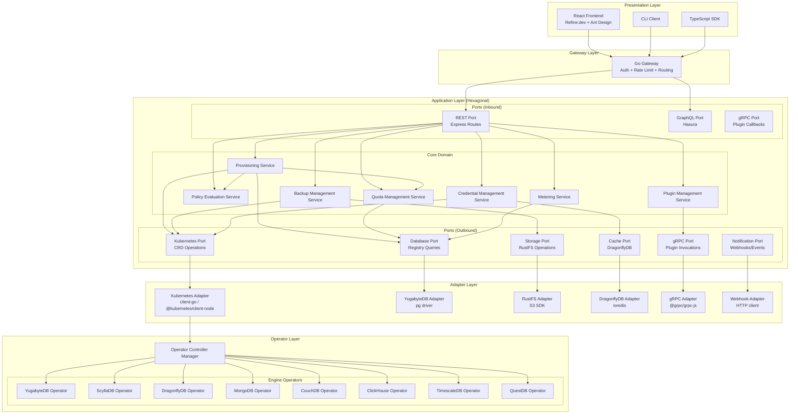
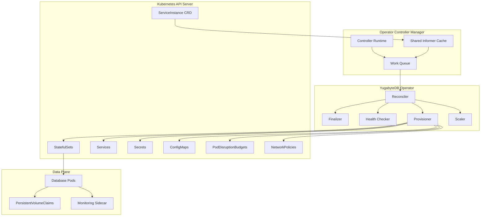
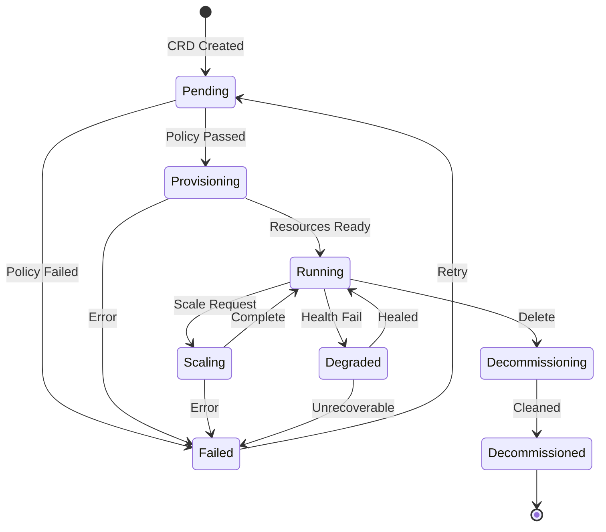
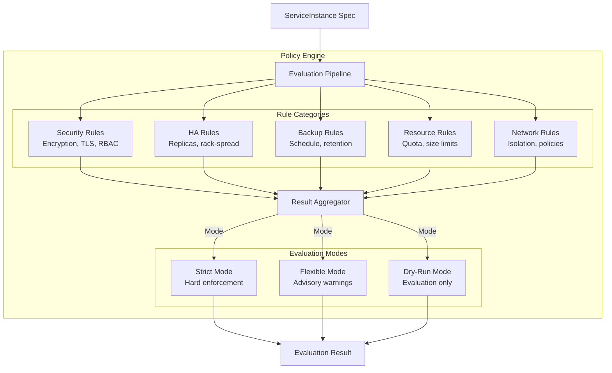
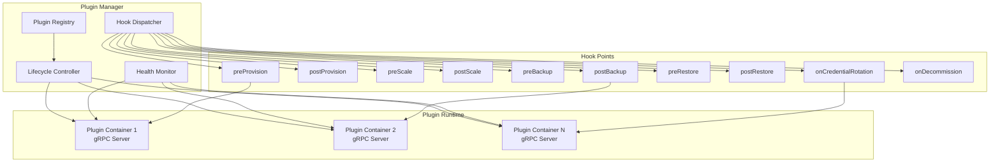
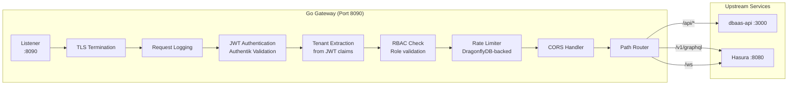

# ERP-DBaaS Software Architecture

## Document Control

| Field             | Value                                |
|-------------------|--------------------------------------|
| Document Title    | ERP-DBaaS Software Architecture      |
| Version           | 1.0.0                               |
| Date              | 2026-02-24                           |
| Classification    | Internal - Engineering               |

---

## 1. Architecture Overview

ERP-DBaaS employs a layered architecture combining hexagonal (ports and adapters) principles in the API layer with the Kubernetes operator pattern in the data plane. This design maximizes separation of concerns, testability, and extensibility while leveraging Kubernetes as the orchestration substrate for database instance lifecycle management.

### 1.1 Architecture Layers



---

## 2. Hexagonal Architecture (API Layer)

### 2.1 Design Principles

The Node.js dbaas-api follows hexagonal architecture (also known as Ports and Adapters) to achieve:

1. **Technology Independence**: Core business logic has no dependencies on frameworks, databases, or external services
2. **Testability**: Core services can be tested with mock adapters without requiring infrastructure
3. **Flexibility**: Adapters can be swapped without changing business logic (e.g., swap RustFS for MinIO)
4. **Clarity**: Clear boundaries between what the system does (core) and how it integrates (adapters)

### 2.2 Project Structure

```
dbaas-api/
├── src/
│   ├── core/                          # Pure business logic (no external deps)
│   │   ├── domain/
│   │   │   ├── models/
│   │   │   │   ├── ServiceInstance.ts
│   │   │   │   ├── BackupPolicy.ts
│   │   │   │   ├── RestoreJob.ts
│   │   │   │   ├── PolicyProfile.ts
│   │   │   │   ├── PluginRegistration.ts
│   │   │   │   ├── TenantDataPlane.ts
│   │   │   │   ├── Quota.ts
│   │   │   │   └── MeteringRecord.ts
│   │   │   ├── events/
│   │   │   │   ├── InstanceCreated.ts
│   │   │   │   ├── InstanceScaled.ts
│   │   │   │   ├── BackupCompleted.ts
│   │   │   │   ├── CredentialRotated.ts
│   │   │   │   └── PolicyViolation.ts
│   │   │   └── errors/
│   │   │       ├── PolicyViolationError.ts
│   │   │       ├── QuotaExceededError.ts
│   │   │       ├── EngineNotSupportedError.ts
│   │   │       └── InstanceNotFoundError.ts
│   │   ├── services/
│   │   │   ├── ProvisioningService.ts
│   │   │   ├── BackupManagementService.ts
│   │   │   ├── PolicyEvaluationService.ts
│   │   │   ├── CredentialManagementService.ts
│   │   │   ├── QuotaManagementService.ts
│   │   │   ├── MeteringService.ts
│   │   │   └── PluginManagementService.ts
│   │   └── ports/
│   │       ├── inbound/
│   │       │   ├── IProvisioningPort.ts
│   │       │   ├── IBackupPort.ts
│   │       │   ├── IPolicyPort.ts
│   │       │   ├── ICredentialPort.ts
│   │       │   ├── IQuotaPort.ts
│   │       │   └── IPluginPort.ts
│   │       └── outbound/
│   │           ├── IKubernetesPort.ts
│   │           ├── IDatabasePort.ts
│   │           ├── IStoragePort.ts
│   │           ├── ICachePort.ts
│   │           ├── IPluginRPCPort.ts
│   │           └── INotificationPort.ts
│   ├── adapters/
│   │   ├── inbound/
│   │   │   ├── rest/
│   │   │   │   ├── instanceRoutes.ts
│   │   │   │   ├── backupRoutes.ts
│   │   │   │   ├── policyRoutes.ts
│   │   │   │   ├── credentialRoutes.ts
│   │   │   │   ├── quotaRoutes.ts
│   │   │   │   ├── pluginRoutes.ts
│   │   │   │   └── meteringRoutes.ts
│   │   │   └── grpc/
│   │   │       └── pluginCallbackServer.ts
│   │   └── outbound/
│   │       ├── kubernetes/
│   │       │   ├── KubernetesAdapter.ts
│   │       │   ├── crdTemplates/
│   │       │   │   ├── serviceInstance.ts
│   │       │   │   ├── backupPolicy.ts
│   │       │   │   ├── restoreJob.ts
│   │       │   │   └── pluginRegistration.ts
│   │       │   └── watchers/
│   │       │       ├── instanceWatcher.ts
│   │       │       └── backupWatcher.ts
│   │       ├── database/
│   │       │   └── YugabyteDBAdapter.ts
│   │       ├── storage/
│   │       │   └── RustFSAdapter.ts
│   │       ├── cache/
│   │       │   └── DragonflyDBAdapter.ts
│   │       ├── grpc/
│   │       │   └── PluginGRPCAdapter.ts
│   │       └── notification/
│   │           ├── WebhookAdapter.ts
│   │           └── SlackAdapter.ts
│   ├── config/
│   │   ├── index.ts
│   │   ├── engines.ts
│   │   └── sizePresets.ts
│   └── app.ts                         # Composition root (wire ports to adapters)
├── test/
│   ├── unit/
│   │   ├── services/
│   │   └── domain/
│   ├── integration/
│   │   └── adapters/
│   └── e2e/
├── package.json
└── tsconfig.json
```

### 2.3 Core Domain Models

```typescript
// ServiceInstance.ts
interface ServiceInstance {
  id: string;
  tenantId: string;
  name: string;
  engine: DatabaseEngine;
  version: string;
  sizePreset: SizePreset | null;
  customResources: ResourceSpec | null;
  replicas: number;
  status: InstanceStatus;
  connectionEndpoint: string | null;
  credentialSecretRef: string | null;
  backupPolicyRef: string | null;
  policyProfileRef: string;
  labels: Record<string, string>;
  annotations: Record<string, string>;
  createdAt: Date;
  updatedAt: Date;
}

type DatabaseEngine =
  | 'yugabytedb'
  | 'scylladb'
  | 'dragonflydb'
  | 'mongodb'
  | 'couchdb'
  | 'clickhouse'
  | 'timescaledb'
  | 'questdb';

type InstanceStatus =
  | 'pending'
  | 'provisioning'
  | 'running'
  | 'scaling'
  | 'backing_up'
  | 'restoring'
  | 'degraded'
  | 'failed'
  | 'decommissioning'
  | 'decommissioned';

type SizePreset = 'small' | 'medium' | 'large' | 'xlarge';

interface ResourceSpec {
  cpu: string;      // e.g., "2000m"
  memory: string;   // e.g., "4Gi"
  storage: string;  // e.g., "50Gi"
}
```

### 2.4 Port Interfaces (Outbound)

```typescript
// IKubernetesPort.ts
interface IKubernetesPort {
  createServiceInstance(spec: ServiceInstanceCRD): Promise<void>;
  updateServiceInstance(name: string, namespace: string, patch: Partial<ServiceInstanceCRD>): Promise<void>;
  deleteServiceInstance(name: string, namespace: string): Promise<void>;
  getServiceInstance(name: string, namespace: string): Promise<ServiceInstanceCRD | null>;
  listServiceInstances(namespace: string, labelSelector?: string): Promise<ServiceInstanceCRD[]>;
  watchServiceInstances(namespace: string, callback: (event: WatchEvent) => void): void;

  createBackupPolicy(spec: BackupPolicyCRD): Promise<void>;
  createRestoreJob(spec: RestoreJobCRD): Promise<void>;

  createNamespace(name: string, labels: Record<string, string>): Promise<void>;
  createNetworkPolicy(namespace: string, policy: NetworkPolicySpec): Promise<void>;
  createSecret(namespace: string, name: string, data: Record<string, string>): Promise<void>;
  rotateSecret(namespace: string, name: string, newData: Record<string, string>): Promise<void>;
}

// IStoragePort.ts
interface IStoragePort {
  uploadBackup(bucket: string, key: string, stream: ReadableStream, metadata: BackupMetadata): Promise<UploadResult>;
  downloadBackup(bucket: string, key: string): Promise<ReadableStream>;
  deleteBackup(bucket: string, key: string): Promise<void>;
  listBackups(bucket: string, prefix: string): Promise<BackupEntry[]>;
  getBackupMetadata(bucket: string, key: string): Promise<BackupMetadata>;
  calculateStorageUsage(bucket: string, prefix: string): Promise<number>;
}
```

---

## 3. Kubernetes Operator Pattern

### 3.1 Operator Architecture

Each database engine is managed by a dedicated Kubernetes operator that implements the reconciliation loop pattern. All operators are built using the kubebuilder framework in Go.



### 3.2 Reconciliation Loop

The operator reconciliation loop follows a standardized pattern across all engines:

```go
func (r *ServiceInstanceReconciler) Reconcile(ctx context.Context, req ctrl.Request) (ctrl.Result, error) {
    log := r.Log.WithValues("instance", req.NamespacedName)

    // 1. Fetch the ServiceInstance CRD
    instance := &dbaasv1alpha1.ServiceInstance{}
    if err := r.Get(ctx, req.NamespacedName, instance); err != nil {
        if apierrors.IsNotFound(err) {
            return ctrl.Result{}, nil // Resource deleted
        }
        return ctrl.Result{}, err
    }

    // 2. Handle finalizer for cleanup
    if instance.ObjectMeta.DeletionTimestamp != nil {
        return r.handleDeletion(ctx, instance)
    }
    if !controllerutil.ContainsFinalizer(instance, finalizerName) {
        controllerutil.AddFinalizer(instance, finalizerName)
        return ctrl.Result{}, r.Update(ctx, instance)
    }

    // 3. Reconcile based on current status
    switch instance.Status.Phase {
    case "":
        return r.handlePending(ctx, instance)
    case dbaasv1alpha1.PhasePending:
        return r.handleProvisioning(ctx, instance)
    case dbaasv1alpha1.PhaseProvisioning:
        return r.checkProvisioningProgress(ctx, instance)
    case dbaasv1alpha1.PhaseRunning:
        return r.handleRunning(ctx, instance)
    case dbaasv1alpha1.PhaseScaling:
        return r.handleScaling(ctx, instance)
    case dbaasv1alpha1.PhaseDegraded:
        return r.handleDegraded(ctx, instance)
    default:
        log.Info("Unknown phase", "phase", instance.Status.Phase)
        return ctrl.Result{RequeueAfter: 30 * time.Second}, nil
    }
}
```

### 3.3 Engine Adapter Pattern

Each database engine operator implements a common provisioner interface, allowing the controller manager to treat all engines uniformly:

```go
// Provisioner interface that each engine adapter must implement
type EngineProvisioner interface {
    // Provision creates the underlying database resources
    Provision(ctx context.Context, instance *v1alpha1.ServiceInstance) error

    // Scale modifies the resources allocated to the instance
    Scale(ctx context.Context, instance *v1alpha1.ServiceInstance, target ScaleTarget) error

    // Backup initiates a backup of the instance
    Backup(ctx context.Context, instance *v1alpha1.ServiceInstance, policy *v1alpha1.BackupPolicy) (*BackupResult, error)

    // Restore restores an instance from a backup
    Restore(ctx context.Context, job *v1alpha1.RestoreJob) error

    // HealthCheck returns the current health status
    HealthCheck(ctx context.Context, instance *v1alpha1.ServiceInstance) (*HealthStatus, error)

    // GetConnectionInfo returns connection details for the instance
    GetConnectionInfo(ctx context.Context, instance *v1alpha1.ServiceInstance) (*ConnectionInfo, error)

    // Deprovision removes all resources associated with the instance
    Deprovision(ctx context.Context, instance *v1alpha1.ServiceInstance) error

    // GetMetrics returns current resource utilization metrics
    GetMetrics(ctx context.Context, instance *v1alpha1.ServiceInstance) (*InstanceMetrics, error)
}
```

**Engine-Specific Implementations**:

| Engine       | StatefulSet Strategy     | Storage Class | Backup Method           |
|--------------|--------------------------|---------------|-------------------------|
| YugabyteDB   | OrderedReady, 3+ pods   | ssd-replicated| ysql_dump / PITR WAL    |
| ScyllaDB     | Parallel, rack-aware     | ssd-local     | sstableloader snapshot  |
| DragonflyDB  | OrderedReady, 1-2 pods  | ssd-replicated| RDB snapshot            |
| MongoDB      | OrderedReady, 3+ pods   | ssd-replicated| mongodump / oplog       |
| CouchDB      | Parallel, quorum-based   | ssd-replicated| Replication snapshot    |
| ClickHouse   | Parallel, shard-aware    | ssd-local     | clickhouse-backup       |
| TimescaleDB  | OrderedReady, 1-2 pods  | ssd-replicated| pg_dump / WAL archiving |
| QuestDB      | OrderedReady, 1 pod     | ssd-local     | Filesystem snapshot     |

---

## 4. CRD-Driven Lifecycle

### 4.1 ServiceInstance CRD Lifecycle

```mermaid
statechart-v2
    [*] --> Pending: CRD Created
    Pending --> Provisioning: Policy Check Passed
    Pending --> Failed: Policy Check Failed
    Provisioning --> Running: All Resources Ready
    Provisioning --> Failed: Provisioning Error
    Running --> Scaling: Scale Request
    Running --> BackingUp: Backup Triggered
    Running --> Decommissioning: Delete Requested
    Running --> Degraded: Health Check Failed
    Scaling --> Running: Scale Complete
    Scaling --> Failed: Scale Error
    BackingUp --> Running: Backup Complete
    BackingUp --> Degraded: Backup Failed
    Degraded --> Running: Auto-Healed
    Degraded --> Failed: Unrecoverable
    Decommissioning --> Decommissioned: Cleanup Complete
    Failed --> Pending: Retry Requested
    Decommissioned --> [*]
```



### 4.2 CRD Status Subresource

Each CRD maintains a status subresource that captures the current state of the resource:

```yaml
status:
  phase: Running
  conditions:
    - type: Ready
      status: "True"
      lastTransitionTime: "2026-02-24T10:00:00Z"
      reason: AllPodsReady
      message: "All 3 pods are running and healthy"
    - type: BackupScheduled
      status: "True"
      lastTransitionTime: "2026-02-24T02:00:00Z"
      reason: CronScheduleActive
      message: "Next backup at 2026-02-25T02:00:00Z"
    - type: PolicyCompliant
      status: "True"
      lastTransitionTime: "2026-02-24T09:00:00Z"
      reason: AllRulesPassed
      message: "Instance complies with strict profile"
  connectionEndpoint: "acme-yugabyte-prod-01.tenant-acme.svc.cluster.local:5433"
  replicas:
    desired: 3
    ready: 3
    updated: 3
  resources:
    allocatedCPU: "6000m"
    allocatedMemory: "12Gi"
    allocatedStorage: "150Gi"
    usedStorage: "45Gi"
  lastHealthCheck:
    timestamp: "2026-02-24T10:05:00Z"
    status: healthy
    latencyMs: 12
  observedGeneration: 5
```

---

## 5. Policy Engine Design

### 5.1 Architecture

The AIDD policy engine is implemented as a core domain service within the hexagonal architecture, with no external dependencies:



### 5.2 Rule Engine Implementation

```typescript
interface PolicyRule {
  id: string;
  category: 'security' | 'ha' | 'backup' | 'resource' | 'network';
  severity: 'critical' | 'high' | 'medium' | 'low';
  evaluate(instance: ServiceInstance, context: EvaluationContext): RuleResult;
}

interface RuleResult {
  ruleId: string;
  passed: boolean;
  severity: string;
  message: string;
  field?: string;
  currentValue?: any;
  requiredValue?: any;
  recommendation?: string;
}

interface EvaluationResult {
  approved: boolean;
  profile: 'strict' | 'flexible';
  violations: RuleResult[];
  warnings: RuleResult[];
  recommendations: RuleResult[];
  evaluatedAt: Date;
  evaluationDurationMs: number;
}
```

---

## 6. Plugin System Architecture

### 6.1 Plugin Framework



### 6.2 Plugin gRPC Interface

```protobuf
syntax = "proto3";
package dbaas.plugin.v1;

service DBaaSPlugin {
  // Called when the plugin should process a hook event
  rpc ExecuteHook(HookRequest) returns (HookResponse);

  // Health check endpoint
  rpc HealthCheck(HealthCheckRequest) returns (HealthCheckResponse);

  // Get plugin metadata
  rpc GetInfo(GetInfoRequest) returns (PluginInfo);
}

message HookRequest {
  string hook_name = 1;           // e.g., "preProvision", "postBackup"
  string instance_id = 2;
  string tenant_id = 3;
  string engine = 4;
  bytes payload = 5;              // JSON-encoded context data
  map<string, string> metadata = 6;
}

message HookResponse {
  bool success = 1;
  string message = 2;
  HookAction action = 3;
  bytes result_data = 4;         // JSON-encoded result
}

enum HookAction {
  CONTINUE = 0;    // Proceed with the operation
  ABORT = 1;       // Abort the operation (only for pre-* hooks)
  RETRY = 2;       // Retry after a delay
}
```

---

## 7. Gateway Architecture

### 7.1 Go Gateway Design



### 7.2 Rate Limiter Implementation

The rate limiter uses a sliding window algorithm backed by DragonflyDB:

```go
type RateLimiter struct {
    cache    *dragonfly.Client
    limits   map[string]TierLimit
}

type TierLimit struct {
    RequestsPerMinute int
    BurstSize         int
}

func (rl *RateLimiter) Allow(ctx context.Context, tenantID string, tier string) (bool, RateLimitInfo, error) {
    key := fmt.Sprintf("ratelimit:%s:%d", tenantID, time.Now().Unix()/60)
    limit := rl.limits[tier]

    count, err := rl.cache.Incr(ctx, key).Result()
    if err != nil {
        return true, RateLimitInfo{}, err // Fail open
    }

    if count == 1 {
        rl.cache.Expire(ctx, key, 2*time.Minute) // TTL for cleanup
    }

    info := RateLimitInfo{
        Limit:     limit.RequestsPerMinute,
        Remaining: max(0, limit.RequestsPerMinute-int(count)),
        ResetAt:   time.Now().Truncate(time.Minute).Add(time.Minute),
    }

    return int(count) <= limit.RequestsPerMinute+limit.BurstSize, info, nil
}
```

---

## 8. Data Architecture

### 8.1 Registry Database Schema (YugabyteDB)

```sql
-- Core tables in the dbaas registry
CREATE TABLE tenants (
    id TEXT PRIMARY KEY,
    name TEXT NOT NULL,
    tier TEXT NOT NULL DEFAULT 'free',
    quota_profile TEXT NOT NULL DEFAULT 'default',
    created_at TIMESTAMPTZ NOT NULL DEFAULT NOW(),
    updated_at TIMESTAMPTZ NOT NULL DEFAULT NOW()
);

CREATE TABLE instances (
    id TEXT PRIMARY KEY,
    tenant_id TEXT NOT NULL REFERENCES tenants(id),
    name TEXT NOT NULL,
    engine TEXT NOT NULL,
    version TEXT NOT NULL,
    size_preset TEXT,
    custom_cpu TEXT,
    custom_memory TEXT,
    custom_storage TEXT,
    replicas INTEGER NOT NULL DEFAULT 1,
    status TEXT NOT NULL DEFAULT 'pending',
    connection_endpoint TEXT,
    credential_secret_ref TEXT,
    policy_profile TEXT NOT NULL DEFAULT 'strict',
    k8s_namespace TEXT NOT NULL,
    k8s_name TEXT NOT NULL,
    labels JSONB DEFAULT '{}',
    created_at TIMESTAMPTZ NOT NULL DEFAULT NOW(),
    updated_at TIMESTAMPTZ NOT NULL DEFAULT NOW(),
    UNIQUE(tenant_id, name)
);

CREATE TABLE backups (
    id TEXT PRIMARY KEY,
    instance_id TEXT NOT NULL REFERENCES instances(id),
    tenant_id TEXT NOT NULL REFERENCES tenants(id),
    type TEXT NOT NULL, -- 'full', 'incremental'
    status TEXT NOT NULL DEFAULT 'pending',
    storage_path TEXT,
    size_bytes BIGINT,
    checksum TEXT,
    started_at TIMESTAMPTZ,
    completed_at TIMESTAMPTZ,
    expires_at TIMESTAMPTZ,
    created_at TIMESTAMPTZ NOT NULL DEFAULT NOW()
);

CREATE TABLE audit_log (
    id TEXT PRIMARY KEY,
    tenant_id TEXT NOT NULL,
    user_id TEXT NOT NULL,
    user_email TEXT,
    action TEXT NOT NULL,
    resource_type TEXT NOT NULL,
    resource_id TEXT,
    details JSONB,
    source_ip TEXT,
    result TEXT NOT NULL, -- 'success', 'failure', 'denied'
    created_at TIMESTAMPTZ NOT NULL DEFAULT NOW()
);

CREATE TABLE metering (
    id TEXT PRIMARY KEY,
    tenant_id TEXT NOT NULL REFERENCES tenants(id),
    instance_id TEXT REFERENCES instances(id),
    metric_name TEXT NOT NULL,
    metric_value NUMERIC NOT NULL,
    unit TEXT NOT NULL,
    recorded_at TIMESTAMPTZ NOT NULL DEFAULT NOW()
);

-- Indexes for common queries
CREATE INDEX idx_instances_tenant ON instances(tenant_id);
CREATE INDEX idx_instances_status ON instances(status);
CREATE INDEX idx_instances_engine ON instances(engine);
CREATE INDEX idx_backups_instance ON backups(instance_id);
CREATE INDEX idx_backups_tenant ON backups(tenant_id);
CREATE INDEX idx_audit_log_tenant ON audit_log(tenant_id);
CREATE INDEX idx_audit_log_created ON audit_log(created_at);
CREATE INDEX idx_metering_tenant_time ON metering(tenant_id, recorded_at);
```

---

## 9. Error Handling and Resilience

### 9.1 Error Categories

| Category         | HTTP Code | Retry Strategy          | Example                        |
|------------------|-----------|--------------------------|--------------------------------|
| Validation       | 400       | No retry (fix input)     | Invalid engine name            |
| Authentication   | 401       | No retry (re-auth)       | Expired JWT                    |
| Authorization    | 403       | No retry (insufficient)  | Viewer attempting mutation     |
| Policy Violation | 422       | No retry (fix config)    | AIDD rule violation            |
| Quota Exceeded   | 429       | Retry after quota reset  | Max instances reached          |
| Not Found        | 404       | No retry                 | Instance does not exist        |
| Conflict         | 409       | Retry with backoff       | Concurrent modification        |
| Internal Error   | 500       | Retry with exponential backoff | Operator communication failure |
| Service Unavail  | 503       | Retry with backoff       | K8s API unavailable            |

### 9.2 Circuit Breaker Pattern

The API layer implements circuit breakers for all outbound adapter calls:

```typescript
interface CircuitBreakerConfig {
  failureThreshold: number;    // Failures before opening (default: 5)
  successThreshold: number;    // Successes to close from half-open (default: 3)
  timeout: number;             // Time in open state before half-open (default: 30s)
}

// Applied to each outbound adapter
const kubernetesBreaker = new CircuitBreaker(kubernetesAdapter, {
  failureThreshold: 5,
  successThreshold: 3,
  timeout: 30000
});

const storageBreaker = new CircuitBreaker(storageAdapter, {
  failureThreshold: 3,
  successThreshold: 2,
  timeout: 60000
});
```

---

## 10. Testing Strategy

| Test Level      | Scope                          | Tools                    | Coverage Target |
|-----------------|--------------------------------|--------------------------|-----------------|
| Unit Tests      | Core domain services, models   | Jest, ts-jest            | 90%+            |
| Integration     | Adapter implementations        | Jest, testcontainers     | 80%+            |
| Operator Unit   | Reconciler logic               | Go testing, envtest      | 85%+            |
| E2E             | Full provisioning workflows    | Cypress (UI), supertest  | Critical paths  |
| Contract        | API schema validation          | Pact                     | All endpoints   |
| Performance     | Load and latency               | k6                       | SLA targets     |
| Chaos           | Failure injection              | Chaos Mesh               | HA scenarios    |

---

*This software architecture document is maintained by the Engineering team and updated with each major release.*
