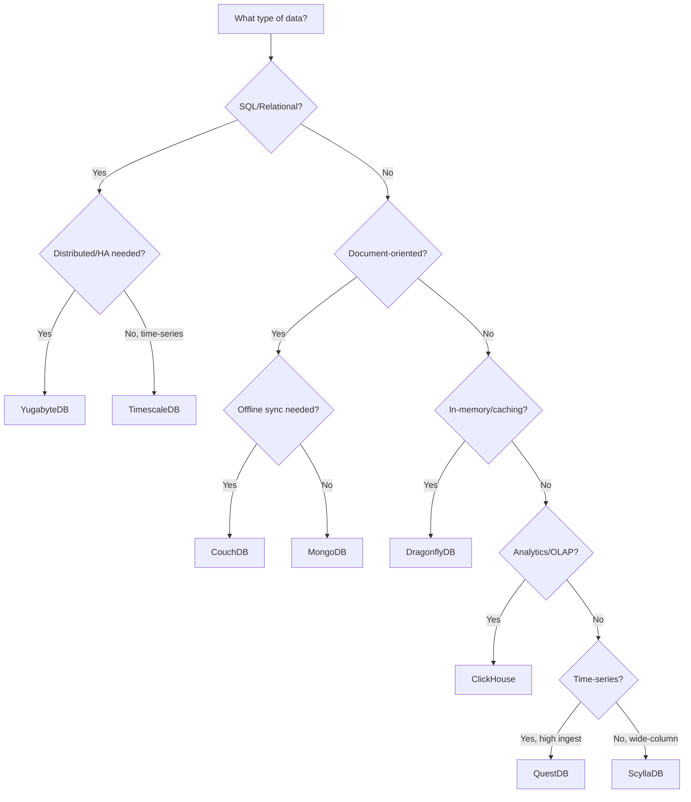
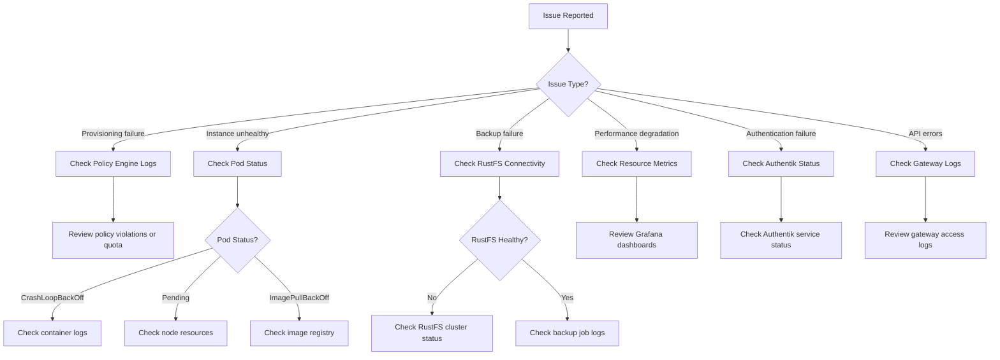

# ERP-DBaaS Training Manual

## Document Control

| Field             | Value                        |
|-------------------|------------------------------|
| Document Title    | ERP-DBaaS Training Manual    |
| Version           | 1.0.0                       |
| Date              | 2026-02-24                   |
| Audience          | All DBaaS Users and Admins   |
| Classification    | Internal                     |

---

## Training Program Overview

This training manual is organized into progressive modules that build upon each other. Complete the modules in order for the best learning experience.

| Module | Title                              | Duration   | Audience           |
|--------|------------------------------------|------------|--------------------|
| 1      | DBaaS Concepts and Terminology     | 30 minutes | All users          |
| 2      | Platform Navigation                | 20 minutes | All users          |
| 3      | Provisioning Wizard Walkthrough    | 45 minutes | Operators, Admins  |
| 4      | Engine Selection Guide             | 30 minutes | Operators, Admins  |
| 5      | Backup and Restore Procedures      | 45 minutes | Operators, Admins  |
| 6      | Scaling and Performance            | 30 minutes | Operators, Admins  |
| 7      | Credential and Security Management | 30 minutes | Operators, Admins  |
| 8      | Quota Management and Metering      | 20 minutes | Operators, Admins  |
| 9      | Plugin Management                  | 30 minutes | Admins             |
| 10     | AIDD Policy Administration         | 45 minutes | Admins             |
| 11     | Troubleshooting and Operations     | 45 minutes | Admins             |

**Total Training Time**: ~5.5 hours

---

## Module 1: DBaaS Concepts and Terminology

### Learning Objectives
- Understand what Database-as-a-Service means in the ERP context
- Learn key terminology used throughout the platform
- Understand the multi-tenant architecture model

### 1.1 What is DBaaS?

Database-as-a-Service (DBaaS) is a platform that automates the provisioning, management, and operation of database instances. Instead of manually installing, configuring, and maintaining databases, users interact with a self-service platform that handles the infrastructure complexity.

**Traditional Model vs. DBaaS Model**:

| Aspect              | Traditional                    | DBaaS                          |
|---------------------|--------------------------------|--------------------------------|
| Provisioning        | Ticket, 2-5 days              | Self-service, <5 minutes       |
| Configuration       | Manual, error-prone           | Guided wizard, policy-validated |
| Backups             | Manual scripts, inconsistent  | Automated, policy-enforced      |
| Scaling             | Requires DBA intervention     | Self-service with quota checks  |
| Monitoring          | Varies by team                | Unified dashboard               |
| Cost tracking       | Not available                 | Per-instance metering           |

### 1.2 Key Terminology

**ServiceInstance**: A managed database deployment. This is the primary resource you interact with in DBaaS. Each ServiceInstance represents a running database (which may consist of one or more pods/replicas).

**Engine**: The specific database technology (e.g., YugabyteDB, MongoDB, ClickHouse). Each engine has different capabilities, performance characteristics, and use cases.

**Size Preset**: A pre-configured combination of CPU, memory, and storage resources (Small, Medium, Large, X-Large).

**Tenant**: An organizational unit (typically an ERP module team) that owns database instances. Each tenant has isolated resources and quotas.

**AIDD (AI-Driven Database Design)**: The governance framework that evaluates database configurations against organizational policies before allowing provisioning.

**Policy Profile**: A set of rules that define what database configurations are acceptable. The two built-in profiles are "strict" (for production) and "flexible" (for development).

**CRD (Custom Resource Definition)**: A Kubernetes extension that defines a new type of resource. DBaaS uses CRDs to represent instances, backups, policies, and plugins.

**Operator**: A Kubernetes controller that manages the lifecycle of a specific database engine. There is one operator per supported engine.

**Quota**: Resource limits assigned to a tenant (max instances, CPU, memory, storage, API rate).

**Credential Rotation**: The process of generating new database access credentials and replacing the old ones, typically for security compliance.

### 1.3 Architecture Simplified

```
You (Browser) --> Gateway (Security) --> API (Business Logic) --> Operators (Database Management) --> Your Database
```

1. You access the web interface or API
2. The Gateway authenticates you and checks rate limits
3. The API processes your request and checks policies
4. The Kubernetes Operator creates or manages your database
5. Your database runs as pods in a dedicated namespace

### 1.4 Knowledge Check

1. What is the difference between a ServiceInstance and an Engine?
2. What does AIDD stand for and what is its purpose?
3. How does multi-tenancy work in DBaaS?
4. What is a CRD and why does DBaaS use them?

---

## Module 2: Platform Navigation

### Learning Objectives
- Navigate the DBaaS web interface confidently
- Understand the dashboard layout and information hierarchy
- Use filtering, searching, and sorting across all views

### 2.1 Main Navigation

The left sidebar contains the primary navigation:

```
Dashboard          - Overview of all instances and health
Instances          - List and manage database instances
  + New Instance   - Start the provisioning wizard
Engine Catalog     - Browse supported database engines
Backups            - View all backup schedules and history
Plugins            - Manage platform plugins
Quotas             - View quota usage and limits
Metering           - Usage and cost reports
Settings           - User preferences and alert configuration
Admin              - Tenant and policy management (admin only)
```

### 2.2 Dashboard Walkthrough

**Top Bar**:
- Left: Breadcrumb navigation showing current location
- Center: Global search bar (search instances by name, engine, or status)
- Right: Notification bell (with unread count), User avatar with dropdown menu

**Summary Cards Row**:
- Total Instances (with trend arrow)
- Running Instances
- Degraded/Failed Instances (red highlight if >0)
- Total Storage Used

**Charts Section**:
- Instance Health Distribution (donut chart: healthy, warning, degraded, critical)
- Resource Utilization (bar chart: CPU, memory, storage as % of quota)

**Recent Activity Table**:
- Timestamp, Action, Instance, User, Status
- Click any row to navigate to the relevant instance

**Quick Actions**:
- "Provision New Instance" button
- "View All Instances" link
- "Export Report" button

### 2.3 Filtering and Searching

**Instance List Filters**:
- **Engine**: Dropdown multi-select (YugabyteDB, ScyllaDB, etc.)
- **Status**: Dropdown multi-select (Running, Provisioning, Degraded, etc.)
- **Size**: Dropdown (Small, Medium, Large, X-Large, Custom)
- **Created**: Date range picker
- **Search**: Free-text search on instance name

**Sorting**:
- Click any column header to sort ascending/descending
- Default sort: Created date (newest first)

### 2.4 Practice Exercise

1. Log in to the DBaaS platform
2. Identify how many running instances exist in your tenant
3. Filter the instance list to show only YugabyteDB instances
4. Sort instances by storage usage (highest first)
5. Use global search to find an instance by name
6. Navigate to the Engine Catalog and compare two engines

---

## Module 3: Provisioning Wizard Walkthrough

### Learning Objectives
- Complete the 4-step provisioning wizard independently
- Make informed decisions about engine, size, and configuration
- Understand and resolve AIDD policy evaluations

### 3.1 Detailed Wizard Walkthrough

**Pre-Requisites**:
- `dbaas_operator` or `dbaas_admin` role
- Available quota for the requested resources
- Understanding of your application's database requirements

### Step 1: Engine Selection (Detailed)

The engine selection screen presents 8 cards in a 4x2 grid. Each card shows:

```
+----------------------------------+
| [Engine Logo]                     |
| YugabyteDB                       |
| Distributed SQL                  |
|                                   |
| - PostgreSQL compatible           |
| - Distributed ACID transactions   |
| - Horizontal scalability          |
|                                   |
| Versions: 2.18, 2.20             |
| HA Modes: RF3, RF5               |
| [Select] [Learn More]            |
+----------------------------------+
```

**Decision Framework**:



### Step 2: Configuration (Detailed)

**Instance Name Rules**:
- Must start with a letter
- Only lowercase letters, numbers, and hyphens
- 3-63 characters long
- Must be unique within your tenant
- Example: `inventory-primary-db`, `hrm-analytics-2026`

**Size Selection Tips**:

| Workload Type                | Recommended Size | Recommended Replicas |
|------------------------------|------------------|---------------------|
| Development/prototyping       | Small            | 1                   |
| Integration testing           | Small or Medium  | 1                   |
| Staging (mirrors prod)        | Same as prod     | Same as prod        |
| Light production (<100 TPS)   | Medium           | 3                   |
| Standard production           | Large            | 3                   |
| Heavy production (>1000 TPS)  | X-Large          | 3 or 5              |

**Backup Schedule Best Practices**:

| Environment   | Recommended Schedule | Retention |
|---------------|---------------------|-----------|
| Development   | None or Weekly      | 7 days    |
| Staging       | Daily at 2 AM UTC   | 14 days   |
| Production    | Every 6 hours       | 90 days   |
| Critical Prod | Hourly              | 180 days  |

### Step 3: Policy Review (Detailed)

**Common Strict Profile Violations and Fixes**:

| Violation                         | Cause                    | Fix                          |
|-----------------------------------|--------------------------|------------------------------|
| "Minimum 3 replicas required"     | Replicas set to 1 or 2  | Increase replicas to 3       |
| "Backup schedule required"        | No backup configured     | Add a backup schedule        |
| "Retention must be >= 30 days"    | Retention < 30           | Set retention to 30+         |
| "SSD storage class required"      | Non-SSD storage          | Change storage class to SSD  |
| "Resources exceed quota"          | Insufficient quota       | Reduce size or request quota increase |

### Step 4: Review and Confirm

**Checklist Before Confirming**:
- [ ] Instance name follows naming convention
- [ ] Engine version is the latest stable release
- [ ] Size is appropriate for the workload
- [ ] Replicas are set for HA (3+ for production)
- [ ] Backup schedule is configured
- [ ] Retention period meets compliance requirements
- [ ] Quota impact is acceptable

### 3.2 Practice Exercise

Provision a test database with the following requirements:
1. Engine: YugabyteDB 2.20
2. Name: `training-test-db`
3. Size: Small (for training purposes)
4. Replicas: 1 (flexible profile for dev)
5. Backup: Daily, 7-day retention
6. Verify it reaches "Running" status

---

## Module 4: Engine Selection Guide

### Learning Objectives
- Understand the capabilities and trade-offs of each engine
- Match workload requirements to the optimal engine
- Know the performance characteristics of each engine

### 4.1 Engine Comparison Matrix

| Feature          | YugabyteDB | ScyllaDB | DragonflyDB | MongoDB | CouchDB | ClickHouse | TimescaleDB | QuestDB |
|------------------|-----------|----------|-------------|---------|---------|------------|-------------|---------|
| Data Model       | Relational | Wide-Column | Key-Value | Document | Document | Columnar | Relational+TS | Time-Series |
| Query Language   | SQL (PG)  | CQL      | Redis Protocol | MQL   | HTTP/Mango | SQL     | SQL (PG)    | SQL     |
| ACID Transactions| Yes       | Limited  | No          | Yes     | MVCC    | No         | Yes         | No      |
| Horizontal Scale | Yes       | Yes      | No          | Yes     | Yes     | Yes        | Limited     | No      |
| Replication      | Raft      | Gossip   | Active-Passive | Raft  | Multi-Master | ZooKeeper | Streaming | N/A    |
| Max Throughput   | 100K TPS  | 1M+ TPS | 4M ops/s    | 50K TPS | 10K TPS | 1M+ rows/s | 500K rows/s | 2M+ rows/s |
| Latency (p99)    | <10ms     | <2ms     | <1ms        | <10ms   | <20ms   | <100ms     | <10ms       | <5ms    |

### 4.2 Engine Deep Dives

**YugabyteDB** - The Default Choice for ERP Modules

When to use: Any workload that needs PostgreSQL compatibility with distributed ACID transactions. This is the recommended default for ERP module primary databases.

Strengths:
- Full PostgreSQL wire protocol compatibility
- Distributed ACID transactions across nodes
- Automatic sharding and rebalancing
- Strong consistency with tunable reads

Limitations:
- Higher latency than single-node PostgreSQL
- More resource-intensive than alternatives for simple workloads
- Complex operational model for RF5 clusters

**ScyllaDB** - For High-Throughput Event Data

When to use: Audit logs, event stores, activity feeds, or any workload with extremely high write throughput and predictable query patterns.

Strengths:
- Consistent sub-millisecond latency at scale
- Millions of operations per second per node
- Excellent for time-ordered data with known access patterns

Limitations:
- No ACID transactions
- Limited query flexibility (requires known partition keys)
- Data modeling requires expertise

**DragonflyDB** - For Caching and Real-Time Data

When to use: Application caching, session management, rate limiting, real-time counters and leaderboards.

Strengths:
- Redis-compatible API (drop-in replacement)
- Multi-threaded architecture (faster than Redis)
- Lower memory footprint than Redis
- Sub-millisecond latency

Limitations:
- Data is primarily in-memory (with optional persistence)
- No complex query support
- Not suitable as a primary data store

**MongoDB** - For Flexible Document Storage

When to use: Content management, product catalogs, user profiles, or any workload with evolving schemas.

Strengths:
- Flexible document model (no schema migration needed)
- Rich query language with aggregation pipeline
- Built-in full-text search
- Horizontal scaling via sharding

Limitations:
- Multi-document transactions have performance overhead
- Memory-mapped storage can be unpredictable
- Requires careful index management

**CouchDB** - For Offline-First and Sync

When to use: Mobile backends, offline-capable applications, multi-master replication scenarios.

Strengths:
- Built-in multi-master replication
- HTTP/REST API (no special drivers needed)
- Conflict resolution for offline-first architectures
- Document versioning

Limitations:
- Lower throughput than other document stores
- Limited query capabilities
- Compaction can be resource-intensive

**ClickHouse** - For Analytics and Reporting

When to use: Business intelligence, log analytics, data warehousing, any analytical query workload.

Strengths:
- Extremely fast analytical queries (columnar storage)
- High compression ratios (10-50x)
- SQL support with powerful analytical functions
- Linear scaling with more nodes

Limitations:
- Not suitable for point lookups or OLTP
- No UPDATE/DELETE support (append-only)
- Eventual consistency in distributed mode

**TimescaleDB** - For Structured Time-Series

When to use: IoT sensor data, application metrics, financial data, any time-stamped relational data.

Strengths:
- PostgreSQL extension (full SQL support)
- Automatic time-based partitioning
- Continuous aggregates for fast roll-up queries
- Compatible with PostgreSQL ecosystem tools

Limitations:
- Single-node architecture (limited horizontal scaling)
- Higher storage footprint than QuestDB for pure time-series
- Compression requires manual policy configuration

**QuestDB** - For High-Ingest Time-Series

When to use: Financial tick data, high-frequency sensor streams, real-time analytics with millions of inserts per second.

Strengths:
- Fastest ingest rate of any time-series database
- SQL support (PostgreSQL wire protocol)
- Minimal resource requirements for high throughput
- Built-in time-series functions

Limitations:
- No HA mode in v1.0.0 (single-node only)
- Limited JOIN support
- Smaller ecosystem and community

### 4.3 Practice Exercise

For each scenario, recommend the best engine:
1. An ERP Payroll module needs a primary database with complex joins and transactions
2. The Analytics team wants to run ad-hoc queries across 2 years of sales data
3. A mobile app needs to work offline and sync when reconnected
4. The IoT module receives 500,000 sensor readings per second
5. The API Gateway needs a session cache with sub-millisecond response times

**Answers**: 1. YugabyteDB, 2. ClickHouse, 3. CouchDB, 4. QuestDB, 5. DragonflyDB

---

## Module 5: Backup and Restore Procedures

### Learning Objectives
- Configure backup schedules for different environments
- Perform on-demand backups and monitor their progress
- Execute a complete restore workflow
- Understand backup types and their trade-offs

### 5.1 Backup Types

**Full Backup**:
- Complete snapshot of all data
- Self-contained (can restore without dependencies)
- Larger size and longer duration
- Recommended: Weekly for production, on-demand for critical changes

**Incremental Backup**:
- Only changes since the last backup (full or incremental)
- Faster and smaller than full backups
- Requires the base full backup for restore
- Supported by: YugabyteDB, MongoDB, TimescaleDB

**Point-in-Time Recovery (PITR)**:
- Continuous WAL/oplog archiving enables restore to any second
- Requires additional storage for WAL archives
- Supported by: YugabyteDB, TimescaleDB, MongoDB

### 5.2 Backup Configuration Procedure

**Step-by-Step: Configure a Backup Schedule**

1. Navigate to the instance detail page
2. Click the **Backups** tab
3. Click **"Configure Schedule"** (or "Edit Schedule" if one exists)
4. Select schedule type:
   - **Hourly**: `0 * * * *` - Every hour on the hour
   - **Every 6 Hours**: `0 */6 * * *` - At midnight, 6AM, noon, 6PM UTC
   - **Daily**: `0 2 * * *` - Daily at 2 AM UTC
   - **Weekly**: `0 2 * * 0` - Sunday at 2 AM UTC
   - **Custom**: Enter your own cron expression
5. Select backup type (Full or Incremental)
6. Set retention period:
   - Development: 7 days
   - Staging: 14-30 days
   - Production: 30-90 days (minimum 30 for strict profile)
   - Compliance: 365 days
7. Enable encryption (required in production)
8. Click **"Save Schedule"**

### 5.3 Restore Procedure

**Step-by-Step: Restore from Backup**

1. Navigate to the instance's **Backups** tab
2. Locate the backup you want to restore from
3. Verify the backup status is "Completed" and checksum is valid
4. Click **"Restore"** next to the backup
5. In the Restore Dialog:
   a. **Target**: "New Instance" (recommended) or "Replace Current" (destructive)
   b. **Instance Name**: Enter a name for the restored instance (e.g., `original-name-restored`)
   c. **Size**: Same as original (default) or different size
   d. **Policy Profile**: Defaults to the same profile as the original
6. Review the restore summary:
   - Source backup: name, date, size
   - Target instance: name, size, estimated restore time
7. Click **"Start Restore"**
8. Monitor progress on the instance list (new instance appears with "Restoring" status)

**Post-Restore Checklist**:
- [ ] Verify instance reaches "Running" status
- [ ] Check data integrity (spot-check key tables/documents)
- [ ] Update application configuration with new connection credentials
- [ ] Verify backup schedule is configured on the restored instance
- [ ] Test application connectivity

### 5.4 Practice Exercise

1. Navigate to a test instance
2. Trigger an on-demand full backup
3. Wait for the backup to complete
4. Restore the backup to a new instance
5. Verify the restored instance is running
6. Compare data between original and restored instances

---

## Module 6: Scaling and Performance

### Learning Objectives
- Understand vertical vs. horizontal scaling
- Perform scaling operations safely
- Interpret performance metrics for scaling decisions

### 6.1 When to Scale

**Signs You Need to Scale Up**:
- CPU utilization consistently >75% during peak hours
- Memory usage approaching allocated limit
- Storage utilization >80%
- Increasing query latency
- Connection count approaching engine limits
- Replication lag increasing

**Scaling Decision Matrix**:

| Symptom                  | Recommended Action            |
|--------------------------|-------------------------------|
| High CPU, normal memory  | Increase CPU (vertical)       |
| High memory              | Increase memory (vertical)    |
| Storage running out      | Expand storage                |
| Too many connections     | Add replicas (horizontal)     |
| High replication lag     | Increase replica resources    |
| Overall capacity limit   | Add replicas + increase size  |

### 6.2 Scaling Procedures

**Vertical Scaling Procedure**:
1. Review current metrics on the Metrics tab
2. Click **"Scale"** on the instance detail page
3. Select the new size preset or adjust custom resources
4. Review the impact preview (estimated downtime, quota usage)
5. Click **"Apply Scale"**
6. Monitor the scaling progress

**Horizontal Scaling Procedure**:
1. Verify the engine supports horizontal scaling
2. Click **"Scale"** on the instance detail page
3. Adjust the replica count
4. Review quota impact
5. Click **"Apply Scale"**
6. Wait for new replicas to sync data

### 6.3 Practice Exercise

1. View the metrics of a running test instance
2. Identify which resource is most utilized
3. Perform a vertical scale from Small to Medium
4. Monitor the rolling update progress
5. Verify the instance returns to "Running" status
6. Compare metrics before and after scaling

---

## Module 7: Credential and Security Management

### Learning Objectives
- Understand how credentials are managed in DBaaS
- Perform manual credential rotation
- Configure automatic rotation schedules

### 7.1 Credential Lifecycle

```
Provisioning --> Credentials Generated --> Stored in K8s Secret --> Delivered to User
     |                                         |
     |                                    Rotation Triggered (manual or scheduled)
     |                                         |
     v                                    New Credentials Generated
Connection URI available                       |
in Instance Detail page                  Old Credentials Grace Period (5 min)
                                               |
                                          Old Credentials Invalidated
```

### 7.2 Rotation Procedure

1. Navigate to the instance detail page
2. Click **"Rotate Credentials"**
3. A confirmation dialog appears:
   - "This will generate new credentials. The old credentials will remain valid for 5 minutes."
   - Option to download new credentials immediately
4. Click **"Confirm Rotation"**
5. New credentials are displayed (one-time view for password)
6. Update your application with the new connection string
7. Verify connectivity with new credentials within the 5-minute grace period

### 7.3 Security Best Practices

- Rotate credentials at least every 90 days (automated is recommended)
- Never store credentials in source code or configuration files
- Use Kubernetes Secret references or environment variables
- Monitor rotation history for unauthorized rotations
- Set up alerts for upcoming credential expirations

---

## Module 8: Quota Management and Metering

### Learning Objectives
- Interpret quota dashboards and usage reports
- Request quota increases through the proper workflow
- Understand the metering and cost attribution model

### 8.1 Understanding Your Quota

Each tenant has resource limits across these dimensions:

| Dimension        | What It Limits                              |
|------------------|---------------------------------------------|
| Max Instances    | Total number of database instances           |
| Total vCPU       | Sum of CPU allocated across all instances    |
| Total Memory     | Sum of RAM allocated across all instances    |
| Total Storage    | Sum of disk space across all instances       |
| Backup Storage   | Total backup data stored in RustFS           |
| API Rate         | Requests per minute to the DBaaS API         |
| Max Plugins      | Number of plugins registered                 |

### 8.2 Reading the Metering Dashboard

The metering dashboard shows:
- **Usage Timeline**: Line graph of resource consumption over time (CPU hours, memory GB-hours, storage GB-months)
- **Cost Breakdown**: Pie chart showing cost distribution by engine and instance
- **Top Consumers**: Table of instances sorted by estimated cost
- **Trend Analysis**: Month-over-month comparison with growth projections

### 8.3 Practice Exercise

1. Navigate to the Quotas page
2. Identify your current utilization percentage for each dimension
3. Navigate to the Metering page
4. Identify the most expensive instance in your tenant
5. Export a monthly usage report

---

## Module 9: Plugin Management

*This module requires `dbaas_admin` role*

### Learning Objectives
- Register and manage platform plugins
- Understand the plugin lifecycle and hooks
- Monitor plugin health and performance

### 9.1 Plugin Registration Walkthrough

1. Navigate to **Plugins** in the sidebar
2. Click **"+ Register Plugin"**
3. Fill in the form:
   - **Name**: `my-custom-notifier`
   - **Version**: `1.0.0`
   - **Type**: Notification
   - **Image**: `registry.internal/plugins/my-notifier:1.0.0`
   - **Port**: 50051
   - **Hooks**: Select `postProvision`, `postBackup`, `onCredentialRotation`
   - **Resources**: CPU 100m-500m, Memory 128Mi-256Mi
4. Click **"Register"**
5. Monitor the plugin status:
   - Pulling image...
   - Starting container...
   - Health check passed...
   - Active

### 9.2 Plugin Troubleshooting

| Issue                     | Diagnosis                           | Resolution                    |
|---------------------------|-------------------------------------|-------------------------------|
| Plugin stuck in "Pulling" | Image not found or registry auth issue | Verify image exists and credentials |
| Health check failing      | Plugin not responding on gRPC port  | Check plugin logs, verify port |
| Hook timeout              | Plugin taking too long to respond   | Increase timeout or optimize plugin |
| Plugin crashing           | OOM or panic in plugin code         | Check logs, increase resources |

---

## Module 10: AIDD Policy Administration

*This module requires `dbaas_admin` role*

### Learning Objectives
- Create and modify AIDD policy profiles
- Test policies with dry-run mode
- Handle policy exceptions

### 10.1 Policy Profile Structure

Each policy profile contains rules organized by category:

```yaml
name: custom-production
description: "Custom production policy for finance module"
mode: strict
rules:
  security:
    - id: SEC-01
      name: "Encryption at rest"
      enabled: true
      params:
        required: true
    - id: SEC-02
      name: "TLS required"
      enabled: true
      params:
        minVersion: "1.3"
  ha:
    - id: HA-01
      name: "Minimum replicas"
      enabled: true
      params:
        minReplicas: 3
  backup:
    - id: BK-01
      name: "Backup schedule required"
      enabled: true
      params:
        maxIntervalHours: 6
    - id: BK-02
      name: "Minimum retention"
      enabled: true
      params:
        minRetentionDays: 90
```

### 10.2 Creating a Custom Policy

1. Navigate to **Admin > Policies** in the sidebar
2. Click **"+ New Policy Profile"**
3. Start from a template (strict or flexible) or blank
4. Configure each rule category:
   - Enable/disable individual rules
   - Set parameters for enabled rules
   - Set enforcement mode (block/warn/info)
5. Save the profile
6. Test with dry-run: Click "Dry Run" and enter a sample instance configuration
7. Review evaluation results
8. Activate the profile by assigning it to a tenant or environment

### 10.3 Practice Exercise

1. Create a custom policy profile for staging environments
2. Set minimum replicas to 1 (allow single-node)
3. Require daily backups with 14-day retention
4. Require TLS but make encryption at rest optional
5. Test the policy with a sample configuration
6. Assign the policy to a test tenant

---

## Module 11: Troubleshooting and Operations

*This module requires `dbaas_admin` role*

### Learning Objectives
- Diagnose common platform issues
- Use operational tools and logs
- Execute emergency procedures

### 11.1 Diagnostic Flowchart



### 11.2 Emergency Procedures

**Emergency Credential Rotation**:
If credentials are compromised:
1. Immediately rotate credentials via API (faster than UI)
2. Set grace period to 0 (immediate invalidation)
3. Notify affected application teams
4. Review audit logs for unauthorized access
5. File a security incident

**Emergency Backup**:
Before any risky operation:
1. Trigger an on-demand full backup
2. Wait for completion
3. Verify checksum
4. Proceed with the operation

**Operator Recovery**:
If an operator is not reconciling:
1. Check operator pod status
2. Review operator logs for errors
3. If stuck, restart the operator pod (the controller manager will recreate it)
4. Verify reconciliation resumes

### 11.3 Knowledge Check (Final Assessment)

1. A developer reports their provisioning request has been pending for 30 minutes. What do you check first?
2. An instance shows "Degraded" status. Describe your diagnostic steps.
3. A backup has failed 3 times in a row. What are the possible causes?
4. A tenant is at 98% quota. What are their options?
5. A plugin is causing hook timeouts. How do you mitigate the impact?

---

## Certification

Upon completing all modules and passing the final assessment, participants receive the **ERP-DBaaS Certified Operator** credential. This certification is valid for 12 months and can be renewed by completing the annual refresher course.

**Assessment Requirements**:
- Score >= 80% on the knowledge checks
- Complete all practice exercises
- Demonstrate a full provisioning and restore workflow

---

*This training manual is updated with each major release. Last updated: February 24, 2026.*
