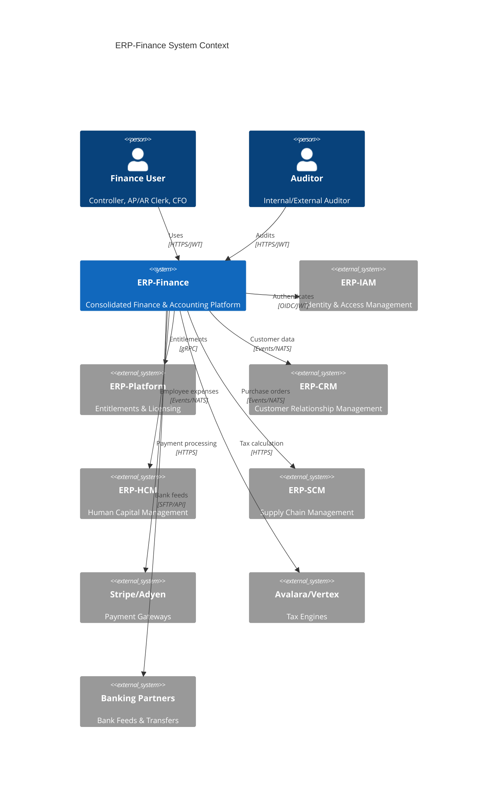
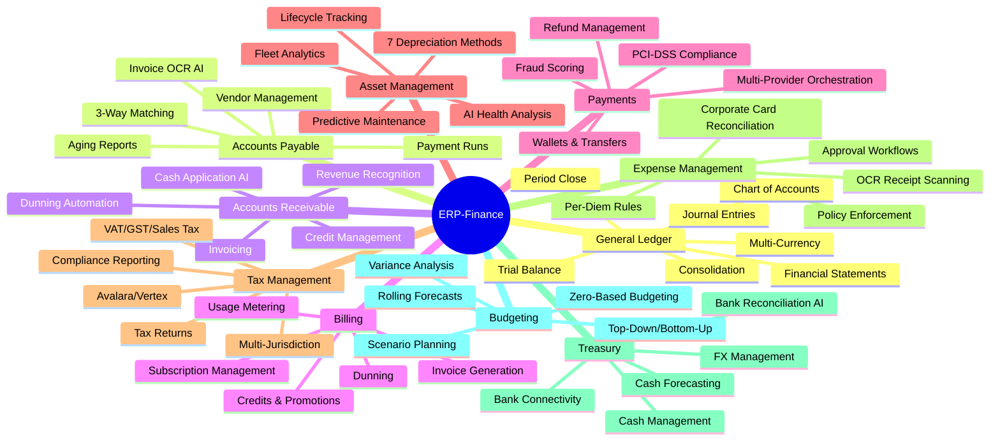

# ERP-Finance Module Overview

## Document Information

| Field | Value |
|-------|-------|
| Module | ERP-Finance |
| Version | 1.0.0 |
| Domain | Finance & Accounting |
| Last Updated | 2026-02-23 |
| Status | Active |
| SKU | erp.finance |

## Executive Summary

ERP-Finance is the consolidated Finance and Accounting module of the ERP product line. It delivers a comprehensive, enterprise-grade financial management platform that consolidates billing, payments, asset management, general ledger, accounts payable/receivable, tax management, expense management, treasury, and budgeting into a single cohesive suite. The module operates in **standalone_plus_suite** mode, meaning it can run independently or as part of the broader ERP platform with entitlements managed through ERP-Platform.

ERP-Finance is benchmarked against Oracle Financials, SAP S/4HANA Finance, NetSuite, Xero, and QuickBooks, combining enterprise-grade capabilities with modern architecture patterns including polyglot services (Go, Rust, Python), event-driven design, and AI-powered intelligence.

## Architecture Context

## Consolidated Service Inventory

The module comprises 15 services organized by financial domain:

| Service | Domain | Technology | Port |
|---------|--------|------------|------|
| general-ledger | GL Core | Go | 8090 |
| general-ledger-service | GL Extended | Go | 8091 |
| accounts-payable | AP Core | Go | 8092 |
| accounts-payable-service | AP Extended | Go | 8093 |
| accounts-receivable | AR Core | Go | 8094 |
| accounts-receivable-service | AR Extended | Go | 8095 |
| billing-service | Billing | Rust (Axum) | 8089 |
| payments-service | Payments | Rust (Axum) | 8084 |
| asset-management-service | Fixed Assets | Python (FastAPI) | 8096 |
| tax-management | Tax Core | Go | 8097 |
| tax-management-service | Tax Extended | Go | 8098 |
| expense-management | Expense Core | Go | 8099 |
| expense-management-service | Expense Extended | Go | 8100 |
| treasury-service | Treasury | Go | 8101 |
| budget-service | Budgeting | Go | 8102 |

## Capability Matrix

## Merge Sources

ERP-Finance was assembled from the following originally independent modules:

| Source Module | Contribution | Import Type |
|---------------|-------------|-------------|
| ERP-Billing | Subscription billing, invoicing, metering engine | Deep import (Rust src) |
| Billing (Legacy) | Legacy billing system, credits, pricing | Deep import (Rust src) |
| ERP-Payments | Payment orchestration, wallets, refunds | Deep import (Rust src) |
| ERP-Asset-Management | Fixed asset lifecycle, depreciation, AI | Deep import (Python src) |
| ERP-General-Ledger | Chart of accounts, journals, trial balance | Service scaffold |
| ERP-AP-AR | Payables and receivables subledgers | Service scaffold |
| ERP-Tax-Management | Multi-jurisdiction tax rules | Service scaffold |
| ERP-Expense-Management | Claims and reimbursements | Service scaffold |

## Integration Mode

- **Standalone**: ERP-Finance operates independently with its own authentication and database
- **Suite**: Integrates with ERP-Platform for entitlements, ERP-IAM for identity, and NATS for event backbone
- **Control Plane**: ERP-Platform subscription hub
- **Identity Provider**: ERP-Directory / ERP-IAM (OIDC/JWT)
- **Event Backbone**: NATS / Redpanda (Kafka-compatible)

## AIDD Guardrails

The module operates under strict AI-Driven Development guardrails:

- **Autonomous Actions**: Read-only queries, low-risk notifications
- **Supervised Actions**: Data mutations, workflow automation, bulk operations
- **Prohibited Actions**: Cross-tenant data access, irreversible deletes without backup, privilege escalation
- **Controls**: Human-in-the-loop for high-risk operations, decision logging, 24-hour rollback window

## Technology Stack

| Layer | Technology |
|-------|-----------|
| API Gateway | Go (net/http) |
| Billing Engine | Rust (Axum, SQLx, Tokio) |
| Payment Engine | Rust (Axum, SQLx, async-nats) |
| Asset Management | Python (FastAPI, SQLAlchemy, Anthropic SDK) |
| Service Framework | Go (standard library) |
| Primary Database | PostgreSQL |
| Cache | Redis |
| OLAP | ClickHouse |
| Object Store | MinIO |
| Vector Store | Qdrant |
| Event Bus | NATS / Redpanda |
| Observability | OpenTelemetry |
