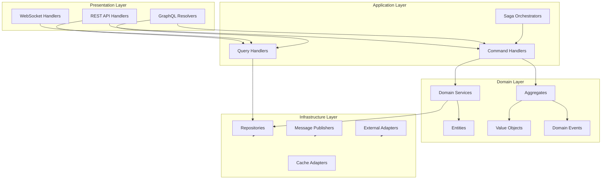
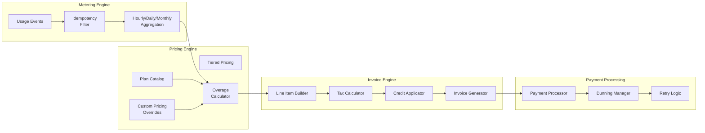
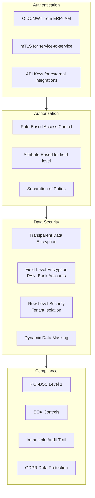

# ERP-Finance Architecture Design

## Document Information

| Field | Value |
|-------|-------|
| Module | ERP-Finance |
| Document Type | Architecture Design Document |
| Version | 1.0.0 |
| Last Updated | 2026-02-23 |

## Architectural Philosophy

ERP-Finance follows a **domain-driven, polyglot microservices** architecture. Each financial domain is implemented in the language best suited to its performance and complexity requirements: Rust for high-throughput billing and payment processing, Python for AI-powered asset management, and Go for the general-purpose financial services (GL, AP, AR, Tax, Expense, Treasury, Budget).

## C4 Container Diagram

```mermaid
flowchart TB
    subgraph External["External Systems"]
        IAM["ERP-IAM<br/>OIDC/JWT"]
        Platform["ERP-Platform<br/>Entitlements"]
        Banks["Banking Partners"]
        PSP["Payment Service Providers<br/>Stripe/Adyen/Paystack/Flutterwave/M-Pesa"]
        TaxEngine["Tax Engines<br/>Avalara/Vertex"]
        OCR["OCR Services<br/>Document AI"]
    end

    subgraph Gateway["API Gateway Layer"]
        GW["Finance Gateway<br/>Go / net/http<br/>:8090"]
    end

    subgraph CoreServices["Core Financial Services"]
        GL["General Ledger<br/>Go<br/>COA, Journals, Trial Balance"]
        AP["Accounts Payable<br/>Go<br/>Vendor Mgmt, 3-Way Match"]
        AR["Accounts Receivable<br/>Go<br/>Invoicing, Credit Mgmt"]
    end

    subgraph RevenueServices["Revenue & Billing Services"]
        BILL["Billing Service<br/>Rust/Axum<br/>Subscriptions, Metering"]
        PAY["Payments Service<br/>Rust/Axum<br/>Orchestration, Wallets"]
    end

    subgraph AssetServices["Asset & Expense Services"]
        ASSET["Asset Management<br/>Python/FastAPI<br/>Depreciation, AI"]
        EXP["Expense Management<br/>Go<br/>Claims, Approvals"]
    end

    subgraph ComplianceServices["Tax & Compliance Services"]
        TAX["Tax Management<br/>Go<br/>VAT/GST, Multi-Jurisdiction"]
        TREAS["Treasury Service<br/>Go<br/>Cash, FX, Reconciliation"]
        BUD["Budget Service<br/>Go<br/>Planning, Variance"]
    end

    subgraph DataLayer["Data Layer"]
        PG[(PostgreSQL<br/>Primary OLTP)]
        Redis[(Redis<br/>Cache/Sessions)]
        CH[(ClickHouse<br/>OLAP Analytics)]
        Minio[(MinIO<br/>Documents/Receipts)]
        Qdrant[(Qdrant<br/>AI Vectors)]
    end

    subgraph EventLayer["Event Infrastructure"]
        NATS["NATS / Redpanda<br/>Event Backbone"]
    end

    GW --> GL
    GW --> AP
    GW --> AR
    GW --> BILL
    GW --> PAY
    GW --> ASSET
    GW --> EXP
    GW --> TAX
    GW --> TREAS
    GW --> BUD

    GW --> IAM
    GW --> Platform

    GL --> PG
    AP --> PG
    AR --> PG
    BILL --> PG
    PAY --> PG
    ASSET --> PG
    EXP --> PG
    TAX --> PG
    TREAS --> PG
    BUD --> PG

    GL --> Redis
    BILL --> Redis
    PAY --> Redis
    TREAS --> Redis

    GL --> CH
    TREAS --> CH
    BUD --> CH

    EXP --> Minio
    AP --> Minio
    ASSET --> Qdrant

    GL --> NATS
    AP --> NATS
    AR --> NATS
    BILL --> NATS
    PAY --> NATS
    ASSET --> NATS
    TAX --> NATS
    EXP --> NATS
    TREAS --> NATS
    BUD --> NATS

    PAY --> PSP
    TAX --> TaxEngine
    AP --> OCR
    EXP --> OCR
    TREAS --> Banks
```

## Service Architecture Patterns

### Domain-Driven Design Layers

Each service follows a clean architecture with these layers:

### Payment Domain DDD Implementation

The payments service demonstrates a full DDD implementation in Rust:

- **Aggregates**: `Payment`, `Subscription` -- enforce invariants and emit domain events
- **Value Objects**: `PaymentId`, `Money`, `PaymentMethod` -- immutable, equality by value
- **Domain Events**: `PaymentCreated`, `PaymentSucceeded`, `PaymentRefunded`, `SubscriptionCreated`, `SubscriptionRenewed`, `SubscriptionCancelled`
- **Repository Pattern**: SQLx-backed persistence with PostgreSQL

### Billing Engine Architecture

The billing engine uses Rust for high-performance processing:

## Multi-Tenancy Architecture

ERP-Finance implements **row-level multi-tenancy** with tenant isolation enforced at every layer:

1. **API Layer**: `X-Tenant-ID` header required for all business endpoints; JWT claims must match
2. **Service Layer**: Tenant context propagated via request-scoped state
3. **Database Layer**: All tables include `tenant_id` column; PostgreSQL Row-Level Security policies enforce isolation
4. **Event Layer**: Events scoped with tenant ID in CloudEvents envelope

## Data Architecture

### Database Strategy

| Database | Purpose | Data Types |
|----------|---------|------------|
| PostgreSQL | Primary OLTP | Transactional ledger, entities, relationships |
| Redis | Caching, sessions | Rate limits, session state, materialized views |
| ClickHouse | Analytics OLAP | Financial reporting, aggregations, time-series |
| MinIO | Object storage | Invoices, receipts, documents, attachments |
| Qdrant | Vector search | AI embeddings for asset analysis |

### Immutable Ledger Design

The General Ledger implements an immutable posting ledger. Journal entries, once posted, can never be modified or deleted. Corrections are made through reversing entries. This is enforced at the database level through:

- Write-only `journal_entries` table with no UPDATE/DELETE permissions for application roles
- `posting_status` enum that transitions only forward: `DRAFT -> POSTED -> REVERSED`
- Reversal creates a new entry referencing the original via `reversal_of_id`
- Database triggers prevent any row modification after `posting_status = 'POSTED'`

## Security Architecture

## Deployment Architecture

Services are containerized and deployed on Kubernetes with the following topology:

- **Billing Service**: 3+ replicas, CPU-optimized nodes, horizontal pod autoscaler
- **Payments Service**: 3+ replicas, network-optimized nodes, PCI-DSS isolated namespace
- **Asset Management Service**: 2+ replicas, GPU-available nodes (for AI inference)
- **All Go Services**: 2+ replicas per service, general-purpose nodes
- **PostgreSQL**: Primary + 2 read replicas, synchronous replication for financial data
- **Redis**: Sentinel cluster with 3 nodes
- **NATS**: 3-node JetStream cluster for durable event streams

## Resilience Patterns

| Pattern | Implementation | Services |
|---------|---------------|----------|
| Circuit Breaker | Exponential backoff with jitter | Payment providers, tax engines |
| Retry with Idempotency | Idempotency keys on all write operations | All services |
| Saga Pattern | Orchestrated sagas for multi-service transactions | Payment + Invoice + GL posting |
| Event Sourcing | Full event sourcing for GL journal entries | General Ledger |
| CQRS | Separate read/write models for reporting | GL, Treasury, Budget |
| Bulkhead | Isolated thread pools per provider | Payments (Stripe/Adyen/Paystack) |
| Dead Letter Queue | Failed events routed for manual review | All event consumers |
